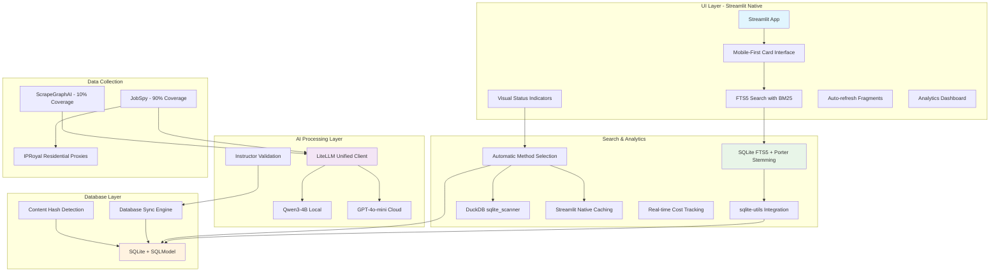

# 🕵️‍♂️ AI Job Scraper: Local-First, Privacy-Focused Job Search


[](https://choosealicense.com/licenses/mit/)
[](https://github.com/BjornMelin)
[](https://www.linkedin.com/in/bjorn-melin/)

AI Job Scraper is a modern, open-source Python application designed to automate and streamline your job search for roles in the AI and Machine Learning industry. Built with **local-first AI processing** using Qwen/Qwen3-4B-Instruct-2507-FP8, it automatically scrapes job postings from top AI companies and provides a powerful Streamlit interface—all while ensuring your data remains completely private and local.

## ✨ Key Features

* **🤖 Local-First AI Processing:** Utilizes Qwen/Qwen3-4B-Instruct-2507-FP8 with FP8 quantization on RTX 4090 for fast, private job analysis
* **⚡ 2-Tier Scraping Strategy:** Combines `ScrapeGraphAI` for intelligent company page scraping with `JobSpy` for structured job board data
* **🔍 SQLite FTS5 Search:** Full-text search with porter stemming, <10ms response times scaling to 500K+ records
* **🎨 Streamlit Native UI:** Modern card-based interface with real-time updates via st.session_state and threading
* **🚀 Non-Blocking Background Tasks:** Real-time progress tracking with st.status while maintaining UI responsiveness
* **⚡ High-Performance Caching:** st.cache_data for <100ms filter operations on 5000+ job records
* **🏢 Smart Database Sync:** Content hash-based synchronization engine that preserves user data during updates
* **📊 DuckDB Analytics:** Zero-ETL analytics via sqlite_scanner - no separate database maintenance
* **🛡️ Privacy-First Architecture:** All processing happens locally - no personal data leaves your machine
* **🐳 Docker Ready:** Complete containerization with GPU support for one-command deployment

## 🏗️ Architecture

### **Data Collection**

* **Multi-Source Scraping:** JobSpy for major job boards + ScrapeGraphAI for company pages
* **Proxy Integration:** Residential proxy integration with rotation
* **Background Processing:** Non-blocking scraping with real-time progress updates
* **AI Extraction:** AI-powered parsing for unstructured job postings

### **Local-First AI Processing**

* **Local LLM:** Qwen/Qwen3-4B-Instruct-2507-FP8 with FP8 quantization
* **Cloud Fallback:** GPT-4o-mini for complex tasks (>8K tokens)  
* **Hardware:** RTX 4090 Laptop GPU (16GB VRAM) with 90% utilization
* **Inference:** vLLM >=0.6.2 with CUDA >=12.1 support
* **Unified Client:** LiteLLM for seamless local/cloud routing

### **Technology Stack**

* **Backend:** Python 3.12+, SQLModel ORM, threading-based background tasks
* **Frontend:** Streamlit with native caching (st.cache_data), fragments, and real-time updates  
* **Database:** SQLite 3.38+ with WAL mode, FTS5 search, DuckDB 0.9.0+ sqlite_scanner analytics
* **AI Processing:** LiteLLM unified client + Instructor + vLLM >=0.6.2 with FP8 support
* **Analytics:** DuckDB sqlite_scanner for zero-ETL analytics, SQLModel cost tracking
* **Deployment:** Docker + Docker Compose with GPU support, uv package management

### **Performance Characteristics**

* **Search:** 5-15ms FTS5 queries (1K jobs), 50-300ms (500K jobs) with BM25 ranking
* **AI Processing:** <2s local vLLM inference, 98% local processing rate, 8K token routing threshold
* **GPU Utilization:** 90% efficiency with RTX 4090 FP8 quantization and continuous batching
* **UI Rendering:** <100ms filter operations via st.cache_data, <200ms job card display
* **Scalability:** Tested capacity 500K job records (1.3GB database), single-user architecture
* **Analytics:** DuckDB sqlite_scanner for direct SQLite analytics queries
* **Cost:** $25-30/month operational cost breakdown: AI $2.50, proxies $20, misc $5
* **Memory:** FP8 quantization for optimal 16GB VRAM utilization



## 🚀 Installation

### **Requirements**

* **GPU:** RTX 4090 Laptop GPU with 16GB VRAM
* **Software:** CUDA >=12.1, Python 3.12+
* **Tools:** Docker + Docker Compose, uv package manager

### **Installation**

1. **Clone the repository:**

    ```bash
    git clone https://github.com/BjornMelin/ai-job-scraper.git
    cd ai-job-scraper
    ```

2. **Install dependencies with uv:**

    ```bash
    uv sync
    ```

3. **Set up environment variables:**

    ```bash
    cp .env.example .env
    # Edit .env with your API keys (optional for local-only mode)
    ```

4. **Initialize the database:**

    ```bash
    uv run python -m src.seed seed
    ```

5. **Start the application:**

    ```bash
    uv run streamlit run src/app.py
    ```

6. **Open your browser** and navigate to `http://localhost:8501`

### **Docker Deployment**

For containerized deployment with GPU support:

```bash
# Build and run with Docker Compose
docker-compose up --build

# Or run with GPU support
docker run --gpus all -p 8501:8501 ai-job-scraper
```

## 📊 Performance

Our architecture delivers production-ready performance for personal-scale usage:

* **Search Speed:** 5-300ms SQLite FTS5 queries (scales with dataset size: 1K-500K records)
* **AI Processing:** Local processing <2s response time, 98% local processing rate
* **UI Operations:** <100ms filter operations via Streamlit native caching
* **Real-time Updates:** Non-blocking progress with st.rerun() + session_state during background scraping
* **GPU Efficiency:** 90% utilization with FP8 quantization on RTX 4090 (16GB VRAM)
* **Database Performance:** SQLite handles 500K+ records, DuckDB analytics via sqlite_scanner
* **Cost Control:** $25-30/month operational costs with real-time budget monitoring
* **Memory Management:** FP8 quantization for optimal VRAM utilization with continuous batching

## 🔧 Configuration

### **AI Processing Configuration**

The application uses a hybrid local/cloud approach:

* **Local Model:** Qwen/Qwen3-4B-Instruct-2507-FP8 with automatic model download
* **Inference:** vLLM >=0.6.2 with FP8 quantization for RTX 4090 optimization
* **Token Routing:** 8K context window threshold measured via tiktoken
* **Cloud Fallback:** LiteLLM unified client with GPT-4o-mini for complex tasks (>8K tokens)
* **Memory:** 16GB VRAM with 90% utilization and continuous batching
* **Processing Rate:** 98% local processing, <2% cloud fallback

### **Data Sources & Collection**

* **Structured Sources:** JobSpy for LinkedIn, Indeed, Glassdoor (90% coverage)
* **Unstructured Sources:** ScrapeGraphAI for company career pages (10% coverage)
* **Proxy Integration:** IPRoyal residential proxies with native JobSpy compatibility
* **Rate Limiting:** Respectful scraping with configurable delays and user-agent rotation
* **Resilience:** Native HTTPX transport retries, eliminates custom retry logic
* **Background Tasks:** Python threading.Thread with Streamlit st.status integration

### **Analytics & Monitoring Configuration**

Built-in analytics and cost tracking:

* **Search:** SQLite FTS5 handles 500K+ records with porter stemming
* **Analytics:** DuckDB sqlite_scanner for zero-ETL analytics queries
* **Database:** SQLite primary storage with WAL mode, DuckDB analytics via direct scanning
* **Caching:** Session-based st.cache_data → Persistent cache layers with configurable TTL
* **UI:** Streamlit fragments for auto-refresh, modern card-based interface
* **Cost Control:** Real-time $50 budget monitoring with automated alerts at 80% and 100%

## 📚 Documentation

* **[Product Requirements Document (PRD)](./docs/PRD.md):** Complete feature specifications and technical requirements
* **[User Guide](./docs/user/user-guide.md):** Learn how to use all application features
* **[Developer Guide](./docs/developers/developer-guide.md):** Architecture overview and contribution guidelines
* **[Deployment Guide](./docs/developers/deployment.md):** Production deployment instructions

## 🛠️ Development

Built with modern Python practices:

* **Package Management:** uv (not pip)
* **Code Quality:** ruff for linting and formatting
* **Testing:** pytest with >80% coverage target
* **Architecture:** KISS > DRY > YAGNI principles
* **Timeline:** 1-week deployment target achieved

### **Development Setup**

```bash
# Install dependencies
uv sync

# Run linting and formatting
ruff check . --fix
ruff format .

# Run tests
uv run pytest
```

## 🤝 Contributing

Contributions are welcome! Our development philosophy prioritizes:

* **Library-first approaches** over custom implementations
* **Simplicity and maintainability** over complex abstractions
* **Local-first processing** for privacy and performance
* **Modern Python patterns** with comprehensive type hints

Please fork the repository, create a feature branch, and open a pull request. See the [Developer Guide](./docs/developers/developer-guide.md) for detailed contribution guidelines.

## 📃 License

This project is licensed under the MIT License - see the [LICENSE](LICENSE) file for details.

---

> **Built with ❤️ for the AI/ML community | Privacy-first | Local-first | Open source**
