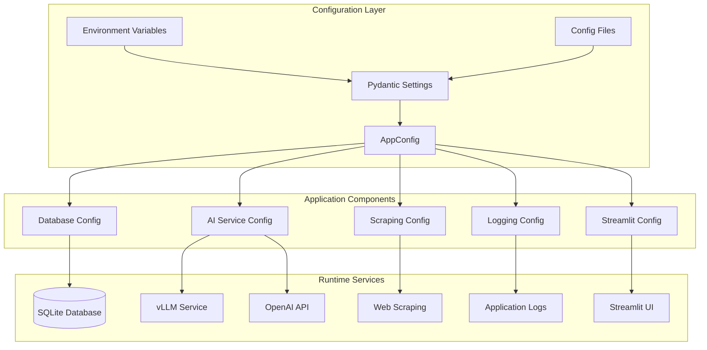

# ADR-002: Local Environment Configuration

## Metadata

**Status:** Accepted  
**Version/Date:** v1.0 / 2025-08-21

## Title

Local Environment Configuration Management with Pydantic

## Description

Implement a centralized, type-safe configuration system using Pydantic BaseSettings to manage environment variables, database connections, AI service settings, and framework-specific configurations for local development with Streamlit and SQLModel.

## Context

The local development environment requires coordinated configuration management across multiple components: database connections (SQLite), AI service integration (local vLLM or API fallback), logging, and Streamlit-specific settings. Current configuration approaches lack type safety, validation, and centralized management, leading to configuration drift and setup complexity for new developers.

Key technical constraints include support for nested environment variables, runtime validation, and seamless switching between development and production configurations without code changes.

## Decision Drivers

- Type safety and validation for all configuration parameters
- Centralized configuration management across all application components
- Environment-based configuration switching (development vs production)
- Minimal setup complexity for new developers
- Integration with Streamlit, SQLModel, and AI processing components
- Support for nested configuration structures

## Alternatives

- A: Direct environment variable access — Pros: Simple, no dependencies / Cons: No validation, type safety, or structure
- B: Custom configuration classes — Pros: Full control / Cons: Significant development effort, lack of standard patterns
- C: Pydantic BaseSettings with nested configurations — Pros: Type safety, validation, industry standard / Cons: Additional dependency

### Decision Framework

| Model / Option | Solution Leverage (Weight: 35%) | Application Value (Weight: 30%) | Maintenance & Cognitive Load (Weight: 25%) | Architectural Adaptability (Weight: 10%) | Total Score | Decision |
|----------------|--------------------------------|--------------------------------|-------------------------------------------|------------------------------------------|-------------|----------|
| **Pydantic BaseSettings** | 9.0 | 8.5 | 9.0 | 8.0 | **8.8** | ✅ **Selected** |
| Custom Configuration | 6.0 | 7.0 | 4.0 | 7.0 | 6.0 | Rejected |
| Direct Environment Access | 3.0 | 5.0 | 6.0 | 5.0 | 4.6 | Rejected |

## Decision

We will adopt **Pydantic BaseSettings with nested configuration classes** to address environment configuration management. This involves using **pydantic.BaseSettings** configured with **nested configuration objects** for database, AI, scraping, logging, and Streamlit settings. This decision establishes the foundation for type-safe configuration management across the application.

## High-Level Architecture



## Related Requirements

### Functional Requirements

- **FR-1:** The system must load configuration from environment variables with type validation
- **FR-2:** The system must support nested configuration structures for different components
- **FR-3:** The system must provide sensible defaults for development environments

### Non-Functional Requirements

- **NFR-1:** **(Maintainability)** The configuration system must reduce setup complexity for new developers by providing clear validation and error messages
- **NFR-2:** **(Security)** The configuration must safely handle sensitive data like API keys through environment variables
- **NFR-3:** **(Reliability)** The configuration must validate all settings at application startup to prevent runtime failures

### Performance Requirements

- **PR-1:** Configuration loading must complete within 100ms during application startup
- **PR-2:** Configuration validation must not impact application runtime performance

### Integration Requirements

- **IR-1:** The configuration must integrate natively with Streamlit application initialization
- **IR-2:** The configuration must support SQLModel database connection management
- **IR-3:** The configuration must work seamlessly with AI service providers (local vLLM and OpenAI)

## Related Decisions

- **ADR-011** (Hybrid LLM Strategy): This configuration system provides the environment variables and type-safe settings consumed by the canonical UnifiedAIClient implementation
- **ADR-005** (Local Database Setup): This configuration management supports the SQLite database connection established in ADR-005
- **ADR-017** (Background Task Management Streamlit): Provides configuration foundation for Streamlit-based task management
- **ADR-023** (Local Development Docker Containerization): Environment configuration supports containerized development setup

## Design

### Architecture Overview

The configuration system uses Pydantic BaseSettings with nested configuration classes to provide type-safe, validated environment management. Each component (database, AI, scraping, logging, Streamlit) has dedicated configuration classes that inherit from BaseSettings.

### Implementation Details

**In `src/config.py`:**

```python
from pydantic import BaseSettings, Field
from pathlib import Path
from typing import Optional, Literal

class DatabaseConfig(BaseSettings):
    """Database configuration for local development."""
    url: str = Field(default="sqlite:///./data/jobs.db")
    echo: bool = Field(default=False)

class AIConfig(BaseSettings):
    """AI processing configuration aligned with canonical UnifiedAIClient from ADR-011."""
    # Core UnifiedAIClient settings
    vllm_base_url: str = Field(default="http://localhost:8000/v1", description="vLLM OpenAI-compatible endpoint")
    token_threshold: int = Field(default=8000, description="Token threshold for local vs cloud routing")
    enable_cloud_fallback: bool = Field(default=True, description="Enable automatic cloud fallback")
    log_routing_decisions: bool = Field(default=True, description="Log AI routing decisions")
    
    # OpenAI API settings (for cloud fallback)
    openai_api_key: Optional[str] = Field(default=None, description="OpenAI API key for cloud fallback")
    
    # Connection settings
    local_timeout: float = Field(default=15.0, description="Local model request timeout")
    cloud_timeout: float = Field(default=30.0, description="Cloud model request timeout")
    max_connections: int = Field(default=10, description="Maximum HTTP connections per client")

class StreamlitConfig(BaseSettings):
    """Streamlit framework configuration."""
    port: int = Field(default=8501)
    debug: bool = Field(default=True)
    server_headless: bool = Field(default=False)

class AppConfig(BaseSettings):
    """Main application configuration."""
    environment: Literal["development", "production"] = Field(default="development")
    debug: bool = Field(default=True)
    data_dir: str = Field(default="./data")
    logs_dir: str = Field(default="./logs")
    
    # Nested configurations
    database: DatabaseConfig = Field(default_factory=DatabaseConfig)
    ai: AIConfig = Field(default_factory=AIConfig)
    streamlit: StreamlitConfig = Field(default_factory=StreamlitConfig)
    
    class Config:
        env_file = ".env"
        env_nested_delimiter = "__"

# Global configuration instance
config = AppConfig()

def initialize_app():
    """Initialize application configuration and setup."""
    # Create directories and configure logging
    Path(config.data_dir).mkdir(exist_ok=True)
    Path(config.logs_dir).mkdir(exist_ok=True)
```

### Configuration

**In `.env` file:**

```env
# Application Settings
ENVIRONMENT=development
DEBUG=true

# Database Configuration
DATABASE__URL=sqlite:///./data/jobs.db
DATABASE__ECHO=false

# AI Configuration (aligned with canonical UnifiedAIClient from ADR-011)
AI__VLLM_BASE_URL=http://localhost:8000/v1
AI__TOKEN_THRESHOLD=8000
AI__ENABLE_CLOUD_FALLBACK=true
AI__LOG_ROUTING_DECISIONS=true
OPENAI_API_KEY=your_openai_api_key_here
AI__LOCAL_TIMEOUT=15.0
AI__CLOUD_TIMEOUT=30.0
AI__MAX_CONNECTIONS=10

# Streamlit Configuration
STREAMLIT__PORT=8501
STREAMLIT__DEBUG=true
STREAMLIT__SERVER_HEADLESS=false

# Directory Paths
DATA_DIR=./data
LOGS_DIR=./logs
```

**In `src/app.py`:**

```python
import streamlit as st
from src.config import config, initialize_app

# Initialize application with validation
initialize_app()

# Streamlit app configuration
if __name__ == "__main__":
    st.set_page_config(
        page_title="AI Job Scraper",
        page_icon="🔍",
        layout="wide"
    )
```

**Using Canonical UnifiedAIClient with Configuration:**

```python
# src/config.py provides configuration for the canonical client
from src.config import config
from src.ai.client import ai_client

# Initialize with configuration from this ADR
ai_client = UnifiedAIClient({
    "local_base_url": config.ai.vllm_base_url,
    "token_threshold": config.ai.token_threshold,
    "enable_cloud_fallback": config.ai.enable_cloud_fallback,
    "log_routing_decisions": config.ai.log_routing_decisions
})

# Usage example
response = ai_client.chat_completion(
    model="Qwen3-4B-Instruct-2507-FP8",
    messages=[{"role": "user", "content": "Extract job information..."}],
    temperature=0.1
)
```

> **INTEGRATION NOTE**: This configuration system provides the environment variables and type-safe settings consumed by the canonical UnifiedAIClient from **ADR-011**. All AI processing across the application uses this unified configuration approach.

## Testing

**In `tests/test_config.py`:**

```python
import pytest
from pathlib import Path
from src.config import AppConfig, DatabaseConfig, AIConfig

def test_default_configuration():
    """Verify default configuration values are correct."""
    config = AppConfig()
    assert config.environment == "development"
    assert config.database.url == "sqlite:///./data/jobs.db"
    assert config.ai.provider == "local"

@pytest.mark.asyncio
async def test_environment_variable_override():
    """Verify environment variables properly override defaults."""
    import os
    os.environ["AI__PROVIDER"] = "openai"
    config = AppConfig()
    assert config.ai.provider == "openai"

def test_configuration_validation():
    """Verify configuration validation catches common errors."""
    config = AppConfig()
    config.ai.provider = "openai"
    config.ai.openai_api_key = None
    # Test validation logic
    assert config.ai.openai_api_key is None
```

## Consequences

### Positive Outcomes

- Enables type-safe configuration management across all application components, reducing runtime configuration errors by providing validation at startup
- Standardizes environment variable handling using industry-standard Pydantic patterns, eliminating custom configuration implementations
- Reduces onboarding complexity for new developers through clear defaults and comprehensive validation with helpful error messages
- Supports seamless environment switching between development and production without code changes through environment-based configuration
- Provides centralized configuration access through a single global config instance, improving maintainability

### Negative Consequences / Trade-offs

- Introduces dependency on `pydantic>=2.0` requiring quarterly security audits and potential migration effort for major version updates
- Adds configuration complexity with nested structures that may require learning curve for developers unfamiliar with Pydantic patterns
- Creates potential for configuration drift between environments if environment files are not properly managed and synchronized
- Requires understanding of nested environment variable syntax using double underscore delimiter which may be unfamiliar to some developers

### Ongoing Maintenance & Considerations

- Monitor Pydantic releases for breaking changes and test compatibility with configuration system
- Validate environment files are synchronized across development, staging, and production environments
- Review configuration defaults quarterly to ensure they remain appropriate for current development practices
- Ensure configuration validation covers all new settings as application features expand
- Document configuration changes in environment file templates when adding new features

### Dependencies

- **Python**: `pydantic>=2.0` for BaseSettings and validation
- **System**: Environment variable support for runtime configuration
- **Removed**: Custom configuration classes (replaced by Pydantic BaseSettings)

## References

- [Pydantic BaseSettings Documentation](https://docs.pydantic.dev/latest/concepts/pydantic_settings/) - Comprehensive guide to configuration management with Pydantic
- [Streamlit Configuration](https://docs.streamlit.io/library/advanced-features/configuration) - Official documentation for Streamlit framework configuration
- [SQLModel Configuration](https://sqlmodel.tiangolo.com/) - Database configuration patterns with SQLModel
- [Twelve-Factor App Config](https://12factor.net/config) - Industry standard principles for application configuration management
- [Environment Variable Best Practices](https://blog.12factor.net/2011/02/06/config) - Security and maintainability considerations for environment-based configuration

## Changelog

- **v1.1 (2025-08-23)**: **CANONICAL AI CLIENT INTEGRATION** - Updated AIConfig to align with canonical UnifiedAIClient from **ADR-011**. Replaced provider-specific settings with unified configuration (vLLM base URL, token threshold, cloud fallback). Added connection management settings (timeouts, max connections). Updated environment variables to match canonical client expectations. Added integration examples showing how configuration feeds into the UnifiedAIClient.
- **v1.0 (2025-08-21)**: Initial accepted version with Pydantic BaseSettings implementation for local environment configuration management
