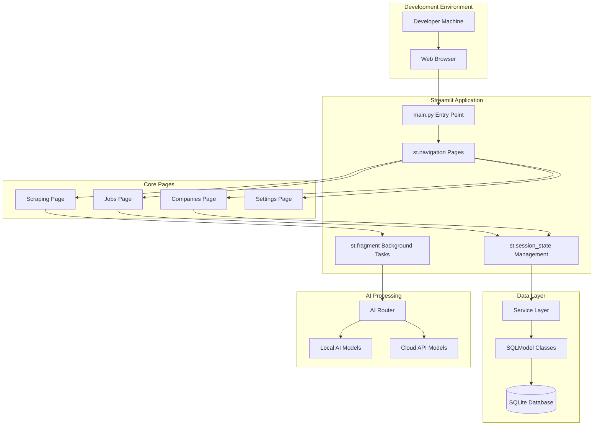

# ADR-003: Local Development Architecture

## Metadata

**Status:** Accepted  
**Version/Date:** v4.0 / 2025-08-20

## Title

Local Development Architecture with Streamlit Framework

## Description

Define local development architecture using Streamlit framework with SQLite database, achieving rapid iteration and maintainable patterns for AI job scraper application.

## Context

The AI job scraper requires a local development architecture that balances rapid iteration with maintainable patterns while supporting the core functionality of job scraping, data management, and AI processing.

The application currently uses Streamlit with `st.navigation()` for page routing, SQLite with SQLModel for development simplicity, `st.session_state` for application state, Streamlit-native patterns with `st.fragment()` auto-refresh for background processing, and local and cloud model support with configurable providers.

Key development constraints include rapid setup with single command startup, Streamlit native hot reload for fast iteration, direct access to logs and database for troubleshooting, library-first approach to minimize custom code, and local-first optimization over production complexity.

## Decision Drivers

- **Solution Leverage**: Maximize use of proven Streamlit library capabilities vs custom implementations
- **Application Value**: Enable effective local development workflow for job scraper functionality  
- **Maintenance & Cognitive Load**: Minimize complexity through library-first patterns
- **Architectural Adaptability**: Support future scaling and deployment options

## Alternatives

- **A: Complex Multi-Framework Approach** — Maximum theoretical flexibility with different UI frameworks, advanced background processing capabilities / High maintenance overhead with multiple frameworks, complex setup and debugging, over-engineering for local development needs
- **B: Minimal Single-File Approach** — Extremely simple setup and debugging, no framework dependencies, fast startup and iteration / Limited UI capabilities for job management interface, no built-in state management or navigation, difficult to scale beyond basic functionality  
- **C: Streamlit-Native Development Architecture** — Native Python integration with existing codebase, built-in navigation, state management, and components, library-first approach with `st.fragment()` for background tasks, proven patterns for AI/ML applications / Single framework dependency (acceptable for development), browser-based interface only (acceptable for development use)
- **D: FastAPI + React Development Stack** — Modern web development patterns, separation of frontend and backend concerns, high performance capabilities / Two-language development stack (Python + JavaScript), complex setup and build process, over-engineering for local development needs

### Decision Framework

| Model / Option | Solution Leverage (Weight: 35%) | Application Value (Weight: 30%) | Maintenance & Cognitive Load (Weight: 25%) | Architectural Adaptability (Weight: 10%) | Total Score | Decision |
|---|---|---|---|---|---|---|
| A: Complex Multi-Framework | 6.0 | 7.0 | 4.0 | 8.0 | 5.9 | ❌ Rejected |
| B: Minimal Single-File | 3.0 | 4.0 | 9.0 | 3.0 | 4.7 | ❌ Rejected |
| **C: Streamlit-Native** | **9.0** | **9.0** | **8.0** | **7.0** | **8.6** | **✅ Selected** |
| D: FastAPI + React | 7.0 | 8.0 | 5.0 | 9.0 | 6.9 | ❌ Rejected |

## Decision

We will adopt **Streamlit-Native Development Architecture** to address local development architecture requirements by implementing Streamlit framework with SQLite database, emphasizing rapid iteration and maintainable patterns.

## High-Level Architecture



## Related Requirements

### Functional Requirements

- FR-1: Support job scraping workflow with UI feedback
- FR-2: Enable job data display and management through Streamlit interface
- FR-3: Provide background task monitoring using `st.fragment()` patterns
- FR-4: Support both local AI and cloud processing configurations

### Non-Functional Requirements

- NFR-1: Single command startup for development environment
- NFR-2: Hot reload functionality for rapid iteration cycles
- NFR-3: Simple debugging through direct log and database access
- NFR-4: Minimal setup complexity for new developers

### Performance Requirements

- PR-1: UI responsiveness under 500ms for typical development operations
- PR-2: Background task updates with 2-second refresh cycle via fragments
- PR-3: Database queries optimized for personal to professional scale (1,000-50,000 jobs)

### Integration Requirements

- IR-1: Coordinate with **ADR-017** background task management patterns
- IR-2: Support **ADR-008** database synchronization requirements
- IR-3: Interface with **ADR-009** AI processing configurations

## Related Decisions

- **ADR-017** (Background Task Management): Provides Streamlit-native background processing patterns
- **ADR-008** (Database Synchronization): Defines SQLModel + SQLite integration approach  
- **ADR-009** (LLM Selection Strategy): Establishes AI processing configuration patterns
- **ADR-009** (Local Development Performance): Complements with performance optimization patterns
- **ADR-023** (Docker Containerization): Provides containerized development environment setup

## Design

### Architecture Overview

The Streamlit-native development architecture implements a single-framework approach with clear separation of concerns through pages, state management, and service layers. The architecture leverages Streamlit's built-in navigation, fragment-based background processing, and session state management.

### Implementation Details

**Streamlit Application Structure**: Main entry point uses `st.navigation()` for page routing with configuration for wide layout and expanded sidebar state. Pages are defined as separate modules with icons and default selection.

**Background Task Management**: Implements `st.fragment()` decorators with `run_every="2s"` parameter for auto-refreshing background task status displays. Session state manages scraping status and progress tracking with `st.rerun()` for UI updates.

**Modal System**: Uses `st.dialog()` decorator for job details modals with configurable width and structured content display using columns and markdown formatting.

### Configuration

```python
# src/main.py - Application configuration
st.set_page_config(
    page_title="AI Job Scraper",
    layout="wide",
    initial_sidebar_state="expanded"
)

# Pages configuration with st.navigation()
pages = [
    st.Page("ui/pages/jobs.py", title="Jobs", icon="📋", default=True),
    st.Page("ui/pages/companies.py", title="Companies", icon="🏢"),
    st.Page("ui/pages/scraping.py", title="Scraping", icon="🔍"),
    st.Page("ui/pages/settings.py", title="Settings", icon="⚙️"),
]
```

## Testing

**Testing Strategy**: Implement pytest-based testing with mocked Streamlit context for component-level validation, page rendering and navigation flow integration tests, fragment auto-refresh verification, and session state management testing.

**Unit Tests**: Component-level testing with mocked Streamlit context using `pytest.fixture` for session state setup and fragment execution validation without exceptions.

**Integration Tests**: Page rendering and navigation flow validation ensuring all pages are importable and contain required render methods.

**Fragment Testing**: Background task and auto-refresh component verification with session state consistency checks.

```python
# tests/ui/test_streamlit_components.py
import pytest
import streamlit as st
from src.ui.utils.background_helpers import background_task_status_fragment

def test_background_task_fragment():
    """Test background task status fragment rendering."""
    st.session_state.scraping_active = True
    st.session_state.scraping_status = "Testing"
    background_task_status_fragment()
    assert st.session_state.scraping_active is True
```

## Consequences

### Positive Outcomes

- **Rapid Development**: Single command startup with `streamlit run src/main.py`
- **Library-First Implementation**: Maximum leverage of Streamlit capabilities
- **Simple Debugging**: Direct access to session state and application logs
- **Framework Consistency**: All UI components use proven Streamlit patterns
- **Hot Reload**: Native Streamlit hot reload for fast iteration cycles

### Negative Consequences / Trade-offs

- **Browser Dependency**: Requires web browser for all development interaction
- **Session State Limitations**: Browser refresh clears application state
- **Single-User Development**: Streamlit optimized for single developer workflow

### Ongoing Maintenance & Considerations

**Required Monitoring**: Page load performance and responsiveness, fragment auto-refresh functionality and resource usage, session state management and memory consumption, background task execution and completion tracking.

**Update Triggers**: Streamlit framework updates affecting navigation or fragment behavior, new Streamlit features that could simplify existing patterns, changes in background task requirements affecting fragment design.

### Dependencies

- Streamlit framework for core UI functionality
- SQLModel and SQLite for data persistence
- Service layer architecture for business logic separation

## References

- [Streamlit Documentation](https://docs.streamlit.io/) - Official documentation for Streamlit framework and API reference
- [Streamlit Navigation Guide](https://docs.streamlit.io/library/api-reference/navigation) - Guide for implementing `st.navigation()` page routing
- [Streamlit Fragments Documentation](https://docs.streamlit.io/library/api-reference/execution-flow/st.fragment) - Documentation for background task fragments with auto-refresh
- [SQLModel Documentation](https://sqlmodel.tiangolo.com/) - SQLModel library for Python SQL database interactions
- [SQLite Optimization Guide](https://www.sqlite.org/optoverview.html) - Performance optimization techniques for SQLite database

## Changelog

- **v4.0 (2025-08-20)**: Applied official ADR template structure with 13 sections, corrected framework references from Reflex to accurate Streamlit implementation, added decision framework with weighted scoring, simplified architecture to focus on local development requirements
- **v3.0 (2025-08-19)**: Previous version with incorrect Reflex framework references
- **v2.0 (2025-08-18)**: Initial local development architecture concepts
