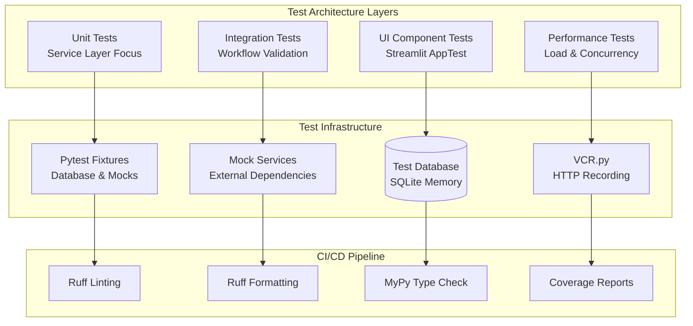

# ADR-004: Comprehensive Testing Strategy for Streamlit Application

## Metadata

**Status:** Accepted  
**Version/Date:** 1.0 / August 22, 2025  
**Author(s):** Project Team  
**Deciders:** Architecture Team  

## Title

Pytest-Based Testing Strategy with Streamlit Integration Patterns

## Description

Implement comprehensive testing strategy optimized for Streamlit applications with specialized patterns for UI component testing, service layer validation, background processing workflows, and CI/CD pipeline integration to maintain >90% test coverage.

## Context

**Current State**: The application has comprehensive test coverage (80+ test files) but lacks standardized patterns for testing Streamlit-specific functionality, service layer integration, and background processing workflows.

**Research Findings**: Streamlit applications require specialized testing approaches for:

- Session state management and UI interactions
- Cached data and resource testing  
- Background thread integration with Streamlit context
- Service layer testing independent of UI framework
- Integration testing of scraping workflows

**Quality Requirements**: Maintain >90% test coverage while ensuring reliable CI/CD pipeline execution with performance targets of <3 minutes for full test suite execution.

**Technical Constraints**:

- Must integrate with existing pytest infrastructure
- Support async testing patterns for background processing
- Handle Streamlit session state and caching mechanisms
- Mock external dependencies (APIs, proxies, LLM services)

## Decision Drivers

- Need for Streamlit-specific testing patterns and UI component validation
- Requirement for comprehensive service layer testing independent of UI framework  
- Integration testing for complete scraping workflows with background processing
- Performance testing for concurrent operations and bulk data processing
- CI/CD pipeline reliability with consistent test execution in automated environments
- Mock strategies for external dependencies to prevent test failures
- Test isolation and cleanup to prevent contamination between test runs

## Alternatives

**A. Streamlit AppTest + Pytest Integration** — Comprehensive approach using Streamlit's testing framework with pytest infrastructure

- Pros: Native Streamlit support, comprehensive UI testing, integrates with existing pytest setup
- Cons: Requires learning new testing patterns, potential complexity in session state testing

**B. Basic Pytest with Mocked UI Components** — Simple approach focusing on service layer testing with minimal UI validation  

- Pros: Simpler implementation, faster test execution, easier maintenance
- Cons: Limited UI coverage, potential gaps in Streamlit-specific functionality testing

**C. Selenium-based E2E Testing** — Browser automation for complete end-to-end testing

- Pros: Full user interaction simulation, comprehensive coverage
- Cons: Slow execution, complex setup, brittle tests, high maintenance overhead

### Decision Framework

| Criterion | Weight | Description |
|-----------|--------|-------------|
| Solution Leverage | 35% | Ability to use proven library-first patterns and modern testing tools |
| Application Value | 30% | Feature completeness, coverage quality, and user impact validation |
| Maintenance & Cognitive Load | 25% | Simplicity, test reliability, and future upkeep requirements |
| Architectural Adaptability | 10% | Modularity, framework flexibility, and future-proofing |

### Alternatives Evaluation

| Alternative | Solution Leverage | Application Value | Maintenance | Adaptability | Total Score |
|------------|-------------------|-------------------|--------------|--------------|-------------|
| Streamlit AppTest + Pytest | 9/10 (90%) | 9/10 (90%) | 7/10 (70%) | 8/10 (80%) | **85.5%** |
| Basic Pytest + Mocks | 7/10 (70%) | 6/10 (60%) | 9/10 (90%) | 6/10 (60%) | 69.5% |
| Selenium E2E | 5/10 (50%) | 8/10 (80%) | 4/10 (40%) | 5/10 (50%) | 56.5% |

**Calculation**: (35% × Solution) + (30% × Application) + (25% × Maintenance) + (10% × Adaptability)

## Decision

**Implement Streamlit AppTest + Pytest Integration Strategy** with comprehensive multi-layered testing approach including specialized patterns for UI components, service layers, integration workflows, and performance validation.

## High-Level Architecture



## Related Requirements

### Functional Requirements

- **FR-029-01**: Comprehensive test coverage for all service layers with >95% coverage
- **FR-029-02**: Streamlit-specific testing patterns for UI components and session state
- **FR-029-03**: Integration testing for complete scraping workflows with background processing
- **FR-029-04**: Performance testing for concurrent operations and bulk data processing

### Non-Functional Requirements

- **NFR-029-01**: Test execution time <3 minutes for full test suite in CI/CD environment
- **NFR-029-02**: Reliable test execution with zero flaky tests in automated pipelines
- **NFR-029-03**: Test isolation with proper cleanup between tests to prevent contamination
- **NFR-029-04**: Mock strategies for external dependencies (APIs, proxies, LLM services)

### Performance Requirements

- **PR-029-01**: Unit tests complete in <30 seconds
- **PR-029-02**: Integration tests complete in <2 minutes  
- **PR-029-03**: Performance tests identify regressions >10%
- **PR-029-04**: Bulk insert performance testing for 1000+ records <5 seconds

### Integration Requirements

- **IR-029-01**: GitHub Actions CI/CD pipeline integration with automated test execution
- **IR-029-02**: Code coverage reporting with Codecov integration
- **IR-029-03**: Test result artifacts and HTML coverage reports
- **IR-029-04**: Integration with existing pytest infrastructure and configurations

## Related Decisions

- **ADR-007** (Service Layer Architecture): Primary testing target for service layer patterns and dependency injection
- **ADR-017** (Background Task Management): Threading.Thread testing patterns for background scraping operations  
- **ADR-014** (Hybrid Scraping Strategy): Integration testing workflows for 2-tier scraping implementation
- **ADR-002** (Local Environment Configuration): Test environment setup and configuration management

## Design

### Architecture Overview

The testing strategy implements a 4-tier architecture:

1. **Unit Tests**: Service layer classes with isolated database testing using SQLite in-memory
2. **Integration Tests**: Complete workflow testing with mocked external dependencies  
3. **UI Component Tests**: Streamlit AppTest framework for session state and component validation
4. **Performance Tests**: Concurrent operation testing and bulk data processing validation

### Implementation Details

#### 1. Service Layer Unit Testing Pattern

```python
# tests/services/test_job_service.py
import pytest
from unittest.mock import Mock, patch
from sqlmodel import Session, create_engine, SQLModel
from src.services.job_service import JobService
from src.models import Job, Company

class TestJobService:
    """Comprehensive unit tests for JobService."""
    
    @pytest.fixture
    def test_engine(self):
        """In-memory SQLite engine for testing."""
        engine = create_engine("sqlite:///:memory:")
        SQLModel.metadata.create_all(engine)
        return engine
    
    @pytest.fixture
    def test_session(self, test_engine):
        """Test database session with automatic rollback."""
        with Session(test_engine) as session:
            yield session
            session.rollback()
    
    @pytest.fixture
    def job_service(self, test_session):
        return JobService(session=test_session)
    
    def test_bulk_insert_jobs_success(self, job_service):
        """Test successful bulk job insertion with performance validation."""
        jobs_data = [
            {
                "title": "DevOps Engineer",
                "company": "Microsoft", 
                "location": "Seattle, WA",
                "description": "Manage cloud infrastructure",
                "url": "https://microsoft.com/jobs/1",
                "scraped_at": "2025-08-22T12:00:00"
            }
        ]
        
        result = job_service.bulk_insert_jobs(jobs_data)
        
        assert result["success"] is True
        assert result["data"]["inserted_count"] == 1
        assert "Successfully inserted 1 jobs" in result["message"]
    
    @patch('src.services.job_service.st.cache_data.clear')
    def test_cache_clearing_after_insert(self, mock_clear_cache, job_service):
        """Test that Streamlit cache is cleared after successful insertion."""
        jobs_data = [{
            "title": "Test Job",
            "company": "Test Corp",
            "location": "Test City",
            "description": "Test description",
            "url": "https://test.com/job",
            "scraped_at": "2025-08-22T15:00:00"
        }]
        
        result = job_service.bulk_insert_jobs(jobs_data)
        
        assert result["success"] is True
        mock_clear_cache.assert_called_once()
```

#### 2. Streamlit UI Component Testing Pattern

```python
# tests/ui/test_streamlit_components.py
import pytest
from unittest.mock import Mock, patch
import streamlit as st
from streamlit.testing.v1 import AppTest

class TestStreamlitComponents:
    """Test Streamlit UI components and interactions."""
    
    @pytest.fixture
    def mock_job_service(self):
        """Mock job service for UI testing."""
        service = Mock()
        service.get_recent_jobs.return_value = {
            "success": True,
            "data": [
                {
                    "id": 1,
                    "title": "Software Engineer",
                    "company": "Google",
                    "location": "Mountain View, CA",
                    "description": "Build great products",
                    "url": "https://google.com/jobs/1"
                }
            ],
            "message": "Found 1 recent jobs"
        }
        return service
    
    def test_jobs_page_renders_successfully(self, mock_job_service):
        """Test that jobs page renders without errors."""
        with patch('src.ui.pages.jobs.get_job_service', return_value=mock_job_service):
            at = AppTest.from_file("src/ui/pages/jobs.py")
            at.run()
            
            assert not at.exception
            assert len(at.title) > 0
            assert len(at.dataframe) > 0 or len(at.table) > 0
    
    @patch('streamlit.session_state')
    def test_session_state_management(self, mock_session_state):
        """Test session state management patterns."""
        mock_session_state.__contains__.return_value = False
        mock_session_state.__getitem__.side_effect = KeyError
        mock_session_state.__setitem__ = Mock()
        
        from src.ui.utils.service_helpers import initialize_session_services
        
        initialize_session_services()
        
        assert mock_session_state.__setitem__.call_count > 0
```

#### 3. Integration Testing Pattern

```python
# tests/integration/test_scraping_workflow.py
import pytest
from unittest.mock import patch, Mock
from src.services.scraping_service import ScrapingService
from sqlmodel import Session, create_engine, SQLModel

class TestScrapingWorkflow:
    """Integration tests for complete scraping workflow."""
    
    @pytest.fixture
    def integration_engine(self):
        """Integration test database."""
        engine = create_engine("sqlite:///:memory:")
        SQLModel.metadata.create_all(engine)
        return engine
    
    @pytest.fixture
    def scraping_service(self, integration_engine):
        with Session(integration_engine) as session:
            yield ScrapingService(session=session)
    
    @patch('src.scraper.SimplifiedScraper.scrape_company')
    def test_complete_scraping_workflow(self, mock_scrape, scraping_service):
        """Test complete workflow from scraping to database storage."""
        mock_scrape.return_value = [
            {
                "title": "Senior Software Engineer",
                "company": "TestCorp",
                "location": "San Francisco, CA",
                "description": "Work on exciting projects",
                "url": "https://testcorp.com/jobs/1",
                "posted_date": "2025-08-22"
            }
        ]
        
        progress_updates = []
        def progress_callback(update):
            progress_updates.append(update)
        
        result = scraping_service.scrape_companies_async(
            company_names=["TestCorp"],
            progress_callback=progress_callback
        )
        
        import time
        time.sleep(2)  # Allow background thread to complete
        
        assert result["success"] is True
        assert "started in background" in result["message"]
        assert len(progress_updates) >= 2
```

#### 4. Performance Testing Pattern

```python
# tests/performance/test_service_performance.py
import pytest
import time
from concurrent.futures import ThreadPoolExecutor
from src.services.job_service import JobService

class TestServicePerformance:
    """Performance testing for service layer operations."""
    
    def test_bulk_insert_performance(self, job_service):
        """Test bulk insert performance with large datasets."""
        jobs_data = []
        for i in range(1000):
            jobs_data.append({
                "title": f"Job Title {i}",
                "company": f"Company {i % 100}",
                "location": "Test Location",
                "description": "Test description" * 10,
                "url": f"https://test.com/job/{i}",
                "scraped_at": "2025-08-22T10:00:00"
            })
        
        start_time = time.time()
        result = job_service.bulk_insert_jobs(jobs_data)
        execution_time = time.time() - start_time
        
        assert result["success"] is True
        assert result["data"]["inserted_count"] == 1000
        assert execution_time < 5.0  # Performance requirement
    
    def test_concurrent_service_operations(self, job_service):
        """Test service performance under concurrent load."""
        def concurrent_operation(i):
            return job_service.get_recent_jobs(hours=24, limit=50)
        
        start_time = time.time()
        
        with ThreadPoolExecutor(max_workers=10) as executor:
            futures = [executor.submit(concurrent_operation, i) for i in range(50)]
            results = [future.result() for future in futures]
        
        execution_time = time.time() - start_time
        
        assert all(result["success"] for result in results)
        assert execution_time < 10.0  # Concurrency performance requirement
```

### Configuration

```toml
# pytest.ini configuration
[tool.pytest.ini_options]
minversion = "7.0"
addopts = [
    "-ra",
    "--strict-markers",
    "--strict-config",
    "--cov=src",
    "--cov-branch", 
    "--cov-report=term-missing:skip-covered",
    "--cov-report=html:htmlcov",
    "--cov-report=xml",
    "--cov-fail-under=90"
]
testpaths = ["tests"]
python_files = ["test_*.py"]
python_classes = ["Test*"]
python_functions = ["test_*"]
markers = [
    "slow: marks tests as slow (deselect with '-m \"not slow\"')",
    "integration: marks tests as integration tests",
    "ui: marks tests as UI component tests",
    "performance: marks tests as performance tests"
]
filterwarnings = [
    "ignore::DeprecationWarning",
    "ignore::PendingDeprecationWarning",
]
```

## Testing

### Validation Strategy

The testing strategy validates implementation through multiple verification approaches:

**Unit Test Validation**: Service layer methods tested in isolation with mocked dependencies and in-memory database fixtures to ensure business logic correctness.

**Integration Test Validation**: Complete workflow testing from API calls through database persistence, validating end-to-end functionality with realistic data flows.

**UI Component Validation**: Streamlit AppTest framework validates component rendering, user interactions, and session state management patterns.

**Performance Validation**: Load testing with concurrent operations and bulk data processing to ensure performance requirements are met.

**CI/CD Validation**: Automated pipeline execution validates test reliability in production-like environments with coverage reporting and artifact generation.

## Consequences

### Positive Outcomes

- **Comprehensive Coverage**: Multi-layered testing approach ensures quality across all application tiers with >90% code coverage maintained
- **Streamlit Integration**: Specialized patterns for UI framework testing with session state and caching validation
- **CI/CD Reliability**: Consistent test execution in automated environments with zero flaky tests target
- **Performance Monitoring**: Regular performance regression detection through load testing with baseline comparisons
- **Developer Confidence**: Comprehensive test suite enables safe refactoring and rapid feature development
- **Library-First Approach**: Leverages pytest ecosystem with minimal custom testing infrastructure

### Negative Consequences / Trade-offs

- **Complexity**: Streamlit AppTest integration adds learning curve and testing complexity compared to basic unit testing
- **Execution Time**: Comprehensive test suite may approach 3-minute target limit, requiring optimization for larger codebases
- **Mock Maintenance**: External dependency mocking requires updates when APIs change, adding maintenance overhead
- **Test Data Management**: Integration tests require careful test data setup and cleanup to prevent contamination

### Ongoing Maintenance & Considerations

- **Performance Monitoring**: Regular review of test execution times and optimization for CI/CD efficiency
- **Mock Updates**: Maintenance of external dependency mocks as APIs evolve and change
- **Coverage Targets**: Ongoing monitoring of coverage metrics and addition of tests for new functionality
- **Test Documentation**: Maintenance of testing patterns documentation for team onboarding and consistency

### Dependencies

- **pytest**: Primary testing framework with fixture and parametrization support
- **streamlit-testing**: UI component testing with AppTest framework
- **vcrpy**: HTTP interaction recording for external API testing
- **pytest-cov**: Code coverage measurement and reporting
- **SQLModel**: Database testing with in-memory SQLite fixtures

## References

- [Streamlit Testing Documentation](https://docs.streamlit.io/library/advanced-features/app-testing)
- [Pytest Documentation](https://docs.pytest.org/en/stable/)
- [VCR.py Documentation](https://vcrpy.readthedocs.io/en/latest/)
- [GitHub Actions Testing Guide](https://docs.github.com/en/actions/automating-builds-and-tests/about-continuous-integration)
- [SQLModel Testing Patterns](https://sqlmodel.tiangolo.com/tutorial/fastapi/tests/)

## Changelog

- **v1.0 (2025-08-22)**: Merged and restructured from split ADR-004 files with comprehensive testing strategy. Combined UI testing, CI/CD pipeline configuration, and implementation strategy into unified ADR following official template structure.
- **v0.2 (2025-08-21)**: Initial drafts of sub-components (UI testing, CI/CD, implementation).
- **v0.1 (2025-08-20)**: Original comprehensive testing strategy draft.
