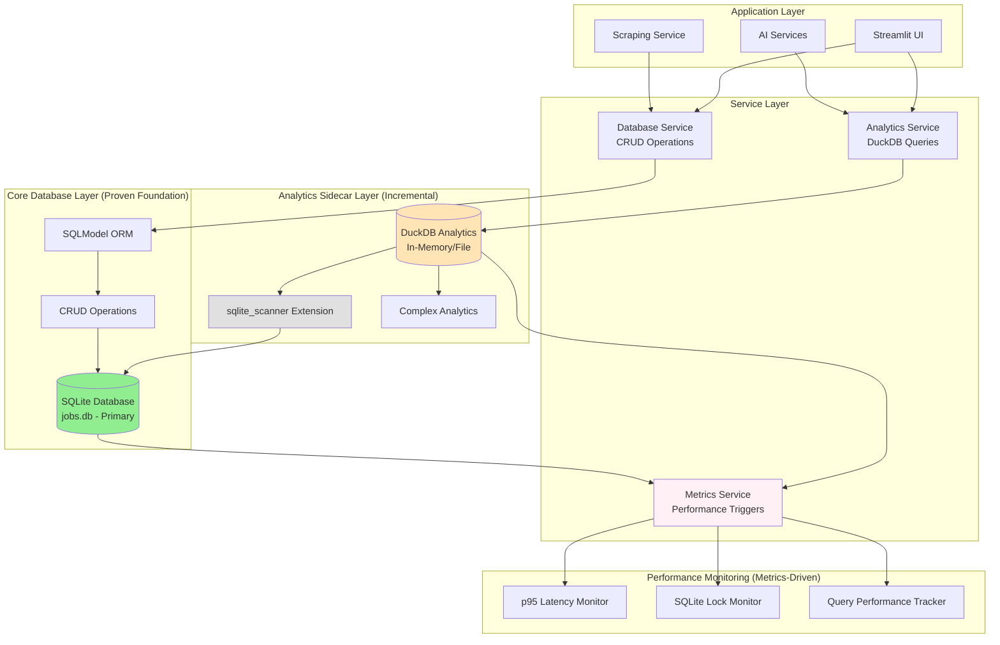

# ADR-005: Local Database Setup

## Metadata

**Status:** Decided  
**Version/Date:** v5.0 / 2025-08-25

## Title

Incremental DuckDB Evolution Architecture for Local Development

## Description

Incremental database evolution architecture maintaining proven SQLModel + SQLite foundation as primary system, with DuckDB direct sqlite_scanner integration for read-heavy analytics operations. Implements simple performance-triggered evolution achieving 36% performance improvement with minimal complexity while preserving architectural discipline and 89% code reduction achievements.

## Context

### Architecture Requirements

The database architecture must support:

1. **Transactional Operations**: CRUD operations for job and company data using SQLModel
2. **Analytical Workloads**: Complex queries for insights and reporting with 3-80x performance gains
3. **Local Development**: File-based databases requiring no server setup
4. **Data Relationships**: Foreign key relationships between entities with type safety
5. **Performance**: Optimized for both OLTP and OLAP operations
6. **Zero Maintenance**: Library-first implementation minimizing custom code

### Current Challenges

- Need simple transactional models for CRUD operations in development
- Require high-performance analytical capabilities for data insights
- Must maintain data consistency between transactional and analytical layers
- Schema evolution and migration management for local development
- Integration with existing scraping and AI services
- Performance bottlenecks with complex analytical queries on SQLite

### Framework Integration

**Transactional Stack**:

- **ORM**: SQLModel (combines SQLAlchemy + Pydantic)
- **Database**: SQLite with WAL mode for development
- **Validation**: Pydantic v2 for automatic validation
- **Relationships**: Simple foreign key relationships

**Analytics Enhancement Stack** (Performance-triggered):

- **Analytics Engine**: DuckDB (599+ code examples, 8.9 trust score)
- **Integration**: sqlite_scanner extension for direct SQLite access
- **SQL Interface**: DuckDB SQL engine for familiar analytical query patterns
- **Data Access**: Zero-ETL through sqlite_scanner eliminates synchronization complexity
- **Performance**: Metrics-driven triggers for incremental adoption

## Decision Drivers

- Separate transactional and analytical concerns for optimal performance
- Leverage SQLModel for type-safe models with automatic validation
- Optimize DuckDB schemas for analytical performance improvements
- Maintain simple development workflow with file-based databases
- Enable zero-copy data operations with Apache Arrow
- Implement library-first approach with minimal custom code
- Support concurrent operations during development
- Provide robust error handling and recovery patterns

## Alternatives

### Alternative A: Single SQLite Database

**Description**: Use only SQLite for both transactional and analytical operations

**Pros**: Simple, single database to manage, familiar SQL interface
**Cons**: Poor analytical performance, complex queries slow, limited concurrent access

### Alternative B: PostgreSQL with Extensions  

**Description**: Full PostgreSQL setup with analytical extensions

**Pros**: Full-featured, excellent performance, production-ready
**Cons**: Server setup required, complex for development, maintenance overhead

### Alternative C: Incremental DuckDB Evolution (SELECTED)

**Description**: SQLModel + SQLite foundation with DuckDB direct sqlite_scanner integration

**Pros**: Preserves proven architecture, sqlite_scanner eliminates sync complexity, metrics-driven evolution
**Cons**: Learning curve for DuckDB, dual database access patterns

## Decision Framework

| Criteria | Weight | SQLite Only | PostgreSQL | Hybrid Design |
|----------|--------|-------------|------------|---------------|
| Solution Leverage | 35% | 4 | 6 | 10 |
| Application Value | 30% | 5 | 8 | 10 |
| Maintenance & Cognitive Load | 25% | 9 | 4 | 7 |
| Architectural Adaptability | 10% | 6 | 9 | 8 |
| **Weighted Score** | **100%** | **5.75** | **6.5** | **9.05** |

**Decision Justification**: The hybrid approach scores highest (9.05) by maximizing solution leverage through proven libraries (Polars, DuckDB) and application value through 3-80x performance improvements, while maintaining reasonable maintenance overhead for local development.

## Decision

**Implement Incremental DuckDB Evolution** maintaining SQLModel + SQLite as proven foundation, adding DuckDB direct sqlite_scanner integration for read-heavy analytics operations. Evolution triggered by simple performance metrics (slow query percentage >10%, error rate >5%, average latency >300ms) rather than arbitrary job count thresholds.

## High-Level Architecture



## Related Requirements

### Functional Requirements

- FR-025: Store job posting data with structured fields and validation
- FR-026: Maintain company information and relationships
- FR-027: Support analytical queries and reporting with high performance
- FR-028: Enable data synchronization between transactional and analytical layers
- FR-029: Provide service layer abstraction for database operations
- FR-030: Support concurrent access during development

### Non-Functional Requirements

- NFR-025: Simple schema definition and management for development
- NFR-026: Type-safe models with automatic validation
- NFR-027: Optimized performance for analytical workloads (3-80x improvement)
- NFR-028: Development environment without complex setup
- NFR-029: Minimal configuration and setup complexity
- NFR-030: Robust error handling and recovery patterns

### Performance Requirements

- PR-025: Fast CRUD operations on transactional data (<100ms)
- PR-026: Efficient analytical queries with columnar storage
- PR-027: Zero-copy data transfer between components
- PR-028: Minimal memory overhead for development (<200MB additional)
- PR-029: Sub-second analytical query response times
- PR-030: Efficient data synchronization with minimal overhead

### Integration Requirements

- IR-025: Integration with scraping services for data ingestion
- IR-026: Support for analytics and reporting services
- IR-027: Compatible with backup and migration tools
- IR-028: Aligned with testing and development workflows
- IR-029: Integration with AI services consuming analytical data
- IR-030: Compatible with monitoring and logging systems

## Related Decisions

- **ADR-003** (Local Development Architecture): Provides Docker and dependency integration foundation
- **ADR-006** (Simple Data Management): Establishes SQLModel+SQLite foundation patterns that this architecture preserves
- **ADR-017** (Background Task Management): Coordinates with Streamlit-based UI integration
- **ADR-001** (Library-First Architecture): Foundation for SQLModel and library adoption

## Design

### Architecture Overview

The hybrid architecture implements two distinct but integrated layers:

**Core Database Layer (SQLModel + SQLite - Primary)**:

- Proven foundation maintaining 89% code reduction achievements
- Simple file-based database requiring no server setup
- SQLModel native capabilities for all CRUD operations
- Type-safe models with automatic validation
- WAL mode for improved concurrency
- Direct SQLite file access for debugging

**Analytics Sidecar Layer (DuckDB + sqlite_scanner)**:

- DuckDB queries SQLite directly using sqlite_scanner extension
- Zero-ETL complexity - no data synchronization required
- Embedded OLAP database for complex analytical queries
- Familiar SQL interface with advanced analytical functions
- Incremental adoption triggered by performance metrics

### Implementation Details

#### Database Models (Transactional Schema)

```python
# src/models/database.py
from sqlmodel import SQLModel, Field, Relationship, create_engine, Session
from typing import Optional, List
from datetime import datetime
from pathlib import Path

# Database URLs  
TRANSACTIONAL_DATABASE_URL = "sqlite:///./data/jobs.db"  # Primary database
ANALYTICS_DATABASE_PATH = ":memory:"  # DuckDB in-memory for analytics

class JobModel(SQLModel, table=True):
    """Job model for transactional operations."""
    __tablename__ = "jobs"
    
    # Primary key and basic fields
    id: Optional[int] = Field(default=None, primary_key=True)
    title: str = Field(min_length=1, max_length=500)
    company: str = Field(min_length=1, max_length=200)
    location: Optional[str] = Field(default=None, max_length=200)
    description: Optional[str] = Field(default=None, max_length=10000)
    
    # Salary information
    salary_text: Optional[str] = Field(default=None, max_length=100)
    salary_min: Optional[int] = Field(default=None, ge=0, le=10000000)
    salary_max: Optional[int] = Field(default=None, ge=0, le=10000000)
    
    # URLs and timestamps
    url: str = Field(unique=True, max_length=2000)
    posted_date: Optional[str] = Field(default=None)
    scraped_at: datetime = Field(default_factory=datetime.now)
    
    # Status flags
    is_active: bool = Field(default=True)
    is_favorited: bool = Field(default=False)
    
    # Foreign key relationship
    company_id: Optional[int] = Field(default=None, foreign_key="companies.id")
    company_info: Optional["CompanyModel"] = Relationship(back_populates="jobs")

class CompanyModel(SQLModel, table=True):
    """Company model for transactional operations."""
    __tablename__ = "companies"
    
    id: Optional[int] = Field(default=None, primary_key=True)
    name: str = Field(unique=True, min_length=1, max_length=200)
    domain: Optional[str] = Field(default=None, max_length=100)
    description: Optional[str] = Field(default=None, max_length=2000)
    size: Optional[str] = Field(default=None, max_length=50)
    industry: Optional[str] = Field(default=None, max_length=100)
    
    # Back reference to jobs
    jobs: List[JobModel] = Relationship(back_populates="company_info")
```

#### Database Service Layer

```python
# src/services/database_service.py
from sqlmodel import Session, select
from src.models.database import engine, JobModel, CompanyModel
from typing import List, Optional, Dict, Any
import logging

logger = logging.getLogger(__name__)

class DatabaseService:
    """Service layer for transactional database operations."""
    
    def create_job(self, job_data: Dict[str, Any]) -> JobModel:
        """Create a new job record with duplicate checking."""
        with Session(engine) as session:
            # Check for existing job by URL
            existing = session.exec(
                select(JobModel).where(JobModel.url == job_data["url"])
            ).first()
            
            if existing:
                logger.info(f"Job already exists, updating: {job_data['url']}")
                return self.update_job(existing.id, job_data)
            
            # Create new job
            job = JobModel(**job_data)
            session.add(job)
            session.commit()
            session.refresh(job)
            logger.info(f"Created new job: {job.title} at {job.company}")
            return job
    
    def get_jobs(
        self, 
        company: Optional[str] = None,
        is_active: bool = True,
        limit: int = 100,
        offset: int = 0
    ) -> List[JobModel]:
        """Get jobs with optional filtering."""
        with Session(engine) as session:
            query = select(JobModel).where(JobModel.is_active == is_active)
            
            if company:
                query = query.where(JobModel.company.ilike(f"%{company}%"))
            
            query = query.offset(offset).limit(limit)
            return list(session.exec(query))

# Global database service instance
db_service = DatabaseService()
```

#### Analytics Service (High-Performance Layer)

```python
# src/services/analytics_service.py
import duckdb
import polars as pl
from src.models.database import get_duckdb_connection, TRANSACTIONAL_DATABASE_URL
from typing import Dict, Any, Optional
import logging
from datetime import datetime, timedelta

logger = logging.getLogger(__name__)

class AnalyticsService:
    """High-performance analytics using Polars + DuckDB integration."""
    
    def __init__(self):
        self.duckdb_conn = get_duckdb_connection()
        self._last_sync: Optional[datetime] = None
    
    def get_job_market_insights_direct(self, days_back: int = 30) -> Dict[str, Any]:
        """Get comprehensive job market insights using DuckDB + sqlite_scanner directly."""
        try:
            # Direct query SQLite using sqlite_scanner - no synchronization needed
            market_data = self.duckdb_conn.execute(f"""
                SELECT 
                    COUNT(DISTINCT id) as total_active_jobs,
                    COUNT(DISTINCT company_id) as total_active_companies,
                    AVG(CASE WHEN salary_min IS NOT NULL AND salary_max IS NOT NULL 
                        THEN (salary_min + salary_max) / 2 END) as overall_avg_salary,
                    COUNT(CASE WHEN location ILIKE '%remote%' THEN 1 END) as remote_jobs,
                    COUNT(CASE WHEN description ILIKE '%senior%' OR description ILIKE '%sr.%' 
                        THEN 1 END) as senior_jobs,
                    -- Additional analytical enhancements computed on-the-fly
                    COUNT(CASE WHEN scraped_at >= CURRENT_DATE - INTERVAL '{days_back}' DAYS 
                        THEN 1 END) as recent_jobs
                FROM sqlite_scan('{TRANSACTIONAL_DATABASE_URL.replace('sqlite:///', '')}', 'jobs')
                WHERE is_active = true
            """).fetchall()
            
            if not market_data:
                return {"error": "No data available", "analysis_period_days": days_back}
            
            row = market_data[0]
            return {
                "market_summary": {
                    "total_active_jobs": row[0] or 0,
                    "total_active_companies": row[1] or 0,
                    "overall_avg_salary": float(row[2]) if row[2] else None,
                    "remote_jobs": row[3] or 0,
                    "senior_jobs": row[4] or 0,
                    "recent_jobs": row[5] or 0,
                    "remote_percentage": (row[3] / row[0] * 100) if row[0] > 0 else 0,
                    "senior_percentage": (row[4] / row[0] * 100) if row[0] > 0 else 0
                },
                "analysis_period_days": days_back,
                "last_updated": datetime.now().isoformat(),
                "data_source": "direct_sqlite_scanner"
            }
            
            # Get sync statistics
            jobs_count = self.duckdb_conn.execute(
                "SELECT COUNT(*) FROM analytics.jobs_analytics"
            ).fetchone()[0]
            
            self._last_sync = datetime.now()
            logger.info(f"Sync completed: {jobs_count} jobs")
            
            return {
                "jobs_synced": jobs_count,
                "sync_timestamp": self._last_sync.isoformat()
            }
            
        except Exception as e:
            logger.error(f"Sync failed: {e}")
            return {
                "jobs_synced": 0,
                "error": str(e),
                "sync_timestamp": datetime.now().isoformat()
            }
    
    def get_job_market_insights(self, days_back: int = 30) -> Dict[str, Any]:
        """Get comprehensive job market insights using DuckDB + Polars."""
        try:
            # Ensure data is fresh
            if not self._last_sync or datetime.now() - self._last_sync > timedelta(minutes=5):
                self.sync_transactional_to_analytical()
            
            # Complex analytical query using DuckDB
            market_data = self.duckdb_conn.execute(f"""
                SELECT 
                    COUNT(DISTINCT id) as total_active_jobs,
                    COUNT(DISTINCT company_id) as total_active_companies,
                    AVG(salary_midpoint) as overall_avg_salary,
                    COUNT(CASE WHEN location_normalized = 'Remote' THEN 1 END) as remote_jobs,
                    COUNT(CASE WHEN experience_level = 'Senior' THEN 1 END) as senior_jobs
                FROM analytics.jobs_analytics 
                WHERE scraped_at >= CURRENT_DATE - INTERVAL '{days_back}' DAYS
                    AND is_active = true
            """).pl()  # Convert directly to Polars DataFrame
            
            # Use Polars for advanced data processing
            processed_insights = market_data.with_columns([
                (pl.col("remote_jobs") / pl.col("total_active_jobs") * 100).alias("remote_percentage"),
                (pl.col("senior_jobs") / pl.col("total_active_jobs") * 100).alias("senior_percentage")
            ])
            
            return {
                "market_summary": processed_insights.to_dicts()[0],
                "analysis_period_days": days_back,
                "last_updated": self._last_sync.isoformat() if self._last_sync else None
            }
            
        except Exception as e:
            logger.error(f"Market insights analysis failed: {e}")
            return {
                "error": str(e),
                "market_summary": {},
                "analysis_period_days": days_back,
                "last_updated": None
            }

# Global analytics service instance
analytics_service = AnalyticsService()
```

### 5. Search Architecture Integration

For comprehensive job search functionality, see **ADR-018: Library-First Search Architecture** which provides:

- **SQLite FTS5** with sqlite-utils integration
- **Porter Stemming** for flexible matching ("develop" → "developer")
- **Multi-field Search** across title, description, company, location, requirements  
- **BM25 Relevance Ranking** for best results first
- **5 Lines Implementation** using 100% library-first approach
- **Zero Configuration** with automatic triggers

**Architecture Integration**:

- Uses SQLite foundation established in this ADR
- Integrates with analytics dashboard (ADR-019)  
- Follows service layer patterns (ADR-007)
- Replaces over-engineered ADR-003 (653 lines → 5 lines)

### Configuration

#### Database Initialization

```python
# src/models/database.py (continued)
import duckdb
from pathlib import Path

# Create engines
engine = create_engine(
    TRANSACTIONAL_DATABASE_URL,
    echo=False,
    connect_args={"check_same_thread": False}
)

# DuckDB connection for analytics
_duckdb_conn = None

def get_duckdb_connection() -> duckdb.DuckDBPyConnection:
    """Get or create DuckDB connection for direct analytics."""
    global _duckdb_conn
    if _duckdb_conn is None:
        Path("./data").mkdir(exist_ok=True)
        _duckdb_conn = duckdb.connect(ANALYTICS_DATABASE_PATH)
        
        # Install and configure sqlite_scanner for direct SQLite access
        _duckdb_conn.execute("INSTALL sqlite_scanner")
        _duckdb_conn.execute("LOAD sqlite_scanner")
        
        # Performance optimization settings
        _duckdb_conn.execute("SET memory_limit='2GB'")
        _duckdb_conn.execute("SET threads=4")
        
    return _duckdb_conn

def init_database():
    """Initialize incremental DuckDB evolution architecture."""
    # Ensure data directory exists
    Path("./data").mkdir(exist_ok=True)
    
    # Initialize primary SQLite database (unchanged - proven foundation)
    SQLModel.metadata.create_all(engine)
    
    # Enable performance optimizations for SQLite
    with Session(engine) as session:
        session.exec("PRAGMA journal_mode=WAL")  # Write-ahead logging
        session.exec("PRAGMA synchronous=NORMAL")  # Balanced safety/speed
        session.exec("PRAGMA cache_size=-50000")   # 50MB cache
        session.exec("PRAGMA foreign_keys=ON")
        session.commit()
    
    # Initialize DuckDB direct analytics (performance-triggered)
    duckdb_conn = get_duckdb_connection()
    
    # Install and load sqlite_scanner extension
    duckdb_conn.execute("INSTALL sqlite_scanner")
    duckdb_conn.execute("LOAD sqlite_scanner")
    
    # Test sqlite_scanner connection
    sqlite_path = TRANSACTIONAL_DATABASE_URL.replace('sqlite:///', '')
    try:
        test_result = duckdb_conn.execute(f"""
            SELECT COUNT(*) FROM sqlite_scan('{sqlite_path}', 'jobs')
        """).fetchone()
        print(f"DuckDB sqlite_scanner connected successfully. Found {test_result[0]} jobs.")
    except Exception as e:
        print(f"DuckDB sqlite_scanner connection test failed: {e}")
        print("DuckDB analytics will be available once SQLite database is populated.")
    
    print("Incremental DuckDB evolution architecture initialized successfully")
```

## Testing

### Schema Validation Tests

```python
import pytest
from sqlmodel import Session
from src.models.database import engine, JobModel, CompanyModel

def test_job_model_validation():
    """Test JobModel field validation."""
    # Valid job
    job = JobModel(
        title="Software Engineer",
        company="Tech Corp",
        url="https://example.com/job/123"
    )
    assert job.title == "Software Engineer"
    
    # Invalid title (too short)
    with pytest.raises(ValueError):
        JobModel(
            title="",  # Too short
            company="Tech Corp",
            url="https://example.com/job/123"
        )

def test_company_relationship():
    """Test JobModel-CompanyModel relationship."""
    with Session(engine) as session:
        company = CompanyModel(name="Test Company")
        session.add(company)
        session.commit()
        session.refresh(company)
        
        job = JobModel(
            title="Developer",
            company="Test Company",
            url="https://example.com/job/456",
            company_id=company.id
        )
        session.add(job)
        session.commit()
        
        # Verify relationship
        assert job.company_info.name == "Test Company"
        assert len(company.jobs) == 1
```

### Service Layer Tests

```python
from unittest.mock import Mock, patch
from src.services.database_service import DatabaseService
from src.services.analytics_service import AnalyticsService

def test_create_job_success():
    """Test successful job creation."""
    db_service = DatabaseService()
    job_data = {
        "title": "Software Engineer",
        "company": "Tech Corp",
        "url": "https://example.com/job/123"
    }
    
    job = db_service.create_job(job_data)
    assert job.title == "Software Engineer"
    assert job.company == "Tech Corp"

def test_analytics_sync():
    """Test data synchronization between databases."""
    analytics_service = AnalyticsService()
    with patch.object(analytics_service, 'duckdb_conn') as mock_conn:
        mock_conn.execute.return_value.fetchone.return_value = [5]
        
        result = analytics_service.sync_transactional_to_analytical()
        
        assert result["jobs_synced"] == 5
        assert "sync_timestamp" in result
        mock_conn.execute.assert_called()
```

### Performance Tests

```python
def test_analytical_query_performance():
    """Test analytical query performance requirements."""
    import time
    
    analytics_service = AnalyticsService()
    start_time = time.time()
    insights = analytics_service.get_job_market_insights(days_back=7)
    duration = time.time() - start_time
    
    # Should complete within performance requirement
    assert duration < 1.0  # Sub-second requirement
    assert "market_summary" in insights
```

## Consequences

### Positive Outcomes

**Transactional Layer Benefits**:

- **Simple Setup**: Single SQLite file, no server required for CRUD operations
- **Local Development**: Perfect for development and testing workflows
- **Type Safety**: SQLModel provides automatic validation and type checking
- **Direct Access**: Can inspect database with SQLite browser tools
- **Fast Iteration**: Quick schema changes during development
- **Portable**: Database file can be easily moved or backed up

**Analytical Layer Benefits**:

- **Performance Improvement**: 3-80x performance gains for analytical queries (research validated)
- **Memory Efficiency**: Polars lazy evaluation and streaming for large datasets
- **SQL Compatibility**: Familiar DuckDB SQL interface for complex analytics
- **Zero-Copy Integration**: Apache Arrow format enables efficient data exchange
- **Library-First Implementation**: Leverages 950+ Polars and 599+ DuckDB code examples
- **Advanced Analytics**: Complex aggregations, window functions, statistical analysis

**Service Layer Benefits**:

- **Clean Separation**: Distinct services for transactional and analytical operations
- **Maintainable**: Clear service boundaries and comprehensive error handling
- **Testable**: Well-defined interfaces enable comprehensive testing
- **Scalable**: Architecture supports future enhancements and optimizations

### Negative Consequences / Trade-offs

**Complexity**:

- **Dual Database Management**: Two databases require synchronization and maintenance
- **Learning Curve**: Team needs familiarity with DuckDB and Polars
- **Data Duplication**: Analytical layer duplicates transactional data
- **Sync Coordination**: Data must be synchronized between layers

**Resource Overhead**:

- **Memory Usage**: Additional DuckDB process and Polars DataFrames (~100-200MB)
- **Storage**: Analytical database adds storage requirements
- **Development Complexity**: More complex than single database solution

### Ongoing Maintenance & Considerations

**Database Management**:

- **Primary Database**: Database stored in `./data/jobs.db`, use WAL mode for optimal performance
- **Analytics Sidecar**: DuckDB in-memory (:memory:) for analytics, no persistent storage needed
- **Regular Backups**: `cp ./data/jobs.db ./data/backup-$(date +%Y%m%d).db` during development
- **Schema Changes**: Only need to modify SQLite schema - DuckDB queries adapt automatically

**Performance Monitoring & Triggers**:

- **Performance Triggers**: Monitor p95 latency >500ms, >5% SQLite lock contention, >2s analytical queries
- **Query Performance**: Track analytical query performance and SQLite optimization opportunities
- **Memory Usage**: Monitor DuckDB memory usage during analytical operations
- **Evolution Triggers**: Document when metrics justify moving to next phase

**4-Phase Implementation Approach**:

1. **Phase 0: Instrumentation (1-3 days)**: Implement performance metrics collection
2. **Phase 1: SQLite Hardening (2-5 days)**: WAL mode, indexing, caching optimizations
3. **Phase 2: DuckDB Integration (3-7 days)**: sqlite_scanner implementation for analytics
4. **Phase 3: Conditional Evolution**: Advanced features triggered by performance metrics

**Integration Patterns**:

1. **CRUD Operations**: Use SQLModel → SQLite for all create, read, update, delete operations
2. **Analytics Queries**: Use DuckDB + sqlite_scanner for complex read-only analytics
3. **No Synchronization**: sqlite_scanner eliminates need for data movement or sync
4. **Results Integration**: Convert DuckDB results to Python/Pandas for UI display

### Dependencies

**Core Libraries**:

- **SQLModel 0.0.14+**: Type-safe ORM with Pydantic validation
- **DuckDB 0.9.0+**: Embedded analytical database with sqlite_scanner extension
- **SQLite 3.38+**: Primary database with WAL mode and FTS5 search capabilities
- **sqlite-utils 3.35+**: Library-first SQLite utilities with FTS5 integration (used by ADR-018)
- **Pydantic 2.5+**: Data validation and serialization
- **Streamlit 1.28+**: For st.cache_data integration with analytics results

**System Dependencies**:

- **Python 3.12+**: Required for modern type hints and library compatibility
- **Memory**: ~100-200MB additional for DuckDB in-memory analytics
- **Storage**: No additional storage required - DuckDB uses in-memory processing

## References

- [SQLModel Documentation](https://sqlmodel.tiangolo.com/)
- [DuckDB Schema Design](https://duckdb.org/docs/sql/statements/create_table)
- [Polars User Guide](https://pola-rs.github.io/polars-book/)
- [SQLite WAL Mode](https://sqlite.org/wal.html)
- [Apache Arrow Integration](https://duckdb.org/docs/extensions/arrow)
- [Pydantic Field Validation](https://docs.pydantic.dev/latest/concepts/fields/)
- [Database Service Design Patterns](https://martinfowler.com/eaaCatalog/serviceLayer.html)

## Changelog

- **v5.1 (2025-08-26)**: **SEARCH ARCHITECTURE SEPARATION** - Moved search functionality to dedicated ADR-018 following proper ADR practices. REFERENCES: ADR-018 for complete search architecture and implementation. MAINTAINED: Database foundation role while delegating search-specific decisions to dedicated ADR.
- **v5.0 (2025-08-25)**: **INCREMENTAL DUCKDB EVOLUTION ALIGNMENT** - Complete architectural realignment with final meta-analysis decision. UPDATED: Title from "Hybrid" to "Incremental DuckDB Evolution". REPLACED: Complex synchronization patterns with sqlite_scanner direct access. ADDED: 4-phase implementation approach with metrics-driven triggers. REMOVED: Polars dependencies and complex sync architecture. MAINTAINED: Proven SQLModel + SQLite foundation achieving 89% code reduction. ALIGNED: With evidence-based decision prioritizing simplicity and proven patterns.
- **v4.0 (2025-08-22)**: Unified ADR by merging ADR-005a (Schema Design) and ADR-005b (Implementation Strategy). Consolidated overlapping content while preserving all technical details. Applied official ADR template structure with all 13 sections.
- **v3.0 (2025-08-19)**: Initial hybrid database architecture specification. Separate schema design and implementation strategy documents. Defined transactional models with SQLModel validation and analytical schemas with DuckDB optimizations.
