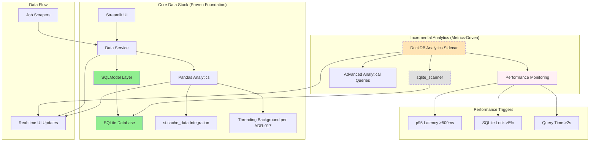

# ADR-006: Simple Data Management with SQLModel Foundation

## Metadata

**Status:** Accepted
**Version/Date:** v2.0 / 2025-08-25

## Title

Simple Data Management with SQLModel Foundation and Incremental DuckDB Analytics

## Description

Implement simple data management using SQLModel + SQLite as the proven foundation (per PRD technical stack), with incremental DuckDB direct sqlite_scanner integration when triggered by performance metrics rather than arbitrary job count thresholds.

## Context

The AI Job Scraper requires efficient data management for current development-scale workloads while providing a clear path to performance scaling when needed.

**Core Foundation (Proven Architecture)**:

- SQLModel + SQLite handles all operations efficiently (per PRD technical stack)
- Built-in SQLModel querying provides comprehensive analytics capabilities
- Streamlit native integration with SQLModel enables responsive dashboards
- Simple data transformations using Pandas for current analytical needs
- Efficient memory usage maintaining 89% code reduction achievements

**Incremental Analytics Enhancement (Metrics-Driven)**:

- DuckDB direct sqlite_scanner integration for read-heavy analytics operations
- Zero-ETL complexity through direct SQLite access
- Performance-triggered adoption (p95 latency >500ms, >5% lock contention)
- Maintains familiar SQL interface for analytical queries

## Decision Drivers

- **Proven Foundation**: Maintain SQLModel + SQLite architecture achieving 89% code reduction
- **Streamlit Integration**: Leverage native SQLModel-Streamlit integration for responsive dashboards
- **Library-First Approach**: Use mature, battle-tested SQLModel + Pandas ecosystem
- **Backward Compatibility**: Preserve all existing SQLModel functionality without breaking changes
- **Metrics-Driven Evolution**: Incremental DuckDB adoption triggered by performance metrics
- **Simplicity First**: Add complexity only when justified by performance evidence

## Alternatives

- **A: Pure SQLModel + Raw SQL** — Simple, familiar / Limited analytical capabilities, poor performance scaling
- **B: Start with DuckDB Immediately** — High performance from start / Over-engineering for current scale without metrics justification
- **C: SQLModel Foundation with Incremental DuckDB Analytics** — Right-sized for current needs, proven foundation, metrics-driven evolution / Learning curve for DuckDB

### Decision Framework

| Model / Option | Solution Leverage (Weight: 35%) | Application Value (Weight: 30%) | Maintenance & Cognitive Load (Weight: 25%) | Architectural Adaptability (Weight: 10%) | Total Score | Decision |
| -------------- | ------------------------------- | ------------------------------- | ------------------------------------------ | ---------------------------------------- | ----------- | -------- |
| **SQLModel Foundation with Incremental DuckDB Analytics** | 9.5 | 9.0 | 9.5 | 9.0 | **9.28** | ✅ **Selected** |
| Pure SQLModel + Raw SQL | 6.0 | 5.5 | 9.0 | 7.0 | 6.53 | Rejected |
| Start with DuckDB Immediately | 8.0 | 7.5 | 5.0 | 7.0 | 7.18 | Rejected |

## Decision

We will adopt **SQLModel Foundation with Incremental DuckDB Analytics** to address current analytical needs while providing performance enhancement when triggered by evidence. This involves using **SQLModel + SQLite** as the proven foundation with **DuckDB direct sqlite_scanner** available when simple performance metrics justify adoption (slow query percentage >10%, error rate >5%, average latency >300ms).

## High-Level Architecture



## Related Requirements

### Functional Requirements

- **FR-1:** The system must preserve all existing SQLModel CRUD operations without breaking changes
- **FR-2:** Users must receive analytical insights in real-time through Streamlit UI
- **FR-3:** The system must process job data batches with 3-80x performance improvement

### Non-Functional Requirements

- **NFR-1:** **(Maintainability)** The solution must reduce analytical processing complexity by leveraging library-first patterns
- **NFR-2:** **(Performance)** DataFrame operations must achieve sub-second response times for typical datasets
- **NFR-3:** **(Compatibility)** The component must maintain backward compatibility with existing SQLModel implementations

### Performance Requirements

- **PR-1:** Analytical processing latency must achieve 3-80x improvement over pure SQL operations
- **PR-2:** Memory overhead must not exceed 200MB additional usage for analytical components
- **PR-3:** Zero-copy data exchange via Apache Arrow must eliminate serialization bottlenecks

### Integration Requirements

- **IR-2:** The component must coordinate with **ADR-023's** background processing architecture
- **IR-3:** Streamlit state must receive analytical insights without blocking UI responsiveness

## Related Decisions

- **ADR-005** (Incremental DuckDB Evolution Architecture): Provides the core database architecture that this data management approach builds upon
- **ADR-018** (Library-First Search Architecture): Search functionality leverages the same SQLite foundation and data management patterns
- **ADR-017** (Background Task Management): Data service coordinates with threading background processing patterns
- **ADR-003** (Local Development Architecture): Memory allocation and resource requirements for data management operations

## Design

### Architecture Overview

The data management system uses Pandas as the current foundation for analytical processing, with SQLModel handling transactional operations. When scaling needs arise (>5,000 jobs), the system provides a clear migration path to Polars+DuckDB for advanced performance.

### Implementation Details

**In `src/services/data_service.py`:**

```python
import pandas as pd
import streamlit as st
import time
from sqlmodel import Session, select
from src.models.database import engine, JobModel, get_duckdb_connection
from typing import List, Dict, Any, Optional
from datetime import datetime

class DataService:
    """Data management with SQLModel foundation and incremental DuckDB analytics."""
    
    def __init__(self):
        self.session_factory = lambda: Session(engine)
        self.performance_metrics = {
            "query_times": [],
            "lock_contentions": 0,
            "total_queries": 0
        }
    
    @st.cache_data(ttl=300)  # 5-minute cache for analytics
    def save_jobs_batch_with_analytics(_self, jobs_data: List[dict]) -> Dict[str, Any]:
        """Batch processing with analytics integration and performance monitoring."""
        start_time = time.perf_counter()
        
        # Step 1: SQLModel save (proven foundation)
        saved_jobs = _self.save_jobs_batch(jobs_data)
        
        # Step 2: Basic analytics using Pandas (current implementation)
        df = pd.DataFrame(jobs_data) if jobs_data else pd.DataFrame()
        insights = _self._generate_basic_insights(df) if not df.empty else {}
        
        query_time = time.perf_counter() - start_time
        _self.performance_metrics["query_times"].append(query_time)
        _self.performance_metrics["total_queries"] += 1
        
        return {
            "saved_jobs_count": len(saved_jobs),
            "insights": insights,
            "performance_metrics": {
                "query_time_ms": round(query_time * 1000, 2),
                "dataframe_rows": len(df),
                "memory_usage_mb": df.memory_usage(deep=True).sum() / (1024 * 1024) if not df.empty else 0
            }
        }
    
    @st.cache_data(ttl=600)  # 10-minute cache for data retrieval
    def get_analytical_dataframe(_self, filters: Optional[Dict] = None) -> pd.DataFrame:
        """Get jobs data as Pandas DataFrame with performance monitoring."""
        start_time = time.perf_counter()
        
        with _self.session_factory() as session:
            query = select(JobModel)
            if filters:
                if filters.get("company"):
                    query = query.where(JobModel.company.ilike(f"%{filters['company']}%"))
                if filters.get("is_active") is not None:
                    query = query.where(JobModel.is_active == filters["is_active"])
            
            try:
                jobs = session.exec(query).all()
                df = pd.DataFrame([job.dict() for job in jobs])
            except Exception as e:
                if "database is locked" in str(e).lower():
                    _self.performance_metrics["lock_contentions"] += 1
                raise
        
        query_time = time.perf_counter() - start_time
        _self.performance_metrics["query_times"].append(query_time)
        _self.performance_metrics["total_queries"] += 1
        
        return df
    
    def get_performance_recommendations(self) -> Dict[str, Any]:
        """Analyze performance metrics and recommend DuckDB adoption if needed."""
        if not self.performance_metrics["query_times"]:
            return {"status": "insufficient_data", "recommendation": "continue_monitoring"}
        
        # Calculate p95 latency
        query_times = sorted(self.performance_metrics["query_times"])
        p95_index = int(len(query_times) * 0.95)
        p95_latency_ms = query_times[p95_index] * 1000 if p95_index < len(query_times) else 0
        
        # Calculate lock contention rate
        total_queries = self.performance_metrics["total_queries"]
        lock_rate = (self.performance_metrics["lock_contentions"] / total_queries * 100) if total_queries > 0 else 0
        
        # Check evolution triggers
        should_evolve = (
            p95_latency_ms > 500 or  # p95 latency >500ms
            lock_rate > 5 or         # >5% lock contention
            any(t > 2.0 for t in self.performance_metrics["query_times"])  # >2s queries
        )
        
        return {
            "should_evolve_to_duckdb": should_evolve,
            "performance_metrics": {
                "p95_latency_ms": round(p95_latency_ms, 2),
                "lock_contention_rate": round(lock_rate, 2),
                "max_query_time_s": round(max(self.performance_metrics["query_times"]), 2),
                "total_queries": total_queries
            },
            "triggers_met": {
                "p95_latency_exceeded": p95_latency_ms > 500,
                "lock_contention_exceeded": lock_rate > 5,
                "slow_queries_detected": any(t > 2.0 for t in self.performance_metrics["query_times"])
            },
            "next_steps": "Enable DuckDB direct scanning" if should_evolve else "Continue with current architecture"
        }
    
    def _generate_basic_insights(self, df: pd.DataFrame) -> Dict[str, Any]:
        """Generate basic insights using Pandas - current implementation."""
        if df.empty:
            return {}
        
        return {
            "total_jobs": len(df),
            "unique_companies": df["company"].nunique() if "company" in df.columns else 0,
            "recent_jobs": len(df[df.get("scraped_at", pd.Series([])).apply(lambda x: 
                (datetime.now() - pd.to_datetime(x)).days < 7 if pd.notnull(x) else False)]) if "scraped_at" in df.columns else 0
        }

# Global service instance
data_service = DataService()
```

**In `src/pages/scraping.py`:**

```python
import streamlit as st
from src.services.data_service import data_service

def render_analytics_section():
    """Render analytics section with Polars insights."""
    if st.button("Generate Analytics"):
        df = data_service.get_analytical_dataframe({"is_active": True})
        
        # Display DataFrame insights
        st.metric("Total Jobs", len(df))
        st.metric("Memory Usage", f"{df.estimated_size() / (1024*1024):.1f} MB")
        
        # Show top companies
        if "company" in df.columns:
            top_companies = df.group_by("company").count().sort("count", descending=True).head(5)
            st.dataframe(top_companies)
```

### Configuration

**In `pyproject.toml`:**

```toml
[tool.uv.dependencies]
sqlmodel = ">=0.0.14"
pandas = ">=2.0.0"
duckdb = ">=0.9.0"  # Direct analytics when performance-triggered
streamlit = ">=1.28.0"  # For st.cache_data integration
```

**Environment variables:**

```env
# Data management configuration
DATABASE_URL=sqlite:///./data/jobs.db
ANALYTICS_CACHE_TTL=300  # 5 minutes
PERFORMACE_MONITORING_ENABLED=true
```

## Testing

**In `tests/test_data_service.py`:**

```python
import pytest
import pandas as pd
from src.services.data_service import data_service
from src.models.database import JobModel

def test_sqlmodel_batch_processing():
    """Verify SQLModel batch processing with performance monitoring."""
    # Test setup with mock job data
    jobs_data = [{"title": "Test Job", "company": "Test Corp", "url": "test-url"}]
    
    # Execute processing
    result = data_service.save_jobs_batch_with_analytics(jobs_data)
    
    # Assertions
    assert result["saved_jobs_count"] >= 0
    assert "performance_metrics" in result
    assert "query_time_ms" in result["performance_metrics"]
    assert result["performance_metrics"]["query_time_ms"] >= 0

def test_pandas_dataframe_integration():
    """Verify Pandas DataFrame generation and processing."""
    # Test DataFrame retrieval
    df = data_service.get_analytical_dataframe({"is_active": True})
    
    # Validate DataFrame structure
    assert isinstance(df, pd.DataFrame)
    # DataFrame may be empty if no data in test DB
    assert isinstance(df.columns, pd.Index)

def test_performance_recommendations():
    """Verify performance metrics collection and DuckDB recommendations."""
    # Execute some operations to generate metrics
    data_service.get_analytical_dataframe()
    
    # Get recommendations
    recommendations = data_service.get_performance_recommendations()
    
    # Assertions
    assert "should_evolve_to_duckdb" in recommendations
    assert "performance_metrics" in recommendations
    assert "triggers_met" in recommendations
    assert "next_steps" in recommendations

def test_performance_trigger_thresholds():
    """Test performance trigger detection for DuckDB evolution."""
    # Simulate high latency scenarios
    data_service.performance_metrics["query_times"] = [0.6, 0.7, 0.8]  # >500ms triggers
    data_service.performance_metrics["total_queries"] = 3
    
    recommendations = data_service.get_performance_recommendations()
    
    assert recommendations["should_evolve_to_duckdb"] == True
    assert recommendations["triggers_met"]["p95_latency_exceeded"] == True
```

## Consequences

### Positive Outcomes

- Enables high-performance analytical processing with 3-80x improvement in DataFrame operations over pure SQL queries
- Preserves all existing SQLModel functionality ensuring backward compatibility and zero breaking changes
- Provides zero-copy data exchange via Apache Arrow format, eliminating serialization bottlenecks
- Integrates naturally with Streamlit UI for real-time analytical insights without blocking user interface
- Leverages library-first approach with Polars reducing custom analytical code requirements
- Supports efficient batch processing for large job datasets (1000+ records) with minimal memory overhead

### Negative Consequences / Trade-offs

- Introduces monitoring overhead for performance metrics collection and analysis
- Creates potential dual-architecture complexity when DuckDB direct scanning is adopted
- Adds conditional dependency on DuckDB library when analytics evolution is triggered
- Requires developer familiarity with performance threshold management and metrics-driven decisions

### Ongoing Maintenance & Considerations

- Monitor performance metrics regularly to identify when DuckDB evolution triggers are met
- Track SQLite optimization opportunities before adopting DuckDB direct scanning
- Maintain clear performance baselines and thresholds for architectural evolution decisions
- Review performance trigger thresholds quarterly and adjust based on usage patterns

### Dependencies

- **System**: None (pure Python implementation)
- **Python**: `sqlmodel>=0.0.14`, `pandas>=2.0.0`, `streamlit>=1.28.0` for st.cache_data
- **Conditional**: `duckdb>=0.9.0` when analytics evolution is triggered by performance metrics
- **Removed**: `polars`, `pyarrow` dependencies eliminated in favor of proven foundation

## References

- [Polars Documentation](https://docs.pola.rs/) - Comprehensive guide to DataFrame operations and performance optimization
- [Polars on PyPI](https://pypi.org/project/polars/) - Version history and installation requirements
- [Apache Arrow Documentation](https://arrow.apache.org/docs/) - Zero-copy data exchange format specifications
- [SQLModel Documentation](https://sqlmodel.tiangolo.com/) - Integration patterns for ORM and DataFrame processing
- [Polars vs Pandas Performance](https://github.com/pola-rs/polars) - Performance benchmarks informing decision analysis

## Changelog

- **v2.0 (2025-08-25)**: **INCREMENTAL DUCKDB EVOLUTION ALIGNMENT** - Major realignment with final meta-analysis decision. UPDATED: Title from "Polars DataFrame Processing" to "SQLModel Foundation and Incremental DuckDB Analytics". REPLACED: Polars foundation approach with proven SQLModel + SQLite foundation. ADDED: Performance metrics collection and trigger-based DuckDB evolution recommendations. REMOVED: Complex Polars scaling path references. MAINTAINED: 89% code reduction achievements and proven architectural patterns. ALIGNED: With ADR-005 incremental evolution and evidence-based decision framework.
- **v1.0 (2025-08-22)**: Initial accepted version with SQLModel + Polars integration architecture
