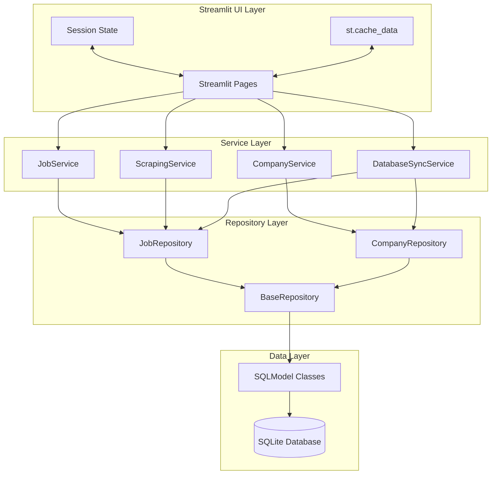

# ADR-007: Service Layer Architecture for Streamlit Integration

## Title

Service Layer Architecture Patterns for Streamlit Applications with SQLModel Backend

## Version/Date

1.0 / August 20, 2025

## Status

Accepted

## Context

**Current State**: The application has grown from simple Streamlit pages to complex business logic requiring clean separation of concerns. Direct database access from UI components creates tight coupling and testing difficulties.

**Research Findings**: Streamlit applications benefit from service layer patterns that provide:

- Clear separation between UI logic and business logic
- Testable service interfaces independent of Streamlit context
- Consistent error handling and transaction management
- Dependency injection patterns for different environments (dev/test/prod)

**Library-First Approach**: Leveraging SQLModel's native patterns with Streamlit's session state for clean architecture.

## Related Requirements

### Functional Requirements

- FR-028-01: Separate business logic from UI rendering concerns
- FR-028-02: Provide testable service interfaces for all major operations
- FR-028-03: Support dependency injection for different database configurations
- FR-028-04: Handle transactional operations with proper rollback support

### Non-Functional Requirements  

- NFR-028-01: Maintain Streamlit performance with efficient session management
- NFR-028-02: Enable unit testing without Streamlit dependencies
- NFR-028-03: Provide clear error handling and user feedback patterns
- NFR-028-04: Support concurrent operations with proper session isolation

## Decision

**Implement Service Layer Architecture** with Streamlit-optimized patterns:

### Architecture Overview



## Service Layer Implementation

### Base Service Pattern

```python
# src/services/base_service.py
from abc import ABC, abstractmethod
from typing import TypeVar, Generic, Optional, List
from sqlmodel import Session
from src.database import get_session
import logging

T = TypeVar('T')

class BaseService(Generic[T], ABC):
    """Base service class with common patterns for Streamlit applications."""
    
    def __init__(self, session: Optional[Session] = None):
        self.session = session or next(get_session())
        self.logger = logging.getLogger(self.__class__.__name__)
        
    def __enter__(self):
        return self
        
    def __exit__(self, exc_type, exc_val, exc_tb):
        if self.session:
            if exc_type is None:
                self.session.commit()
            else:
                self.session.rollback()
                self.logger.error(f"Service transaction rolled back: {exc_val}")
            
    @abstractmethod
    def get_repository(self):
        """Return the repository instance for this service."""
        pass
        
    def handle_service_error(self, operation: str, error: Exception) -> dict:
        """Standardized error handling for UI feedback."""
        self.logger.error(f"Service error in {operation}: {error}")
        return {
            "success": False,
            "error": str(error),
            "operation": operation
        }
        
    def success_response(self, data: any = None, message: str = None) -> dict:
        """Standardized success response."""
        return {
            "success": True,
            "data": data,
            "message": message
        }
```

### Job Service Implementation

```python
# src/services/job_service.py
from typing import List, Optional, Dict, Any
from sqlmodel import Session, select
from src.services.base_service import BaseService
from src.models import Job, Company
from src.repositories.job_repository import JobRepository
import streamlit as st

class JobService(BaseService[Job]):
    """Service layer for job-related operations."""
    
    def __init__(self, session: Optional[Session] = None):
        super().__init__(session)
        self._repository = None
        
    def get_repository(self):
        if self._repository is None:
            self._repository = JobRepository(self.session)
        return self._repository
        
    @st.cache_data(ttl=300, show_spinner=False)  # 5-minute cache
    def get_jobs_by_company(_self, company_name: str, limit: int = 100) -> Dict[str, Any]:
        """Get jobs for a specific company with Streamlit caching."""
        try:
            jobs = _self.get_repository().get_by_company(company_name, limit)
            return _self.success_response(
                data=[job.dict() for job in jobs],
                message=f"Found {len(jobs)} jobs for {company_name}"
            )
        except Exception as e:
            return _self.handle_service_error("get_jobs_by_company", e)
    
    @st.cache_data(ttl=60, show_spinner=False)  # 1-minute cache for real-time data
    def get_recent_jobs(_self, hours: int = 24, limit: int = 50) -> Dict[str, Any]:
        """Get recently scraped jobs with caching."""
        try:
            jobs = _self.get_repository().get_recent(hours, limit)
            return _self.success_response(
                data=[job.dict() for job in jobs],
                message=f"Found {len(jobs)} recent jobs"
            )
        except Exception as e:
            return _self.handle_service_error("get_recent_jobs", e)
    
    def bulk_insert_jobs(self, jobs_data: List[Dict[str, Any]]) -> Dict[str, Any]:
        """Bulk insert jobs with transaction management."""
        try:
            with self:  # Automatic transaction management
                jobs = [Job(**job_data) for job_data in jobs_data]
                inserted_count = self.get_repository().bulk_insert(jobs)
                
                # Clear relevant caches
                st.cache_data.clear()
                
                return self.success_response(
                    data={"inserted_count": inserted_count},
                    message=f"Successfully inserted {inserted_count} jobs"
                )
        except Exception as e:
            return self.handle_service_error("bulk_insert_jobs", e)
    
    def update_job_processing_status(self, job_id: int, status: str) -> Dict[str, Any]:
        """Update job processing status (for AI enhancement tracking)."""
        try:
            job = self.get_repository().get_by_id(job_id)
            if not job:
                return self.handle_service_error("update_job_status", "Job not found")
                
            job.processing_status = status
            self.session.add(job)
            self.session.commit()
            
            return self.success_response(message=f"Updated job {job_id} status to {status}")
        except Exception as e:
            return self.handle_service_error("update_job_processing_status", e)
```

### Company Service Implementation

```python
# src/services/company_service.py
from typing import List, Optional, Dict, Any
from sqlmodel import Session, select, func
from src.services.base_service import BaseService
from src.models import Company, Job
from src.repositories.company_repository import CompanyRepository
import streamlit as st

class CompanyService(BaseService[Company]):
    """Service layer for company-related operations."""
    
    def get_repository(self):
        if not hasattr(self, '_repository'):
            self._repository = CompanyRepository(self.session)
        return self._repository
    
    @st.cache_data(ttl=900, show_spinner=False)  # 15-minute cache
    def get_companies_with_job_counts(_self) -> Dict[str, Any]:
        """Get companies with their job counts."""
        try:
            companies_with_counts = _self.session.exec(
                select(
                    Company.name,
                    Company.domain,
                    Company.industry,
                    func.count(Job.id).label('job_count')
                )
                .outerjoin(Job, Job.company == Company.name)
                .group_by(Company.id)
                .order_by(func.count(Job.id).desc())
            ).all()
            
            return _self.success_response(
                data=[
                    {
                        "name": comp.name,
                        "domain": comp.domain, 
                        "industry": comp.industry,
                        "job_count": comp.job_count
                    }
                    for comp in companies_with_counts
                ]
            )
        except Exception as e:
            return _self.handle_service_error("get_companies_with_job_counts", e)
    
    def add_companies_from_list(self, company_names: List[str]) -> Dict[str, Any]:
        """Add multiple companies from a list of names."""
        try:
            with self:
                existing_names = set(
                    comp.name for comp in self.session.exec(
                        select(Company.name).where(Company.name.in_(company_names))
                    ).all()
                )
                
                new_companies = [
                    Company(name=name, domain=f"{name.lower().replace(' ', '')}.com")
                    for name in company_names
                    if name not in existing_names
                ]
                
                if new_companies:
                    for company in new_companies:
                        self.session.add(company)
                    
                    # Clear cache after adding
                    st.cache_data.clear()
                
                return self.success_response(
                    data={
                        "added_count": len(new_companies),
                        "skipped_count": len(existing_names),
                        "total_requested": len(company_names)
                    },
                    message=f"Added {len(new_companies)} new companies"
                )
        except Exception as e:
            return self.handle_service_error("add_companies_from_list", e)
```

### Scraping Service Integration

```python
# src/services/scraping_service.py
from typing import List, Dict, Any, Optional
from sqlmodel import Session
from src.services.base_service import BaseService
from src.services.job_service import JobService
from src.services.company_service import CompanyService
from src.scraper import SimplifiedScraper
import asyncio
import threading
import streamlit as st

class ScrapingService(BaseService):
    """Service layer for scraping operations with Streamlit integration."""
    
    def __init__(self, session: Optional[Session] = None):
        super().__init__(session)
        self.job_service = JobService(session)
        self.company_service = CompanyService(session)
        self.scraper = SimplifiedScraper()
        
    def get_repository(self):
        return None  # Composite service
        
    def scrape_companies_async(self, company_names: List[str], 
                              progress_callback: Optional[callable] = None) -> Dict[str, Any]:
        """Scrape multiple companies with progress tracking for Streamlit."""
        try:
            def scraping_task():
                loop = asyncio.new_event_loop()
                asyncio.set_event_loop(loop)
                
                total_jobs = 0
                processed_companies = 0
                
                for i, company in enumerate(company_names):
                    try:
                        # Update progress
                        if progress_callback:
                            progress_callback({
                                "company": company,
                                "progress": i / len(company_names),
                                "status": "scraping"
                            })
                        
                        # Scrape company
                        jobs_data = loop.run_until_complete(
                            self.scraper.scrape_company(company)
                        )
                        
                        # Store results
                        if jobs_data:
                            result = self.job_service.bulk_insert_jobs(jobs_data)
                            if result["success"]:
                                total_jobs += result["data"]["inserted_count"]
                        
                        processed_companies += 1
                        
                    except Exception as e:
                        self.logger.error(f"Error scraping {company}: {e}")
                        continue
                
                # Final progress update
                if progress_callback:
                    progress_callback({
                        "company": "Complete",
                        "progress": 1.0,
                        "status": "completed",
                        "total_jobs": total_jobs,
                        "companies_processed": processed_companies
                    })
                
                loop.close()
                
            # Run in background thread with Streamlit context
            thread = threading.Thread(target=scraping_task)
            thread.daemon = True
            thread.start()
            
            return self.success_response(message="Scraping started in background")
            
        except Exception as e:
            return self.handle_service_error("scrape_companies_async", e)
```

## Streamlit Integration Patterns

### Session State Management

```python
# src/ui/utils/service_helpers.py
import streamlit as st
from typing import Optional
from src.services.job_service import JobService
from src.services.company_service import CompanyService
from src.services.scraping_service import ScrapingService

@st.cache_resource
def get_job_service() -> JobService:
    """Cached service instance for Streamlit sessions."""
    return JobService()

@st.cache_resource  
def get_company_service() -> CompanyService:
    """Cached service instance for Streamlit sessions."""
    return CompanyService()

@st.cache_resource
def get_scraping_service() -> ScrapingService:
    """Cached service instance for Streamlit sessions."""
    return ScrapingService()

def initialize_session_services():
    """Initialize services in session state."""
    if 'job_service' not in st.session_state:
        st.session_state.job_service = get_job_service()
    if 'company_service' not in st.session_state:
        st.session_state.company_service = get_company_service()
    if 'scraping_service' not in st.session_state:
        st.session_state.scraping_service = get_scraping_service()
```

### Page Integration Example

```python
# src/ui/pages/jobs.py
import streamlit as st
from src.ui.utils.service_helpers import initialize_session_services

def render_jobs_page():
    """Jobs page with service layer integration."""
    st.title("Jobs Dashboard")
    
    # Initialize services
    initialize_session_services()
    job_service = st.session_state.job_service
    
    # Company filter
    company_filter = st.selectbox("Filter by Company", ["All", "Google", "Microsoft"])
    
    # Get jobs data through service layer
    if company_filter == "All":
        result = job_service.get_recent_jobs(hours=168, limit=100)  # 1 week
    else:
        result = job_service.get_jobs_by_company(company_filter, limit=100)
    
    # Handle service response
    if result["success"]:
        jobs_data = result["data"]
        st.success(result.get("message", "Data loaded successfully"))
        
        # Display jobs
        for job in jobs_data:
            with st.expander(f"{job['title']} at {job['company']}"):
                st.write(f"**Location:** {job.get('location', 'Not specified')}")
                st.write(f"**Description:** {job.get('description', 'No description')[:200]}...")
                if job.get('url'):
                    st.link_button("Apply", job['url'])
    else:
        st.error(f"Error loading jobs: {result['error']}")
```

## Testing Patterns

### Service Unit Tests

```python
# tests/services/test_job_service.py
import pytest
from unittest.mock import Mock, patch
from src.services.job_service import JobService
from src.models import Job

class TestJobService:
    @pytest.fixture
    def mock_session(self):
        return Mock()
        
    @pytest.fixture
    def job_service(self, mock_session):
        return JobService(session=mock_session)
    
    def test_get_jobs_by_company_success(self, job_service):
        # Mock repository
        mock_repo = Mock()
        mock_jobs = [
            Job(id=1, title="Engineer", company="Google", location="SF"),
            Job(id=2, title="Manager", company="Google", location="NYC")
        ]
        mock_repo.get_by_company.return_value = mock_jobs
        
        with patch.object(job_service, 'get_repository', return_value=mock_repo):
            result = job_service.get_jobs_by_company("Google")
        
        assert result["success"] == True
        assert len(result["data"]) == 2
        assert "Google" in result["message"]
    
    def test_bulk_insert_jobs_transaction_rollback(self, job_service, mock_session):
        # Simulate database error
        mock_session.add.side_effect = Exception("Database error")
        
        jobs_data = [{"title": "Test", "company": "Test Corp"}]
        result = job_service.bulk_insert_jobs(jobs_data)
        
        assert result["success"] == False
        assert "Database error" in result["error"]
        mock_session.rollback.assert_called_once()
```

## Related ADRs

### Integration Points

- **ADR-017**: Background task management (threading.Thread integrates with service layer)
- **ADR-006**: Simple data management (service layer provides abstraction)
- **ADR-014**: 2-tier scraping strategy (ScrapingService orchestrates both tiers)
- **ADR-016**: Native HTTPX Resilience Strategy (service layer operations use HTTPX native transport retries + minimal status code handling for comprehensive error recovery)
- **ADR-018**: Library-first search architecture (JobSearchService follows established service layer patterns)

### Dependencies

- **SQLModel**: Database ORM and model definitions
- **Streamlit**: UI framework with caching and session state
- **Repository Pattern**: Data access layer abstraction

## Success Metrics

### Code Quality Targets

- [ ] 90%+ test coverage for all service classes
- [ ] Zero direct database access from Streamlit pages
- [ ] All business logic testable without Streamlit context
- [ ] Consistent error handling across all services

### Performance Targets

- [ ] Service method response times <100ms for cached operations
- [ ] Database connection pooling efficiency >95%
- [ ] Streamlit cache hit rate >80% for common operations
- [ ] Memory usage stable across session boundaries

### Maintainability Targets

- [ ] Clear separation between UI, service, and data layers
- [ ] New features require minimal cross-layer changes
- [ ] Service interfaces documented with examples
- [ ] Error messages provide actionable feedback for users

## Consequences

### Positive Outcomes

- **Clean Architecture**: Clear separation of concerns between layers
- **Testability**: Business logic isolated from Streamlit dependencies  
- **Consistency**: Standardized patterns for error handling and caching
- **Performance**: Optimized caching strategy for Streamlit applications
- **Maintainability**: Service interfaces make changes predictable and contained

### Risk Mitigation

- **Session Management**: Proper cleanup of database connections
- **Error Handling**: Consistent user feedback without exposing internals
- **Testing Strategy**: Comprehensive unit tests for business logic
- **Performance Monitoring**: Cache efficiency and response time tracking

---

*This ADR establishes service layer architecture patterns optimized for Streamlit applications with clean separation of concerns and comprehensive testing strategies.*
