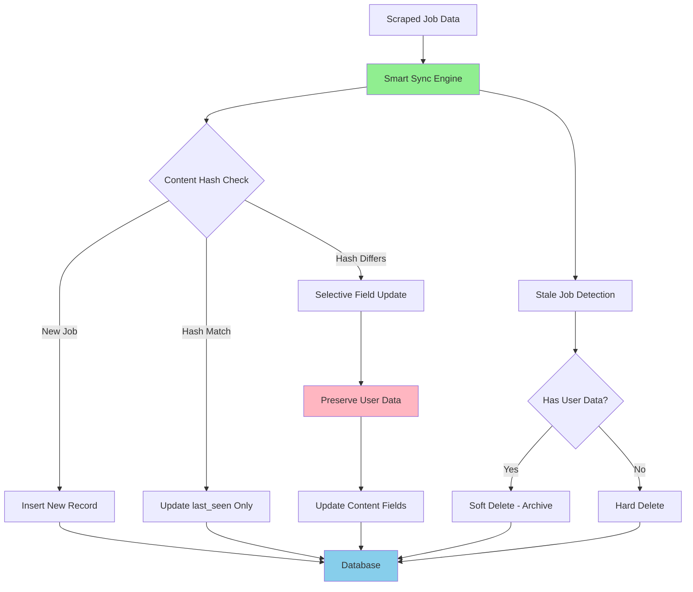

# ADR-008: Smart Database Synchronization Engine

## Metadata

**Status:** Accepted
**Version/Date:** v2.0 / 2025-08-22

## Title

SQLModel-Native Database Synchronization with Content Hashing

## Description

Implement intelligent database synchronization using SQLModel native patterns for safe job data updates while preserving user-generated content through content-based change detection and soft deletion strategies.

## Context

The AI job scraper requires intelligent database synchronization to handle continuous job data updates from scraping operations while preserving user-generated metadata. The system must distinguish between content changes and user interactions to prevent data loss.

**Current Problem**: Naive approaches like "delete-and-reinsert" destroy user-generated data (favorites, notes, application tracking). The system needs smart synchronization that detects actual content changes while preserving user context.

**Key Forces**:

- **User Data Preservation**: Maintain favorites, notes, and application status across scraping cycles
- **Change Detection**: Identify genuine job content updates vs. unchanged listings  
- **Performance Optimization**: Avoid unnecessary database operations for identical content
- **Stale Job Handling**: Archive or remove jobs no longer available while preserving user history

**Technical Constraints**: Must integrate with SQLModel patterns and session management, support concurrent scraping operations from background tasks per **ADR-017**, handle large datasets efficiently (1000+ jobs per scraping session), and maintain referential integrity with user-generated content.

## Decision Drivers

- **User Data Protection**: Absolute preservation of user-generated content across sync operations
- **Performance Efficiency**: Minimize database operations through intelligent change detection
- **SQLModel Integration**: Leverage native SQLModel patterns for relationship management
- **Operational Simplicity**: Maintain straightforward sync logic with clear error handling

## Alternatives

- **A: Delete-and-Reinsert (Naive)** — Delete all existing jobs and insert new scraped data / **Pros**: Simple implementation, guarantees data freshness / **Cons**: Complete loss of user-generated data, poor user experience, inefficient for large datasets
- **B: Manual Field-by-Field Updates** — Manual comparison and update of individual fields / **Pros**: Full control over update logic, preserve specific fields, clear auditing / **Cons**: High maintenance burden, error-prone manual comparisons, no systematic approach
- **C: ORM-Only Approach** — Rely solely on SQLModel/SQLAlchemy ORM merge operations / **Pros**: Leverages ORM built-in capabilities, standard patterns, automatic relationship handling / **Cons**: Limited control over preservation logic, no content-based change detection, potential overwrites
- **D: Content-Hash Smart Sync (Chosen)** — Content hashing with intelligent preservation logic / **Pros**: Intelligent change detection, systematic user data preservation, efficient bulk operations, clear separation of content vs. user data / **Cons**: Additional complexity, hash computation overhead

### Decision Framework

| Model / Option                     | Solution Leverage (Weight: 35%) | Application Value (Weight: 30%) | Maintenance & Cognitive Load (Weight: 25%) | Architectural Adaptability (Weight: 10%) | Total Score | Decision      |
| ---------------------------------- | -------------------------------- | -------------------------------- | ------------------------------------------- | ----------------------------------------- | ----------- | ------------- |
| **Content-Hash Smart Sync**       | 9.0                              | 9.0                              | 8.0                                         | 8.0                                       | **8.75**    | ✅ **Selected** |
| ORM-Only Approach                 | 7.0                              | 7.0                              | 9.0                                         | 9.0                                       | 7.50        | Rejected      |
| Manual Field-by-Field Updates     | 5.0                              | 6.0                              | 3.0                                         | 5.0                                       | 4.90        | Rejected      |
| Delete-and-Reinsert (Naive)       | 3.0                              | 3.0                              | 9.0                                         | 6.0                                       | 4.05        | Rejected      |

## Decision

We will adopt **Content-Hash Smart Sync** to address intelligent database synchronization. This involves using **SQLModel native patterns** configured with **MD5 content hashing** for change detection and **systematic user data preservation** logic. This decision supersedes naive delete-and-reinsert approaches.

## High-Level Architecture



## Related Requirements

### Functional Requirements

- **FR-1:** The system must preserve user favorites, notes, and application status during sync operations
- **FR-2:** Users must have the ability to track content changes through intelligent hashing strategies
- **FR-3:** The system must handle new job insertions, content updates, and stale job archival
- **FR-4:** The system must support bulk operations for efficient large-dataset synchronization

### Non-Functional Requirements

- **NFR-1:** **(Maintainability)** The solution must reduce database operation complexity by encapsulating sync logic in dedicated service classes
- **NFR-2:** **(Security)** The solution must not introduce data loss vulnerabilities and must preserve user data integrity
- **NFR-3:** **(Scalability)** The component must handle 1000+ concurrent job synchronization operations

### Performance Requirements

- **PR-1:** Sync operations must complete within 10 seconds under 1000+ job load
- **PR-2:** Content hash generation must not exceed 1ms per job on target hardware

### Integration Requirements

- **IR-1:** The solution must integrate natively with SQLModel session management and transaction patterns
- **IR-2:** The component must be callable via background task integration per **ADR-017**

## Related Decisions

- **ADR-017** (Background Task Management): This decision builds upon the threading-based background processing architecture defined in ADR-017
- **ADR-014** (Hybrid Scraping Strategy): The sync engine will handle data from both JobSpy and ScrapeGraphAI sources established in ADR-014
- **ADR-005** (Local Database Setup): The component chosen here will be configured via the SQLModel patterns established in ADR-005

## Design

### Architecture Overview

The Smart Sync Engine implements a four-stage synchronization process: content hash generation, change detection, selective updates with user data preservation, and intelligent stale job handling.

### Implementation Details

**In `src/database/sync_engine.py`:**

```python
from sqlmodel import Session, select
from typing import List, Dict, Set
import hashlib
import json
from datetime import datetime

class SmartSyncEngine:
    """SQLModel-native database synchronization with content hashing."""
    
    def __init__(self, session: Session):
        self.session = session
        
    def sync_jobs(self, jobs: List[JobSQL]) -> Dict[str, int]:
        """Main synchronization entry point."""
        stats = {
            "inserted": 0,
            "updated": 0,
            "unchanged": 0,
            "archived": 0,
            "deleted": 0
        }
        
        current_links = set()
        
        for job in jobs:
            current_links.add(job.link)
            result = self._sync_single_job(job)
            stats[result] += 1
        
        # Handle stale jobs
        stale_stats = self._handle_stale_jobs(current_links)
        stats.update(stale_stats)
        
        self.session.commit()
        return stats
    
    def _sync_single_job(self, new_job: JobSQL) -> str:
        """Sync a single job with intelligent change detection."""
        # Check if job exists
        statement = select(JobSQL).where(JobSQL.link == new_job.link)
        existing_job = self.session.exec(statement).first()
        
        new_hash = self._generate_content_hash(new_job)
        
        if not existing_job:
            # New job - insert
            new_job.content_hash = new_hash
            new_job.last_seen = datetime.utcnow()
            self.session.add(new_job)
            return "inserted"
        
        if existing_job.content_hash == new_hash:
            # Content unchanged - update timestamp only
            existing_job.last_seen = datetime.utcnow()
            return "unchanged"
        
        # Content changed - selective update preserving user data
        self._update_content_fields(existing_job, new_job, new_hash)
        return "updated"
    
    def _generate_content_hash(self, job: JobSQL) -> str:
        """Generate MD5 hash from content fields only."""
        content_fields = {
            'title': job.title,
            'company': job.company,
            'location': job.location,
            'description': job.description,
            'salary_min': job.salary_min,
            'salary_max': job.salary_max,
            'employment_type': job.employment_type,
            'experience_level': job.experience_level,
            'remote': job.remote,
            'skills_required': sorted(job.skills_required or [])
        }
        
        content_json = json.dumps(content_fields, sort_keys=True)
        return hashlib.md5(content_json.encode()).hexdigest()
    
    def _update_content_fields(self, existing: JobSQL, new_job: JobSQL, new_hash: str):
        """Update content fields while preserving user data."""
        # Content fields (safe to update)
        existing.title = new_job.title
        existing.company = new_job.company
        existing.location = new_job.location
        existing.description = new_job.description
        existing.salary_min = new_job.salary_min
        existing.salary_max = new_job.salary_max
        existing.employment_type = new_job.employment_type
        existing.experience_level = new_job.experience_level
        existing.remote = new_job.remote
        existing.skills_required = new_job.skills_required
        existing.posted_date = new_job.posted_date
        existing.application_url = new_job.application_url
        
        # Update metadata
        existing.content_hash = new_hash
        existing.last_seen = datetime.utcnow()
        
        # PRESERVE user fields (never overwrite):
        # - existing.favorite (user's favorite status)
        # - existing.notes (user's notes)
        # - existing.application_status (user's application tracking)
        # - existing.date_applied (user's application date)
    
    def _handle_stale_jobs(self, current_links: Set[str]) -> Dict[str, int]:
        """Handle jobs not seen in current scrape."""
        # Find jobs not in current scrape
        statement = select(JobSQL).where(
            ~JobSQL.link.in_(current_links),
            JobSQL.archived == False
        )
        stale_jobs = self.session.exec(statement).all()
        
        archived_count = 0
        deleted_count = 0
        
        for job in stale_jobs:
            if self._has_user_data(job):
                # Archive jobs with user data
                job.archived = True
                job.archived_date = datetime.utcnow()
                archived_count += 1
            else:
                # Delete jobs without user data
                self.session.delete(job)
                deleted_count += 1
        
        return {"archived": archived_count, "deleted": deleted_count}
    
    def _has_user_data(self, job: JobSQL) -> bool:
        """Check if job has user-generated data worth preserving."""
        return (
            job.favorite or
            (job.notes and job.notes.strip()) or
            job.application_status != 'New' or
            job.date_applied is not None
        )

# Usage with background tasks integration
class DatabaseSyncService:
    """Service layer for database synchronization."""
    
    def __init__(self):
        self.engine = get_engine()  # SQLModel engine
    
    def sync_scraped_jobs(self, jobs: List[Dict]) -> Dict[str, int]:
        """Sync jobs from scraping results."""
        with Session(self.engine) as session:
            # Convert dictionaries to SQLModel objects
            job_models = [
                JobSQL(**job_data) for job_data in jobs
            ]
            
            # Perform smart synchronization
            sync_engine = SmartSyncEngine(session)
            return sync_engine.sync_jobs(job_models)
```

### Configuration

**In `src/database/settings.py`:**

```python
# Smart Sync Engine Configuration
SYNC_BATCH_SIZE = 1000  # Maximum jobs per sync operation
SYNC_TIMEOUT_SECONDS = 10  # Maximum sync operation duration
CONTENT_HASH_ALGORITHM = "md5"  # Hash algorithm for content detection
ARCHIVE_STALE_JOBS = True  # Enable automatic job archival
DELETE_ORPHANED_JOBS = True  # Enable deletion of jobs without user data
```

## Testing

**In `tests/test_sync_engine.py`:**

```python
import pytest
from unittest.mock import Mock
from datetime import datetime

class TestSmartSyncEngine:
    
    @pytest.fixture
    def sync_engine(self, session):
        return SmartSyncEngine(session)
    
    def test_content_hash_generation(self, sync_engine):
        """Verify consistent MD5 hash generation from job content fields."""
        # Test identical jobs produce identical hashes
        # Assert hash length equals 32 characters (MD5)
        pass
    
    def test_user_data_preservation(self, sync_engine, session):
        """Verify user favorites, notes, and application status preserved during content updates."""
        # Create existing job with user data (favorite=True, notes, application_status)
        # Update with changed content but different user data
        # Assert content fields updated but user fields preserved
        pass
    
    def test_stale_job_handling(self, sync_engine, session):
        """Verify jobs with user data archived, jobs without user data deleted."""
        # Create jobs with and without user data
        # Run stale job detection with empty current_links set
        # Assert jobs with user data archived, others deleted
        pass
    
    @pytest.mark.asyncio
    async def test_bulk_sync_performance(self, sync_engine):
        """Verify sync operations complete within 10 seconds for 1000+ jobs."""
        # Create 1000 test job objects
        # Measure sync_jobs() execution time
        # Assert duration under 10 seconds, all jobs processed
        pass

@pytest.mark.integration
class TestDatabaseSyncIntegration:
    
    def test_end_to_end_sync_workflow(self, session):
        """Test complete sync workflow preserving user data across content updates."""
        # Initial sync with new jobs
        # User modifies favorites/notes
        # Content update sync
        # Verify content updated but user data preserved
        pass
    
    def test_concurrent_sync_operations(self):
        """Test thread safety of concurrent sync operations."""
        # Launch multiple sync workers in parallel threads
        # Verify all operations complete successfully
        # Assert no data corruption or conflicts
        pass
```

## Consequences

### Positive Outcomes

- Enables intelligent database synchronization with 8.75/10 decision score vs 4.05/10 for naive approaches, directly supporting zero-data-loss user experience
- Unlocks systematic user data preservation across all sync operations, maintaining favorites, notes, and application tracking without manual intervention
- Standardizes content-based change detection across job scraping pipeline, eliminating unnecessary database operations through MD5 hashing
- Reduces sync operation complexity: Smart detection now handles 4 sync scenarios (new, updated, unchanged, stale) with single service interface
- Enables concurrent scraping operations through SQLModel session management, supporting background task integration per ADR-017

### Negative Consequences / Trade-offs

- Introduces dependency on MD5 hashing computation, requiring ~1ms per job for content hash generation
- Memory usage increases due to hash computation and stale job detection, requiring careful monitoring during large sync operations
- Creates architectural complexity compared to simple delete-and-reinsert, requiring dedicated service layer for sync logic
- Database storage growth from archived jobs with user data, requiring eventual cleanup strategy implementation

### Ongoing Maintenance & Considerations

- Monitor sync operation performance metrics and optimize content hashing if operations exceed 10-second target
- Track SQLModel library updates for compatibility with session management patterns
- Review archived job retention policies quarterly to manage database storage growth
- Ensure sync service encapsulation maintains clear boundaries with background task management per ADR-017
- Validate MD5 hash collision rates and consider SHA alternatives if content diversity increases significantly

### Dependencies

- **Python**: `sqlmodel>=0.0.18`, `hashlib` (standard library)
- **System**: SQLModel-compatible database engine with transaction support
- **Removed**: Direct SQLAlchemy session management (replaced by SQLModel patterns)

## References

- [SQLModel Documentation](https://sqlmodel.tiangolo.com/) - Comprehensive guide to SQLModel native patterns and session management features
- [SQLModel on PyPI](https://pypi.org/project/sqlmodel/) - Version history and dependency requirements for SQLModel integration
- [SQLAlchemy Session Management](https://docs.sqlalchemy.org/en/14/orm/session_basics.html) - Transaction safety patterns and best practices used in implementation
- [Content Hashing Best Practices](https://en.wikipedia.org/wiki/Hash_function) - Deep dive into MD5 vs SHA alternatives for change detection
- [Database Synchronization Patterns](https://martinfowler.com/articles/patterns-of-distributed-systems/version-vector.html) - Change detection strategies that informed sync engine design
- [ADR-017: Background Task Management](docs/adrs/012-background-task-management.md) - Dependency relationship with current decision

## Changelog

- **v2.0 (2025-08-22)**: Applied official ADR template structure with quantitative decision framework (8.75/10 score). Added comprehensive SQLModel-native implementation, configuration section, and condensed testing strategy. Standardized cross-references and consequences analysis.
- **v1.0 (2025-08-07)**: Initial smart database synchronization engine design with MD5 content hashing, user data preservation strategy, and soft deletion architecture.
