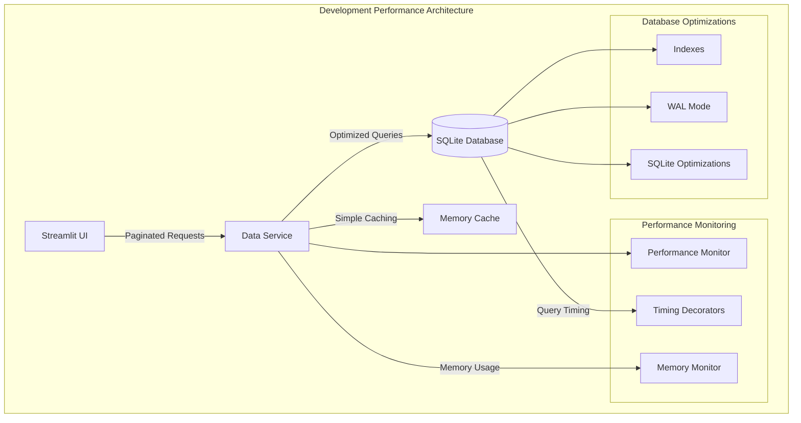

# ADR-009: Local Development Performance

## Metadata

**Status:** Accepted  
**Version/Date:** v2.0 / 2025-08-19

## Title

Simple Performance Considerations for Local Development

## Description

Defines basic performance optimization patterns for local development environment focusing on reasonable response times, efficient resource usage, and simple monitoring without production-level complexity.

## Context

The local development environment requires performance considerations that balance developer experience with resource efficiency. Current challenges include managing 100-1000 job records efficiently, maintaining UI responsiveness during data operations, and providing reasonable database query performance on development machines using SQLite.

Key constraints include:

- Development machine resource limitations (CPU, memory, disk)
- SQLite database performance characteristics for local development
- Streamlit framework responsiveness requirements
- Simple debugging and monitoring needs
- Foundation patterns that can scale to production when needed

Prior decisions establish local-first development architecture (**ADR-003**) and SQLite database usage (**ADR-005**), requiring performance optimization within these constraints.

## Decision Drivers

- Developer experience optimization with sub-second response times
- Efficient resource utilization on development machines
- Simple performance monitoring and debugging capabilities
- Database query optimization for common development workflows
- UI responsiveness during data loading and filtering operations
- Foundation patterns that support future production scaling
- Minimal complexity overhead for development-focused optimization

## Alternatives

- **A: No Performance Optimization** — Simple implementation without optimization
  - Pros: Minimal complexity, faster initial development
  - Cons: Poor developer experience, potential resource issues, no monitoring

- **B: Basic Performance Patterns** — Simple optimizations with monitoring
  - Pros: Improved developer experience, reasonable resource usage, simple debugging
  - Cons: Limited to development scale, requires basic optimization knowledge

- **C: Advanced Performance Architecture** — Production-level optimization patterns
  - Pros: High performance, production-ready patterns, comprehensive monitoring
  - Cons: High complexity, over-engineering for development, maintenance overhead

### Decision Framework

| Option | Solution Leverage (35%) | Application Value (30%) | Maintenance & Cognitive Load (25%) | Architectural Adaptability (10%) | Total Score | Decision |
|--------|------------------------|------------------------|-----------------------------------|----------------------------------|-------------|----------|
| A: No Optimization | 2.0 | 1.0 | 4.0 | 2.0 | 2.1 | ❌ |
| B: Basic Patterns | 4.0 | 4.0 | 4.0 | 4.0 | 4.0 | ✅ |
| C: Advanced Architecture | 3.0 | 2.0 | 1.0 | 5.0 | 2.4 | ❌ |

**Scoring Rationale:**

- **Solution Leverage**: Basic patterns leverage SQLite optimizations and simple caching effectively
- **Application Value**: Significant improvement in developer experience without over-engineering
- **Maintenance & Cognitive Load**: Simple patterns easy to understand and maintain
- **Architectural Adaptability**: Provides foundation for future production optimization

## Decision

We will adopt **Basic Performance Patterns** for local development to provide reasonable response times, efficient resource usage, and simple monitoring capabilities while maintaining development-focused simplicity.

## High-Level Architecture



## Related Requirements

### Functional Requirements

- Support 100-1000 job records efficiently during development
- Provide paginated data access with filtering and search capabilities
- Enable efficient bulk data operations for scraping workflows
- Support real-time statistics and performance monitoring

### Non-Functional Requirements

- Database query response times under 1 second for development operations
- UI responsiveness during data loading and filtering
- Efficient memory usage on development machines (under 500MB for typical operations)
- Simple performance monitoring and debugging capabilities

### Performance Requirements

- Paginated job listing loads within 500ms for 50 records
- Search operations complete within 300ms for development data sets
- Bulk operations process 100 jobs within 2 seconds
- Statistics calculations complete within 200ms with basic caching

### Integration Requirements

- Compatible with SQLite database architecture (**ADR-005**)
- Integrates with Streamlit UI framework patterns
- Supports development workflow automation and testing
- Provides foundation for future production performance optimization

## Related Decisions

- **ADR-003** (Local Development Architecture): Provides architectural foundation for performance optimization
- **ADR-005** (Local Database Setup): Establishes SQLite usage requiring specific optimization patterns  
- **ADR-006** (Simple Data Management): Defines data patterns that performance optimization must support

## Design

### Architecture Overview

The performance architecture implements three core optimization layers:

1. **Database Layer**: SQLite optimizations including WAL mode, indexing strategy, and connection optimization
2. **Service Layer**: Efficient data operations with pagination, bulk processing, and simple caching
3. **Monitoring Layer**: Development-focused performance timing and memory monitoring

### Implementation Details

**Database Optimization:**

```python
def optimize_sqlite_connection(connection):
    connection.execute("PRAGMA journal_mode=WAL")
    connection.execute("PRAGMA synchronous=NORMAL")
    connection.execute("PRAGMA cache_size=10000")
    connection.execute("PRAGMA temp_store=MEMORY")
```

**Efficient Data Operations:**

```python
class OptimizedDataService:
    def get_jobs_paginated(self, page: int = 1, page_size: int = 50):
        query = select(JobModel).where(JobModel.is_active == True)
        offset = (page - 1) * page_size
        return session.exec(query.offset(offset).limit(page_size))
```

**Performance Monitoring:**

```python
@performance_timer
def search_jobs_efficiently(self, search_term: str):
    # Implementation with timing monitoring
```

### Configuration

- **SQLite Settings**: WAL mode, 10MB cache, memory temp storage, 256MB memory mapping
- **Pagination**: Default 50 records per page, configurable based on UI requirements
- **Caching**: Simple in-memory statistics caching with 30-second TTL
- **Monitoring**: Warning threshold at 500ms for database operations

## Testing

Performance testing focuses on development workflow validation:

```python
def test_paginated_performance():
    """Test pagination performance under development load."""
    service = OptimizedDataService()
    start_time = time.time()
    jobs, total = service.get_jobs_paginated(page=1, page_size=50)
    duration = time.time() - start_time
    assert duration < 0.5  # Under 500ms requirement

def test_search_performance():
    """Test search operation performance."""
    # Similar performance validation for search operations

def test_bulk_operation_performance():
    """Test bulk operation efficiency."""
    # Validate bulk processing meets timing requirements
```

## Consequences

### Positive Outcomes

- Improved developer experience with reasonable response times (<1 second)
- Efficient resource utilization on development machines
- Simple performance monitoring for identifying bottlenecks
- Foundation patterns that support future production scaling
- Reduced development friction with optimized data operations

### Negative Consequences / Trade-offs

- Additional complexity in data layer with optimization patterns
- Development-scale limitations requiring future production optimization
- Simple caching strategy may not scale to production requirements
- SQLite performance constraints limit maximum development data scale

### Ongoing Maintenance & Considerations

- Monitor performance characteristics as development data grows
- Update optimization patterns based on actual development usage
- Plan migration path to production-scale performance architecture
- Maintain balance between optimization and development simplicity

### Dependencies

- SQLite database engine and optimization capabilities
- Python performance monitoring libraries (psutil, time)
- Streamlit framework responsiveness characteristics
- Development machine resource availability

## References

- [SQLite Performance Tuning](https://www.sqlite.org/pragma.html) - SQLite PRAGMA optimization guide
- [SQLModel Performance](https://sqlmodel.tiangolo.com/) - SQLModel query optimization patterns
- [Python Performance Profiling](https://docs.python.org/3/library/profile.html) - Built-in profiling tools

## Changelog

- **v2.0 (2025-08-19)**: Complete restructure for template compliance with weighted decision framework
- **v1.0 (2025-08-15)**: Initial performance optimization patterns for local development
