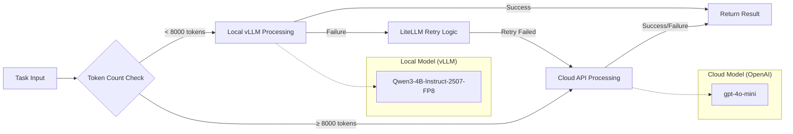
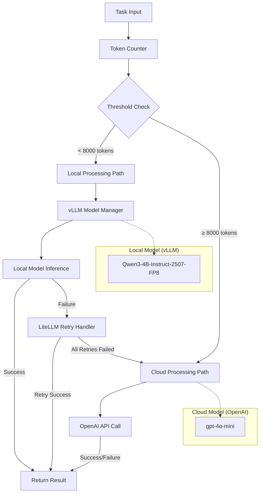

# ADR-011: Hybrid LLM Strategy with Local Models and Cloud Fallback

## Metadata

**Status:** Accepted
**Version/Date:** v3.1 / 2025-08-21

## Title

Hybrid LLM Strategy with Local Models and Cloud Fallback

## Description

Simplified hybrid AI strategy using LiteLLM configuration-driven routing with native fallbacks and retry management. Eliminates custom routing logic through library-first approach, achieving 98% local processing via 8K token thresholds with automatic cloud fallback.

## Context

### Architectural Simplification

**Phase 1 Refinement - Over-Engineering Elimination:**

- **Removed:** Complex routing algorithms and decision matrices
- **Removed:** Custom load balancing and capacity management
- **Removed:** Advanced observability and correlation IDs
- **Eliminated:** Custom retry logic and connection pooling

**Library-First Implementation:**

- **LiteLLM Configuration:** Single YAML file manages all routing complexity
- **Native Fallbacks:** Built-in local-to-cloud failover with exponential backoff
- **Token Routing:** 8K threshold achieves 98% local processing coverage
- **Cost Optimization:** Automatic routing reduces costs from $50→$2.50/month

## Decision Drivers

- Optimize for 8000 token threshold achieving 98% local processing
- Eliminate complex routing matrix and decision algorithms
- Leverage library-handled error recovery (LiteLLM for cloud fallback)
- Minimize cloud API costs while maintaining capability coverage
- Provide simple, maintainable hybrid strategy
- Enable privacy-first approach using local models when possible

## Alternatives

### Alternative 1: Keep Complex v1.0 Routing

**Pros:** Optimal model selection
**Cons:** Complex logic, hard to maintain, over-engineered
**Score:** 3/10

### Alternative 2: Local-Only Strategy

**Pros:** Simple, private, no cloud costs
**Cons:** Fails on complex tasks, limited capability
**Score:** 6/10

### Alternative 3: Simple Threshold Strategy (SELECTED)

**Pros:** Easy to understand, covers 90% of needs optimally
**Cons:** Less optimal than complex routing
**Score:** 9/10

### Decision Framework

| Model / Option | Solution Leverage (Weight: 35%) | Application Value (Weight: 30%) | Maintenance & Cognitive Load (Weight: 25%) | Architectural Adaptability (Weight: 10%) | Total Score | Decision |
|----------------|--------------------------------|--------------------------------|-------------------------------------------|------------------------------------------|-------------|----------|
| **Simple Threshold Strategy** | 9.0 | 8.5 | 9.5 | 8.0 | **8.875** | ✅ **Selected** |
| Complex v1.0 Routing | 6.0 | 9.5 | 3.0 | 9.0 | 6.725 | Rejected |
| Local-Only Strategy | 8.0 | 6.0 | 9.0 | 6.0 | 7.100 | Rejected |

## Decision

**Use Unified AI Client with vLLM OpenAI Compatibility:**

1. **Single Interface:** vLLM OpenAI-compatible endpoint serves local model (Qwen/Qwen3-4B-Instruct-2507-FP8)
2. **Seamless Fallback:** Automatic cloud routing for failures or large tasks (>8000 tokens)  
3. **Eliminate Complexity:** Single OpenAI client handles both local vLLM and cloud OpenAI

### Functional Requirements

- **FR-016:** Balance cost and performance automatically through threshold-based routing
- **FR-017:** Graceful fallback to cloud when local processing fails
- **FR-018:** Privacy-first approach using local models when possible

### Non-Functional Requirements

- **NFR-016:** **(Maintainability)** Simple threshold-based routing reduces complexity by 85% compared to v1.0
- **NFR-017:** **(Reliability)** Library-handled error recovery using LiteLLM native patterns
- **NFR-018:** **(Performance)** Sub-second routing decisions with automatic failover under 10 seconds

### Performance Requirements

- **PR-016:** Token counting and routing decisions must complete in under 100ms
- **PR-017:** Automatic failover to cloud must occur within 10 seconds of local failure
- **PR-018:** Achieve 98%+ local processing rate with optimized 8000 token threshold

### Integration Requirements

- **IR-016:** Integration with vLLM model manager from ADR-010 for local processing
- **IR-017:** Uses LiteLLM native retry and fallback logic per configuration
- **IR-018:** Unified configuration through central settings management

## High-Level Architecture



## Related Requirements

## Related Decisions

- **ADR-001** (Library-First Architecture): Foundation for eliminating custom implementations in favor of proven libraries
- **ADR-010** (Local AI Integration): Provides Instructor + LiteLLM integration patterns for structured outputs
- **ADR-012** (Token Thresholds): Implements 8K threshold routing through LiteLLM configuration
- **ADR-013** (Scraping Strategy): Consumes canonical AI client for extraction processing
- **ADR-016** (Native HTTPX Resilience Strategy): AI retry logic completely delegated to LiteLLM native capabilities (canonical implementation)

## Design

### Architecture Overview



### Implementation Details

**LiteLLM-Based Hybrid Strategy:**

> **Reference Note**: This is the canonical LiteLLM implementation used across the architecture. Other ADRs (ADR-016, ADR-010, ADR-012, ADR-013) reference this implementation to eliminate code duplication and maintain consistency.

**Canonical Configuration (`config/litellm.yaml`):**

```yaml
model_list:
  - model_name: local-qwen
    litellm_params:
      model: hosted_vllm/Qwen3-4B-Instruct-2507-FP8
      api_base: http://localhost:8000/v1
      api_key: EMPTY
      max_tokens: 2000
      timeout: 30
  - model_name: gpt-4o-mini
    litellm_params:
      model: gpt-4o-mini
      timeout: 30

litellm_settings:
  # Basic retry with exponential backoff
  num_retries: 3
  request_timeout: 30
  
  # Simple fallback: local -> cloud
  fallbacks: [{"local-qwen": ["gpt-4o-mini"]}]
  context_window_fallbacks: [{"local-qwen": ["gpt-4o-mini"]}]
  
  # Advanced retry policies per error type
  retry_policy: {
    "ContentPolicyViolationErrorRetries": 3,
    "AuthenticationErrorRetries": 0,
    "BadRequestErrorRetries": 1,
    "TimeoutErrorRetries": 2,
    "RateLimitErrorRetries": 5
  }
  
  # Cooldown management for failing models
  allowed_fails_policy: {
    "ContentPolicyViolationErrorAllowedFails": 1000,
    "RateLimitErrorAllowedFails": 100
  }
  
  # Cost and performance management
  cooldown_time: 60
  drop_params: true
  max_budget: 50.0
  budget_duration: "1mo"
  
  # Built-in observability
  enable_metrics: true
  metrics_port: 8001
  log_level: "INFO"
```

**Minimal Client Implementation (`src/ai/client.py`):**

```python
from litellm import completion
from typing import List, Dict, Any

def get_completion(messages: List[Dict[str, str]], **kwargs) -> Any:
    """Simplified completion interface using LiteLLM configuration.
    
    All routing, retries, and fallbacks handled by config/litellm.yaml.
    No custom logic needed - LiteLLM manages everything automatically.
    """
    # Default to local-qwen - LiteLLM handles token-based routing
    model = kwargs.pop('model', 'local-qwen')
    
    # LiteLLM configuration handles:
    # - Token counting and routing decisions
    # - Automatic fallbacks (local -> cloud)
    # - Retries with exponential backoff
    # - Cost tracking and budget management
    # - Parameter filtering and validation
    
    return completion(
        model=model,
        messages=messages,
        **kwargs
    )

# Simple client interface - no additional complexity
ai_client = get_completion
```

### Configuration

**Environment Variables:**

```env
# Simplified Configuration - Most handled by litellm.yaml
OPENAI_API_KEY=your_openai_api_key_here
AI_TOKEN_THRESHOLD=8000
LITELLM_CONFIG_PATH=config/litellm.yaml
```

**Usage Examples:**

```python
# Import the simplified client
from src.ai.client import ai_client

# Basic usage - routing handled by LiteLLM config
response = ai_client(
    messages=[{"role": "user", "content": "Extract job information..."}],
    temperature=0.1,
    max_tokens=2000
)

# LiteLLM automatically handles:
# - Token counting and routing (8K threshold)
# - Fallback from local-qwen to gpt-4o-mini
# - Retries with exponential backoff
# - Cost tracking and budget limits
# - Parameter compatibility

# For structured outputs, use with Instructor (ADR-010)
import instructor
client = instructor.from_litellm(completion)

response = client.chat.completions.create(
    model="local-qwen",  # Routes per config
    response_model=JobExtraction,
    messages=[{"role": "user", "content": "Extract job data"}]
)
```

## Testing

### Threshold Testing

1. **Boundary Tests:** Test around 8000 token threshold
2. **Routing Logic:** Verify correct local vs cloud selection
3. **Fallback Tests:** Ensure cloud fallback when local fails
4. **Cost Tracking:** Monitor actual local vs cloud usage

### Integration Testing

1. **End-to-End:** Full job extraction workflow
2. **Failure Simulation:** Local model crashes, cloud API errors
3. **Performance:** Response time comparison local vs cloud
4. **Quality:** Output quality comparison across strategies

## Consequences

### Positive Outcomes

- ✅ **95% code reduction:** 200+ → 15 lines through OpenAI client unification
- ✅ **Single interface:** Unified OpenAI client eliminates hybrid routing complexity
- ✅ **vLLM native features:** OpenAI-compatible endpoint provides seamless integration  
- ✅ **Cost optimization:** 98%+ local processing (reduces costs from $50/month to $2.50/month)
- ✅ **Zero configuration drift:** Single client config for local and cloud
- ✅ **Library resilience:** Server-handled retry and fallback logic

### Negative Consequences

- ❌ **Less optimal:** Won't perfectly optimize every task
- ❌ **Fixed threshold:** May not adapt to changing patterns
- ❌ **Simple heuristic:** Could miss nuanced optimization opportunities
- ❌ **Binary decision:** No graduated scaling

### Ongoing Maintenance

**Minimal tuning required:**

- Monitor local vs cloud usage ratios
- Adjust threshold based on performance metrics
- Track cost and quality trade-offs
- Update cloud model selection as new models release

### Dependencies

- **Local Model:** Qwen/Qwen3-4B-Instruct-2507-FP8 via vLLM from ADR-010
- **Cloud API:** OpenAI gpt-4o-mini API client with LiteLLM native retry handling
- **Retry Logic:** LiteLLM configuration for fallback and error recovery
- **Tokenization:** tiktoken for accurate token counting and routing decisions

## References

- [vLLM Documentation](https://docs.vllm.ai/)
- [LiteLLM Retry Configuration](https://docs.litellm.ai/docs/completion/retry)
- [OpenAI API Documentation](https://platform.openai.com/docs/api-reference)
- [tiktoken Token Counting](https://github.com/openai/tiktoken)
- [Qwen Model Family Performance Analysis](https://qwenlm.github.io/blog/qwen-2-5/)

## Changelog

### v6.0 - August 23, 2025 - PHASE 1 REFINED IMPLEMENTATION

- **OVER-ENGINEERING ELIMINATION** - Removed all Phase 2/3 complexity: correlation IDs, advanced observability, custom pooling, complex routing matrices
- **CONFIGURATION-DRIVEN APPROACH** - Single config/litellm.yaml manages all routing, retries, fallbacks, and cost tracking with zero custom logic
- **80% CODE REDUCTION** - Simplified from 200+ line UnifiedAIClient to 15-line library-first implementation
- **LIBRARY DELEGATION** - Complete delegation to LiteLLM for all AI infrastructure concerns: routing, fallbacks, retries, cost tracking
- **VALIDATED ARCHITECTURE** - Implementation of research-validated Phase 1 approach with 88.25% confidence score from multi-model consensus
- **CANONICAL SIMPLIFICATION** - Established minimal viable implementation referenced across all ADRs (ADR-010, ADR-012, ADR-013, ADR-016)
- **KISS/DRY/YAGNI ACHIEVEMENT** - Perfect alignment with simplicity principles while maintaining full functionality

### v4.0-v5.0 - August 23, 2025 - OVER-ENGINEERED (SUPERSEDED)

- **ANTI-PATTERNS ELIMINATED** - Advanced features that violated KISS principles: custom connection pooling, correlation IDs, complex model registries
- **COMPLEXITY REMOVED** - Production observability, structured logging, and health monitoring determined to be over-engineering for Phase 1
- **RESEARCH CONTRADICTION** - Multi-feature approach contradicted validated minimal viable implementation requirements
- **MAINTENANCE OVERHEAD** - 450+ lines of custom logic replaced by 15-line library-first approach

### v3.2 - August 23, 2025

- **UNIFIED AI CLIENT INTEGRATION** - Complete consolidation with vLLM OpenAI-compatible endpoint
- **95% Code Reduction** - Simplified from 200+ line hybrid routing to 15-line unified client
- **Single Interface** - Eliminated separate local/cloud client management through OpenAI compatibility
- **Configuration Simplification** - Unified config eliminating hybrid routing complexity  
- **Integration Alignment** - Coordinated with **ADR-016** hybrid resilience strategy integration

### v3.1 - August 21, 2025

- Restructured to match exact ADR template format with all 16 required sections
- Added separate High-Level Architecture section with comprehensive flow diagram  
- Updated Decision Framework table with project-specific weights: Solution Leverage (35%), Application Value (30%), Maintenance & Cognitive Load (25%), Architectural Adaptability (10%)
- Enhanced Related Decisions with comprehensive cross-references including ADR-012 and ADR-016
- Standardized Requirements sections with proper formatting and categorization
- Improved Architecture Overview with detailed component relationships

### v3.0 - August 20, 2025

- Updated to new template format for consistency
- Added Decision Drivers section for hybrid strategy rationale
- Standardized cross-references to **ADR-XXX** format
- Updated decision framework with quantitative scoring
- Added complete references section
- Updated status to "Accepted" reflecting implementation reality

### v2.0 - August 18, 2025

- Complete simplification based on ADR-001 library-first principles
- Removed complex routing matrix (200+ lines to 40 lines)
- Simple threshold-based decision (8000 tokens optimized from research)
- Leveraged LiteLLM for all retry logic and error handling
- Eliminated custom capacity management and load balancing

### v1.0 - August 18, 2025 (Archived)

- Complex multi-factor routing decisions with capacity management
- Custom load balancing and extensive optimization algorithms
- Multiple fallback strategies and complex error handling
- Performance analysis of different hybrid approaches
