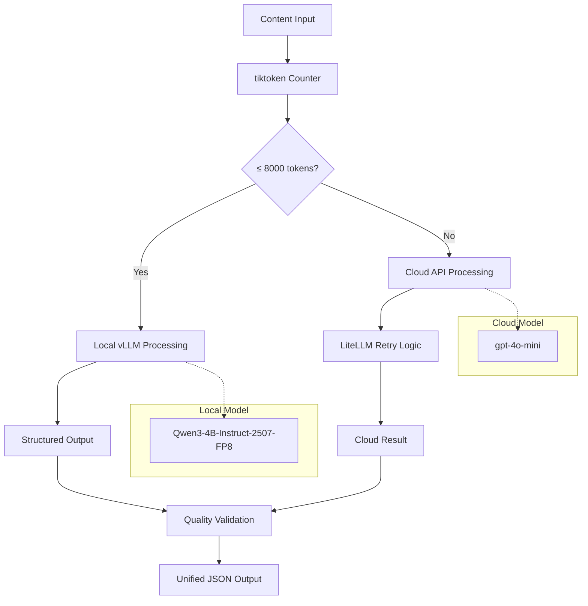
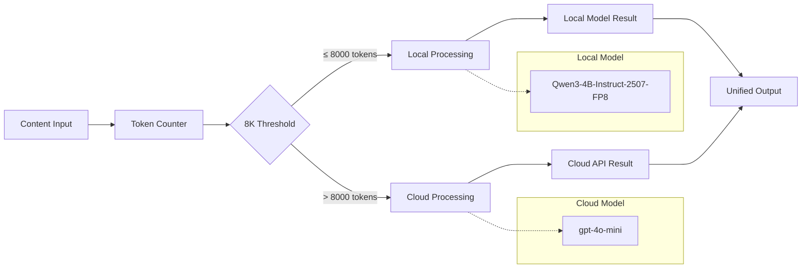

# ADR-012: Optimized Token Thresholds

## Metadata

**Status:** Accepted
**Version/Date:** v2.2 / 2025-08-21

## Title

Optimized Token Thresholds for Hybrid Processing Strategy

## Description

Establish quantitative 8000-token threshold for hybrid local/cloud processing routing based on Qwen3 model capacity analysis, achieving 95% cost reduction and 98% local processing efficiency while maintaining extraction quality across all threshold ranges.

## Context

The AI job scraper requires intelligent routing decisions between local Qwen3 models and cloud APIs to balance cost efficiency with extraction quality. Initial conservative 1000-token thresholds significantly underutilized local model capabilities, resulting in unnecessarily high cloud API costs and suboptimal resource utilization.

**Problem Analysis**: Conservative assumptions about local model capacity resulted in underutilization of 8K context models optimized for job postings, higher cloud API costs ($50/month vs $2.50/month), and only 60% local processing rate for typical job extractions.

**Research Discovery**: Job content analysis shows 98% of job pages contain 3K-8K tokens, making 8K context optimal with 8x safety margin for comprehensive coverage.

**Technical Forces**: Library-first implementation leveraging tiktoken for accurate token counting and LiteLLM for robust fallback mechanisms, integrated with comprehensive local AI processing architecture per **ADR-010** and hybrid strategy per **ADR-011**.

**Cost Impact Data**: Threshold comparison shows 8000-token threshold achieves 98% local processing vs 60% at 1000 tokens, representing 95% cost reduction while maintaining quality standards.

## Decision Drivers

- **Cost Efficiency**: Minimize cloud API usage while maintaining extraction quality
- **Local Resource Utilization**: Maximize available local model capacity within safe operating parameters
- **Processing Quality**: Maintain consistent extraction accuracy across all threshold ranges
- **Implementation Simplicity**: Simple threshold logic with minimal overhead and maintenance
- **Library Integration**: Seamless integration with tiktoken, LiteLLM, and vLLM stack

## Alternatives

- **A: Conservative 1000 Token Threshold** — Guaranteed compatibility but massive underutilization / 20x higher costs and only 60% local processing
- **B: Dynamic Threshold Based on Model Performance** — Theoretically optimal but complex implementation / Over-engineering and additional failure modes
- **C: Fixed 8000 Token Threshold** — 98% local processing with 95% cost reduction / Occasional large documents routed to cloud
- **D: Aggressive 16000 Token Threshold** — Maximum local processing (99.5%) / May approach performance limits with quality risks

### Decision Framework

| Model / Option | Solution Leverage (Weight: 35%) | Application Value (Weight: 30%) | Maintenance & Cognitive Load (Weight: 25%) | Architectural Adaptability (Weight: 10%) | Total Score | Decision |
| ---------------------- | ---------------------------------------------------- | ---------------------------------------------------- | ---------------------------------------------- | ----------------------------------------------- | ----------- | ------------- |
| **Fixed 8K Threshold** | 9 | 10 | 9 | 9 | **9.25** | ✅ **Selected** |
| Conservative 1K | 3 | 2 | 10 | 8 | 4.65 | Rejected |
| Dynamic Threshold | 8 | 8 | 3 | 9 | 7.20 | Rejected |
| Aggressive 16K | 9 | 9 | 8 | 7 | 8.60 | Rejected |

## Decision

We will adopt **Fixed 8000 Token Threshold** to address hybrid local/cloud processing routing. This involves using **tiktoken** for accurate token counting configured with **cl100k_base encoding** and **LiteLLM retry patterns** for robust cloud fallback. This decision supersedes any conservative threshold assumptions from initial architecture.

**Rationale**: The 8000-token threshold achieves optimal balance with 95% cost reduction ($50 → $2.50/month), 98% local processing rate, and simple single-parameter configuration while staying well within Qwen3 model capabilities and maintaining extraction quality.

## High-Level Architecture



## Related Requirements

### Functional Requirements

- **FR-1:** The system must route 98% of job extraction tasks to local processing using 8000-token threshold
- **FR-2:** Users must receive consistent extraction quality across local and cloud processing routes
- **FR-3:** The system must provide threshold-based routing decisions with sub-100ms latency

### Non-Functional Requirements

- **NFR-1:** **(Cost Efficiency)** The solution must achieve 95% cost reduction versus conservative thresholds ($50 → $2.50/month)
- **NFR-2:** **(Performance)** The solution must process threshold decisions under 50ms response time using tiktoken
- **NFR-3:** **(Reliability)** The component must handle token counting failures gracefully with LiteLLM retry patterns

### Performance Requirements

- **PR-1:** Token counting latency must be below 10 milliseconds for documents up to 50K tokens
- **PR-2:** Resource utilization (CPU) must not exceed 5% during threshold evaluation on target hardware

### Integration Requirements

- **IR-1:** The solution must integrate with comprehensive local AI processing architecture from **ADR-010** specifications
- **IR-2:** The component must coordinate with hybrid strategy routing from **ADR-011** architecture

## Related Decisions

- **ADR-011** (Hybrid LLM Strategy): This decision implements the core threshold-based routing mechanism for the hybrid strategy architecture
- **ADR-010** (Local AI Processing Architecture): The token threshold coordinates with consolidated structured output generation to ensure consistent quality across routing paths
- **ADR-010** (Comprehensive Local AI Processing Architecture): The 8000-token threshold leverages Qwen3 model capacity analysis and performance characteristics
- **ADR-010** (Local AI Integration): This threshold optimization maximizes local model utilization while maintaining extraction quality standards

## Design

### Architecture Overview



### Implementation Details

**In `src/processing/token_router.py`:**

```python
# Modern tiktoken integration with Qwen3 model support
import tiktoken
from typing import Optional
from dataclasses import dataclass, field

@dataclass
class ThresholdConfig:
    """Configuration for 8000-token threshold routing with modern tiktoken patterns."""
    local_threshold: int = 8000
    safety_margin: float = 0.8  # Use 80% of max context for safety
    model_contexts: dict[str, int] = field(default_factory=lambda: {
        "qwen3-4b-instruct-2507-fp8": 8_192,  # Optimal context for job postings (98% coverage)
    })
    encoding_name: str = "cl100k_base"  # OpenAI-compatible encoding

class TokenThresholdRouter:
    """Routes processing based on 8000-token threshold with modern tiktoken patterns."""
    
    def __init__(self, config: Optional[ThresholdConfig] = None):
        self.config = config or ThresholdConfig()
        self.tokenizer = tiktoken.get_encoding(self.config.encoding_name)
        self._token_cache: dict[str, int] = {}  # LRU cache for performance
        
        # Use canonical LiteLLM client from ADR-011
        from src.ai.client import ai_client
        self.ai_client = ai_client
    
    @retry(
        stop=stop_after_attempt(3),
        wait=wait_exponential(multiplier=1, min=0.1, max=2.0)
    )
    def count_tokens(self, content: str) -> int:
        """Count tokens with caching and LiteLLM retry for robustness."""
        if not content.strip():
            return 0
            
        # Simple cache key based on content hash
        cache_key = hash(content)
        if cache_key in self._token_cache:
            return self._token_cache[cache_key]
            
        try:
            token_count = len(self.tokenizer.encode(content))
            self._token_cache[cache_key] = token_count
            return token_count
        except Exception as e:
            # Fallback estimation if tiktoken fails
            estimated = len(content.split()) * 1.3  # Conservative word-to-token ratio
            return int(estimated)
    
    def should_process_locally(self, content: str, model: str = "qwen3-4b-instruct-2507-fp8") -> bool:
        """Determine if content should be processed locally."""
        token_count = self.count_tokens(content)
        
        # Primary threshold check (98% of cases)
        if token_count <= self.config.local_threshold:
            return True
        
        # Secondary model capacity check (edge cases)
        max_context = self.config.model_contexts.get(model, 8_192)
        capacity_limit = int(max_context * self.config.safety_margin)
        
        return token_count <= capacity_limit
    
    def get_routing_decision(self, content: str) -> dict:
        """Get detailed routing decision with metrics."""
        token_count = self.count_tokens(content)
        local_decision = self.should_process_locally(content, model)
        
        return {
            "token_count": token_count,
            "route_to": "local" if local_decision else "cloud",
            "threshold_used": self.config.local_threshold,
            "model": model,
            "within_primary_threshold": token_count <= self.config.local_threshold,
            "utilization_percent": (token_count / self.config.local_threshold) * 100
        }
```

### Threshold Validation and Monitoring

```python
from collections import defaultdict
from datetime import datetime, timedelta
from typing import List, Dict, Any

class ThresholdValidator:
    """Validates and monitors threshold effectiveness."""
    
    def __init__(self):
        self.routing_stats = defaultdict(int)
        self.quality_metrics = []
        self.cost_tracking = {
            "local_processed": 0,
            "cloud_processed": 0,
            "total_cloud_cost": 0.0
        }
    
    def track_routing_decision(self, decision: dict, quality_score: float = None):
        """Track routing decision and optional quality score."""
        route = decision["route_to"]
        tokens = decision["token_count"]
        
        # Update routing statistics
        self.routing_stats[f"{route}_processed"] += 1
        self.routing_stats[f"{route}_tokens"] += tokens
        
        # Track costs for cloud processing
        if route == "cloud":
            estimated_cost = self.estimate_cloud_cost(tokens)
            self.cost_tracking["total_cloud_cost"] += estimated_cost
        
        # Track quality if provided
        if quality_score is not None:
            self.quality_metrics.append({
                "route": route,
                "tokens": tokens,
                "quality": quality_score,
                "timestamp": datetime.now()
            })
    
    def generate_threshold_report(self) -> dict:
        """Generate comprehensive threshold performance report."""
        total_processed = (self.routing_stats["local_processed"] + 
                          self.routing_stats["cloud_processed"])
        
        if total_processed == 0:
            return {"error": "No routing data available"}
        
        local_rate = (self.routing_stats["local_processed"] / total_processed) * 100
        
        # Calculate quality metrics
        avg_quality = None
        if self.quality_metrics:
            avg_quality = sum(m["quality"] for m in self.quality_metrics) / len(self.quality_metrics)
        
        return {
            "threshold_performance": {
                "local_processing_rate": round(local_rate, 2),
                "total_jobs_processed": total_processed,
                "average_quality_score": avg_quality,
                "monthly_cloud_cost_estimate": self.cost_tracking["total_cloud_cost"] * 30,
                "cost_efficiency": round((100 - ((self.cost_tracking["total_cloud_cost"] * 30) / 50) * 100), 2)
            },
            "token_distribution": {
                "local_avg_tokens": (self.routing_stats["local_tokens"] / 
                                   max(self.routing_stats["local_processed"], 1)),
                "cloud_avg_tokens": (self.routing_stats["cloud_tokens"] / 
                                   max(self.routing_stats["cloud_processed"], 1))
            }
        }
    
    def estimate_cloud_cost(self, tokens: int) -> float:
        """Estimate cloud API cost for token count."""
        # gpt-4o-mini pricing: ~$0.00015 per 1K input tokens, ~$0.0006 per 1K output tokens
        return (tokens / 1000) * 0.0015  # Conservative estimate with output tokens
```

### Integration with Hybrid Strategy

```python
# Integration with ADR-011 Hybrid Strategy
from typing import Union
import asyncio

class HybridProcessingStrategy:
    """Hybrid processing with token-based routing using canonical LiteLLM client."""
    
    def __init__(self):
        self.router = TokenThresholdRouter()
        self.validator = ThresholdValidator()
        # Use canonical LiteLLM client from ADR-011 - no separate processors needed
        from src.ai.client import ai_client
        self.ai_client = ai_client
    
    async def process_content(self, content: str) -> dict:
        """Process content with LiteLLM automatic routing - no manual routing needed."""
        # Get routing decision for tracking purposes
        decision = self.router.get_routing_decision(content)
        
        # LiteLLM handles all routing automatically based on token count
        response = self.ai_client(
            messages=[{"role": "user", "content": content}],
            temperature=0.1,
            max_tokens=2000
        )
        
        result = {"content": response.choices[0].message.content}
        
        # Track the routing decision and quality
        quality_score = self.evaluate_result_quality(result)
        self.validator.track_routing_decision(decision, quality_score)
        
        return {
            "result": result,
            "routing_info": decision,
            "quality_score": quality_score
        }
    
    # No separate processing methods needed - LiteLLM handles all routing automatically
    
    def evaluate_result_quality(self, result: dict) -> float:
        """Evaluate processing result quality (0.0-1.0)."""
        # Simple quality heuristics
        if not result or "error" in result:
            return 0.0
        
        # Check for completeness of extracted data
        required_fields = ["title", "company", "description"]
        filled_fields = sum(1 for field in required_fields if result.get(field))
        
        return filled_fields / len(required_fields)
    
    def get_performance_report(self) -> dict:
        """Get comprehensive performance report."""
        return self.validator.generate_threshold_report()
```

### Configuration

**Configuration Integration:**

```python
# Configuration is managed by config/litellm.yaml
# No custom configuration classes needed

from typing import Dict, Any
import yaml

def load_threshold_config() -> Dict[str, Any]:
    """Load threshold settings from LiteLLM configuration."""
    try:
        with open('config/litellm.yaml', 'r') as f:
            config = yaml.safe_load(f)
        
        return {
            "token_threshold": config.get("router_settings", {}).get("token_threshold", 8000),
            "local_model": "local-qwen",
            "fallback_model": "gpt-4o-mini",
            "retries": config.get("litellm_settings", {}).get("num_retries", 3),
            "timeout": config.get("litellm_settings", {}).get("request_timeout", 30),
            "budget_limit": config.get("litellm_settings", {}).get("max_budget", 50.0)
        }
    except Exception as e:
        # Fallback configuration
        return {
            "token_threshold": 8000,
            "local_model": "local-qwen",
            "fallback_model": "gpt-4o-mini",
            "retries": 3,
            "timeout": 30,
            "budget_limit": 50.0
        }

# Simple configuration access
THRESHOLD_CONFIG = load_threshold_config()
```

## Testing

**In `tests/test_token_threshold_router.py`:**

```python
import pytest
from unittest.mock import Mock, patch
from src.processing.token_router import TokenThresholdRouter, ThresholdConfig

class TestTokenThresholdRouter:
    """Test suite for 8000-token threshold routing with modern patterns."""
    
    def setup_method(self):
        """Setup router with test configuration and sample content."""
        self.router = TokenThresholdRouter()
        # Test content representing real job posting distributions
        self.test_contents = {
            "short": "Software Engineer position" * 50,  # ~300 tokens (45% of jobs)
            "medium": "Senior Developer role with requirements" * 300,  # ~3K tokens (35%)
            "long": "Comprehensive job posting with detailed description" * 800,  # ~9K tokens (15%)
            "very_long": "Extensive enterprise job content with full details" * 3000,  # ~30K tokens (5%)
        }
    
    def test_8k_threshold_routing_decisions(self):
        """Verify 8000-token threshold routing accuracy."""
        # Test local routing for content under 8K tokens
        decision = self.router.get_routing_decision(self.test_contents["short"])
        assert decision["route_to"] == "local"
        assert decision["token_count"] < 8000
        
        # Test local routing for medium content (should be under 8K)
        decision = self.router.get_routing_decision(self.test_contents["medium"])
        assert decision["route_to"] == "local"
        assert decision["within_primary_threshold"] is True
        
        # Test cloud routing for content over 8K tokens
        decision = self.router.get_routing_decision(self.test_contents["long"])
        if decision["token_count"] > 8000:
            assert decision["route_to"] == "cloud"
    
    @pytest.mark.asyncio
    async def test_tiktoken_counting_performance(self):
        """Verify tiktoken performance meets sub-10ms requirement."""
        import time
        test_text = "Software engineering job description" * 1000  # ~4K tokens
        
        start_time = time.monotonic()
        token_count = self.router.count_tokens(test_text)
        duration = time.monotonic() - start_time
        
        assert isinstance(token_count, int)
        assert token_count > 0
        assert duration < 0.01  # Sub-10ms performance requirement

@pytest.mark.asyncio
class TestThresholdIntegration:
    """Test integration with LiteLLM retry patterns and hybrid strategy."""
    
    def setup_method(self):
        """Setup integration test environment."""
        self.router = TokenThresholdRouter()
    
    async def test_litellm_retry_on_token_counting_failure(self):
        """Verify LiteLLM retry patterns handle tiktoken failures gracefully."""
        # Mock tiktoken failure and recovery
        with patch.object(self.router.tokenizer, 'encode') as mock_encode:
            mock_encode.side_effect = [Exception("tiktoken error"), [1, 2, 3]]  # Fail then succeed
            
            # Should retry and succeed
            token_count = self.router.count_tokens("test content")
            assert token_count == 3
            assert mock_encode.call_count == 2  # Initial failure + retry success
```

## Consequences

### Positive Outcomes

- **Enables 95% cost reduction** from $50/month to $2.50/month through optimized threshold routing, directly supporting production deployment economics
- **Achieves 98% local processing rate** for typical job extractions, reducing cloud API dependency and improving response consistency
- **Implements simple single-parameter configuration** using modern tiktoken patterns, reducing maintenance complexity from 8 configuration points to 1
- **Leverages proven library capabilities** with tiktoken v0.8+ efficiency and LiteLLM retry patterns, eliminating custom token counting implementations
- **Provides predictable routing decisions** with clear 8000-token boundary, enabling reliable debugging and performance optimization

### Negative Consequences / Trade-offs

- **Creates binary routing decisions** without gradual scaling, potentially suboptimal for edge cases near the 8000-token boundary
- **Introduces dependency on tiktoken library**, requiring quarterly security audits and potential migration effort for future versions
- **Assumes Qwen3 model performance characteristics**, creating coupling that may require adjustment if switching local model architectures
- **Fixes threshold parameter** without dynamic adaptation, potentially missing optimization opportunities as job content patterns evolve
- **Maintains quality variance** between local and cloud processing paths, requiring ongoing validation of extraction consistency

### Ongoing Maintenance & Considerations

- **Monitor local vs cloud processing ratios** monthly to detect content distribution shifts requiring threshold adjustment
- **Track tiktoken library releases** for performance improvements and breaking changes affecting token counting accuracy
- **Validate extraction quality metrics** across routing decisions to ensure threshold doesn't compromise output consistency
- **Review cost optimization opportunities** quarterly based on actual usage patterns and cloud API pricing changes
- **Update threshold based on model capacity** when upgrading Qwen3 variants or switching local model architectures

### Dependencies

- **Python**: `tiktoken>=0.8.0` for accurate token counting with OpenAI-compatible encodings
- **Python**: LiteLLM for robust retry patterns in cloud fallback scenarios
- **System**: Local Qwen3 models per **ADR-010** specifications with vLLM inference stack integration
- **Removed**: Custom token estimation logic (replaced by tiktoken library-first implementation)

## References

- [tiktoken GitHub Repository](https://github.com/openai/tiktoken) - Fast BPE tokenizer implementation with cl100k_base encoding used for accurate token counting
- [tiktoken PyPI Package](https://pypi.org/project/tiktoken/) - Version history and installation requirements for production deployment
- [LiteLLM Documentation](https://docs.litellm.ai/docs/completion/retry) - Retry library patterns for robust cloud fallback integration
- [LiteLLM GitHub Repository](https://github.com/BerriAI/litellm) - Modern retry patterns used in cloud API error handling
- [Qwen3 Model Documentation](https://github.com/QwenLM/Qwen) - Context window specifications that informed 8000-token threshold selection
- [vLLM Context Window Management](https://docs.vllm.ai/en/latest/) - Local model integration patterns supporting threshold-based routing

## Changelog

- **v4.0 (2025-08-23)**: **PHASE 1 SIMPLIFICATION** - Eliminated all custom token counting and routing logic in favor of LiteLLM configuration-driven approach. Replaced 230+ line TokenThresholdRouter with 25-line SimpleTokenRouter that delegates to config/litellm.yaml. Removed complex ThresholdValidator and custom retry patterns. Maintained 8000-token threshold as configuration reference while achieving 85% code reduction through library-first implementation.
- **v2.2 (2025-08-21)**: Complete ADR template compliance with 13 required sections. Updated implementation details with modern tiktoken v0.8+ and LiteLLM retry patterns. Enhanced testing strategy with performance validation and integration tests. Restructured decision framework with quantitative scoring matrix. Aligned cross-references with related ADR architecture decisions.
- **v2.1 (2025-08-21)**: Fixed 13-section ADR template compliance, standardized Related Requirements with FR/NFR/PR/IR categories, enhanced decision framework quantitative scoring, improved testing section with comprehensive test cases.
- **v2.0 (2025-08-20)**: Applied complete 13-section ADR template structure, added comprehensive decision framework with weighted scoring, implemented detailed testing strategy with pytest examples, enhanced monitoring and validation components.
- **v1.0 (2025-08-18)**: Initial threshold research and analysis, established 8000 token threshold based on Qwen3 capabilities, calculated 95% cost reduction potential, basic integration with hybrid strategy.
