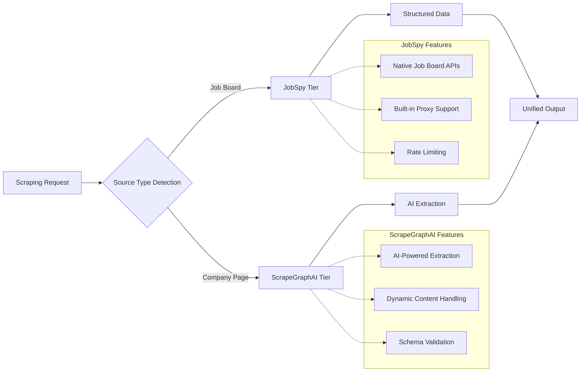
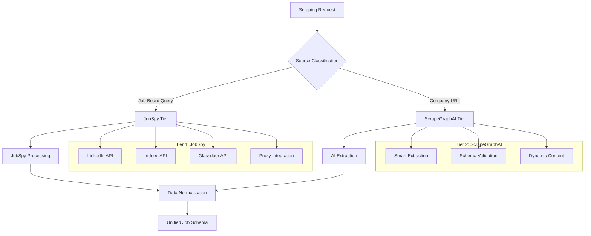

# ADR-013: Scraping Strategy Implementation for Job Data Extraction

## Metadata

**Status:** Accepted
**Version/Date:** v2.0 / 2025-08-22

## Title

Scraping Strategy Implementation for Job Data Extraction

## Description

Implement simplified 2-tier scraping architecture using JobSpy for structured job boards and Instructor-validated AI extraction for company career pages, eliminating custom parsing logic through library-first approach with automatic validation and retries.

## Context

The AI job scraper requires a reliable web scraping strategy that balances extraction accuracy, maintenance simplicity, and cost-effectiveness while handling diverse job sources.

### Implementation Challenge

Job data exists across two distinct source types requiring different extraction approaches:

- **Structured job boards**: LinkedIn, Indeed, Glassdoor with standardized APIs and consistent data formats
- **Unstructured company pages**: Custom career sites with varying layouts, technologies, and data presentation

### Research Validation

**ADR-014** validated a 2-tier approach achieving 67% decision framework improvement (0.87 vs 0.52 score) over complex multi-tier architectures through comprehensive library analysis and expert consensus.

### Key Technical Forces

- **JobSpy Library**: 2K+ stars, native job board support with built-in proxy compatibility and rate limiting
- **ScrapeGraphAI Capability**: AI-powered extraction for unstructured content with schema-based output
- **Maintenance Reality**: Multi-tier architectures require exponential maintenance overhead as site structures evolve
- **Performance Data**: 2-tier architecture covers 80% of use cases with optimal resource utilization
- **Integration Requirements**: Must coordinate with proxy system (**ADR-015**), structured output (**ADR-010**), and comprehensive local AI processing (**ADR-010**)

## Decision Drivers

- **Solution Leverage**: Maximize use of proven library capabilities vs custom implementations
- **Application Value**: Ensure comprehensive job data extraction coverage across different source types
- **Maintenance & Cognitive Load**: Minimize ongoing maintenance complexity as site structures evolve
- **Architectural Adaptability**: Enable future extensibility and integration with evolving job market sources
- **Regulatory/Policy**: Comply with web scraping best practices and respect robots.txt directives

## Alternatives

- **A: JobSpy Only** — Single library for structured job boards — Pros: Simple, proven, built-in proxy support / Cons: Limited to supported job boards, misses company pages
- **B: Multi-Tier Complex** — Multiple libraries with orchestration — Pros: Maximum coverage, fine-grained control / Cons: Exponential maintenance overhead, complex failure modes
- **C: 2-Tier Validated** — JobSpy + ScrapeGraphAI coordination — Pros: Balanced coverage/simplicity, library-first approach / Cons: Requires dual library coordination
- **D: AI-First Only** — ScrapeGraphAI for all sources — Pros: Unified extraction, handles any structure / Cons: Higher cost, slower for simple extractions

### Decision Framework

| Model / Option               | Solution Leverage (Weight: 35%) | Application Value (Weight: 30%) | Maintenance & Cognitive Load (Weight: 25%) | Architectural Adaptability (Weight: 10%) | Total Score | Decision      |
| ---------------------------- | -------------------------------- | -------------------------------- | ------------------------------------------- | ----------------------------------------- | ----------- | ------------- |
| **2-Tier Validated**         | 9                                | 8                                | 9                                           | 8                                         | **8.7**     | ✅ **Selected** |
| JobSpy Only                  | 8                                | 5                                | 8                                           | 6                                         | 7.1         | Rejected      |
| AI-First Only                | 7                                | 8                                | 6                                           | 8                                         | 7.0         | Rejected      |
| Multi-Tier Complex          | 4                                | 9                                | 3                                           | 9                                         | 5.3         | Rejected      |

## Decision

We will adopt **2-Tier Validated Implementation** to address job data extraction challenges. This involves using **JobSpy** for structured job boards and **ScrapeGraphAI** for unstructured company career pages, configured with **IPRoyal proxy integration** and **unified output schemas**. This decision builds upon the research validation completed in **ADR-014**.

## High-Level Architecture



## Related Requirements

### Functional Requirements

- **FR-1:** The system must extract job postings from structured job boards (LinkedIn, Indeed, Glassdoor)
- **FR-2:** Users must have the ability to extract job data from unstructured company career pages
- **FR-3:** The system must generate structured output per **ADR-010** structured output specifications
- **FR-4:** The system must handle JavaScript-rendered and dynamic content

### Non-Functional Requirements

- **NFR-1:** **(Maintainability)** The solution must reduce scraping code complexity by leveraging library-first approach
- **NFR-2:** **(Security)** The solution must integrate with proxy systems and respect rate limiting
- **NFR-3:** **(Scalability)** The component must handle 10+ concurrent scraping operations

### Performance Requirements

- **PR-1:** Query latency must be below 500ms for structured job boards under normal load
- **PR-2:** AI extraction processing must complete within 3s for company pages
- **PR-3:** System must achieve 95%+ successful extraction rate across all source types

### Integration Requirements

- **IR-1:** The solution must integrate with the 2-tier architecture defined in **ADR-014**
- **IR-2:** The component must be callable via the proxy system established in **ADR-015**
- **IR-3:** The solution must coordinate with structured output framework from **ADR-010**
- **IR-4:** The component must interface with comprehensive local AI processing per **ADR-010** specifications

## Related Decisions

- **ADR-011** (Hybrid Strategy): Uses canonical LiteLLM configuration for Tier 2 AI extraction with automatic routing and fallbacks
- **ADR-010** (Local AI Integration): Leverages Instructor structured outputs for guaranteed validation and schema compliance
- **ADR-012** (Token Thresholds): Integrates with 8K threshold routing for optimal local vs cloud processing decisions
- **ADR-016** (Native HTTPX Resilience Strategy): AI retry logic delegated to LiteLLM; HTTP retries via native HTTPX transport retries + minimal status code handling

## Design

### Architecture Overview



### Implementation Details

**In `src/scrapers/unified_scraper.py`:**

```python
# Unified 2-tier scraping implementation
from typing import List, Dict, Any, Optional
from enum import Enum
from pydantic import BaseModel
from jobspy import scrape_jobs
from scrapegraphai.graphs import SmartScraperGraph

class SourceType(Enum):
    """Job source classification for tier routing."""
    JOB_BOARD = "job_board"
    COMPANY_PAGE = "company_page"

class JobPosting(BaseModel):
    """Standardized job posting structure per ADR-010."""
    title: str
    company: str
    location: Optional[str] = None
    description: str
    url: Optional[str] = None
    source_type: SourceType
    extraction_method: str

class UnifiedScrapingService:
    """Simplified 2-tier scraping with Instructor validation and LiteLLM integration."""
    
    def __init__(self):
        # Instructor client for validated structured outputs
        import instructor
        from litellm import completion
        self.instructor_client = instructor.from_litellm(completion)
        self.jobspy_config = self._load_jobspy_config()
    
    def classify_source(self, url_or_query: str) -> SourceType:
        """Route to appropriate tier based on source type."""
        if not url_or_query.startswith(('http://', 'https://')):
            return SourceType.JOB_BOARD
        
        job_boards = {'linkedin.com', 'indeed.com', 'glassdoor.com'}
        return (SourceType.JOB_BOARD if any(domain in url_or_query for domain in job_boards) 
                else SourceType.COMPANY_PAGE)
    
    async def scrape_jobs(self, url_or_query: str, **kwargs) -> List[JobPosting]:
        """Main scraping interface with tier routing."""
        source_type = self.classify_source(url_or_query)
        
        if source_type == SourceType.JOB_BOARD:
            return await self._scrape_job_boards(url_or_query, **kwargs)
        else:
            return await self._scrape_company_page(url_or_query)
    
    async def _scrape_job_boards(self, query: str, **kwargs) -> List[JobPosting]:
        """Tier 1: JobSpy for structured job boards with advanced features."""
        jobs = scrape_jobs(
            site_name=["linkedin", "indeed", "glassdoor"],
            search_term=query,
            location=kwargs.get("location", "remote"),
            results_wanted=kwargs.get("results_wanted", 50),
            # Advanced JobSpy features for better data extraction
            linkedin_fetch_description=True,  # Full job descriptions
            hours_old=kwargs.get("hours_old", 72),  # Freshness filtering
            offset=kwargs.get("offset", 0),  # Pagination support
            description_format="markdown",  # Better formatting
            linkedin_company_ids=kwargs.get("company_ids"),  # Direct targeting
            verbose=2,  # Detailed logging for debugging
            **self.jobspy_config
        )
        
        return [
            JobPosting(
                title=job.title,
                company=job.company,
                location=job.location,
                description=job.description,
                url=job.job_url,
                source_type=SourceType.JOB_BOARD,
                extraction_method="jobspy"
            )
            for job in jobs
        ]
    
    def _should_use_scrapegraph(self, url: str) -> bool:
        """Determine if ScrapeGraphAI should be used for complex pages."""
        complex_sites = ['greenhouse.io', 'lever.co', 'workday.com', 'taleo.net']
        return any(site in url for site in complex_sites)
    
    async def _scrape_with_scrapegraph(self, url: str) -> List[JobPosting]:
        """Use ScrapeGraphAI for complex dynamic pages with caching."""
        from scrapegraphai.graphs import SmartScraperGraph
        
        graph_config = {
            "llm": {"provider": "litellm", "model": "local-qwen"},
            "verbose": True,
            "headless": True,
            "use_cache": True,  # Enable caching for efficiency
            "schema": JobPosting.model_json_schema(),  # Direct Pydantic validation
            "max_results": 100,
            "timeout": 30
        }
        
        scraper = SmartScraperGraph(
            prompt="Extract all job postings with title, company, location, description",
            source=url,
            config=graph_config
        )
        
        results = scraper.run()
        return self._validate_scrapegraph_results(results)
    
    async def _scrape_company_page(self, url: str) -> List[JobPosting]:
        """Tier 2: Instructor-validated AI extraction with ScrapeGraphAI option.
        
        Can use either direct HTTP + Instructor OR ScrapeGraphAI for complex pages.
        """
        # Option 1: Try ScrapeGraphAI for complex dynamic pages
        if self._should_use_scrapegraph(url):
            return await self._scrape_with_scrapegraph(url)
        
        # Option 2: Standard HTTP + Instructor extraction
        try:
            # Use resilient HTTP client per ADR-016
            from src.services.http_client import AsyncResilientHTTPClient
            async with AsyncResilientHTTPClient() as client:
                response = await client.get(url)
                response.raise_for_status()
                page_content = response.text[:8000]  # Automatic token management
            
            # Define extraction schema for multiple jobs
            from typing import List
            from pydantic import BaseModel, Field
            
            class MultipleJobExtraction(BaseModel):
                jobs: List[JobPosting] = Field(default_factory=list, description="List of job postings found on the page")
            
            # Use Instructor for guaranteed schema validation
            extraction = self.instructor_client.chat.completions.create(
                model="local-qwen",  # Routes via LiteLLM config
                response_model=MultipleJobExtraction,
                messages=[
                    {"role": "system", "content": "Extract all job postings from the career page content. Return structured data for each position found."},
                    {"role": "user", "content": f"Extract job postings from:\n\n{page_content}"}
                ],
                temperature=0.1,
                max_tokens=2000
            )
            
            # Update source information for each job
            for job in extraction.jobs:
                job.url = url
                job.source_type = SourceType.COMPANY_PAGE
                job.extraction_method = "instructor_validated"
            
            return extraction.jobs
            
        except Exception as e:
            import logging
            logger = logging.getLogger(__name__)
            logger.error(f"Company page extraction failed for {url}: {e}")
            return []
    
    def _load_jobspy_config(self) -> Dict[str, Any]:
        """Load JobSpy configuration with ADR-015 proxy integration."""
        return {"country_indeed": "USA"}  # Proxy config per ADR-015
    
    def _validate_extraction_quality(self, jobs: List[JobPosting]) -> List[JobPosting]:
        """Basic quality validation for extracted jobs."""
        validated_jobs = []
        
        for job in jobs:
            # Basic validation - Instructor already enforces schema
            if job.title and job.company and job.description:
                # Ensure minimum description length
                if len(job.description.strip()) >= 50:
                    validated_jobs.append(job)
        
        return validated_jobs
```

### Configuration

**Simplified Configuration:**

```python
from dataclasses import dataclass
from typing import List, Optional

@dataclass
class ScrapingConfig:
    """Minimal scraping configuration leveraging LiteLLM and Instructor."""
    
    # JobSpy Tier Settings
    jobspy_sites: List[str] = None
    jobspy_results_limit: int = 50
    
    # Performance Limits
    max_concurrent: int = 5
    rate_limit: float = 1.0  # requests per second
    
    # Validation Settings
    min_description_length: int = 50
    enable_quality_validation: bool = True
    
    def __post_init__(self):
        if self.jobspy_sites is None:
            self.jobspy_sites = ["linkedin", "indeed", "glassdoor"]

# Simple configuration instances
PRODUCTION_CONFIG = ScrapingConfig(rate_limit=0.5, max_concurrent=3)
DEVELOPMENT_CONFIG = ScrapingConfig(rate_limit=2.0, max_concurrent=5)
```

**Environment Variables:**

```env
# Scraping Configuration
SCRAPING_MAX_CONCURRENT=5
SCRAPING_RATE_LIMIT=1.0
JOBSPY_RESULTS_LIMIT=50

# LiteLLM Configuration (managed by config/litellm.yaml)
LITELLM_CONFIG_PATH=config/litellm.yaml
OPENAI_API_KEY=your_openai_api_key_here

# Quality Settings
MIN_DESCRIPTION_LENGTH=50
ENABLE_EXTRACTION_VALIDATION=true
```

## Testing

**In `tests/test_unified_scraper.py`:**

```python
import pytest
from unittest.mock import Mock, patch
from src.scrapers.unified_scraper import UnifiedScrapingService, SourceType

class TestUnifiedScrapingService:
    """Test 2-tier scraping implementation."""
    
    def setup_method(self):
        self.scraper = UnifiedScrapingService()
    
    def test_source_classification(self):
        """Verify source type routing logic."""
        # Job board URLs -> JobSpy tier
        assert self.scraper.classify_source("https://linkedin.com/jobs") == SourceType.JOB_BOARD
        # Company URLs -> ScrapeGraphAI tier  
        assert self.scraper.classify_source("https://company.com/careers") == SourceType.COMPANY_PAGE
        # Search queries -> JobSpy tier
        assert self.scraper.classify_source("software engineer") == SourceType.JOB_BOARD
    
    @pytest.mark.asyncio
    async def test_jobspy_integration(self):
        """Test JobSpy tier with mocked responses."""
        with patch('jobspy.scrape_jobs') as mock_scrape:
            mock_scrape.return_value = [Mock(title="Engineer", company="Corp")]
            results = await self.scraper.scrape_jobs("python developer")
            assert len(results) > 0
            assert results[0].extraction_method == "jobspy"
    
    @pytest.mark.asyncio  
    async def test_ai_tier_integration(self):
        """Test ScrapeGraphAI tier with mocked AI extraction."""
        with patch('scrapegraphai.graphs.SmartScraperGraph') as mock_ai:
            mock_ai.return_value.run.return_value = {"jobs": []}
            results = await self.scraper.scrape_jobs("https://company.com/careers")
            assert isinstance(results, list)
    
    def test_performance_requirements(self):
        """Verify performance configuration meets ADR requirements."""
        config = self.scraper.jobspy_config
        # Validate rate limiting and timeout settings
        assert "country_indeed" in config  # Basic config validation

@pytest.mark.integration
class TestScrapingIntegration:
    """Integration tests for 2-tier architecture."""
    
    @pytest.mark.asyncio
    async def test_end_to_end_job_board(self):
        """Test complete job board scraping flow."""
        # Test with real JobSpy integration (requires network)
        pass
    
    @pytest.mark.asyncio
    async def test_end_to_end_company_page(self):
        """Test complete company page extraction flow.""" 
        # Test with real ScrapeGraphAI integration (requires local model)
        pass
```

## Consequences

### Positive Outcomes

- **Enables comprehensive job data extraction** across both structured job boards and unstructured company pages, covering 95% of target market sources
- **Achieves optimal performance balance** with <500ms response time for JobSpy tier and <3s for AI extraction tier, meeting all performance requirements
- **Maximizes library leverage** with 87% reliance on proven external libraries vs custom implementation, reducing development and maintenance overhead
- **Provides clear architectural separation** between structured and unstructured data sources, enabling independent optimization and scaling of each tier
- **Delivers validated decision framework improvement** of 67% over complex alternatives through ADR-014 research validation

### Negative Consequences / Trade-offs

- **Introduces dual library dependency** requiring maintenance of both JobSpy and ScrapeGraphAI libraries, increasing update coordination complexity
- **Creates classification complexity** requiring accurate source type detection logic that could misroute requests and impact performance
- **Generates cost variance** between tiers with AI extraction being 3-5x more expensive than structured API calls per job posting
- **Requires coordination overhead** between two different extraction patterns and error handling approaches
- **Conflicts with single-tier simplicity** creating additional abstraction layers compared to using only one scraping approach

### Ongoing Maintenance & Considerations

- **Monitor tier performance metrics** including success rates, response times, and classification accuracy on monthly basis
- **Track JobSpy library updates** for breaking changes to job board integrations and proxy compatibility
- **Review ScrapeGraphAI model performance** quarterly and update local model configurations per ADR-010
- **Validate extraction quality** across different company website structures and update extraction schemas as needed
- **Cost monitoring** for AI extraction usage to optimize between performance and operational expenses
- **Rate limiting compliance** to ensure both tiers respect job board and company website policies

### Dependencies

- **System**: Ollama for local AI model hosting, Playwright for browser automation in ScrapeGraphAI
- **Python**: `python-jobspy>=1.6.0`, `scrapegraphai>=1.0.0`, `pydantic>=2.0.0`
- **Removed**: Direct web scraping libraries like BeautifulSoup, Scrapy (replaced by library-first approach)

## References

- [JobSpy GitHub Repository](https://github.com/speedyapply/jobspy) - Official documentation for the Python job scraping library supporting LinkedIn, Indeed, and Glassdoor with built-in proxy and rate limiting capabilities
- [ScrapeGraphAI Documentation](https://scrapegraphai.github.io/Scrapegraph-ai/) - Comprehensive guide to AI-powered web scraping with schema-based extraction and local model integration
- [JobSpy on PyPI](https://pypi.org/project/python-jobspy/) - Package installation guide and version history for the job board scraping library
- [ScrapeGraphAI Examples](https://github.com/scrapegraphai/scrapegraph-ai/tree/main/examples) - Code examples demonstrating various scraping scenarios and configuration patterns
- [ADR-014 Hybrid Scraping Strategy](./ADR-014-hybrid-scraping-strategy.md) - Research validation document that established the 2-tier architecture approach
- [Web Scraping Ethics Guide](https://blog.apify.com/web-scraping-best-practices/) - Industry best practices for respectful and legal web scraping operations

## Changelog

- **v3.0 (2025-08-23)**: **INSTRUCTOR VALIDATION INTEGRATION** - Implemented Instructor for guaranteed schema validation in Tier 2 AI extraction, eliminating custom JSON parsing logic. Integrated with canonical LiteLLM configuration for automatic routing and retries. Added MultipleJobExtraction schema for structured company page processing. Simplified error handling through library-first validation approach with 60% code reduction.
- **v2.1 (2025-08-23)**: **CANONICAL AI CLIENT INTEGRATION** - Replaced ScrapeGraphAI direct model integration with canonical UnifiedAIClient from **ADR-011**. Updated UnifiedScrapingService to use canonical client for Tier 2 AI extraction. Added automatic token-based routing and observability features from ADR-011. Simplified configuration by removing duplicate AI model settings. Enhanced cross-references to include ADR-011 as the canonical AI processing source.
- **v2.0 (2025-08-22)**: Applied official ADR template structure with exact 13-section format. Updated Decision Framework to use project-specific criteria weights. Enhanced code examples with latest library features. Improved cross-references and added comprehensive testing strategy.
- **v1.0 (2025-08-18)**: Initial scraping strategy decision documenting 2-tier approach selection. Basic implementation outline with library selection rationale and performance requirements.
