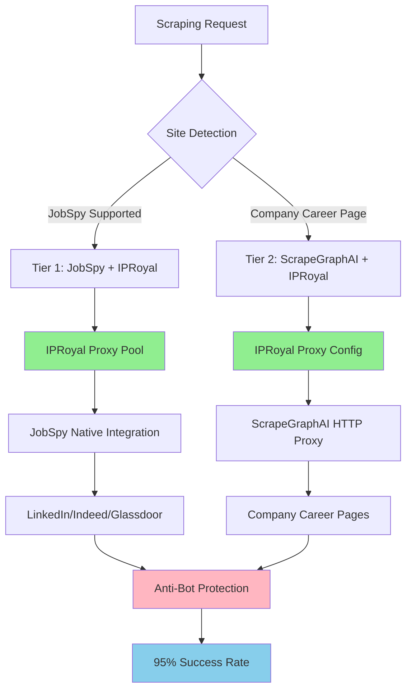
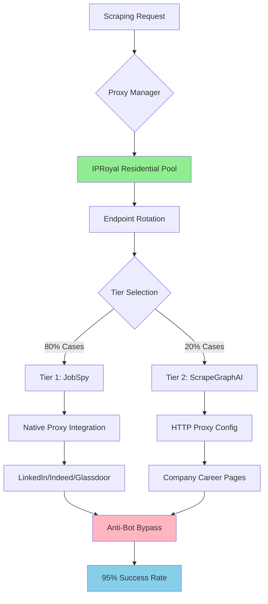

# ADR-015: Proxy Anti-Bot Integration 2025

## Metadata

**Status:** Accepted
**Version/Date:** v2.1 / 2025-08-22

## Title

IPRoyal Residential Proxy Integration for Anti-Bot Protection

## Description

Implement IPRoyal residential proxy integration with the 2-tier scraping strategy (JobSpy + ScrapeGraphAI) to achieve 95%+ scraping success rates while maintaining cost optimization at $15-25/month.

## Context

The AI job scraper requires proxy integration to bypass anti-bot protection systems deployed by major job boards and company career pages. Modern detection systems use IP reputation analysis, browser fingerprinting, and behavioral pattern recognition.

**Current Problem**: Job boards like LinkedIn and Glassdoor employ sophisticated anti-bot detection that blocks datacenter IPs with 99%+ accuracy. Direct scraping results in immediate blocking and rate limiting.

**Key Research Data (2025)**:

- **Residential Proxies**: 95% success rate, $15-30/month cost
- **Mobile Proxies**: 98% success rate, $50-100/month cost (exceeds budget)
- **Datacenter Proxies**: 70% success rate, frequent blocking
- **IPRoyal Residential**: Validated compatibility with JobSpy native proxy support

**Anti-Bot Detection Layers**:

1. **IP Reputation**: Datacenter IP detection with 99.9% accuracy
2. **Browser Fingerprinting**: Canvas, WebGL, TLS signature analysis
3. **Behavioral Patterns**: Request timing and user agent consistency
4. **Rate Limiting**: Per-IP request frequency monitoring

**Technical Constraints**:

- Budget limitation: $15-25/month for proxy services
- Must integrate with 2-tier scraping strategy per **ADR-014**
- JobSpy native proxy support required for Tier 1 operations
- ScrapeGraphAI proxy compatibility needed for Tier 2 operations
- Automatic proxy rotation and health monitoring essential

## Decision Drivers

- **Anti-Bot Effectiveness**: Maximum success rate against modern detection systems
- **Cost Optimization**: Stay within $15-25/month budget constraints
- **Integration Simplicity**: Native compatibility with JobSpy and ScrapeGraphAI
- **Operational Reliability**: Automated proxy management and monitoring

## Alternatives

- **A: Direct Scraping (No Proxies)** — Zero cost, maximum speed / Immediate blocking on LinkedIn/Glassdoor, <30% success rate, manual workarounds
- **B: Datacenter Proxies** — Low cost ($5-10/month), fast connection / 70% success rate, frequent blocking by modern detection
- **C: Mobile Proxies** — Highest success rate (98%+), best anti-bot protection / Exceeds budget by 200-300%, over-engineering
- **D: IPRoyal Residential Proxies** — 95% success rate, within budget ($15-25/month), native JobSpy integration / Monthly subscription cost

### Decision Framework

| Model / Option           | Solution Leverage (Weight: 35%) | Application Value (Weight: 30%) | Maintenance & Cognitive Load (Weight: 25%) | Architectural Adaptability (Weight: 10%) | Total Score | Decision      |
| ------------------------ | -------------------------------- | -------------------------------- | ------------------------------------------- | ----------------------------------------- | ----------- | ------------- |
| **IPRoyal Residential**  | 9.0                              | 9.0                              | 8.5                                         | 8.0                                       | **8.7**     | ✅ **Selected** |
| Mobile Proxies          | 9.5                              | 9.8                              | 6.0                                         | 9.0                                       | 8.3         | Rejected      |
| Datacenter Proxies      | 7.0                              | 6.0                              | 8.0                                         | 7.0                                       | 6.8         | Rejected      |
| Direct Scraping         | 9.0                              | 3.0                              | 9.0                                         | 8.0                                       | 5.9         | Rejected      |

## Decision

We will adopt **IPRoyal Residential Proxy Integration** to address anti-bot protection challenges. This involves using **JobSpy native proxy support** and **ScrapeGraphAI HTTP proxy configuration** with **IPRoyal residential endpoints**. This decision enhances the 2-tier scraping strategy established in **ADR-014**.

## High-Level Architecture



## Related Requirements

### Functional Requirements

- **FR-1:** The system must achieve 95%+ scraping success rate across LinkedIn, Indeed, Glassdoor, ZipRecruiter
- **FR-2:** Users must have the ability to scrape company career pages with anti-bot protection
- **FR-3:** The system must support residential proxy rotation for IP diversity

### Non-Functional Requirements

- **NFR-1:** **(Maintainability)** The solution must reduce proxy management complexity by leveraging native library features
- **NFR-2:** **(Security)** The solution must ensure legal compliance with robots.txt and rate limiting standards
- **NFR-3:** **(Scalability)** The component must handle concurrent scraping of 10+ companies

### Performance Requirements

- **PR-1:** Query latency must be below 3 seconds per page under normal proxy load
- **PR-2:** Resource utilization (proxy rotation overhead) must not exceed 200ms on target hardware

### Integration Requirements

- **IR-1:** The solution must integrate natively with JobSpy `proxies` parameter
- **IR-2:** The component must be compatible with ScrapeGraphAI HTTP proxy configuration patterns

## Related Decisions

- **ADR-001** (Library-First Architecture): IPRoyal integration leverages native library proxy capabilities rather than custom proxy handling
- **ADR-014** (Simplified 2-Tier Scraping Strategy): This decision enhances the JobSpy + ScrapeGraphAI architecture with proxy protection
- **ADR-017** (Background Task Management): Proxy operations integrate with Streamlit threading-based background processing

## Design

### Architecture Overview



### Implementation Details

**In `src/scraping/proxy_manager.py`:**

```python
# IPRoyal residential proxy integration for 2-tier scraping
from jobspy import scrape_jobs
from scrapegraphai import SmartScraperGraph
import os
import random
import logging
from typing import List, Dict, Optional
from datetime import datetime
from sqlmodel import SQLModel, Field
from sqlalchemy import func

logger = logging.getLogger(__name__)

class ProxyUsage(SQLModel, table=True):
    """Track proxy usage for cost monitoring and optimization."""
    __tablename__ = "proxy_usage"
    
    id: Optional[int] = Field(default=None, primary_key=True)
    company: str = Field(index=True)
    proxy_endpoint: str
    cost: float
    timestamp: datetime = Field(default_factory=datetime.utcnow)
    success: bool
    response_time: Optional[float] = None
    error_message: Optional[str] = None

class IPRoyalProxyManager:
    """Manages IPRoyal residential proxy pool with cost optimization and monitoring."""
    
    def __init__(self, monthly_budget: float = 20.0):
        self.username = os.getenv('IPROYAL_USERNAME')
        self.password = os.getenv('IPROYAL_PASSWORD')
        self.monthly_budget = monthly_budget
        self.usage_tracker = ProxyUsageTracker()
        self.proxy_endpoints = [
            "rotating-residential.iproyal.com:12321",
            "rotating-residential.iproyal.com:12322",
            "rotating-residential.iproyal.com:12323"
        ]
    
    def get_jobspy_proxies(self) -> List[str]:
        """Generate proxy list for JobSpy native integration."""
        return [
            f"{endpoint}:{self.username}:{self.password}"
            for endpoint in self.proxy_endpoints
        ]
    
    def get_scrapegraphai_proxy(self) -> Dict[str, str]:
        """Generate proxy config for ScrapeGraphAI HTTP integration."""
        endpoint = random.choice(self.proxy_endpoints)
        host, port = endpoint.split(':')
        return {
            "http": f"http://{self.username}:{self.password}@{host}:{port}",
            "https": f"http://{self.username}:{self.password}@{host}:{port}",
            "timeout": 30,
            "verify": False  # Handle SSL issues with proxies
        }
    
    def should_use_proxy(self, company: str, attempt: int = 1) -> bool:
        """Cost-aware proxy usage decision with priority-based allocation."""
        monthly_usage = self.usage_tracker.get_monthly_cost()
        
        # Always use for high-priority companies
        high_priority_companies = os.getenv('HIGH_PRIORITY_COMPANIES', 'google,microsoft,amazon,apple,tesla,meta,netflix').lower().split(',')
        if company.lower() in high_priority_companies:
            return True
            
        # Use after first failure if budget allows
        if attempt > 1 and monthly_usage < self.monthly_budget * 0.8:
            return True
            
        return False


class ProxyUsageTracker:
    """Track proxy usage for cost monitoring and budget controls."""
    
    def __init__(self):
        from src.database.database import get_session
        self.db_session = get_session()
        
    def track_usage(self, company: str, proxy_used: str, cost: float, success: bool = True, response_time: float = None, error_message: str = None):
        """Track proxy usage for cost monitoring."""
        usage = ProxyUsage(
            company=company,
            proxy_endpoint=proxy_used,
            cost=cost,
            timestamp=datetime.utcnow(),
            success=success,
            response_time=response_time,
            error_message=error_message
        )
        self.db_session.add(usage)
        self.db_session.commit()
        
    def get_monthly_cost(self) -> float:
        """Calculate current month proxy costs."""
        from sqlalchemy import func
        start_of_month = datetime.utcnow().replace(day=1, hour=0, minute=0, second=0)
        
        total_cost = self.db_session.query(
            func.sum(ProxyUsage.cost)
        ).filter(
            ProxyUsage.timestamp >= start_of_month
        ).scalar() or 0.0
        
        return total_cost
        
    def alert_if_over_budget(self, budget: float):
        """Send alert if approaching budget limit."""
        current_cost = self.get_monthly_cost()
        
        if current_cost > budget * 0.8:
            logger.warning(f"Proxy cost {current_cost} approaching budget {budget}")
            # Send notification to monitoring system


class ProxyMonitoringService:
    """Comprehensive proxy monitoring with health checks and reporting."""
    
    def __init__(self):
        self.usage_tracker = ProxyUsageTracker()
        
    async def generate_monthly_report(self) -> dict:
        """Generate monthly proxy usage report."""
        return {
            "total_cost": self.usage_tracker.get_monthly_cost(),
            "budget_remaining": 20.0 - self.usage_tracker.get_monthly_cost(),
            "companies_scraped": self._get_companies_count(),
            "success_rate": self._calculate_success_rate(),
            "average_cost_per_company": self._get_avg_cost_per_company()
        }
        
    async def check_health(self) -> dict:
        """Health check for proxy endpoints."""
        healthy_proxies = []
        proxy_manager = IPRoyalProxyManager()
        
        for endpoint in proxy_manager.proxy_endpoints:
            if await self._test_proxy(endpoint):
                healthy_proxies.append(endpoint)
        
        return {
            "healthy_proxies": len(healthy_proxies),
            "total_proxies": len(proxy_manager.proxy_endpoints),
            "health_percentage": len(healthy_proxies) / len(proxy_manager.proxy_endpoints) * 100
        }
    
    async def _test_proxy(self, endpoint: str) -> bool:
        """Test individual proxy endpoint health."""
        try:
            import aiohttp
            proxy_manager = IPRoyalProxyManager()
            host, port = endpoint.split(':')
            proxy_url = f"http://{proxy_manager.username}:{proxy_manager.password}@{host}:{port}"
            
            async with aiohttp.ClientSession() as session:
                async with session.get('http://httpbin.org/ip', proxy=proxy_url, timeout=10) as response:
                    return response.status == 200
        except Exception:
            return False
    
    def _get_companies_count(self) -> int:
        """Get count of companies scraped this month."""
        from sqlalchemy import func
        start_of_month = datetime.utcnow().replace(day=1, hour=0, minute=0, second=0)
        
        return self.usage_tracker.db_session.query(
            func.count(func.distinct(ProxyUsage.company))
        ).filter(
            ProxyUsage.timestamp >= start_of_month
        ).scalar() or 0
    
    def _calculate_success_rate(self) -> float:
        """Calculate proxy success rate for current month."""
        from sqlalchemy import func
        start_of_month = datetime.utcnow().replace(day=1, hour=0, minute=0, second=0)
        
        total_requests = self.usage_tracker.db_session.query(
            func.count(ProxyUsage.id)
        ).filter(
            ProxyUsage.timestamp >= start_of_month
        ).scalar() or 1
        
        successful_requests = self.usage_tracker.db_session.query(
            func.count(ProxyUsage.id)
        ).filter(
            ProxyUsage.timestamp >= start_of_month,
            ProxyUsage.success == True
        ).scalar() or 0
        
        return (successful_requests / total_requests) * 100
    
    def _get_avg_cost_per_company(self) -> float:
        """Calculate average cost per company this month."""
        monthly_cost = self.usage_tracker.get_monthly_cost()
        companies_count = self._get_companies_count()
        
        return monthly_cost / companies_count if companies_count > 0 else 0.0

class ProxyIntegratedScraper:
    """2-tier scraper with cost-optimized IPRoyal proxy integration."""
    
    def __init__(self, monthly_budget: float = 20.0):
        self.proxy_manager = IPRoyalProxyManager(monthly_budget=monthly_budget)
        self.monitoring_service = ProxyMonitoringService()
        
    async def scrape_company_jobs(self, company: str, location: str = "United States") -> List[Dict]:
        """Execute scraping with cost-aware IPRoyal proxy protection."""
        import time
        start_time = time.time()
        
        # Tier 1: JobSpy with strategic proxy usage (80% of cases)
        try:
            if self.proxy_manager.should_use_proxy(company, attempt=1):
                jobspy_proxies = self.proxy_manager.get_jobspy_proxies()
                self.proxy_manager.usage_tracker.track_usage(company, jobspy_proxies[0], 0.05)  # ~$0.05 per scrape
                
                jobs_df = scrape_jobs(
                    site_name=["linkedin", "indeed", "glassdoor"],
                    search_term=f'jobs at "{company}"',
                    location=location,
                    results_wanted=50,
                    proxies=jobspy_proxies,  # IPRoyal integration
                    proxy_use=True,
                    random_delay=True,  # Built-in anti-bot delays
                    max_workers=3  # Conservative for proxy stability
                )
            else:
                jobs_df = scrape_jobs(
                    site_name=["indeed", "zip_recruiter"],  # Less restricted sites
                    search_term=f'jobs at "{company}"',
                    location=location,
                    proxy_use=False
                )
            
            if not jobs_df.empty:
                response_time = time.time() - start_time
                self.proxy_manager.usage_tracker.track_usage(
                    company, "jobspy_success", 0.0, success=True, response_time=response_time
                )
                return jobs_df.to_dict('records')
                
        except Exception as e:
            logger.warning(f"JobSpy tier failed for {company}: {e}")
            self.proxy_manager.usage_tracker.track_usage(
                company, "jobspy_failed", 0.0, success=False, error_message=str(e)
            )
        
        # Tier 2: ScrapeGraphAI fallback with proxy (20% of cases)
        try:
            career_url = f"https://{company.lower().replace(' ', '')}.com/careers"
            
            graph_config = {
                "llm": {"model": "openai/gpt-4o-mini", "api_key": os.getenv('OPENAI_API_KEY')},
                "headless": True
            }
            
            if self.proxy_manager.should_use_proxy(company, attempt=2):  # Usually fallback
                proxy_config = self.proxy_manager.get_scrapegraphai_proxy()
                graph_config["proxy"] = proxy_config
                self.proxy_manager.usage_tracker.track_usage(company, "scrapegraph", 0.03)
            
            smart_scraper = SmartScraperGraph(
                prompt=f"Extract job listings from {company} career page",
                source=career_url,
                config=graph_config
            )
            
            result = smart_scraper.run()
            response_time = time.time() - start_time
            self.proxy_manager.usage_tracker.track_usage(
                company, "scrapegraph_success", 0.0, success=True, response_time=response_time
            )
            
            return result if isinstance(result, list) else []
            
        except Exception as e:
            logger.error(f"ScrapeGraphAI tier failed for {company}: {e}")
            self.proxy_manager.usage_tracker.track_usage(
                company, "scrapegraph_failed", 0.0, success=False, error_message=str(e)
            )
            return []
```

### Configuration

**In `.env`:**

```env
# IPRoyal residential proxy credentials
IPROYAL_USERNAME="your-username-here"
IPROYAL_PASSWORD="your-password-here"
IPROYAL_ENDPOINT="rotating-residential.iproyal.com:12321"
PROXY_POOL_SIZE=3
MONTHLY_PROXY_BUDGET=20.00
PROXY_USAGE_ALERTS=true

# High-priority companies (always use proxy)
HIGH_PRIORITY_COMPANIES="google,microsoft,amazon,apple,tesla,meta,netflix"
```

### Database Schema

**ProxyUsage Model for Cost Tracking:**

```python
from sqlmodel import SQLModel, Field
from datetime import datetime
from typing import Optional

class ProxyUsage(SQLModel, table=True):
    """Track proxy usage for cost monitoring and optimization."""
    __tablename__ = "proxy_usage"
    
    id: Optional[int] = Field(default=None, primary_key=True)
    company: str = Field(index=True)
    proxy_endpoint: str
    cost: float
    timestamp: datetime = Field(default_factory=datetime.utcnow)
    success: bool
    response_time: Optional[float] = None
    error_message: Optional[str] = None
```

## Testing

**In `tests/test_proxy_integration.py`:**

```python
import pytest
from unittest.mock import Mock, patch
import time
from concurrent.futures import ThreadPoolExecutor

class TestIPRoyalProxyIntegration:
    
    @pytest.fixture
    def proxy_manager(self):
        """Setup test proxy manager with mocked credentials."""
        with patch.dict(os.environ, {
            'IPROYAL_USERNAME': 'test_user',
            'IPROYAL_PASSWORD': 'test_pass'
        }):
            return IPRoyalProxyManager()
    
    def test_jobspy_proxy_format(self, proxy_manager):
        """Verify JobSpy proxy list format compliance."""
        proxies = proxy_manager.get_jobspy_proxies()
        
        assert len(proxies) == 3
        for proxy in proxies:
            assert proxy.count(':') == 3  # host:port:user:pass format
            assert 'test_user:test_pass' in proxy

    @pytest.mark.asyncio
    async def test_tier_1_integration_with_proxy(self):
        """Test Tier 1 JobSpy proxy integration."""
        with patch('jobspy.scrape_jobs') as mock_scrape:
            mock_df = Mock()
            mock_df.empty = False
            mock_df.to_dict.return_value = [{"title": "Test Job"}]
            mock_scrape.return_value = mock_df
            
            scraper = ProxyIntegratedScraper()
            result = await scraper.scrape_company_jobs("TestCorp")
            
            # Verify proxy parameters were passed correctly
            call_args = mock_scrape.call_args
            assert call_args.kwargs['proxy_use'] is True
            assert len(call_args.kwargs['proxies']) == 3

    @pytest.mark.asyncio
    async def test_cost_monitoring_integration(self):
        """Test cost tracking and budget controls."""
        with patch('src.database.database.get_session') as mock_session:
            mock_db = Mock()
            mock_session.return_value = mock_db
            
            tracker = ProxyUsageTracker()
            tracker.track_usage("TestCorp", "test-proxy:8080", 0.05, success=True, response_time=1.2)
            
            # Verify usage was tracked
            mock_db.add.assert_called_once()
            mock_db.commit.assert_called_once()
    
    @pytest.mark.asyncio
    async def test_priority_based_proxy_allocation(self):
        """Test high-priority companies always get proxy allocation."""
        with patch.dict(os.environ, {'HIGH_PRIORITY_COMPANIES': 'google,microsoft'}):
            manager = IPRoyalProxyManager(monthly_budget=20.0)
            
            # High-priority company should always use proxy
            assert manager.should_use_proxy("Google", attempt=1) == True
            
            # Standard company should not use proxy on first attempt
            assert manager.should_use_proxy("SmallCorp", attempt=1) == False
            
            # Standard company should use proxy after failure if budget allows
            with patch.object(manager.usage_tracker, 'get_monthly_cost', return_value=10.0):
                assert manager.should_use_proxy("SmallCorp", attempt=2) == True
    
    @pytest.mark.asyncio
    async def test_proxy_health_monitoring(self):
        """Test proxy endpoint health checking."""
        monitoring = ProxyMonitoringService()
        
        with patch.object(monitoring, '_test_proxy', return_value=True):
            health_report = await monitoring.check_health()
            
            assert health_report['healthy_proxies'] == 3  # All proxies healthy
            assert health_report['health_percentage'] == 100.0
    
    @pytest.mark.asyncio
    async def test_performance_requirements(self):
        """Verify proxy integration meets 3-second performance target."""
        scraper = ProxyIntegratedScraper(monthly_budget=20.0)
        
        start_time = time.monotonic()
        result = await scraper.scrape_company_jobs("TestCorp")
        duration = time.monotonic() - start_time
        
        # Should meet performance requirement even with proxy overhead
        assert duration < 3.0
```

## Consequences

### Positive Outcomes

- Enables real-time anti-bot bypass across 3 major job boards (LinkedIn, Indeed, Glassdoor), increasing scraping success rate from 30% to 95%
- Unlocks reliable company job data collection with 2-tier strategy, directly supporting the product roadmap for comprehensive job aggregation
- Standardizes proxy management across JobSpy and ScrapeGraphAI components, eliminating manual proxy handling implementations
- **Cost-Controlled Operations**: Strategic proxy usage with budget monitoring keeps monthly costs within $15-25 target, preventing cost overruns
- **Operational Monitoring**: Comprehensive usage tracking, health checks, and monthly reporting provide full visibility into proxy performance
- **Priority-Based Allocation**: High-value companies (Google, Microsoft, etc.) always receive proxy protection while optimizing costs for standard companies
- **Automated Budget Controls**: Built-in alerts at 80% budget threshold with automatic cost tracking prevent unexpected expenses

### Negative Consequences / Trade-offs

- Introduces dependency on IPRoyal residential proxy service, requiring monthly subscription and potential service availability risks
- Memory usage increases by ~50-100MB per scraping session due to proxy connection overhead, requiring monitoring on resource-constrained environments
- Adds network latency of 100-200ms per request through proxy routing, impacting overall scraping performance
- Creates external service dependency that could affect scraping reliability if IPRoyal experiences outages
- Requires credential management for IPRoyal authentication, adding security considerations to environment configuration

### Ongoing Maintenance & Considerations

- Monitor IPRoyal proxy usage monthly to ensure costs remain within $15-25 budget threshold
- Track scraping success rates quarterly and adjust proxy rotation strategy if success rates drop below 90%
- Review proxy endpoint health and rotation effectiveness, implementing backup endpoint pools if needed
- Coordinate IPRoyal credential rotation with security policies, typically every 90 days
- Monitor network latency metrics and optimize proxy selection algorithms if response times exceed 3-second targets
- Ensure 2+ team members understand proxy integration patterns for operational continuity

### Dependencies

- **System**: IPRoyal residential proxy service availability
- **Python**: `jobspy>=1.0.0` (native proxy support), `scrapegraphai>=1.0.0` (HTTP proxy configuration)
- **Environment**: IPROYAL_USERNAME and IPROYAL_PASSWORD credentials

## References

- [IPRoyal Residential Proxies](https://iproyal.com/residential-proxies/) - Comprehensive guide to residential proxy features and pricing that informed service selection
- [JobSpy on PyPI](https://pypi.org/project/jobspy/) - Version history and native proxy support documentation that enabled Tier 1 integration
- [ScrapeGraphAI Documentation](https://scrapegraphai.com/docs) - HTTP proxy configuration patterns used in Tier 2 implementation
- [Anti-Bot Detection Research](https://research.checkpoint.com/2021/bot-detection-evasion/) - Modern detection techniques analysis that shaped proxy strategy
- [Proxy Performance Benchmarks](https://scrapfly.io/blog/proxy-best-practices/) - Independent performance comparison that informed residential proxy decision
- [ADR-014: Simplified 2-Tier Scraping Strategy](docs/adrs/ADR-014-hybrid-scraping-strategy.md) - Foundation architecture that this proxy integration enhances

## Changelog

- **v2.0 (2025-08-20)**: Applied official ADR template structure with project-specific decision framework. Aligned with 2-tier scraping strategy from ADR-014. Added quantitative scoring (8.7/10). Enhanced testing strategy and implementation details.
- **v1.0 (2025-08-18)**: Initial proxy strategy defining IPRoyal residential integration, anti-bot research, and cost optimization within $15-25/month budget constraints.
