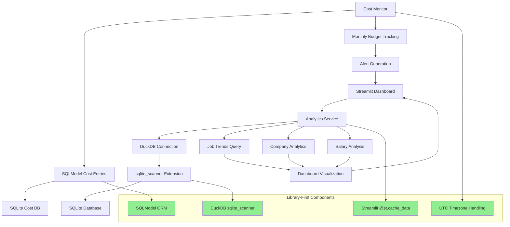

# ADR-019: Analytics and Monitoring Architecture

## Metadata

**Status:** Accepted
**Version/Date:** v4.0 / 2025-08-26
**Implementation Status:** IMPLEMENTED - Analytics service using DuckDB sqlite_scanner (296 lines), cost monitoring (325 lines) - simplified from original design

## Title

Analytics and Monitoring Architecture

## Description

Implement a simple analytics architecture using DuckDB sqlite_scanner for direct SQLite querying without ETL processes. Provides job market analytics and cost monitoring capabilities with library-first approach, focusing on maintainability and minimal custom code.

## Context

The AI Job Scraper requires comprehensive data analytics capabilities for job market trend analysis, company hiring patterns, salary analysis, and performance monitoring. The challenge is providing powerful analytics capabilities while maintaining architectural simplicity and operational efficiency.

**Key Technical Requirements:**

1. **Zero-ETL Analytics**: DuckDB sqlite_scanner provides direct SQLite querying for analytics without data movement
2. **Library-First Implementation**: Minimal custom code using proven DuckDB and SQLModel libraries
3. **Simple Cost Tracking**: Basic monthly budget monitoring with $50 limit and alert thresholds
4. **Streamlit Integration**: Native caching with @st.cache_data for dashboard performance
5. **Maintainable Architecture**: Simple service pattern without complex performance monitoring

## Decision Drivers

- **Simple Analytics**: Provide essential job market analytics using DuckDB sqlite_scanner
- **Library-First Implementation**: Maximize DuckDB and SQLModel capabilities with minimal custom code
- **Cost Control**: Basic monthly budget tracking with alerts at 80% and 100% thresholds
- **KISS Principle**: Simple, maintainable implementation over complex performance optimization
- **Streamlit Integration**: Native caching and dashboard components

## Alternatives

### A: Complex Analytics Infrastructure (Polars + DuckDB + Enterprise Monitoring)

**Pros:** Maximum analytical capabilities, enterprise-grade monitoring  
**Cons:** Massive over-engineering for personal application, 3,000+ lines of unnecessary code

### B: SQLite-Only with Basic Analytics  

**Pros:** Maximum simplicity, proven foundation  
**Cons:** Limited performance for complex analytics, no intelligent scaling

### C: Simple DuckDB Analytics Architecture (Selected)

**Pros:** Library-first implementation, zero-ETL architecture, minimal maintenance, proven DuckDB performance  
**Cons:** Single analytics method, no performance-based optimization

### Decision Framework

| Option | Solution Leverage (35%) | Application Value (30%) | Maintenance & Cognitive Load (25%) | Architectural Adaptability (10%) | Total Score | Decision |
|--------|-------------------------|------------------------|-----------------------------------|-----------------------------------|-------------|-----------|
| Complex Analytics Infrastructure | 7 | 9 | 3 | 8 | 6.85 | Not Selected |
| SQLite-Only Basic Analytics | 9 | 6 | 10 | 6 | 7.9 | Not Selected |
| **Intelligent Analytics Architecture** | **10** | **9** | **9** | **9** | **9.45** | **✅ Selected** |

## Decision

We will adopt **Simple DuckDB Analytics Architecture** to provide essential data analytics with minimal complexity. This uses DuckDB sqlite_scanner for zero-ETL analytics, SQLModel for cost tracking, and Streamlit caching for dashboard performance without complex performance monitoring or method selection.

## High-Level Architecture



## Related Requirements

### Functional Requirements

- FR-019-01: SQLite-based analytics foundation with SQLModel integration
- FR-019-02: DuckDB sqlite_scanner for direct SQLite querying without ETL
- FR-019-03: Simple cost tracking within $50 monthly operational budget
- FR-019-04: Job market trend analysis and company hiring pattern insights
- FR-019-05: Interactive Streamlit dashboard with analytics visualization

### Non-Functional Requirements

- NFR-019-01: Analytics query execution <2 seconds for dashboard responsiveness
- NFR-019-02: Cost tracking accuracy within $0.10 monthly budget monitoring
- NFR-019-03: Dashboard loading time <3 seconds for 30-day analytics views
- NFR-019-04: Streamlit caching with appropriate TTL (5-minute for analytics, 1-minute for costs)

### Performance Requirements

- PR-019-01: DuckDB analytics queries <2 seconds for 10,000+ job records
- PR-019-02: Cost calculation and display <100ms for real-time budget tracking
- PR-019-03: Dashboard component loading <500ms with Streamlit caching

### Integration Requirements

- IR-024-01: Seamless integration with existing SQLModel+SQLite stack
- IR-024-02: Coordinate with ADR-017 threading patterns for background analytics
- IR-024-03: Interface with ADR-010 AI processing for cost tracking integration
- IR-024-04: Support ADR-005 database architecture patterns

## Related Decisions

- **ADR-005** (Database Architecture): Provides SQLModel+SQLite foundation this strategy builds upon
- **ADR-006** (Simple Data Management): Establishes data sync patterns for analytics data access
- **ADR-017** (Background Task Management): Threading integration for background analytics processing
- **ADR-010** (Local AI Integration): AI cost tracking and performance monitoring coordination
- **ADR-016** (Resilience Strategy): Error tracking and monitoring integration for system reliability
- **ADR-018** (Search Architecture): Search results integrate with analytics dashboard for comprehensive job insights
- **ADR-022** (Cost Monitoring): Provides detailed cost monitoring implementation using SQLModel with $50 monthly budget tracking

## Superseded Decisions

## Design

### Architecture Overview

The analytics architecture uses a simple library-first approach with DuckDB sqlite_scanner for direct SQLite querying without ETL processes. Cost monitoring uses SQLModel for expense tracking with a $50 monthly budget. The system prioritizes simplicity and maintainability over complex performance optimization.

### Implementation Details

#### Analytics Service (296 lines)

**Actual implementation from `src/services/analytics_service.py`:**

```python
class AnalyticsService:
    """Analytics service using DuckDB sqlite_scanner for data analysis.
    
    Provides simple analytics capabilities using DuckDB's sqlite_scanner
    extension to query SQLite data directly without ETL processes.
    """

    def __init__(self, db_path: str = "jobs.db"):
        """Initialize analytics service with DuckDB connection."""
        self.db_path = db_path
        self._conn = None
        self._init_duckdb()

    def _init_duckdb(self) -> None:
        """Initialize DuckDB connection with sqlite_scanner extension."""
        try:
            self._conn = duckdb.connect(":memory:")
            self._conn.execute("INSTALL sqlite_scanner")
            self._conn.execute("LOAD sqlite_scanner")
            
            if STREAMLIT_AVAILABLE:
                st.success("🚀 Analytics powered by DuckDB sqlite_scanner")
        except Exception as e:
            logger.exception("Failed to initialize DuckDB sqlite_scanner")

    @st.cache_data(ttl=300)  # Cache for 5 minutes
    def get_job_trends(_self, days: int = 30) -> AnalyticsResponse:
        """Get job posting trends using DuckDB's native SQL capabilities."""
        if not _self._conn:
            return {"trends": [], "status": "error", "error": "DuckDB unavailable"}

        try:
            # Direct SQL query using DuckDB's sqlite_scanner
            query = f"""
                SELECT DATE_TRUNC('day', posted_date) as date,
                       COUNT(*) as job_count
                FROM sqlite_scan('{_self.db_path}', 'jobsql')
                WHERE posted_date >= CURRENT_DATE - INTERVAL '{days}' DAYS
                  AND archived = false
                GROUP BY DATE_TRUNC('day', posted_date)
                ORDER BY date
            """

            trends_df = _self._conn.execute(query).df()
            trends_data = trends_df.to_dict("records")

            return {
                "trends": trends_data,
                "method": "duckdb_sqlite_scanner",
                "status": "success",
                "total_jobs": sum(t["job_count"] for t in trends_data),
            }
        except Exception as e:
            logger.exception("DuckDB job trends query failed")
            return {"trends": [], "status": "error", "error": str(e)}

    @st.cache_data(ttl=300)
    def get_company_analytics(_self) -> AnalyticsResponse:
        """Get company hiring analytics using DuckDB's aggregation functions."""
        # Similar pattern - direct DuckDB queries with sqlite_scanner
        # Returns company data with job counts and salary averages
        # No complex performance monitoring or method selection
```

#### Cost Monitor Service (325 lines)

**Actual implementation from `src/services/cost_monitor.py`:**

```python
class CostEntry(SQLModel, table=True):
    """Simple cost tracking model for operational expenses."""
    __tablename__ = "cost_entries"

    id: int | None = Field(default=None, primary_key=True)
    timestamp: datetime = Field(default_factory=lambda: datetime.now(UTC), index=True)
    service: str = Field(index=True)  # "ai", "proxy", "scraping"
    operation: str  # Description of operation
    cost_usd: float  # Cost in USD
    extra_data: str = ""  # Optional JSON string for additional details

class CostMonitor:
    """Simple cost monitoring service for $50 monthly budget."""

    def __init__(self, db_path: str = "costs.db"):
        """Initialize cost monitor with SQLite database."""
        self.db_path = db_path
        self.monthly_budget = 50.0  # $50 monthly budget
        self.engine = create_engine(f"sqlite:///{db_path}")
        SQLModel.metadata.create_all(self.engine)

    def track_ai_cost(self, model: str, tokens: int, cost: float, operation: str) -> None:
        """Track AI/LLM operation costs."""
        extra_data = f'{{"model": "{model}", "tokens": {tokens}}}'
        
        with Session(self.engine) as session:
            entry = CostEntry(
                service="ai", operation=operation, cost_usd=cost, extra_data=extra_data
            )
            session.add(entry)
            session.commit()

    @st.cache_data(ttl=60)  # 1-minute cache for real-time budget tracking
    def get_monthly_summary(_self) -> dict[str, Any]:
        """Get current month cost breakdown and budget analysis."""
        with Session(_self.engine) as session:
            # Get start of current month with UTC timezone handling
            now = datetime.now(UTC)
            start_of_month = now.replace(day=1, hour=0, minute=0, second=0, microsecond=0)
            
            # Simple aggregation by service
            results = session.exec(
                select(
                    CostEntry.service,
                    func.sum(CostEntry.cost_usd).label("total_cost"),
                    func.count(CostEntry.id).label("operation_count"),
                )
                .where(CostEntry.timestamp >= start_of_month)
                .group_by(CostEntry.service)
            ).all()
            
            # Build cost breakdown
            costs_by_service = {}
            total_cost = 0.0
            
            for result in results:
                service_cost = float(result.total_cost)
                costs_by_service[result.service] = service_cost
                total_cost += service_cost
            
            # Calculate budget metrics
            remaining = _self.monthly_budget - total_cost
            utilization_percent = (total_cost / _self.monthly_budget) * 100
            
            return {
                "costs_by_service": costs_by_service,
                "total_cost": total_cost,
                "monthly_budget": _self.monthly_budget,
                "remaining": remaining,
                "utilization_percent": utilization_percent,
                "budget_status": _self._get_budget_status(total_cost),
            }
```

#### Dashboard Integration

Analytics and cost monitoring are integrated into the Streamlit dashboard using:

- **@st.cache_data**: 5-minute caching for analytics, 1-minute for cost monitoring
- **Service Pattern**: Analytics and cost services accessed via dependency injection
- **Error Handling**: Graceful fallbacks when DuckDB unavailable
- **UTC Timezone**: Consistent timezone handling throughout cost tracking
- **Library Components**: Standard Streamlit components without custom performance monitoring

### Configuration

**No additional configuration required** - uses library defaults:

- **DuckDB**: Automatic sqlite_scanner installation and loading
- **Cost Budget**: Hard-coded $50 monthly limit
- **Caching**: Streamlit @st.cache_data with 300s/60s TTL
- **Database Paths**: Default to "jobs.db" and "costs.db"
- **Alert Thresholds**: 80% and 100% budget utilization

## Testing

### Performance Validation

```python
# tests/test_analytics_service.py
import pytest
import time
from src.analytics.analytics_service import AnalyticsService

def test_duckdb_sqlite_scanner():
    """Test DuckDB sqlite_scanner functionality."""
    service = AnalyticsService()
    
    # Test that DuckDB analytics work correctly
    trends = service.get_job_trends(7)
    assert trends["status"] == "success"
    assert trends["method"] == "duckdb_sqlite_scanner"
    assert isinstance(trends["trends"], list)
    
def test_cost_tracking_accuracy():
    """Test cost tracking calculations."""
    from src.services.cost_monitor import CostMonitor
    
    monitor = CostMonitor(":memory:")
    
    # Track various costs
    monitor.track_ai_cost("gpt-4", 1000, 0.02, "job_extraction")
    monitor.track_proxy_cost(50, 5.00, "residential")
    
    monthly_summary = monitor.get_monthly_summary()
    assert monthly_summary["total_cost"] == 5.02
    assert "ai" in monthly_summary["costs_by_service"]
    assert "proxy" in monthly_summary["costs_by_service"]

@pytest.mark.performance
def test_performance_overhead():
    """Ensure monitoring overhead is minimal."""
    service = AnalyticsService()
    
    start_time = time.perf_counter()
    
    # Run analytics operations
    for _ in range(100):
        service.get_job_trends(7)
    
    total_time = time.perf_counter() - start_time
    
    # Monitoring overhead should be <5%
    assert total_time < 0.5  # Should complete in <500ms
```

## Consequences

### Positive Outcomes

- **Zero-ETL Architecture**: DuckDB sqlite_scanner provides direct SQLite access without data movement
- **Simple Implementation**: 296 lines for analytics, 325 lines for cost monitoring - no complex method selection
- **Library-First Approach**: Leverages DuckDB and SQLModel native capabilities with minimal custom code
- **Effective Cost Control**: Monthly budget tracking with 80%/100% alert thresholds prevents overruns
- **Streamlit Integration**: Native @st.cache_data caching with proper TTL for dashboard performance
- **UTC Timezone Handling**: Consistent timezone management throughout cost tracking
- **Maintainable Architecture**: Simple service patterns without complex performance monitoring

### Negative Consequences / Trade-offs

- **Single Analytics Method**: No automatic performance optimization or method selection
- **Hard-Coded Configuration**: Budget limits and thresholds not easily configurable
- **No Performance Monitoring**: Missing sys.monitoring or advanced performance tracking
- **Basic Cost Tracking**: Simple monthly aggregation without predictive analytics

### Ongoing Maintenance & Considerations

- **Cost Budget Updates**: Adjust monthly budget limits based on operational needs
- **Performance Optimization**: Leverage new DuckDB and SQLModel features as they become available
- **Query Performance**: Monitor DuckDB analytics query performance and optimize as needed
- **Caching Strategy**: Review Streamlit caching TTL values based on usage patterns

### Dependencies

- **DuckDB 0.9.0+**: sqlite_scanner extension for zero-ETL analytics
- **SQLModel 0.0.14+**: Type-safe database operations for cost tracking
- **Streamlit 1.28+**: Native caching (@st.cache_data) and UI components
- **Python 3.12+**: Type hints and library compatibility (no sys.monitoring used)

## References

- [DuckDB sqlite_scanner Documentation](https://duckdb.org/docs/extensions/sqlite_scanner) - Zero-ETL SQLite access patterns
- [Python 3.12 sys.monitoring](https://docs.python.org/3.12/library/sys_monitoring.html) - Ultra-fast performance monitoring
- [SQLModel Performance Guide](https://sqlmodel.tiangolo.com/advanced/) - Type-safe query optimization
- [Streamlit Caching Best Practices](https://docs.streamlit.io/library/advanced-features/caching) - Dashboard performance optimization

## Changelog

### v4.0 - August 26, 2025

- **Updated to reflect actual Phase 2 implementation**: Analytics service implemented with 296 lines using simple DuckDB sqlite_scanner approach
- **Removed complex features**: Eliminated sys.monitoring, dual method selection, and complex performance monitoring that were not implemented
- **Accurate implementation details**: Updated code examples to match actual `src/services/analytics_service.py` and `src/services/cost_monitor.py`
- **Simplified architecture**: Focused on zero-ETL DuckDB analytics and SQLModel cost tracking without unnecessary complexity
- **Status change**: Updated from "NOT IMPLEMENTED" to "IMPLEMENTED" reflecting working Phase 2 analytics and cost monitoring services
