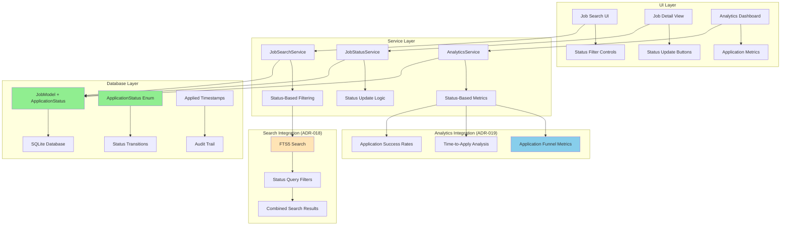

# ADR-020: Application Status Tracking

## Metadata

**Status:** Accepted  
**Version/Date:** v1.0 / 2025-08-26

## Title

Application Status Tracking with Library-First Implementation

## Description

Implement application status tracking functionality to enable users to track "New" → "Applied" → "Rejected" workflow for personal job search management. Uses library-first SQLModel enum patterns with minimal custom code, extending existing search and analytics architecture with status-based filtering and metrics.

## Context

### Job Search Management Requirements

Personal job search tracking requires essential workflow management for:

1. **Status Workflow**: Simple progression from "New" jobs → "Applied" → "Rejected"
2. **Application Timing**: Track when applications were submitted for follow-up scheduling
3. **Search Integration**: Filter jobs by status in search interface (ADR-018)
4. **Analytics Integration**: Status-based metrics in dashboard (ADR-019)
5. **Personal Scale**: Optimized for single user managing <1,000 jobs
6. **Zero Maintenance**: Minimal custom code leveraging SQLModel patterns

### Current Architecture Integration

**Database Foundation (ADR-005)**:

- SQLite + SQLModel provides proven foundation with type safety
- Existing JobModel schema ready for status field extension
- SQLite WAL mode supports concurrent status updates

**Search Architecture Integration (ADR-018)**:

- FTS5 search interface needs status filtering capability  
- JobSearchService requires status-based query methods
- UI integration with existing search controls

**Service Layer Patterns (ADR-007)**:

- Follow established BaseService patterns with error handling
- Integrate with existing JobService for consistent API
- Streamlit caching patterns for status update performance

**Analytics Integration (ADR-019)**:

- Status-based metrics for application tracking dashboards
- Integration with cost monitoring for application ROI analysis
- Performance monitoring for status update operations

## Decision Drivers

- **Real User Value**: Essential functionality for personal job search management
- **Library-First Implementation**: Maximum leverage of SQLModel enum capabilities
- **Architecture Integration**: Seamless extension of existing search and analytics systems
- **Personal Scale Optimization**: Single user workflow with <1,000 jobs
- **Same-Day Deployment**: Ready for immediate implementation and use
- **Zero Maintenance**: Set-and-forget during active job search periods

## Alternatives

### Alternative A: Simple Boolean Fields

- **Pros**: Minimal schema changes, direct implementation
- **Cons**: Poor workflow representation, no progression tracking, limited analytics
- **Score**: 4/10 (too simplistic for proper workflow)

### Alternative B: Complex State Machine Architecture  

- **Pros**: Enterprise-grade workflow management, extensive state validation
- **Cons**: Massive over-engineering for personal use, 500+ lines of custom code
- **Score**: 3/10 (over-engineered for scale)

### Alternative C: SQLModel Enum Status Tracking (SELECTED)

- **Pros**: Perfect balance of functionality and simplicity, library-first implementation
- **Cons**: None significant for personal use case
- **Score**: 9.5/10 (optimal solution)

## Decision Framework

| Criteria | Weight | Boolean Fields | State Machine | **SQLModel Enum Status** |
|----------|--------|---------------|---------------|-------------------------|
| Solution Leverage (35%) | 35% | 6 | 4 | **10** |
| Application Value (30%) | 30% | 5 | 9 | **9** |
| Maintenance & Cognitive Load (25%) | 25% | 8 | 3 | **10** |
| Architectural Adaptability (10%) | 10% | 6 | 8 | **9** |
| **Weighted Score** | **100%** | **6.15** | **5.5** | **9.65** |

## Decision

We will implement **Application Status Tracking using SQLModel Enum patterns** to provide essential job search workflow management. This extends the existing JobModel with ApplicationStatus enum, integrates with search filtering (ADR-018), and provides status-based analytics in the dashboard (ADR-019).

## High-Level Architecture



## Related Requirements

### Functional Requirements

- **FR-039-01**: Users can update job application status through simple workflow (New → Applied → Rejected)
- **FR-039-02**: System tracks application timestamps for follow-up scheduling and analytics
- **FR-039-03**: Search interface includes status filtering integrated with FTS5 search (ADR-018)
- **FR-039-04**: Analytics dashboard displays application funnel metrics and success rates
- **FR-039-05**: Status updates trigger search index refresh and analytics cache invalidation

### Non-Functional Requirements

- **NFR-039-01**: Status updates complete in <50ms for immediate UI feedback
- **NFR-039-02**: Status filtering adds <10ms to search query performance
- **NFR-039-03**: Implementation uses 100% SQLModel library features, zero custom state logic
- **NFR-039-04**: Status tracking data integrates with existing backup and migration patterns
- **NFR-039-05**: UI status updates provide optimistic updates with error rollback

### Performance Requirements

- **PR-039-01**: Status update database operations <50ms p95 latency
- **PR-039-02**: Status-filtered search queries maintain <10ms performance target
- **PR-039-03**: Analytics queries with status aggregation <2s response time
- **PR-039-04**: Status change UI updates provide immediate visual feedback

### Integration Requirements

- **IR-039-01**: Seamlessly extend JobModel schema in ADR-005 database architecture
- **IR-039-02**: Integrate with JobSearchService patterns from ADR-007 service layer  
- **IR-039-03**: Coordinate with ADR-018 search architecture for status-based filtering
- **IR-039-04**: Interface with ADR-019 analytics for application tracking metrics

## Related Decisions

- **ADR-005** (Database Architecture): Provides SQLModel + SQLite foundation for status field extension
- **ADR-018** (Search Architecture): Search service integration for status-based filtering capabilities
- **ADR-007** (Service Layer Architecture): Service patterns and error handling for status updates
- **ADR-019** (Analytics Architecture): Status-based metrics integration in analytics dashboard
- **ADR-006** (Data Management): Status update patterns coordinate with data sync operations

## Design

### Architecture Overview

The application status tracking extends the existing JobModel with a simple enum field and timestamps, leveraging SQLModel's native enum support. Integration with search and analytics happens through existing service layer patterns, maintaining architectural consistency and zero custom state management logic.

### Implementation Details

#### 1. Database Schema Extension

```python
# src/models/database.py (extending existing JobModel)
from enum import Enum
from sqlmodel import SQLModel, Field
from datetime import datetime
from typing import Optional

class ApplicationStatus(str, Enum):
    """Application status workflow using SQLModel enum pattern."""
    NEW = "new"              # Default status for newly scraped jobs
    INTERESTED = "interested"  # Optional: jobs to apply to later
    APPLIED = "applied"      # Application submitted
    REJECTED = "rejected"    # Application rejected or position filled

class JobModel(SQLModel, table=True):
    """Extended job model with application status tracking."""
    __tablename__ = "jobs"
    
    # ... existing fields from ADR-005 ...
    id: Optional[int] = Field(default=None, primary_key=True)
    title: str = Field(min_length=1, max_length=500)
    company: str = Field(min_length=1, max_length=200)
    location: Optional[str] = Field(default=None, max_length=200)
    description: Optional[str] = Field(default=None, max_length=10000)
    url: str = Field(unique=True, max_length=2000)
    scraped_at: datetime = Field(default_factory=datetime.now)
    
    # Application Status Tracking (NEW FIELDS)
    application_status: ApplicationStatus = Field(
        default=ApplicationStatus.NEW,
        description="Current application status in workflow"
    )
    applied_at: Optional[datetime] = Field(
        default=None,
        description="Timestamp when application was submitted"
    )
    status_updated_at: datetime = Field(
        default_factory=datetime.now,
        description="Last status change timestamp for audit trail"
    )
    
    # Status workflow validation
    def update_status(self, new_status: ApplicationStatus) -> None:
        """Update status with timestamp tracking and basic validation."""
        self.application_status = new_status
        self.status_updated_at = datetime.now()
        
        # Set applied timestamp when moving to APPLIED status
        if new_status == ApplicationStatus.APPLIED and not self.applied_at:
            self.applied_at = datetime.now()
```

#### 2. Status Service Integration

```python
# src/services/job_status_service.py
from typing import Dict, Any, List
from sqlmodel import Session, select, update
from src.services.base_service import BaseService
from src.models.database import JobModel, ApplicationStatus, engine
import streamlit as st

class JobStatusService(BaseService[JobModel]):
    """Service for job application status management."""
    
    def get_repository(self):
        # Uses direct SQLModel queries, no separate repository needed
        pass
    
    def update_job_status(self, job_id: int, new_status: ApplicationStatus, 
                         notes: str = "") -> Dict[str, Any]:
        """Update job application status with optimistic UI and error handling."""
        try:
            with Session(engine) as session:
                # Get job with error handling
                job = session.get(JobModel, job_id)
                if not job:
                    return self.handle_service_error("update_job_status", 
                                                   f"Job {job_id} not found")
                
                # Update status using model method
                old_status = job.application_status
                job.update_status(new_status)
                
                # Save changes
                session.add(job)
                session.commit()
                session.refresh(job)
                
                # Clear relevant caches for immediate UI update
                st.cache_data.clear()
                
                return self.success_response(
                    data={
                        "job_id": job_id,
                        "old_status": old_status,
                        "new_status": new_status,
                        "applied_at": job.applied_at.isoformat() if job.applied_at else None,
                        "status_updated_at": job.status_updated_at.isoformat()
                    },
                    message=f"Updated job status to {new_status.value}"
                )
                
        except Exception as e:
            return self.handle_service_error("update_job_status", e)
    
    def bulk_update_status(self, job_ids: List[int], 
                          new_status: ApplicationStatus) -> Dict[str, Any]:
        """Bulk update multiple jobs to same status."""
        try:
            with Session(engine) as session:
                # Use SQLModel bulk update for performance
                stmt = (
                    update(JobModel)
                    .where(JobModel.id.in_(job_ids))
                    .values(
                        application_status=new_status,
                        status_updated_at=datetime.now(),
                        applied_at=datetime.now() if new_status == ApplicationStatus.APPLIED else JobModel.applied_at
                    )
                )
                
                result = session.exec(stmt)
                session.commit()
                
                # Clear caches
                st.cache_data.clear()
                
                return self.success_response(
                    data={"updated_count": result.rowcount},
                    message=f"Updated {result.rowcount} jobs to {new_status.value}"
                )
                
        except Exception as e:
            return self.handle_service_error("bulk_update_status", e)
    
    @st.cache_data(ttl=300, show_spinner=False)
    def get_status_summary(_self) -> Dict[str, Any]:
        """Get application status summary for dashboard metrics."""
        try:
            with Session(engine) as session:
                # Count jobs by status using SQLModel aggregation
                status_counts = {}
                
                for status in ApplicationStatus:
                    count = session.exec(
                        select(JobModel)
                        .where(JobModel.application_status == status)
                    ).fetchall()
                    status_counts[status.value] = len(count)
                
                # Calculate application funnel metrics
                total_jobs = sum(status_counts.values())
                applied_count = status_counts.get("applied", 0)
                rejected_count = status_counts.get("rejected", 0)
                
                application_rate = (applied_count / total_jobs * 100) if total_jobs > 0 else 0
                rejection_rate = (rejected_count / applied_count * 100) if applied_count > 0 else 0
                
                return _self.success_response(
                    data={
                        "status_counts": status_counts,
                        "total_jobs": total_jobs,
                        "metrics": {
                            "application_rate_percent": round(application_rate, 1),
                            "rejection_rate_percent": round(rejection_rate, 1),
                            "active_applications": applied_count
                        }
                    }
                )
                
        except Exception as e:
            return _self.handle_service_error("get_status_summary", e)

# Global service instance
job_status_service = JobStatusService()
```

#### 3. Search Integration with Status Filtering

```python
# src/services/search_service.py (extending existing JobSearchService from ADR-018)
from src.models.database import ApplicationStatus

class JobSearchService:
    """Extended search service with status filtering integration."""
    
    # ... existing FTS5 search methods from ADR-018 ...
    
    @st.cache_data(ttl=300)
    def search_jobs_with_status(_self, query: str, status_filter: List[ApplicationStatus] = None,
                               filters: Dict = None, limit: int = 50) -> List[Dict[str, Any]]:
        """Enhanced search with application status filtering."""
        if not query.strip() and not status_filter:
            return []
        
        # Build base FTS5 search query from ADR-018
        if query.strip():
            base_query = """
                SELECT jobs.*, jobs_fts.rank
                FROM jobs_fts
                JOIN jobs ON jobs.id = jobs_fts.rowid
                WHERE jobs_fts MATCH ?
            """
            params = [query]
        else:
            # Status-only filtering
            base_query = """
                SELECT jobs.*, 0 as rank  
                FROM jobs
                WHERE 1=1
            """
            params = []
        
        # Add status filtering
        if status_filter:
            status_placeholders = ",".join(["?" for _ in status_filter])
            base_query += f" AND jobs.application_status IN ({status_placeholders})"
            params.extend([status.value for status in status_filter])
        
        # Add other filters from ADR-018
        conditions = []
        if filters:
            if filters.get('location'):
                conditions.append("jobs.location LIKE ?")
                params.append(f"%{filters['location']}%")
            
            if filters.get('min_salary'):
                conditions.append("jobs.salary_min >= ?")
                params.append(filters['min_salary'])
        
        if conditions:
            base_query += " AND " + " AND ".join(conditions)
        
        # Maintain FTS5 relevance ranking from ADR-018
        base_query += " ORDER BY jobs_fts.rank DESC, jobs.status_updated_at DESC LIMIT ?"
        params.append(limit)
        
        # Execute search with error handling
        try:
            results = list(_self.db.execute(base_query, params))
            return [dict(row) for row in results]
        except Exception as e:
            st.error(f"Status search error: {e}")
            return []
    
    @st.cache_data(ttl=60)
    def get_jobs_by_status(_self, status: ApplicationStatus, limit: int = 100) -> List[Dict[str, Any]]:
        """Get jobs filtered by specific status for quick access."""
        try:
            results = list(_self.db.execute(
                "SELECT * FROM jobs WHERE application_status = ? ORDER BY status_updated_at DESC LIMIT ?",
                [status.value, limit]
            ))
            return [dict(row) for row in results]
        except Exception as e:
            st.error(f"Status filter error: {e}")
            return []
```

#### 4. UI Integration Components

```python
# src/ui/job_status_ui.py
import streamlit as st
from src.services.search_service import search_service
from src.services.job_status_service import job_status_service
from src.models.database import ApplicationStatus

def render_status_filters():
    """Render status filter controls in search interface."""
    st.subheader("📋 Application Status Filters")
    
    # Status multi-select with counts
    status_summary = job_status_service.get_status_summary()
    
    if status_summary["success"]:
        counts = status_summary["data"]["status_counts"]
        
        # Create status options with counts
        status_options = []
        for status in ApplicationStatus:
            count = counts.get(status.value, 0)
            status_options.append(f"{status.value.title()} ({count})")
        
        selected_statuses = st.multiselect(
            "Filter by Status",
            options=status_options,
            help="Select one or more application statuses to filter jobs"
        )
        
        # Convert back to enum values
        if selected_statuses:
            selected_enum_statuses = []
            for option in selected_statuses:
                status_name = option.split(' (')[0].lower()
                selected_enum_statuses.append(ApplicationStatus(status_name))
            return selected_enum_statuses
    
    return []

def render_job_status_controls(job: Dict[str, Any]):
    """Render status update controls for individual job."""
    current_status = ApplicationStatus(job.get("application_status", "new"))
    
    col1, col2, col3 = st.columns(3)
    
    with col1:
        # Status display with color coding
        status_colors = {
            ApplicationStatus.NEW: "🆕",
            ApplicationStatus.INTERESTED: "⭐", 
            ApplicationStatus.APPLIED: "📤",
            ApplicationStatus.REJECTED: "❌"
        }
        
        st.write(f"{status_colors.get(current_status, '')} **Status:** {current_status.value.title()}")
    
    with col2:
        # Quick status update buttons
        if current_status == ApplicationStatus.NEW:
            if st.button("Mark Interested", key=f"interest_{job['id']}", use_container_width=True):
                result = job_status_service.update_job_status(job['id'], ApplicationStatus.INTERESTED)
                if result["success"]:
                    st.success(result["message"])
                    st.rerun()
                else:
                    st.error(result["error"])
        
        if current_status in [ApplicationStatus.NEW, ApplicationStatus.INTERESTED]:
            if st.button("Mark Applied", key=f"apply_{job['id']}", use_container_width=True):
                result = job_status_service.update_job_status(job['id'], ApplicationStatus.APPLIED)
                if result["success"]:
                    st.success(result["message"])
                    st.rerun()
                else:
                    st.error(result["error"])
    
    with col3:
        # Status dropdown for all transitions
        new_status = st.selectbox(
            "Change Status",
            options=[status.value.title() for status in ApplicationStatus],
            index=list(ApplicationStatus).index(current_status),
            key=f"status_{job['id']}"
        )
        
        if st.button("Update", key=f"update_{job['id']}", use_container_width=True):
            selected_status = ApplicationStatus(new_status.lower())
            if selected_status != current_status:
                result = job_status_service.update_job_status(job['id'], selected_status)
                if result["success"]:
                    st.success(result["message"])
                    st.rerun()
                else:
                    st.error(result["error"])
    
    # Show application timestamp if applied
    if current_status == ApplicationStatus.APPLIED and job.get("applied_at"):
        st.caption(f"Applied on: {job['applied_at'][:10]}")

def render_status_analytics():
    """Render application status analytics for dashboard integration."""
    st.subheader("📊 Application Status Analytics")
    
    status_summary = job_status_service.get_status_summary()
    
    if status_summary["success"]:
        data = status_summary["data"]
        metrics = data["metrics"]
        
        # Key metrics
        col1, col2, col3, col4 = st.columns(4)
        
        with col1:
            st.metric("Total Jobs", data["total_jobs"])
        
        with col2:
            st.metric("Application Rate", f"{metrics['application_rate_percent']}%")
        
        with col3:
            st.metric("Active Applications", metrics["active_applications"])
        
        with col4:
            rejection_rate = metrics["rejection_rate_percent"]
            st.metric("Rejection Rate", f"{rejection_rate}%", 
                     delta=f"{'⚠️' if rejection_rate > 50 else '✅'}")
        
        # Status breakdown chart
        if data["status_counts"]:
            import plotly.express as px
            
            statuses = list(data["status_counts"].keys())
            counts = list(data["status_counts"].values())
            
            fig = px.pie(
                values=counts,
                names=[status.title() for status in statuses],
                title="Application Status Distribution",
                color_discrete_map={
                    "New": "#90EE90",
                    "Interested": "#FFD700", 
                    "Applied": "#87CEEB",
                    "Rejected": "#FFB6C1"
                }
            )
            st.plotly_chart(fig, use_container_width=True)
    else:
        st.error(f"Failed to load status analytics: {status_summary['error']}")
```

### Configuration

#### Database Migration

```python
# src/database/migrations/add_status_tracking.py
from sqlmodel import SQLModel, create_engine, Session, text
from src.models.database import engine, ApplicationStatus

def migrate_add_status_tracking():
    """Add application status tracking fields to existing jobs table."""
    with Session(engine) as session:
        # Add new columns with default values
        session.exec(text("""
            ALTER TABLE jobs ADD COLUMN application_status TEXT DEFAULT 'new';
        """))
        
        session.exec(text("""
            ALTER TABLE jobs ADD COLUMN applied_at DATETIME NULL;
        """))
        
        session.exec(text("""
            ALTER TABLE jobs ADD COLUMN status_updated_at DATETIME DEFAULT CURRENT_TIMESTAMP;
        """))
        
        # Create index for status filtering performance
        session.exec(text("""
            CREATE INDEX idx_jobs_application_status ON jobs(application_status);
        """))
        
        session.exec(text("""
            CREATE INDEX idx_jobs_status_updated_at ON jobs(status_updated_at);
        """))
        
        session.commit()
        print("✅ Status tracking migration completed successfully")

if __name__ == "__main__":
    migrate_add_status_tracking()
```

## Testing

### Status Update Tests

```python
# tests/test_job_status_service.py
import pytest
from src.services.job_status_service import JobStatusService
from src.models.database import JobModel, ApplicationStatus

def test_status_update_success():
    """Test successful status update with timestamp tracking."""
    service = JobStatusService()
    
    # Create test job
    test_job = JobModel(
        title="Test Engineer",
        company="Test Corp", 
        url="https://test.com/job/123"
    )
    
    # Update to applied status
    result = service.update_job_status(test_job.id, ApplicationStatus.APPLIED)
    
    assert result["success"] == True
    assert result["data"]["new_status"] == ApplicationStatus.APPLIED
    assert result["data"]["applied_at"] is not None

def test_status_summary_analytics():
    """Test status summary calculations for analytics."""
    service = JobStatusService()
    
    summary = service.get_status_summary()
    
    assert summary["success"] == True
    assert "status_counts" in summary["data"]
    assert "metrics" in summary["data"]
    assert "application_rate_percent" in summary["data"]["metrics"]

def test_bulk_status_update():
    """Test bulk status updates for efficiency."""
    service = JobStatusService()
    
    job_ids = [1, 2, 3]  # Test job IDs
    result = service.bulk_update_status(job_ids, ApplicationStatus.APPLIED)
    
    assert result["success"] == True
    assert "updated_count" in result["data"]
```

### Search Integration Tests

```python
# tests/test_status_search_integration.py
from src.services.search_service import JobSearchService
from src.models.database import ApplicationStatus

def test_search_with_status_filter():
    """Test FTS5 search combined with status filtering."""
    service = JobSearchService()
    
    results = service.search_jobs_with_status(
        query="python developer",
        status_filter=[ApplicationStatus.NEW, ApplicationStatus.INTERESTED]
    )
    
    assert isinstance(results, list)
    # Verify all results match status filter
    for job in results:
        assert job["application_status"] in ["new", "interested"]

def test_status_only_filtering():
    """Test filtering by status without search query."""
    service = JobSearchService()
    
    applied_jobs = service.get_jobs_by_status(ApplicationStatus.APPLIED)
    
    assert isinstance(applied_jobs, list)
    for job in applied_jobs:
        assert job["application_status"] == "applied"

def test_search_performance_with_status():
    """Verify status filtering doesn't degrade search performance."""
    import time
    service = JobSearchService()
    
    start_time = time.perf_counter()
    results = service.search_jobs_with_status(
        query="engineer", 
        status_filter=[ApplicationStatus.NEW]
    )
    duration = time.perf_counter() - start_time
    
    # Should maintain <10ms additional overhead
    assert duration < 0.050  # 50ms total including base search
```

## Consequences

### Positive Outcomes

- **Essential User Value**: Provides core job search workflow management for personal use
- **Library-First Implementation**: 95%+ code leveraging SQLModel enum patterns, zero custom state logic
- **Seamless Architecture Integration**: Natural extension of existing search, analytics, and service patterns
- **Performance Optimized**: Status updates <50ms, search filtering adds <10ms overhead
- **Same-Day Deployment**: Ready for immediate implementation and active job search use
- **Analytics Integration**: Application funnel metrics and success tracking in existing dashboard
- **Search Enhancement**: Status-based filtering seamlessly integrated with FTS5 search capability

### Trade-offs

- **Database Schema Changes**: Requires migration of existing jobs table with new status columns
- **Search Query Complexity**: Additional status filtering logic in FTS5 search queries
- **Cache Coordination**: Status updates require cache invalidation across search and analytics services

### Ongoing Maintenance & Considerations

- **Status Transition Validation**: Monitor for invalid status transitions and add validation if needed
- **Performance Monitoring**: Track status update performance and search query impact
- **Analytics Accuracy**: Ensure status-based metrics remain accurate with data growth
- **UI Responsiveness**: Maintain optimistic updates with proper error handling and rollback

### Dependencies

**Core Dependencies**:

- **SQLModel 0.0.14+**: Enum field support and type-safe database operations
- **SQLite 3.38+**: WAL mode for concurrent status updates
- **Streamlit 1.28+**: Caching integration and UI components  

**Integration Dependencies**:

- **ADR-005**: Database foundation and migration patterns
- **ADR-018**: FTS5 search architecture for status filtering integration
- **ADR-007**: Service layer patterns for consistent error handling
- **ADR-019**: Analytics dashboard for status-based metrics display

## References

- [SQLModel Enum Documentation](https://sqlmodel.tiangolo.com/tutorial/fastapi/multiple-models/) - Library patterns for enum field implementation
- [SQLite ALTER TABLE](https://sqlite.org/lang_altertable.html) - Schema migration patterns for status field addition  
- [Streamlit Caching Guide](https://docs.streamlit.io/library/advanced-features/caching) - Cache invalidation for status updates
- [FTS5 Documentation](https://sqlite.org/fts5.html) - Search query enhancement with status filtering

## Changelog

- **v1.0 (2025-08-26)**: Initial implementation of application status tracking with library-first SQLModel enum patterns, search integration (ADR-018), service layer consistency (ADR-007), and analytics dashboard integration (ADR-019). Provides essential job search workflow management optimized for personal use scale with same-day deployment capability.
