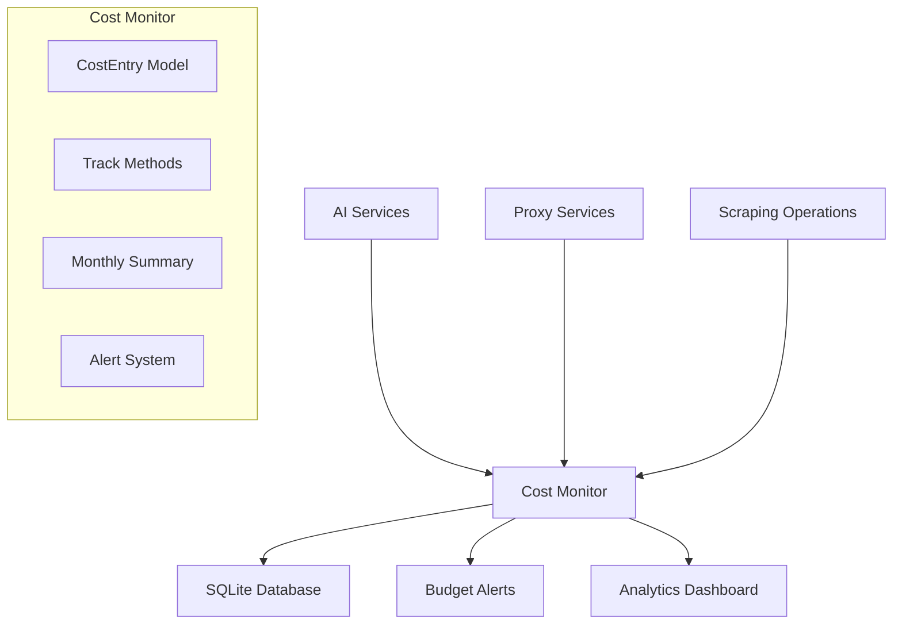

# ADR-022: Simple Cost Monitoring and Budget Management

## Metadata

**Status:** Accepted
**Version/Date:** v1.0 / 2025-08-26

## Title

Simple SQLModel-Based Cost Monitoring with $50 Monthly Budget Tracking

## Description

Implement lightweight cost monitoring using SQLModel for database operations and Streamlit caching for dashboard integration, focusing on simplicity and maintainability with a $50 monthly budget limit.

## Context

The AI job scraper application incurs operational costs from multiple services:

- AI/LLM API calls (OpenAI, Groq, local models)
- Proxy services for web scraping
- Scraping operations and infrastructure

Without cost monitoring, there is risk of unexpected expenses exceeding reasonable limits for a personal project. The application needs:

- Real-time cost tracking across service categories
- Budget alerts to prevent overspending
- Simple integration with the existing analytics dashboard
- Minimal maintenance overhead

Initial research showed complex monitoring solutions would add significant maintenance burden, while a simple SQLModel approach provides sufficient functionality with library-first implementation.

## Decision Drivers

- **Simplicity**: Minimize code complexity and maintenance overhead
- **Budget Control**: Prevent unexpected costs exceeding $50/month
- **Service Categorization**: Track costs by service type for optimization
- **Dashboard Integration**: Seamless integration with Streamlit UI
- **Library-First**: Leverage existing SQLModel and Streamlit patterns

## Alternatives

- A: **Complex Monitoring with Performance Optimization** — Pros: Advanced analytics, sys.monitoring integration / Cons: High complexity, maintenance overhead
- B: **External Service (e.g., AWS CloudWatch)** — Pros: Enterprise features, scalability / Cons: Additional costs, external dependency
- C: **Simple SQLModel with Basic Tracking** — Pros: Simple, maintainable, leverages existing patterns / Cons: Limited advanced features

### Decision Framework

| Option                    | Solution Leverage (35%) | Application Value (30%) | Maintenance (25%) | Adaptability (10%) | Total Score | Decision      |
| ------------------------- | ----------------------- | ----------------------- | ----------------- | ------------------ | ----------- | ------------- |
| **SQLModel Basic Tracking** | 9.0                     | 8.0                     | 9.5               | 7.0                | **8.6**     | ✅ **Selected** |
| Complex Performance Monitor | 6.0                     | 9.0                     | 4.0               | 8.0                | 6.4         | Rejected      |
| External CloudWatch       | 7.0                     | 7.0                     | 6.0               | 9.0                | 7.0         | Rejected      |

## Decision

We will adopt **Simple SQLModel-based Cost Monitoring** to track operational expenses with a $50 monthly budget limit. This involves using **SQLModel** for cost entry storage, **Streamlit caching** for dashboard performance, and **UTC timezone handling** throughout. This decision provides cost oversight without the complexity of advanced monitoring systems.

## High-Level Architecture



## Related Requirements

### Functional Requirements

- **FR-1:** The system must track costs for AI, proxy, and scraping services
- **FR-2:** Users must receive alerts at 80% and 100% budget utilization

### Non-Functional Requirements

- **NFR-1:** **(Maintainability)** The solution must use existing SQLModel patterns with minimal custom code
- **NFR-2:** **(Security)** The solution must operate locally with no external data sharing
- **NFR-3:** **(Performance)** Dashboard queries must be cached with 1-minute TTL

### Performance Requirements

- **PR-1:** Cost tracking operations must complete in under 100ms
- **PR-2:** Monthly summary generation must complete in under 500ms

### Integration Requirements

- **IR-1:** The solution must integrate with Streamlit caching using `@st.cache_data`
- **IR-2:** The component must support both Streamlit and non-Streamlit environments

## Related Decisions

- **ADR-019** (Analytics and Monitoring): This cost monitoring integrates with the analytics dashboard for unified reporting
- **ADR-006** (Simple Data Management): Uses the same SQLModel patterns established for job data storage

## Design

### Architecture Overview

The cost monitoring system consists of:

- `CostEntry` SQLModel for storing individual cost records
- `CostMonitor` service class for tracking and aggregation
- Service-specific tracking methods for AI, proxy, and scraping costs
- Real-time budget monitoring with threshold alerts
- Streamlit dashboard integration with caching

### Implementation Details

**In `src/services/cost_monitor.py`:**

```python
from sqlmodel import Field, Session, SQLModel, create_engine, func, select
from datetime import UTC, datetime

class CostEntry(SQLModel, table=True):
    """Simple cost tracking model for operational expenses."""
    __tablename__ = "cost_entries"
    
    id: int | None = Field(default=None, primary_key=True)
    timestamp: datetime = Field(default_factory=lambda: datetime.now(UTC), index=True)
    service: str = Field(index=True)  # "ai", "proxy", "scraping"
    operation: str  # Description of operation
    cost_usd: float  # Cost in USD
    extra_data: str = ""  # Optional JSON for details

class CostMonitor:
    """Simple cost monitoring service for $50 monthly budget."""
    
    def __init__(self, db_path: str = "costs.db"):
        self.monthly_budget = 50.0  # $50 monthly budget
        self.engine = create_engine(f"sqlite:///{db_path}")
        SQLModel.metadata.create_all(self.engine)
    
    @st.cache_data(ttl=60)  # 1-minute cache
    def get_monthly_summary(_self) -> dict[str, Any]:
        """Get current month cost breakdown and budget analysis."""
        # Implementation details in actual file
```

### Configuration

**Environment Variables:**

- Cost monitoring uses local SQLite database (no external configuration required)
- Monthly budget is hardcoded to $50 but can be modified in constructor

## Testing

**In `tests/test_cost_monitor.py`:**

```python
import pytest
from src.services.cost_monitor import CostMonitor, CostEntry

@pytest.fixture
def cost_monitor():
    """Provide test cost monitor with in-memory database."""
    return CostMonitor(db_path=":memory:")

def test_ai_cost_tracking(cost_monitor):
    """Verify AI cost tracking with proper categorization."""
    cost_monitor.track_ai_cost("gpt-4", 1000, 0.02, "job_extraction")
    summary = cost_monitor.get_monthly_summary()
    
    assert summary["costs_by_service"]["ai"] == 0.02
    assert summary["operation_counts"]["ai"] == 1

def test_budget_alerts(cost_monitor):
    """Verify budget alert thresholds trigger correctly."""
    # Track costs approaching 80% threshold
    cost_monitor.track_ai_cost("gpt-4", 20000, 40.0, "large_batch")
    alerts = cost_monitor.get_cost_alerts()
    
    assert len(alerts) > 0
    assert alerts[0]["type"] == "warning"
```

## Consequences

### Positive Outcomes

- **Simple Cost Control**: Provides essential budget monitoring with $50 monthly limit, preventing unexpected expenses
- **Service Optimization**: Cost breakdown by service (AI/proxy/scraping) enables targeted optimization efforts
- **Zero Maintenance**: Uses existing SQLModel and Streamlit patterns, requiring no additional infrastructure or dependencies
- **Real-time Alerts**: Budget alerts at 80% and 100% thresholds provide timely cost awareness
- **Dashboard Integration**: Seamless integration with analytics dashboard using consistent caching patterns

### Negative Consequences / Trade-offs

- **Limited Advanced Features**: No complex performance monitoring or predictive analytics capabilities
- **Local Storage Only**: SQLite-based storage doesn't support distributed monitoring across multiple instances
- **Manual Budget Updates**: Monthly budget limit is hardcoded and requires code changes to modify

### Ongoing Maintenance & Considerations

- **Monthly Budget Review**: Evaluate if $50 monthly budget remains appropriate based on usage patterns
- **Cost Category Analysis**: Monitor service cost breakdowns to identify optimization opportunities
- **Alert Threshold Tuning**: Adjust 80%/100% alert thresholds if they prove too sensitive or insufficient

### Dependencies

- **Python**: `sqlmodel`, `streamlit` (optional for dashboard integration)
- **Database**: SQLite for local cost storage
- **Removed**: No complex monitoring libraries or external services required

## References

- [SQLModel Documentation](https://sqlmodel.tiangolo.com/) - Database modeling patterns used for cost entries
- [Streamlit Caching Guide](https://docs.streamlit.io/develop/concepts/architecture/caching) - Caching patterns for dashboard performance
- [Python datetime with UTC](https://docs.python.org/3/library/datetime.html#datetime.datetime.now) - Timezone handling implementation

## Changelog

- **v1.0 (2025-08-26)**: Initial accepted version with 325-line SQLModel implementation, $50 monthly budget, and service categorization.
