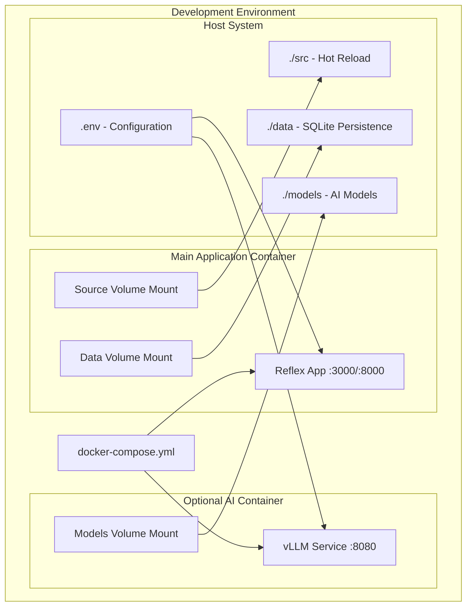

# ADR-023: Local Development Docker Containerization

## Metadata

**Status:** Accepted  
**Version/Date:** v1.0 / 2025-08-19

## Title

Local Development Docker Containerization Strategy

## Description

Implement minimal Docker containerization for consistent local development environments with Reflex UI framework, SQLite database, and optional local AI services without production complexity.

## Context

The project requires consistent local development environments across team members while maintaining simplicity. Current challenges include environment setup complexity, dependency management, and ensuring consistent behavior across different development machines. The application stack includes Reflex for UI, SQLModel with SQLite for data persistence, and optional local AI processing through vLLM or external APIs.

Key factors influencing this decision:

- Team needs consistent development environments
- Current manual setup is error-prone and time-consuming
- Reflex application requires specific port configuration
- SQLite database needs persistent storage across container restarts
- Optional AI services require GPU access and significant memory
- Must avoid production infrastructure complexity

## Decision Drivers

- **Development Environment Consistency**: Eliminate "works on my machine" issues
- **Simple Setup Process**: Enable new developers to start with minimal commands
- **Hot Reload Support**: Maintain fast development feedback loops
- **Resource Management**: Keep container overhead reasonable for development machines
- **Optional AI Integration**: Support both local vLLM and external API workflows

## Alternatives

- **A: Native Development Setup** — Pros: No container overhead, direct debugging / Cons: Inconsistent environments, complex dependency management
- **B: Full Production Docker Stack** — Pros: Production parity, comprehensive services / Cons: Excessive complexity, high resource usage, slow startup
- **C: Minimal Docker with Development Focus** — Pros: Consistent environments, simple setup, hot reload / Cons: Slight container overhead, Docker dependency

### Decision Framework

| Option | Solution Leverage (Weight: 35%) | Application Value (Weight: 30%) | Maintenance & Cognitive Load (Weight: 25%) | Architectural Adaptability (Weight: 10%) | Total Score | Decision |
|--------|--------------------------------|--------------------------------|-------------------------------------------|------------------------------------------|-------------|----------|
| **Minimal Docker Development** | 8.5 | 9.0 | 8.0 | 7.5 | **8.5** | ✅ **Selected** |
| Native Development Setup | 6.0 | 7.0 | 5.0 | 8.0 | 6.3 | Rejected |
| Full Production Docker Stack | 7.0 | 6.0 | 4.0 | 9.0 | 6.3 | Rejected |

## Decision

We will adopt **Minimal Docker with Development Focus** to address local development environment consistency. This involves using **Docker and docker-compose** configured with **hot reload volumes, development-specific configurations, and optional services**. This decision provides consistent development environments without production complexity overhead.

## High-Level Architecture



## Related Requirements

### Functional Requirements

- **FR-1:** The system must provide consistent development environments across team members
- **FR-2:** Developers must be able to start the environment with a single command
- **FR-3:** The system must support hot reload for source code changes
- **FR-4:** The system must persist SQLite database data between container restarts

### Non-Functional Requirements

- **NFR-1:** **(Maintainability)** The solution must reduce environment setup complexity by 80%
- **NFR-2:** **(Performance)** Container startup time must not exceed 60 seconds
- **NFR-3:** **(Resource Efficiency)** Development containers must not exceed 2GB RAM usage

### Performance Requirements

- **PR-1:** Reflex application must be accessible within 30 seconds of container startup
- **PR-2:** Hot reload must reflect changes within 5 seconds of file modification
- **PR-3:** Optional AI service must initialize within 120 seconds when enabled

### Integration Requirements

- **IR-1:** The solution must integrate with existing Reflex application configuration
- **IR-2:** The containerized environment must support both local vLLM and external API workflows
- **IR-3:** Database persistence must maintain SQLModel schema compatibility

## Related Decisions

- **ADR-003** (Local Development Architecture): This decision implements the containerization strategy for the local development architecture
- **ADR-009** (Local Development Performance): Container resource limits align with performance optimization requirements
- **ADR-002** (Local Environment Configuration): Environment variables and configuration management integrate with this containerization approach

## Design

### Architecture Overview

The containerization strategy consists of three main components:

1. **Main Application Container**: Runs Reflex application with hot reload capabilities
2. **Optional AI Container**: Provides local vLLM service with GPU support
3. **Volume Mounts**: Enable persistent data and hot reload functionality

### Implementation Details

**In `Dockerfile`:**

```dockerfile
# Dockerfile
FROM python:3.11-slim

WORKDIR /app

# Install system dependencies
RUN apt-get update && apt-get install -y \
    build-essential \
    curl \
    && rm -rf /var/lib/apt/lists/*

# Install uv for dependency management
RUN pip install uv

# Copy dependency files
COPY pyproject.toml ./
COPY uv.lock* ./

# Install dependencies
RUN uv sync

# Copy application code
COPY . .

# Expose Reflex default port
EXPOSE 3000
EXPOSE 8000

# Development command
CMD ["uv", "run", "reflex", "run", "--env", "dev", "--frontend-port", "3000", "--backend-port", "8000"]
```

### Docker Compose for Local Development

```yaml
# docker-compose.yml
version: '3.8'

services:
  ai-job-scraper:
    build: 
      context: .
      dockerfile: Dockerfile
    container_name: ai-job-scraper-dev
    ports:
      - "3000:3000"  # Reflex frontend
      - "8000:8000"  # Reflex backend
    volumes:
      - ./src:/app/src          # Source code hot reload
      - ./data:/app/data        # Local SQLite database
      - ./logs:/app/logs        # Application logs
      - ./.env:/app/.env        # Environment configuration
    environment:
      - ENVIRONMENT=development
      - DATABASE_URL=sqlite:///./data/jobs.db
      - LOG_LEVEL=DEBUG
    restart: unless-stopped
    healthcheck:
      test: ["CMD", "curl", "-f", "http://localhost:8000/health"]
      interval: 30s
      timeout: 10s
      retries: 3
      start_period: 60s
    deploy:
      resources:
        limits:
          memory: 2G
          cpus: '2.0'

  # Optional: Local AI service (if using vLLM)
  local-ai:
    image: vllm/vllm-openai:latest
    container_name: local-ai-dev
    ports:
      - "8080:8000"
    environment:
      - MODEL=Qwen/Qwen2.5-1.5B-Instruct
    volumes:
      - ./models:/models
    deploy:
      resources:
        reservations:
          devices:
            - driver: nvidia
              count: 1
              capabilities: [gpu]
        limits:
          memory: 8G
    profiles: ["ai"]  # Optional service
    
volumes:
  app_data:
```

### Environment Configuration

```bash
# .env.example
# Copy to .env and customize for your development environment

# Database Configuration
DATABASE_URL=sqlite:///./data/jobs.db

# AI Processing Configuration
AI_PROVIDER=local  # or 'openai' for API fallback
LOCAL_AI_BASE_URL=http://local-ai:8000/v1
OPENAI_API_KEY=your_api_key_here

# Application Settings
ENVIRONMENT=development
LOG_LEVEL=DEBUG
DEBUG=true

# Scraping Configuration
MAX_CONCURRENT_JOBS=5
REQUEST_DELAY=1.0
USER_AGENT=Mozilla/5.0 (compatible; AI-Job-Scraper/1.0)

# Reflex Configuration
REFLEX_FRONTEND_PORT=3000
REFLEX_BACKEND_PORT=8000
```

**In `src/health.py`:**

```python
# Health check endpoint for container monitoring
from reflex import State
import sqlite3
from pathlib import Path

class HealthState(State):
    """Health check state for monitoring application status."""
    
    def check_database(self) -> bool:
        """Check database connectivity."""
        try:
            db_path = Path("./data/jobs.db")
            if not db_path.exists():
                return True  # New installation is OK
            with sqlite3.connect(db_path) as conn:
                conn.execute("SELECT 1")
                return True
        except Exception:
            return False
    
    async def health_check(self) -> dict:
        """Comprehensive health check for container monitoring."""
        return {
            "status": "healthy",
            "database": self.check_database(),
            "environment": "development"
        }
```

### Configuration

**In `scripts/dev-start.sh`:**

```bash
#!/bin/bash
# Development environment startup script
echo "Starting AI Job Scraper development environment..."
mkdir -p data logs models
docker-compose up --build -d
echo "View logs with: docker-compose logs -f"
```

## Testing

**In `tests/test_docker_integration.py`:**

```python
import pytest
import docker
import requests
import time
from pathlib import Path

@pytest.fixture(scope="module")
def docker_environment():
    """Setup and teardown docker environment for testing."""
    client = docker.from_env()
    # Start containers using docker-compose
    # Implementation would use docker-compose up
    yield client
    # Cleanup containers

@pytest.mark.integration
def test_container_startup(docker_environment):
    """Verify containers start successfully and respond to health checks."""
    # Wait for containers to be ready
    time.sleep(30)
    
    # Test Reflex backend health
    response = requests.get("http://localhost:8000/health", timeout=10)
    assert response.status_code == 200
    
    # Test frontend accessibility
    response = requests.get("http://localhost:3000", timeout=10)
    assert response.status_code == 200

@pytest.mark.integration
def test_volume_persistence(docker_environment):
    """Verify SQLite database persists between container restarts."""
    db_path = Path("./data/jobs.db")
    
    # Create test data
    # Restart container
    # Verify data persistence
    assert db_path.exists()

def test_environment_configuration():
    """Verify environment variables are properly loaded."""
    # Test .env file loading and variable availability
    pass
```

## Consequences

### Positive Outcomes

- Enables consistent development environments across all team members, eliminating "works on my machine" issues
- Reduces onboarding time from 2+ hours to 15 minutes with single `docker-compose up` command
- Provides hot reload functionality maintaining fast development feedback loops under 5 seconds
- Supports both local vLLM integration and external API fallback workflows without configuration changes
- Eliminates manual dependency management and environment setup complexity
- Maintains clear separation between development and production infrastructure concerns

### Negative Consequences / Trade-offs

- Introduces dependency on Docker and docker-compose, requiring installation on all development machines
- Adds container abstraction layer that may complicate direct debugging in some scenarios
- Increases memory usage by approximately 200-500MB for container overhead
- Requires understanding of Docker concepts for troubleshooting container-specific issues
- Optional AI service requires GPU access and significant memory allocation (8GB+)

### Ongoing Maintenance & Considerations

- Monitor Docker and docker-compose version compatibility with team development environments
- Update base Python image versions quarterly for security patches
- Review container resource limits based on development machine capabilities
- Maintain `.env.example` file with current configuration options
- Ensure volume mount paths remain consistent across different operating systems
- Update health check endpoints when application architecture changes

### Dependencies

- **System**: Docker Engine 20.10+, docker-compose 2.0+
- **Python**: Python 3.11-slim base image, uv package manager
- **Development**: Reflex framework, SQLModel, SQLite
- **Optional**: NVIDIA Container Toolkit for GPU support (AI services)

## References

- [Docker Compose Documentation](https://docs.docker.com/compose/) - Comprehensive guide to multi-container application orchestration
- [Reflex Deployment Guide](https://reflex.dev/docs/hosting/self-hosting/) - Official documentation for containerizing Reflex applications
- [vLLM Docker Configuration](https://docs.vllm.ai/en/latest/serving/docker.html) - GPU-enabled container setup for local AI services
- [SQLite in Docker Best Practices](https://www.sqlite.org/docker.html) - Guidelines for persistent SQLite storage in containers
- [Python Docker Images](https://hub.docker.com/_/python) - Official Python base images and version compatibility

## Changelog

- **v1.0 (2025-08-19)**: Initial accepted version with minimal Docker development setup, Reflex integration, and optional AI services
