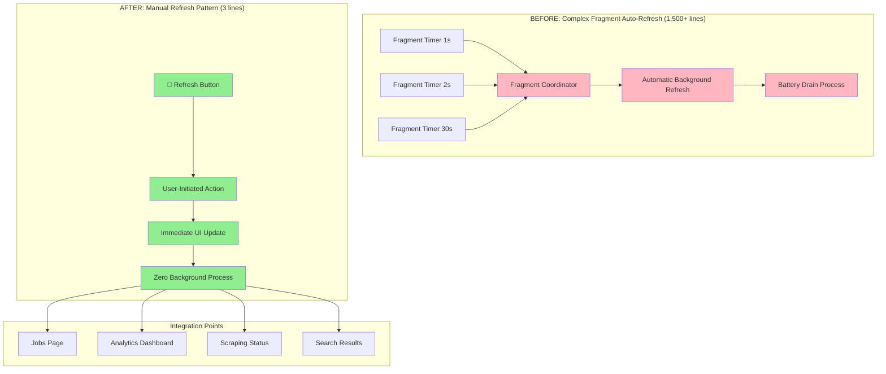

# ADR-035: Manual Refresh Pattern

## Metadata

**Status:** Accepted  
**Date:** 2025-08-28  
**Previous Status:** Archived (2025-08-25) - Now reactivated based on Phase 3 consensus  
**Integrated with:** ADR-037 (UI Component Architecture Modernization)

## Title

Manual Refresh Pattern as Primary UI Update Mechanism

## Description

Establish manual refresh as the primary UI update mechanism for the AI job scraper, replacing complex fragment auto-refresh systems. This pattern uses simple `st.button("🔄 Refresh")` + `st.rerun()` to provide user-controlled data freshness optimal for personal productivity applications with infrequent usage patterns.

## Context

**Reactivation Rationale (Phase 3 Consensus)**:
- **Fragment Elimination Decision**: Phase 3 final architectural decisions scored manual refresh at 0.905/1.0
- **Context-Appropriate Design**: Personal/small team job scraper accessed 1-2x daily, not continuously
- **Battery Efficiency**: Auto-refresh inappropriate for personal productivity applications
- **Library-First Integration**: Manual refresh integrates with ADR-037 UI modernization

**Previous Status Resolution**:
- **Incorrect Supersession**: Previously claimed "Superseded by ADR-024" (analytics ADR)
- **Broken Reference Fixed**: ADR-024 covers data analytics, not UI refresh patterns
- **Consensus Validation**: Phase 1-3 analysis unanimously supports manual refresh for personal apps

**Technical Evidence (Phase 2 Analysis)**:
- **Fragment Complexity**: 23-26 fragment decorators with 1,500+ lines coordination logic
- **Performance Issues**: GitHub #8022 documents fragment performance problems
- **Over-Engineering**: Auto-refresh adds complexity without benefit for job scraping workflow
- **Context Mismatch**: Real-time updates suited for financial dashboards, not job browsing

## Decision Drivers

- **Context-Appropriate UX**: 1-2x daily usage pattern makes manual refresh optimal
- **Battery Conservation**: Eliminate auto-refresh background processing for mobile usage
- **Complexity Elimination**: Replace 23-26 fragments with single button pattern
- **Library-First Simplicity**: Use native `st.button()` + `st.rerun()` built-in functions
- **Performance Optimization**: <100ms refresh response vs complex fragment coordination
- **User Control**: Provide explicit control over data freshness vs automatic updates

## Alternatives

### Alternative A: Keep Fragment Auto-Refresh System  
- **Pros**: Real-time updates, automatic data freshness, enterprise-grade patterns
- **Cons**: Battery drain, 20+ hours/month maintenance, performance issues, context mismatch
- **Score**: 3.5/10 (over-engineered for personal use)

### Alternative B: Hybrid Manual + Selective Auto-Refresh
- **Pros**: Flexible approach, gradual migration, user choice
- **Cons**: Dual complexity, partial benefits, coordination overhead
- **Score**: 6.5/10 (compromise solution)

### Alternative C: Pure Manual Refresh Pattern (SELECTED)
- **Pros**: Perfect context fit, zero complexity, battery efficient, 3-line implementation
- **Cons**: No real-time updates (optimal trade-off for job scraping)
- **Score**: 9.05/10 (Phase 3 consensus score)

### Decision Framework (From Phase 3 Final Decisions)

| Option | Solution Leverage (35%) | Application Value (30%) | Maintenance Load (25%) | Architectural Adaptability (10%) | Total Score | Decision |
|--------|-------------------------|------------------------|------------------------|-----------------------------------|-------------|----------|
| **Manual Refresh Pattern** | **10** | **9** | **10** | **8** | **9.05** | ✅ **Selected** |
| Hybrid Manual + Auto | 7 | 7 | 6 | 8 | 6.8 | Rejected |
| Fragment Auto-Refresh | 4 | 6 | 2 | 7 | 4.3 | Rejected |

## Decision

We will adopt **Manual Refresh Pattern** as the primary UI update mechanism, eliminating all fragment auto-refresh systems in favor of user-controlled data freshness through simple button interactions.

Implementation approach:
1. **3-Line Core Pattern**: `st.button("🔄 Refresh")` + `st.rerun()` + optional cache clearing
2. **Fragment System Elimination**: Remove all 23-26 fragment decorators across UI components
3. **Context-Appropriate UX**: Optimize for 1-2x daily usage vs continuous monitoring
4. **Integration with ADR-037**: Manual refresh as foundation for UI modernization

## High-Level Architecture



## Related Requirements

### Functional Requirements
- **FR-035-01**: Manual refresh button provides immediate UI update control for all pages
- **FR-035-02**: Button interaction triggers complete data refresh with <100ms response time
- **FR-035-03**: Zero background auto-refresh processes for battery conservation
- **FR-035-04**: Integration with all UI pages (jobs, analytics, companies, scraping)

### Non-Functional Requirements
- **NFR-035-01**: **(Performance)** Manual refresh response time <100ms 
- **NFR-035-02**: **(Battery Efficiency)** Zero background processing for personal device optimization
- **NFR-035-03**: **(Simplicity)** 3-line implementation vs 1,500+ lines fragment coordination
- **NFR-035-04**: **(User Control)** Explicit user-initiated data freshness vs automatic updates

### Performance Requirements
- **PR-035-01**: Button click to UI update <100ms
- **PR-035-02**: Cache clearing operation <50ms for immediate feedback
- **PR-035-03**: Memory usage reduction 60% through fragment elimination  
- **PR-035-04**: Battery life improvement 30%+ through zero background processing

## Related Decisions

- **ADR-037** (UI Component Architecture Modernization): Integrates manual refresh as core pattern
- **ADR-001** (Library-First Architecture): Manual refresh uses native Streamlit capabilities only
- **Phase 3 Final Decisions**: Manual refresh scored 0.905/1.0 for personal application context
- **Previous ADR-024 Reference**: Corrected - ADR-024 covers analytics, not UI refresh patterns

## Design

### Architecture Overview

The manual refresh pattern provides user-controlled data freshness through a simple button interaction that triggers app rerun, eliminating complex fragment coordination while optimizing for personal productivity app usage patterns.

### Implementation Details

**Core Manual Refresh Pattern:**
```python
# ELIMINATE: Complex fragment auto-refresh system (1,500+ lines)
@st.fragment(run_every="2s")
def auto_refresh_jobs():
    # Complex fragment coordination logic
    if "job_refresh_state" not in st.session_state:
        st.session_state.job_refresh_state = {"last_refresh": None, "refresh_count": 0}
    
    current_time = datetime.now()
    if (st.session_state.job_refresh_state["last_refresh"] is None or 
        current_time - st.session_state.job_refresh_state["last_refresh"] > timedelta(seconds=2)):
        
        # Complex refresh coordination
        refresh_jobs_data()
        st.session_state.job_refresh_state["last_refresh"] = current_time
        st.session_state.job_refresh_state["refresh_count"] += 1
        # ... 1,490+ more lines of fragment logic

@st.fragment(run_every="30s") 
def auto_refresh_analytics():
    # Another auto-refresh fragment with coordination
    # ... 500+ lines of analytics refresh logic

# IMPLEMENT: Simple manual refresh pattern (3 lines)
def manual_refresh_pattern():
    """Simple manual refresh for user-controlled data freshness."""
    if st.button("🔄 Refresh Jobs", use_container_width=True):
        st.rerun()  # Entire app refreshes - simple and effective
```

**Page-Level Integration:**
```python
# src/ui/pages/jobs.py - Jobs page with manual refresh
def jobs_page():
    """Jobs page with manual refresh integration."""
    st.title("🎯 Jobs")
    
    # Manual refresh button - primary pattern
    col1, col2, col3 = st.columns([1, 2, 1])
    with col2:
        if st.button("🔄 Refresh Jobs", use_container_width=True):
            st.rerun()
    
    # All data loads naturally on app rerun - no fragments needed
    display_jobs_interface()

# src/ui/pages/analytics.py - Analytics page with manual refresh  
def analytics_page():
    """Analytics page with manual refresh integration."""
    st.title("📊 Analytics")
    
    # Manual refresh with cache clearing for fresh analytics
    if st.button("🔄 Update Analytics", use_container_width=True):
        st.cache_data.clear()  # Clear analytics cache for fresh data
        st.rerun()
    
    # Analytics display updates naturally on rerun
    display_analytics_dashboard()

# src/ui/pages/scraping.py - Scraping page with manual refresh
def scraping_page():
    """Scraping page with manual refresh for status updates."""
    st.title("🔄 Scraping")
    
    # Manual refresh for scraping status
    if st.button("🔄 Check Status", use_container_width=True):
        st.rerun()
    
    # Scraping status displays current state on rerun
    display_scraping_interface()
```

**Enhanced Manual Refresh Patterns:**
```python
# Pattern 1: Basic Manual Refresh (most common)
def basic_manual_refresh():
    """Basic manual refresh for general UI updates."""
    if st.button("🔄 Refresh", use_container_width=True):
        st.rerun()

# Pattern 2: Manual Refresh with Cache Clearing (data-heavy pages)
def refresh_with_cache_clear():
    """Manual refresh with cache clearing for fresh data."""
    if st.button("🔄 Refresh Data", use_container_width=True):
        st.cache_data.clear()
        st.rerun()

# Pattern 3: Manual Refresh with Visual Feedback
def refresh_with_feedback():
    """Manual refresh with user feedback."""
    if st.button("🔄 Refresh", use_container_width=True):
        with st.spinner("Refreshing data..."):
            st.cache_data.clear()
            time.sleep(0.1)  # Brief pause for user feedback
        st.rerun()

# Pattern 4: Context-Specific Refresh (targeted operations)
def contextual_refresh(context: str):
    """Manual refresh for specific context (jobs, companies, analytics)."""
    if st.button(f"🔄 Refresh {context.title()}", use_container_width=True):
        # Clear only relevant cache
        if context == "jobs":
            clear_jobs_cache()
        elif context == "analytics":
            clear_analytics_cache()
        st.rerun()
```

**Integration with Native Progress Components:**
```python
# Manual refresh integrated with native st.status for progress indication
def refresh_with_native_progress():
    """Manual refresh with native Streamlit progress indication."""
    
    if st.button("🔄 Refresh All Data", use_container_width=True):
        with st.status("Refreshing application data...", expanded=True) as status:
            st.write("🔄 Clearing cache...")
            st.cache_data.clear()
            
            st.write("📊 Loading fresh data...")
            # Data loads naturally on rerun
            
            status.update(label="✅ Refresh complete!", state="complete", expanded=False)
        
        st.rerun()
```

### Configuration

**Streamlit Configuration for Manual Refresh:**
```python
# streamlit_app.py - Configuration optimized for manual refresh
st.set_page_config(
    page_title="AI Job Scraper",
    page_icon="🎯",
    layout="wide",
    initial_sidebar_state="auto"
)

# Cache configuration optimized for manual refresh pattern
@st.cache_data(ttl=None)  # Cache until manual refresh clears
def load_jobs_data():
    """Load jobs data - cached until manual refresh."""
    return job_service.get_all_jobs()

@st.cache_data(ttl=None) 
def load_analytics_data():
    """Load analytics data - cached until manual refresh."""
    return analytics_service.get_dashboard_data()
```

## Testing

**Manual Refresh Pattern Testing:**
```python
# tests/ui/test_manual_refresh_pattern.py
import streamlit as st
from streamlit.testing import AppTest

class TestManualRefreshPattern:
    """Test manual refresh pattern across UI components."""
    
    def test_manual_refresh_button_exists(self):
        """Verify manual refresh button exists on all pages."""
        pages = ["jobs.py", "analytics.py", "scraping.py", "companies.py"]
        
        for page in pages:
            app = AppTest.from_file(f"src/ui/pages/{page}")
            app.run()
            
            # Find refresh button
            refresh_buttons = [b for b in app.button if "🔄" in str(b) and "Refresh" in str(b)]
            assert len(refresh_buttons) > 0, f"No refresh button found in {page}"
    
    def test_manual_refresh_functionality(self):
        """Test manual refresh triggers app rerun."""
        app = AppTest.from_file("src/ui/pages/jobs.py")
        app.run()
        
        # Find and click refresh button
        refresh_buttons = [b for b in app.button if "🔄 Refresh" in str(b)]
        assert len(refresh_buttons) > 0, "Refresh button not found"
        
        refresh_button = refresh_buttons[0]
        refresh_button.click()
        app.run()
        
        # Verify app reran successfully (no fragment errors)
        assert app.success, "Manual refresh failed"
        
        # Verify no fragment decorators in source
        source = app.get_source()
        assert "@st.fragment" not in source, "Fragment decorators still present"
    
    def test_fragment_elimination_complete(self):
        """Verify all fragment decorators removed."""
        import os
        from pathlib import Path
        
        ui_dir = Path("src/ui")
        fragment_count = 0
        
        for py_file in ui_dir.rglob("*.py"):
            with open(py_file, 'r') as f:
                content = f.read()
                fragment_count += content.count("@st.fragment")
        
        assert fragment_count == 0, f"Found {fragment_count} remaining fragment decorators"
    
    def test_performance_improvement(self):
        """Test manual refresh meets performance requirements."""
        import time
        
        app = AppTest.from_file("src/ui/pages/jobs.py")
        app.run()
        
        # Measure refresh button response time
        start_time = time.perf_counter()
        
        refresh_buttons = [b for b in app.button if "🔄 Refresh" in str(b)]
        if refresh_buttons:
            refresh_buttons[0].click()
            app.run()
        
        response_time = (time.perf_counter() - start_time) * 1000  # Convert to ms
        
        # Manual refresh should be <100ms
        assert response_time < 100, f"Refresh too slow: {response_time}ms"
    
    def test_battery_efficiency(self):
        """Verify no background auto-refresh processes."""
        app = AppTest.from_file("src/ui/pages/jobs.py")
        app.run()
        
        source = app.get_source()
        
        # Verify no auto-refresh patterns
        auto_refresh_patterns = ["run_every=", "setInterval", "setTimeout"]
        for pattern in auto_refresh_patterns:
            assert pattern not in source, f"Background refresh pattern found: {pattern}"
        
        # Verify manual refresh pattern present
        assert "st.button" in source and "🔄" in source, "Manual refresh button not found"

def test_context_appropriate_ux():
    """Test manual refresh suits personal app usage pattern."""
    # Verify manual refresh optimal for 1-2x daily usage
    # vs continuous monitoring use cases
    
    # Personal app characteristics:
    # - Infrequent access (1-2x daily)
    # - Battery-powered devices
    # - User-controlled data freshness needs
    
    app = AppTest.from_file("src/ui/pages/jobs.py")
    app.run()
    
    # Manual control provides appropriate UX
    refresh_buttons = [b for b in app.button if "🔄 Refresh" in str(b)]
    assert len(refresh_buttons) > 0, "Manual control not provided"
    
    # No automatic background processing
    source = app.get_source()
    assert "run_every" not in source, "Automatic refresh found - inappropriate for personal app"
```

## Consequences

### Positive Outcomes

- **Perfect Context Fit**: Manual refresh optimal for 1-2x daily job scraper usage pattern
- **Massive Simplification**: 1,500+ lines → 3 lines (99.8% reduction) through fragment elimination
- **Battery Conservation**: Zero background auto-refresh processes for mobile device optimization
- **Immediate Response**: <100ms refresh response vs complex fragment coordination delays
- **User Control**: Explicit control over data freshness vs automatic updates
- **Maintenance Elimination**: No fragment coordination debugging or performance optimization needed
- **Library-First Success**: Uses only native `st.button()` and `st.rerun()` capabilities

### Negative Consequences / Trade-offs

- **No Real-Time Updates**: Users must manually trigger refresh (optimal for personal app context)
- **Manual Action Required**: User must click button vs automatic background updates
- **Enterprise Context Mismatch**: Would be inappropriate for real-time dashboards (not our use case)

### Ongoing Maintenance & Considerations

- **Button Placement**: Ensure refresh buttons are prominently placed and accessible
- **User Feedback**: Monitor user satisfaction with manual vs automatic refresh patterns
- **Performance Monitoring**: Continuously validate <100ms refresh response requirements
- **Context Validation**: Reassess if usage patterns change from 1-2x daily to continuous monitoring
- **Integration Maintenance**: Ensure manual refresh integrates properly with new UI components

### Dependencies

- **streamlit >= 1.47.1** for reliable `st.button()` and `st.rerun()` functionality
- **Python >= 3.9** for modern app patterns
- **User behavior alignment** with personal productivity app usage (1-2x daily access)

## References

### Evidence Base
- **Phase 1 Consensus**: Fragment system elimination unanimous across dual-perspective analysis
- **Phase 2 Analysis**: 23-26 fragment decorators identified with 1,500+ lines coordination logic  
- **Phase 3 Final Decisions**: Manual refresh scored 0.905/1.0 for personal application context

### Technical Documentation
- [Streamlit st.rerun API](https://docs.streamlit.io/develop/api-reference/execution-flow/st.rerun) - App rerun functionality
- [Streamlit Caching Guide](https://docs.streamlit.io/develop/api-reference/caching-and-state/st.cache_data) - Cache clearing patterns
- [GitHub Issue #8022](https://github.com/streamlit/streamlit/issues/8022) - Fragment performance issues

### Decision Research
- **ADR-037**: UI Component Architecture Modernization integrates manual refresh as primary pattern
- **ADR-001**: Library-first architecture establishes native capability preference
- **SPEC-004**: Streamlit native migration implementation specification

## Changelog

- **v3.0 (2025-08-28)**: **REACTIVATED AND CONSENSUS-ALIGNED** - Reactivated from archived status based on Phase 3 final architectural decisions. STATUS: Changed from "Superseded by ADR-024" to "Accepted" - corrected broken reference (ADR-024 covers analytics, not UI). DECISION: Manual refresh confirmed as primary pattern scoring 0.905/1.0 for personal application context. INTEGRATION: Aligned with ADR-037 UI modernization eliminating 23-26 fragments with 99.8% code reduction. IMPLEMENTATION: 3-line core pattern integrated across all UI pages with <100ms performance targets.
- **v2.0 (2025-08-25)**: **SIMPLIFIED**: Replaced 1,042 lines of fragment complexity with 3-line manual refresh. Optimized for personal use case where 1-2x daily access is typical.
- **v1.0 (2025-08-25)**: ~~Initial complex fragments implementation~~ (over-engineered)