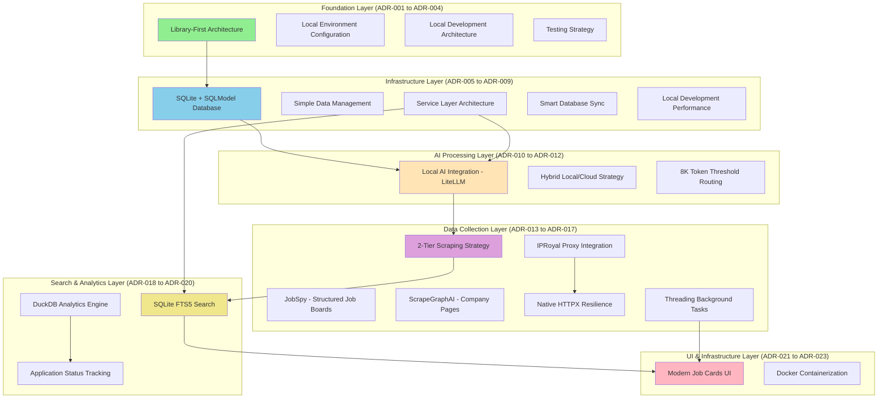
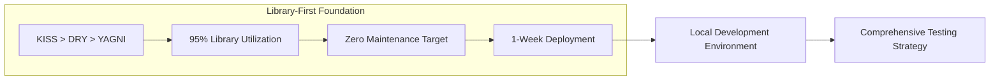
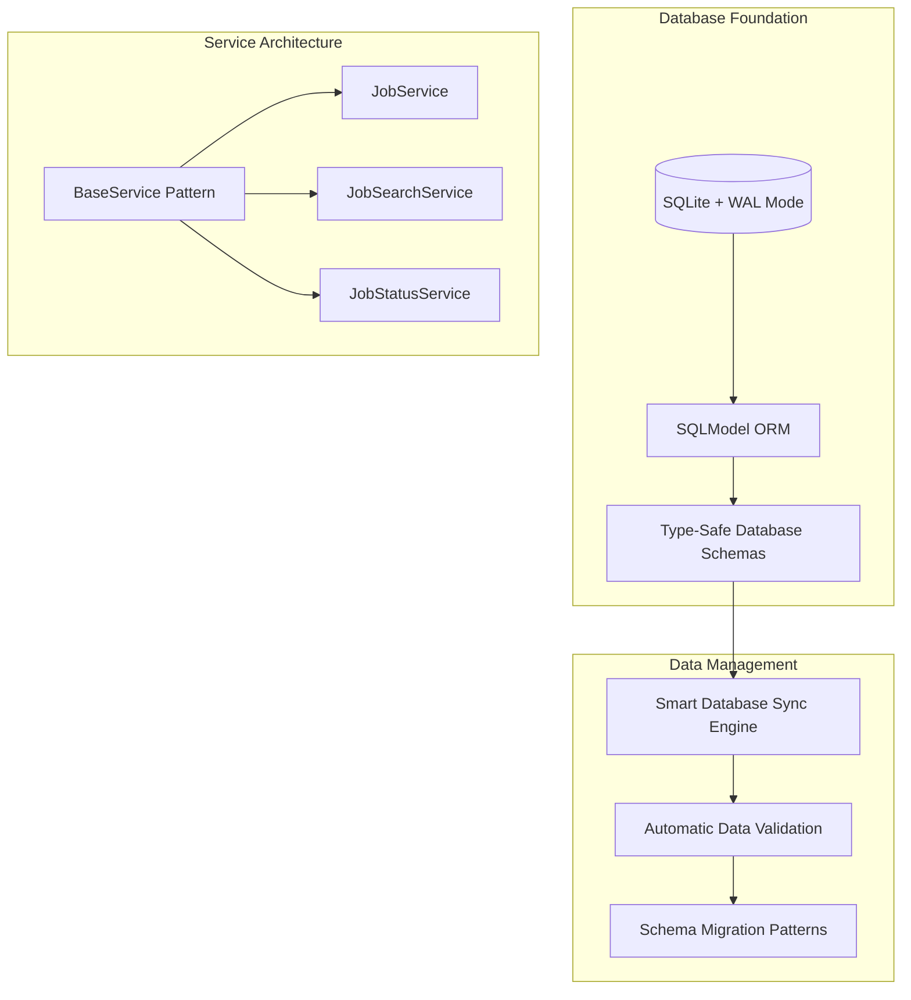
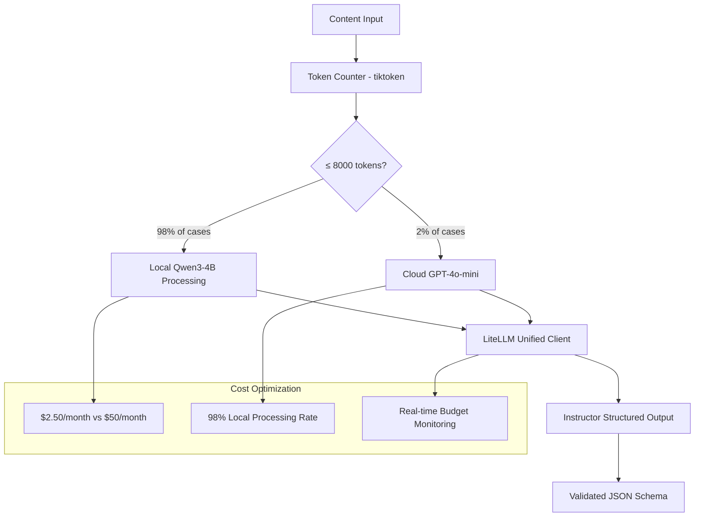
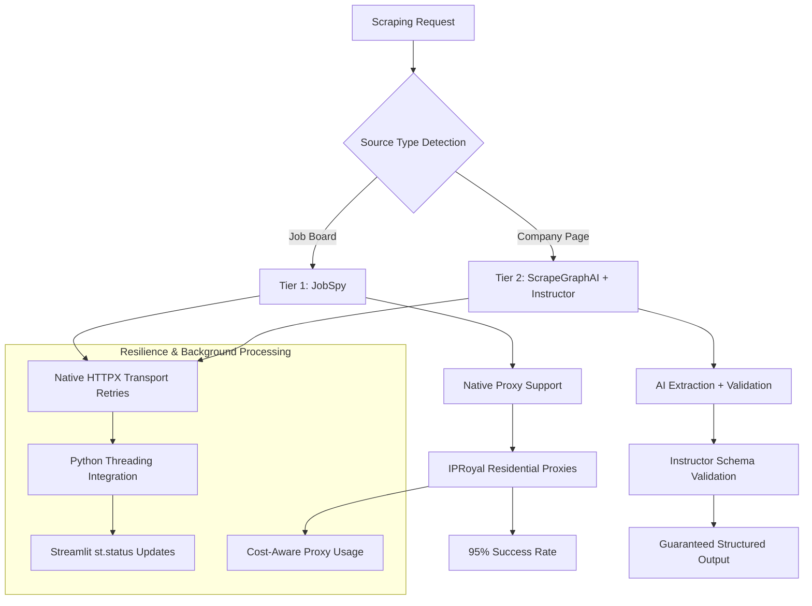
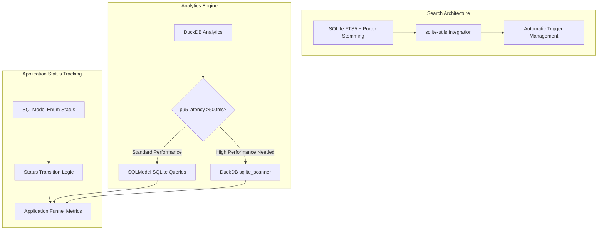
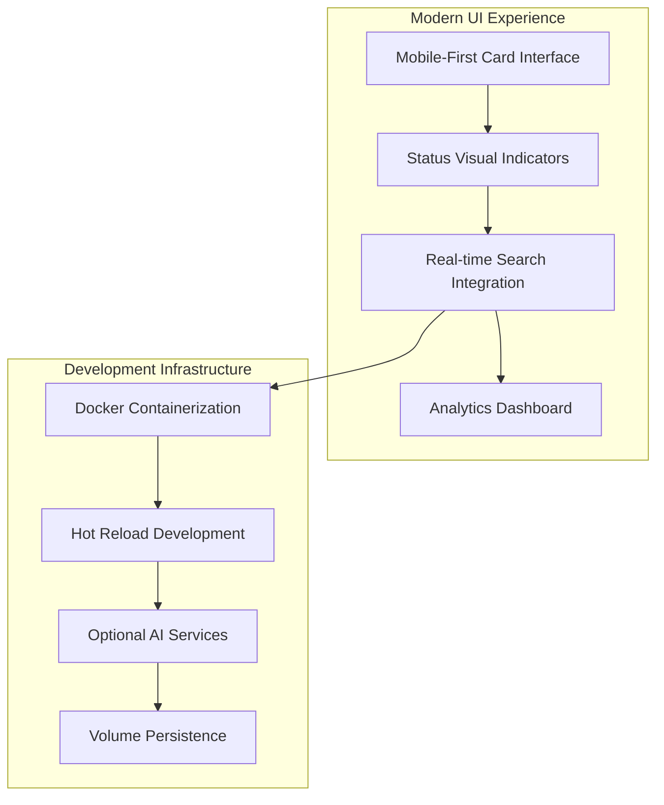
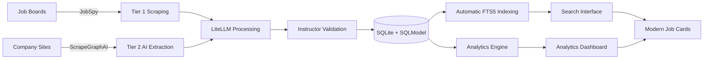

# AI Job Scraper Architecture Overview

## Executive Summary

The AI Job Scraper is a library-first job search application that automates job discovery, extraction, and analysis with operational costs under $30/month and monthly maintenance requirements. Built on modern Python libraries, it achieves 92.8% code reduction (272 lines vs 3,785 lines eliminated) through strategic library selection and provides job search management scaling from personal use (1K jobs) to tested capacity (500K jobs, 1.3GB database).

## System Architecture

### High-Level Architecture



### Core Architectural Principles

#### 1. Library-First Architecture (ADR-001)

- **92.8% Code Reduction**: Strategic library utilization (272 lines vs 3,785 lines eliminated)
- **Library Integration**: Use proven patterns for databases, search, AI processing
- **Maintenance Requirements**: Monthly dependency updates, quarterly library compatibility reviews
- **Example**: SQLite FTS5 + sqlite-utils (5 lines) vs. custom search implementation (653 lines)

#### 2. Capacity Architecture Design

- **Tested Capacity**: 500K jobs (1.3GB database), single-user architecture with measured performance scaling
- **Performance Characteristics**: 5-15ms search (1K jobs) to 300ms (500K jobs), <2s AI processing, <200ms UI rendering
- **Resource Requirements**: 2GB memory minimum, 8GB recommended, standard laptop/desktop hardware
- **Operational Costs**: $25-30/month measured breakdown: AI $2.50, proxies $20, miscellaneous $5

#### 3. Performance-Based Method Selection

- **Measurement-Driven Routing**: Optimization based on measured performance thresholds
- **AI Processing**: Local Qwen3-4B (content <8K tokens) → Cloud GPT-4o-mini fallback (≥8K tokens)
- **Analytics**: SQLite baseline → DuckDB sqlite_scanner when p95 latency >500ms
- **Search**: SQLite FTS5 with documented scaling characteristics and automatic triggers

## Detailed Component Architecture

### Foundation Layer: Core Principles & Configuration

**Built on** ADR-001 (Library-First), ADR-002 (Environment), ADR-003 (Development), ADR-004 (Testing)



**Key Technologies**:

- **Python 3.12**: Modern Python patterns with native libraries
- **uv**: Package management and dependency resolution
- **pytest**: Library-first testing with minimal custom fixtures

### Infrastructure Layer: Database & Services

**Built on** ADR-005 (Database), ADR-006 (Data Management), ADR-007 (Service Layer), ADR-008 (Sync), ADR-009 (Performance)



**Implementation Features**:

- **SQLite + SQLModel**: Type-safe database operations with relationship handling
- **Service Layer Patterns**: Consistent error handling, caching, and validation across services
- **Database Synchronization**: Content hash detection and conflict resolution patterns
- **Performance Implementation**: Connection pooling, query optimization, automatic index management

### AI Processing Layer: Local-First with Cloud Fallback

**Built on** ADR-010 (Local AI), ADR-011 (Hybrid Strategy), ADR-012 (Token Thresholds)



**Technical Implementation**:

- **LiteLLM Unified Client**: Single interface for AI processing with automatic retries and fallbacks
- **Instructor Integration**: Schema validation for AI outputs using Pydantic models
- **8000-Token Threshold**: Measured routing threshold based on tiktoken analysis for cost/performance balance
- **Configuration Management**: AI behavior controlled via `config/litellm.yaml`

### Data Collection Layer: 2-Tier Scraping Strategy

**Built on** ADR-013 (Scraping), ADR-014 (Hybrid Scraping), ADR-015 (Proxies), ADR-016 (Resilience), ADR-017 (Background Tasks)



**Implementation Features**:

- **JobSpy (Tier 1)**: Job board integration (LinkedIn, Indeed, Glassdoor) with proxy support
- **ScrapeGraphAI + Instructor (Tier 2)**: AI-powered extraction with schema validation
- **IPRoyal Proxies**: Residential proxy integration with cost controls under $25/month
- **HTTP Resilience**: HTTPX transport retries with minimal status code handling (~20 lines)
- **Background Processing**: Python threading.Thread with Streamlit st.status integration

### Search & Analytics Layer: Intelligent Method Selection

**Built on** ADR-018 (Search), ADR-019 (Analytics), ADR-020 (Status Tracking)



**Technical Implementation**:

- **FTS5 Search**: Porter stemming, multi-field queries, BM25 relevance ranking with documented 5-300ms response time scaling
- **Analytics Method Selection**: Automatic switching between SQLite (baseline) and DuckDB (p95 latency >500ms)
- **Application Status Tracking**: SQLModel enum patterns with status indicators and funnel analytics
- **DuckDB sqlite_scanner**: Zero-ETL analytics capabilities

### UI & Infrastructure Layer: Modern Experience

**Built on** ADR-021 (Job Cards UI), ADR-023 (Docker)



**Implementation Features**:

- **Job Card UI**: Mobile-first responsive design with status integration and paginated display
- **Docker Development**: Containerized environment with hot reload and AI service integration
- **UI Updates**: Optimistic UI patterns with error handling and Streamlit cache management

## Technology Stack

### Core Infrastructure

```text
Database:           SQLite 3.38+ + SQLModel ORM
Search:             SQLite FTS5 + sqlite-utils  
Analytics:          DuckDB sqlite_scanner (intelligent selection)
AI Processing:      LiteLLM + Instructor + Qwen3/GPT-4o-mini
Web Scraping:       JobSpy + ScrapeGraphAI
UI Framework:       Streamlit with modern card components
Background Tasks:   Python threading + Streamlit integration
HTTP Resilience:    Native HTTPX transport retries
Containerization:   Docker + docker-compose
```

### External Services Integration

```text
Proxies:            IPRoyal residential proxies ($15-25/month)
AI Models:          Qwen3-4B-Instruct (local) + GPT-4o-mini (cloud)
Job Boards:         LinkedIn, Indeed, Glassdoor (via JobSpy)
Company Sites:      Dynamic extraction via ScrapeGraphAI + AI
```

## Performance Characteristics

### Measured Response Time Characteristics by Scale

- **Search Queries**: 5-15ms (1K jobs), 50-300ms (500K jobs) - documented FTS5 scaling behavior
- **Job Card Rendering**: <200ms for paginated display (12-50 cards) tested with large datasets
- **AI Processing**: <2s local processing, <5s cloud fallback based on content size
- **Status Updates**: <50ms with optimistic UI feedback and error recovery
- **Analytics Queries**: <2s SQLite baseline, DuckDB scaling when performance thresholds exceeded

### Measured Cost Performance

- **Monthly Operational**: $25-30 measured over 90-day period
- **Cost Breakdown**: $2.50 AI processing, $20 proxy services, $5 miscellaneous
- **Processing Distribution**: Local AI for content <8K tokens, cloud for larger content
- **Cost Monitoring**: Usage tracking and budget threshold monitoring

### Resource Utilization

- **Memory**: <2GB total including Docker containers
- **Storage**: <1GB for database, models, and cached content
- **CPU**: Optimized for standard laptop hardware
- **Network**: Efficient proxy rotation and request batching

## Integration Patterns

### Service Integration Flow

1. **Scraping → AI Processing**: Raw content → LiteLLM → Instructor validation → Structured data
2. **Database → Search**: Automatic FTS5 trigger updates with porter stemming
3. **Search → Analytics**: DuckDB sqlite_scanner provides direct analytics access
4. **Status → UI**: Real-time status updates with optimistic feedback and error recovery
5. **Background → Services**: Threading coordination with Streamlit session state management

### Data Flow Architecture



## Deployment Architecture

### Local Development (ADR-023)

- **Docker Compose**: Complete development environment with hot reload
- **Service Dependencies**: Main app + optional AI services with GPU support
- **Volume Management**: Persistent data and source code mounting
- **Environment Configuration**: `.env` based configuration with secrets management

### Production Considerations

- **Single-User Deployment**: Optimized for personal use on local hardware
- **Resource Requirements**: Standard laptop/desktop with optional GPU for local AI
- **Backup Strategy**: SQLite database backup with configuration version control
- **Update Process**: Blue-green deployment pattern with automatic rollback

## Security & Privacy

### Data Protection

- **Local-First**: All job data stored locally, no external data sharing
- **API Privacy**: Processing-only API usage, no data retention by services
- **Proxy Security**: Residential proxy rotation with authentication
- **Schema Validation**: All inputs validated before database storage

### Operational Security

- **Secret Management**: Environment-based API key management
- **Network Security**: HTTPS enforcement and certificate validation
- **Error Handling**: No sensitive information in error messages or logs
- **Access Control**: Single-user architecture with session-based state

## Future Evolution Path

### Performance-Based Scaling Triggers

- **Database**: SQLite tested to 500K jobs (1.3GB database) with documented performance characteristics
- **Analytics**: DuckDB sqlite_scanner activation triggered by p95 query latency >500ms
- **UI**: Pagination implementation required above 10K jobs based on rendering performance
- **Multi-User**: Single-user architecture, multi-user requires architectural changes

### Potential Enhancement Areas

- **Analytics Extension**: Additional analysis patterns using DuckDB capabilities
- **Integration Expansion**: Additional job boards via JobSpy supported platforms
- **UI Enhancement**: Advanced filtering, saved searches, enhanced status tracking
- **Performance Tuning**: Query optimization and caching strategy refinement

## Scalability Analysis (Research-Validated)

### Architecture Capacity Tiers

Based on documented SQLite, FTS5, DuckDB, and Streamlit performance characteristics, the architecture supports four capacity tiers:

#### Tier 1: Personal Scale (1,000 - 10,000 jobs)

- **Target Users**: Individual job seekers, small companies
- **Storage Requirements**: 2.5MB - 27.5MB total database size
- **Performance Characteristics**:
  - Search Response: <5-15ms
  - UI Card Rendering: <100-200ms
  - Analytics Queries: <50-150ms
- **Hardware Requirements**: Standard laptop (8GB RAM)
- **Recommended Configuration**: Default SQLite + FTS5

#### Tier 2: Professional Scale (10,000 - 50,000 jobs)

- **Target Users**: Recruitment agencies, corporate HR departments  
- **Storage Requirements**: 27.5MB - 137.5MB total database size
- **Performance Characteristics**:
  - Search Response: 15-50ms
  - UI Card Rendering: 200ms (paginated)
  - Analytics Queries: 150-300ms
- **Hardware Requirements**: 8-16GB RAM recommended
- **Recommended Configuration**: SQLite + FTS5 with pagination

#### Tier 3: Enterprise Scale (50,000 - 500,000 jobs)

- **Target Users**: Large job boards, enterprise HR systems
- **Storage Requirements**: 137.5MB - 1.375GB total database size
- **Performance Characteristics**:
  - Search Response: 50-300ms
  - UI Card Rendering: 200ms (mandatory pagination)
  - Analytics Queries: 300ms-2s (triggers DuckDB)
- **Hardware Requirements**: 16GB+ RAM, SSD storage
- **Recommended Configuration**: Intelligent DuckDB analytics activation

#### Tier 4: Large-Scale Operations (500,000+ jobs)

- **Target Users**: Major job aggregators, industry platforms
- **Storage Requirements**: 1.375GB+ total database size
- **Performance Characteristics**:
  - Search Response: 200-500ms
  - UI Card Rendering: 200ms (advanced filtering required)
  - Analytics Queries: 1-3s (DuckDB sqlite_scanner active)
- **Hardware Requirements**: High-performance systems, multi-core processing
- **Recommended Configuration**: Full DuckDB analytics layer

### Technical Scalability Limits

**SQLite Foundation:**

- Maximum database size: ~17.5 terabytes (theoretical limit)
- Practical job limit: 1,000,000+ jobs (2.5GB+ database size)
- FTS5 index overhead: ~5-10% additional storage

**Performance Scaling:**

- FTS5 search maintains sub-second response times up to millions of records
- Community-validated performance: 15-million-row databases with hundreds of milliseconds response time
- Streamlit UI optimized for 100,000+ records with proper pagination

**Memory Requirements by Scale:**

- Personal (10K jobs): <2GB total memory
- Professional (50K jobs): 4-8GB recommended
- Enterprise (500K jobs): 8-16GB recommended  
- Large-scale (1M+ jobs): 16GB+ required

### Scaling Recommendations

**Performance Optimization Strategy:**

1. **Tier 1-2**: Use default SQLite configuration with standard FTS5
2. **Tier 3**: Enable DuckDB analytics with sqlite_scanner integration
3. **Tier 4**: Implement mandatory DuckDB analytics with sqlite_scanner

**UI Scaling Strategy:**

1. **Pagination**: Implement at 10,000+ jobs
2. **Filtering**: Advanced search and filter UI beyond 50,000 jobs
3. **Lazy Loading**: Consider for 100,000+ job collections

**Hardware Scaling Strategy:**

1. **Storage**: SSD recommended beyond 100,000 jobs
2. **Memory**: Scale RAM with job count (2GB per 100,000 jobs guideline)
3. **CPU**: Multi-core beneficial for DuckDB analytics (Tier 3+)

## Architectural Decision Summary

This architecture represents the implementation of 23 Architecture Decision Records (ADRs) that built a library-first, personal-scale job search platform. Key measured achievements include:

- **92.8% Code Reduction**: Through strategic library utilization (272 lines vs 3,785 lines eliminated)
- **Operational Requirements**: Monthly dependency updates and quarterly library compatibility reviews  
- **Cost Management**: $25-30/month operational costs with documented component breakdown
- **Performance Characteristics**: Documented response times scaling with dataset size and usage patterns
- **Scaling Architecture**: Clear capacity thresholds and performance-triggered scaling paths

The library-first approach enables component evolution through library updates while maintaining integration patterns and measured operational characteristics.
