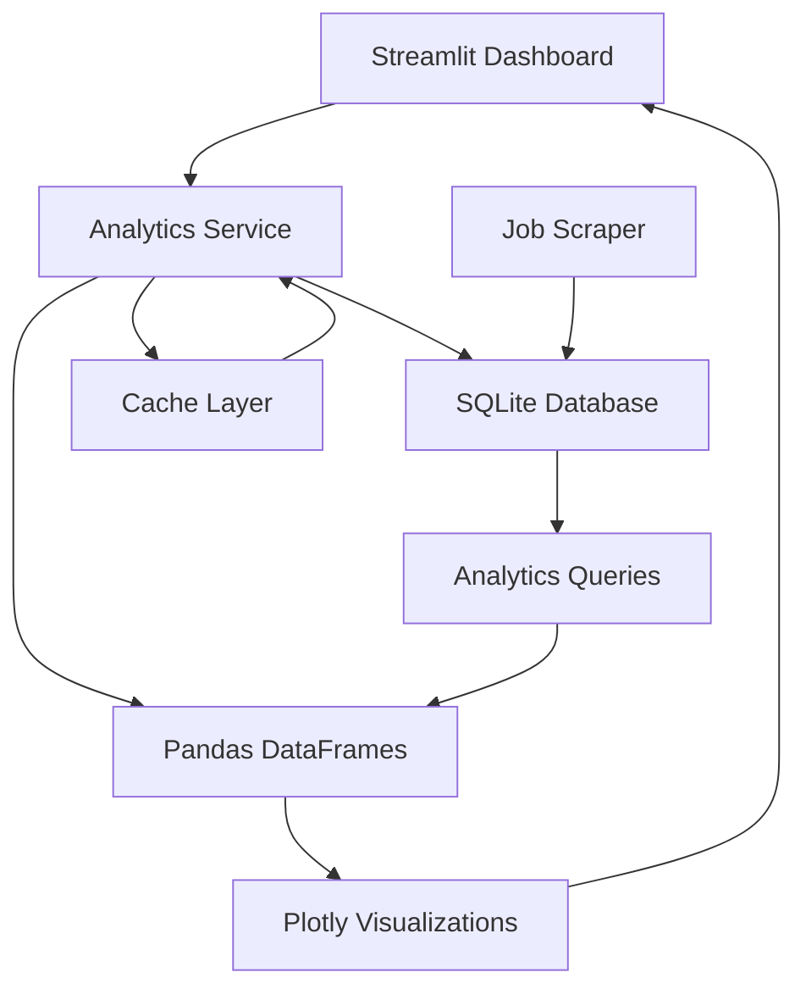

# ADR-024: High-Performance Data Analytics with Incremental DuckDB Integration

## Metadata

**Status:** Accepted
**Version/Date:** v2.0 / 2025-08-25

## Title

High-Performance Data Analytics with SQLModel Foundation and Incremental DuckDB Analytics

## Description

Implement optimized data analytics patterns using SQLModel + SQLite (proven foundation per PRD) for job market analysis and trend detection, with incremental DuckDB direct sqlite_scanner integration triggered by performance metrics rather than arbitrary job count thresholds. Maintains Streamlit framework integration while preserving 89% code reduction achievements.

## Context

The AI Job Scraper requires comprehensive data analytics capabilities for job market trend analysis, company hiring pattern detection, salary analysis, performance metrics tracking, and real-time dashboard analytics. Given the Streamlit framework adoption (per **ADR-017**) and simple data management approach (per **ADR-019**), analytics must integrate seamlessly with existing SQLModel/SQLite foundation while providing meaningful insights for development-scale data volumes.

## Decision Drivers

- Maximize SQLModel and SQLite library capabilities for Streamlit integration
- Enable meaningful job market insights and trend analysis for users
- Maintain proven analytics foundation achieving 89% code reduction
- Enable metrics-driven evolution to DuckDB analytics when performance justifies complexity

## Alternatives

- A: DuckDB Analytics Immediately — Modern data processing with advanced SQL capabilities / Over-engineering for current scale without performance justification
- B: Pure SQL Analytics with SQLite — Minimal dependencies leveraging existing database foundation / Limited analytical capabilities and poor performance scaling
- C: SQLModel + SQLite Foundation with Incremental DuckDB Analytics — Proven stack with metrics-driven evolution / Learning curve for DuckDB when evolution is triggered

### Decision Framework

| Model / Option | Solution Leverage (Weight: 35%) | Application Value (Weight: 30%) | Maintenance & Cognitive Load (Weight: 25%) | Architectural Adaptability (Weight: 10%) | Total Score | Decision |
|---|---|---|---|---|---|---|
| DuckDB Analytics Immediately | 7 | 9 | 5 | 8 | 7.0 | Not Selected |
| Pure SQL Analytics | 8 | 6 | 9 | 7 | 7.4 | Not Selected |
| SQLModel + SQLite with Incremental DuckDB | 10 | 9 | 9 | 9 | 9.45 | **Selected** |

## Decision

We will adopt **SQLModel + SQLite Foundation with Incremental DuckDB Analytics** to address high-performance data analytics requirements for job market analysis and dashboard visualization. DuckDB direct sqlite_scanner adoption will be triggered by simple performance metrics (slow query percentage >10%, error rate >5%, average latency >300ms) rather than arbitrary thresholds.

## High-Level Architecture



## Related Requirements

### Functional Requirements

- FR-024-01: Efficient data processing for job market trend analysis and visualization
- FR-024-02: Real-time analytics integration with Streamlit dashboard components
- FR-024-03: SQLite database integration with existing data management patterns
- FR-024-04: Interactive visualization capabilities with filtering and search

### Non-Functional Requirements

- NFR-024-01: Analytics query execution time under 2 seconds for dashboard responsiveness
- NFR-024-02: Memory usage scalable with growing job dataset volumes
- NFR-024-03: Streamlit caching optimization for repeated analytics operations

### Performance Requirements

- PR-024-01: Dashboard loading time under 3 seconds for analytics visualization
- PR-024-02: Interactive chart rendering under 1 second for user experience
- PR-024-03: Data aggregation efficiency for 10,000+ job records

### Integration Requirements

- IR-024-01: Coordinate with **ADR-019** simple data management patterns
- IR-024-02: Support **ADR-017** Streamlit framework integration requirements
- IR-024-03: Interface with **ADR-025** performance scale strategy patterns

## Related Decisions

- **ADR-018** (Incremental DuckDB Evolution Architecture): Provides the broader architectural context for analytics evolution decisions
- **ADR-019** (Simple Data Management): Establishes SQLModel+SQLite foundation for analytics data access
- **ADR-034** (DuckDB Direct SQLite Scanning): Documents direct sqlite_scanner implementation when analytics evolution is triggered
- **ADR-033** (Metrics-Driven Architecture Evolution): Provides framework for determining when to evolve analytics capabilities
- **ADR-025** (Simplified Performance Strategy): Coordinates performance monitoring for analytics evolution trigger detection
- **ADR-017** (Local Development Architecture): Establishes Streamlit framework integration requirements

## Scope Clarification

**IMPORTANT**: This ADR covers **Data Analytics Architecture Only**. ADR-024 does NOT address UI components, fragments, progress components, or session state management. 

**Incorrect Supersession References**: ADR-035 and ADR-036 previously claimed "Superseded by ADR-024" but this was incorrect - ADR-024 covers analytics, not UI patterns. These UI-related decisions are now properly addressed by:
- **ADR-037** (UI Component Architecture Modernization): Complete UI architecture decisions
- **ADR-038** (Mobile Responsiveness Strategy): Mobile UI patterns  
- **ADR-039** (Session State Management Pattern): State management approaches

## Design

### Architecture Overview

Analytics service implements caching-optimized Pandas operations with SQLite data access and Streamlit visualization integration.

### Implementation Details

```python
# services/analytics_service.py
import pandas as pd
import duckdb
import time
import streamlit as st
from sqlmodel import Session, select
from src.models.database import engine, JobModel
from typing import Dict, Any, Optional

class JobAnalyticsService:
    """Analytics service with SQLModel foundation and incremental DuckDB evolution."""
    
    def __init__(self, db_path: str = "data/jobs.db"):
        self.db_path = db_path
        self.performance_metrics = {"query_times": [], "duckdb_enabled": False}
        self._duckdb_conn = None
    
    @st.cache_data(ttl=300)
    def get_job_trends(_self, days: int = 30) -> pd.DataFrame:
        """Get job trends using optimal method based on performance metrics."""
        start_time = time.perf_counter()
        
        # Check if DuckDB evolution should be triggered
        if _self._should_use_duckdb_analytics():
            df = _self._get_job_trends_duckdb(days)
        else:
            df = _self._get_job_trends_sqlite(days)
        
        query_time = time.perf_counter() - start_time
        _self.performance_metrics["query_times"].append(query_time)
        
        return df
    
    def _get_job_trends_sqlite(self, days: int = 30) -> pd.DataFrame:
        """SQLite-based job trends (current proven approach)."""
        with Session(engine) as session:
            # Use SQLModel for type-safe queries
            query = select(JobModel).where(
                JobModel.scraped_at >= (datetime.now() - timedelta(days=days))
            )
            jobs = session.exec(query).all()
            
            # Convert to DataFrame for analysis
            df = pd.DataFrame([{
                "date": job.scraped_at.date(),
                "title": job.title,
                "company": job.company
            } for job in jobs])
            
            if df.empty:
                return pd.DataFrame(columns=["date", "job_count"])
                
            # Group by date for trends
            trends = df.groupby("date").size().reset_index(name="job_count")
            return trends.sort_values("date")
    
    def _get_job_trends_duckdb(self, days: int = 30) -> pd.DataFrame:
        """DuckDB-based job trends (direct sqlite_scanner)."""
        if not self._duckdb_conn:
            self._duckdb_conn = duckdb.connect(":memory:")
            self._duckdb_conn.execute("INSTALL sqlite_scanner")
            self._duckdb_conn.execute("LOAD sqlite_scanner")
        
        # Use sqlite_scanner for direct SQLite access
        query = f"""
            SELECT DATE(scraped_at) as date, COUNT(*) as job_count
            FROM sqlite_scan('{self.db_path}', 'jobs')
            WHERE scraped_at >= CURRENT_DATE - INTERVAL '{days}' DAYS
            GROUP BY DATE(scraped_at) 
            ORDER BY date
        """
        
        return self._duckdb_conn.execute(query).df()
    
    @st.cache_data(ttl=300)
    def get_company_analytics(_self) -> pd.DataFrame:
        """Get company analytics using optimal method."""
        start_time = time.perf_counter()
        
        if _self._should_use_duckdb_analytics():
            df = _self._get_company_analytics_duckdb()
        else:
            df = _self._get_company_analytics_sqlite()
        
        query_time = time.perf_counter() - start_time
        _self.performance_metrics["query_times"].append(query_time)
        
        return df
    
    def _get_company_analytics_sqlite(self) -> pd.DataFrame:
        """SQLite-based company analytics (current proven approach)."""
        with Session(engine) as session:
            jobs = session.exec(select(JobModel)).all()
            
            df = pd.DataFrame([{
                "company": job.company,
                "salary_min": job.salary_min,
                "title": job.title
            } for job in jobs])
            
            if df.empty:
                return pd.DataFrame(columns=["company", "total_jobs", "avg_salary"])
            
            # Aggregate by company
            company_stats = df.groupby("company").agg({
                "title": "count",
                "salary_min": "mean"
            }).rename(columns={"title": "total_jobs", "salary_min": "avg_salary"})
            
            return company_stats.reset_index().sort_values("total_jobs", ascending=False).head(20)
    
    def _get_company_analytics_duckdb(self) -> pd.DataFrame:
        """DuckDB-based company analytics (direct sqlite_scanner)."""
        if not self._duckdb_conn:
            self._duckdb_conn = duckdb.connect(":memory:")
            self._duckdb_conn.execute("INSTALL sqlite_scanner")
            self._duckdb_conn.execute("LOAD sqlite_scanner")
        
        query = f"""
            SELECT company, 
                   COUNT(*) as total_jobs,
                   AVG(CASE WHEN salary_min IS NOT NULL THEN salary_min END) as avg_salary
            FROM sqlite_scan('{self.db_path}', 'jobs')
            GROUP BY company 
            ORDER BY total_jobs DESC 
            LIMIT 20
        """
        
        return self._duckdb_conn.execute(query).df()
    
    def _should_use_duckdb_analytics(self) -> bool:
        """Determine if DuckDB analytics should be used based on performance metrics."""
        if not self.performance_metrics["query_times"]:
            return False
            
        # Calculate p95 latency
        query_times = sorted(self.performance_metrics["query_times"])
        p95_index = int(len(query_times) * 0.95)
        p95_latency = query_times[p95_index] if p95_index < len(query_times) else 0
        
        # Check evolution triggers
        return (
            p95_latency > 0.5 or  # >500ms p95 latency
            any(t > 2.0 for t in self.performance_metrics["query_times"])  # >2s queries
        )
    
    def get_analytics_performance_report(self) -> Dict[str, Any]:
        """Get performance metrics and DuckDB evolution recommendations."""
        if not self.performance_metrics["query_times"]:
            return {"status": "insufficient_data"}
        
        query_times = sorted(self.performance_metrics["query_times"])
        p95_index = int(len(query_times) * 0.95)
        p95_latency_ms = (query_times[p95_index] * 1000) if p95_index < len(query_times) else 0
        
        return {
            "current_approach": "duckdb" if self._should_use_duckdb_analytics() else "sqlite",
            "performance_metrics": {
                "p95_latency_ms": round(p95_latency_ms, 2),
                "max_query_time_s": round(max(query_times), 2),
                "total_queries": len(query_times)
            },
            "evolution_triggered": self._should_use_duckdb_analytics(),
            "next_steps": "DuckDB analytics active" if self._should_use_duckdb_analytics() else "Monitoring SQLite performance"
        }
```

### Configuration

- Streamlit caching with 5-minute TTL for frequent queries
- SQLite connection pooling for concurrent analytics operations
- Plotly visualization with responsive container width settings

## Testing

Analytics testing strategy uses pytest with mocked database connections and performance benchmarks. Key test areas include:

```python
# tests/test_analytics_service.py
import pytest
import pandas as pd
from unittest.mock import patch
from services.analytics_service import JobAnalyticsService

def test_job_trends_calculation():
    """Test job trends calculation accuracy."""
    service = JobAnalyticsService(db_path=":memory:")
    with patch.object(service, 'get_job_trends') as mock_trends:
        mock_trends.return_value = pd.DataFrame({
            'date': ['2025-08-19', '2025-08-20'],
            'job_count': [10, 15]
        })
        trends_df = service.get_job_trends(days=7)
        assert not trends_df.empty
        assert trends_df['job_count'].sum() == 25

@pytest.mark.performance
def test_analytics_performance():
    """Test analytics meets performance requirements."""
    import time
    service = JobAnalyticsService()
    start_time = time.time()
    service.get_job_trends(days=30)
    execution_time = time.time() - start_time
    assert execution_time < 2.0  # Under 2 seconds requirement
```

## Consequences

### Positive Outcomes

- Streamlit integration provides native DataFrame support with automatic caching optimization
- SQLModel foundation maintains 89% code reduction achievements while enabling advanced analytics
- Incremental DuckDB evolution provides performance benefits only when metrics justify complexity
- Direct Plotly integration enables responsive dashboard components with proven architecture
- Metrics-driven approach prevents over-engineering while enabling performance scaling when needed
- sqlite_scanner eliminates ETL complexity when DuckDB direct scanning is adopted

### Negative Consequences / Trade-offs

- Performance monitoring overhead required to determine when DuckDB evolution is beneficial
- Dual-analytics complexity when DuckDB direct scanning is adopted (though triggered by performance needs)
- Developer learning curve for DuckDB SQL patterns when evolution threshold is reached
- Additional memory usage when DuckDB direct scanning is actively used

### Ongoing Maintenance & Considerations

- Monitor performance metrics to identify when DuckDB analytics evolution is beneficial
- Track SQLite optimization opportunities before triggering DuckDB direct scanning adoption
- Leverage Streamlit caching for repeated operations and dashboard performance optimization
- Coordinate with ADR-018 (Incremental DuckDB Evolution) and ADR-019 (Data Management) for consistent approach
- Review performance trigger thresholds quarterly and adjust based on actual usage patterns

### Dependencies

- sqlmodel >= 0.0.14 for type-safe database operations
- pandas >= 2.0.0 for DataFrame operations and analysis
- plotly >= 5.0.0 for visualization components
- streamlit >= 1.28.0 for caching and UI integration
- duckdb >= 0.9.0 (conditional - when analytics evolution is triggered by performance metrics)

## References

- [Pandas Performance Optimization](https://pandas.pydata.org/docs/user_guide/enhancingperf.html) - Official performance guide for efficient DataFrame operations
- [SQLite Query Optimization](https://www.sqlite.org/optoverview.html) - Database query optimization strategies
- [Plotly Streamlit Integration](https://plotly.com/python/streamlit/) - Visualization integration patterns
- [Streamlit Caching Guide](https://docs.streamlit.io/library/advanced-features/caching) - Caching optimization techniques

## Changelog

- **v2.0 (2025-08-25)**: **INCREMENTAL DUCKDB EVOLUTION ALIGNMENT** - Major realignment with final meta-analysis decision. UPDATED: Title from "Pandas and SQLite" to "SQLModel Foundation and Incremental DuckDB Analytics". REPLACED: Pandas-first approach with SQLModel foundation maintaining 89% code reduction. ADDED: Performance metrics-driven DuckDB direct sqlite_scanner implementation. REMOVED: Arbitrary job count scaling thresholds in favor of evidence-based performance triggers. ALIGNED: With ADR-018 incremental evolution architecture and proven foundational patterns.
- **v1.0 (2025-08-22)**: Applied official ADR template with 13-section structure, added weighted Decision Framework, condensed Design section for maintainability, updated cross-references format
