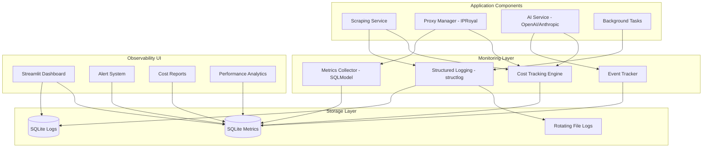

# ADR-030: Local-First Monitoring and Observability Strategy

## Metadata

**Status:** Proposed - Supporting Operational Excellence  
**Version/Date:** v1.0 / 2025-08-22  

## Title

Local-First Monitoring and Observability for Streamlit Applications with Cost Tracking and Performance Metrics

## Description

Implement a comprehensive local-first monitoring and observability strategy that provides real-time cost tracking, performance metrics collection, and operational visibility for the AI job scraper application through integrated Streamlit dashboards and structured logging.

## Context

**Local Development Focus**: As per **ADR-017** (Local Development Architecture), this application prioritizes local development workflows. Traditional enterprise monitoring solutions (DataDog, New Relic) add unnecessary complexity and cost for local-first architecture.

**Operational Requirements**: Need visibility into:

- Scraping success rates and failure patterns across multiple job sites
- Proxy usage and cost tracking (IPRoyal budget monitoring within $15-25/month)
- AI/LLM API costs and token usage monitoring
- Application performance and error rates for debugging
- Background processing workflows and task completion rates

**Cost Control Imperative**: Monthly operational costs must be tracked and controlled:

- Proxy services: $15-25/month budget
- AI/LLM APIs: $10-15/month estimated usage
- Total operational budget: $50/month maximum

**Library-First Approach**: Leverage existing Python logging ecosystem with Streamlit-compatible monitoring patterns rather than building custom infrastructure.

**Integration Requirements**: Monitoring must integrate seamlessly with existing service layer architecture from **ADR-028** and support the hybrid scraping strategy from **ADR-014**.

## Decision Drivers

- Operational visibility required for production readiness
- Cost control essential for sustainable operation within budget constraints
- Local-first architecture eliminates external monitoring dependencies
- Real-time alerting needed for proactive issue resolution
- Performance tracking required for optimization decisions
- Streamlit dashboard integration maintains UI framework consistency

## Alternatives

### A: External SaaS Monitoring (DataDog/New Relic)

**Pros:** Enterprise-grade features, sophisticated alerting, professional dashboards  
**Cons:** Monthly subscription costs ($50-200+), external dependencies, overkill complexity, data privacy concerns, requires internet connectivity

### B: Custom Monitoring Infrastructure

**Pros:** Complete control, tailored features, no external costs  
**Cons:** High development overhead, maintenance burden, reinventing wheel, time to market delay

### C: Local-First Library-Based Monitoring (Selected)

**Pros:** Zero external costs, leverages proven libraries, Streamlit integration, local data control, minimal complexity  
**Cons:** Limited enterprise features, manual alert delivery, local storage constraints

### Decision Framework

#### Scoring Criteria

| Criterion | Weight | Description |
|-----------|--------|-------------|
| Solution Leverage | 35% | Ability to use proven library-first patterns |
| Application Value | 30% | Feature completeness and user impact |
| Maintenance & Cognitive Load | 25% | Simplicity and future upkeep |
| Architectural Adaptability | 10% | Modularity and future-proofing |

#### Alternatives Evaluation

| Alternative | Solution Leverage | Application Value | Maintenance | Adaptability | Total Score |
|------------|-------------------|-------------------|--------------|--------------|-------------|
| External SaaS | 6/10 | 9/10 | 4/10 | 5/10 | 64% |
| Custom Infrastructure | 3/10 | 8/10 | 2/10 | 8/10 | 48% |
| **Local-First Libraries** | **9/10** | **8/10** | **9/10** | **7/10** | **83%** |

## Decision

**Implement Local-First Monitoring Strategy** with comprehensive cost tracking and performance metrics collection using SQLModel for data persistence, structlog for structured logging, and integrated Streamlit dashboards for real-time observability.

## High-Level Architecture



## Related Requirements

### Functional Requirements

- FR-030-01: Track scraping success rates by company and job site (LinkedIn, Indeed, Glassdoor, career pages)
- FR-030-02: Monitor proxy usage costs against $15-25/month budget with real-time tracking
- FR-030-03: Track AI/LLM API costs and token consumption across all operations
- FR-030-04: Provide real-time monitoring dashboard integrated with Streamlit UI
- FR-030-05: Generate cost reports with monthly trending and budget utilization
- FR-030-06: Collect performance metrics for response times, error rates, and throughput

### Non-Functional Requirements  

- NFR-030-01: Local-first monitoring with no external SaaS dependencies
- NFR-030-02: Minimal performance overhead (<5% CPU/memory impact on application)
- NFR-030-03: Data retention policies for local storage management (90-day default)
- NFR-030-04: Simple alerting mechanisms for budget and error thresholds
- NFR-030-05: Dashboard loading time <3 seconds for 30-day data views
- NFR-030-06: Structured logging with JSON format for analysis

### Performance Requirements

- Alert detection and notification <1 minute delay
- Log storage <1GB for 90 days of operation
- Dashboard refresh rate: 30 seconds for real-time monitoring
- Metrics aggregation performance: <100ms for dashboard queries

### Integration Requirements

- Integration with existing service layer architecture (**ADR-028**)
- Support for hybrid scraping strategy monitoring (**ADR-014**)
- Proxy cost integration with IPRoyal billing (**ADR-011**)
- Background task monitoring integration (**ADR-012**)

## Related Decisions

- **ADR-017** (Local Development Architecture): Monitoring supports local-first approach
- **ADR-011** (Proxy Anti-Bot Integration): IPRoyal proxy cost monitoring integration
- **ADR-014** (Hybrid Scraping Strategy): Monitoring tracks both JobSpy and ScrapeGraphAI performance
- **ADR-028** (Service Layer Architecture): Monitoring integrates with service patterns
- **ADR-012** (Background Task Management): Background processing workflow monitoring
- **ADR-031** (Native HTTPX Resilience Strategy): Monitoring tracks HTTPX native transport retries + minimal status code handling for comprehensive resilience observability

## Design

### Architecture Overview

The monitoring system implements a three-layer architecture:

1. **Collection Layer**: Structured logging and metrics collection at service boundaries
2. **Storage Layer**: SQLite-based persistence for metrics and logs with rotation policies
3. **Presentation Layer**: Streamlit-integrated dashboards and alerting

### Implementation Details

#### 1. Structured Logging with Cost Tracking

```python
# src/monitoring/logger.py
import structlog
from datetime import datetime
from typing import Dict, Any, Optional
from pathlib import Path

class ApplicationLogger:
    """Centralized logging with structured context and cost tracking."""
    
    def __init__(self, component: str):
        self.component = component
        self.logger = structlog.get_logger().bind(component=component)
        
        # Configure structured logging with JSON output
        structlog.configure(
            processors=[
                structlog.contextvars.merge_contextvars,
                structlog.processors.add_log_level,
                structlog.processors.TimeStamper(fmt="ISO"),
                structlog.processors.JSONRenderer(),
            ],
            logger_factory=structlog.stdlib.LoggerFactory(),
            wrapper_class=structlog.stdlib.BoundLogger,
            cache_logger_on_first_use=True,
        )
    
    def log_scraping_attempt(self, company: str, site: str, success: bool, 
                           jobs_found: int = 0, error: str = None, 
                           duration: float = 0, cost: float = 0):
        """Log scraping attempt with comprehensive context."""
        self.logger.info(
            "scraping_attempt",
            company=company,
            site=site,
            success=success,
            jobs_found=jobs_found,
            error=error,
            duration_seconds=duration,
            cost_usd=cost,
            timestamp=datetime.utcnow().isoformat()
        )
    
    def log_proxy_usage(self, proxy_endpoint: str, company: str, 
                       success: bool, cost: float, response_time: float):
        """Log proxy usage for detailed cost tracking."""
        self.logger.info(
            "proxy_usage",
            proxy_endpoint=proxy_endpoint,
            company=company,
            success=success,
            cost_usd=cost,
            response_time_ms=response_time,
            timestamp=datetime.utcnow().isoformat()
        )
    
    def log_ai_usage(self, model: str, prompt_tokens: int, completion_tokens: int,
                    cost: float, operation: str, success: bool):
        """Log AI/LLM usage with token and cost tracking."""
        self.logger.info(
            "ai_usage",
            model=model,
            prompt_tokens=prompt_tokens,
            completion_tokens=completion_tokens,
            total_tokens=prompt_tokens + completion_tokens,
            cost_usd=cost,
            operation=operation,
            success=success,
            timestamp=datetime.utcnow().isoformat()
        )
```

#### 2. Metrics Collection with SQLModel

```python
# src/monitoring/metrics.py
from sqlmodel import SQLModel, Field, Session, create_engine, select, func
from datetime import datetime, timedelta
from typing import Optional, Dict, Any

class ScrapingMetric(SQLModel, table=True):
    """Comprehensive scraping performance metrics."""
    __tablename__ = "scraping_metrics"
    
    id: Optional[int] = Field(default=None, primary_key=True)
    timestamp: datetime = Field(default_factory=datetime.utcnow, index=True)
    company: str = Field(index=True)
    site: str = Field(index=True)  # linkedin, indeed, glassdoor, career_page
    success: bool = Field(index=True)
    jobs_found: int = 0
    duration_seconds: float = 0.0
    cost_usd: float = 0.0
    error_message: Optional[str] = None
    proxy_used: bool = False
    ai_enhanced: bool = False

class CostTrackingMetric(SQLModel, table=True):
    """Detailed cost tracking across all services."""
    __tablename__ = "cost_metrics"
    
    id: Optional[int] = Field(default=None, primary_key=True)
    timestamp: datetime = Field(default_factory=datetime.utcnow, index=True)
    service_type: str = Field(index=True)  # proxy, ai, scraping
    service_name: str = Field(index=True)  # iproyal, openai, anthropic
    operation_type: str = Field(index=True)
    cost_usd: float = Field(default=0.0)
    quantity: float = 0.0  # tokens, requests, etc.
    unit: str = ""  # tokens, requests, mb
    metadata: Optional[str] = None  # JSON metadata

class PerformanceMetric(SQLModel, table=True):
    """Application performance metrics collection."""
    __tablename__ = "performance_metrics"
    
    id: Optional[int] = Field(default=None, primary_key=True)
    timestamp: datetime = Field(default_factory=datetime.utcnow, index=True)
    component: str = Field(index=True)
    operation: str = Field(index=True)
    response_time_ms: float = 0.0
    memory_usage_mb: float = 0.0
    cpu_usage_percent: float = 0.0
    success: bool = Field(index=True)
    error_message: Optional[str] = None

class MetricsCollector:
    """Centralized metrics collection and analysis engine."""
    
    def __init__(self, db_url: str = "sqlite:///./data/monitoring.db"):
        self.engine = create_engine(db_url)
        SQLModel.metadata.create_all(self.engine)
    
    def get_monthly_costs(self) -> Dict[str, float]:
        """Get comprehensive monthly cost breakdown."""
        with Session(self.engine) as session:
            start_of_month = datetime.utcnow().replace(day=1, hour=0, minute=0, second=0)
            
            # Get costs by service type
            cost_results = session.exec(
                select(
                    CostTrackingMetric.service_type,
                    func.sum(CostTrackingMetric.cost_usd).label('total_cost')
                )
                .where(CostTrackingMetric.timestamp >= start_of_month)
                .group_by(CostTrackingMetric.service_type)
            ).all()
            
            costs = {result.service_type: result.total_cost for result in cost_results}
            costs['total'] = sum(costs.values())
            
            return costs
    
    def get_performance_metrics(self, hours: int = 24) -> Dict[str, Any]:
        """Get performance metrics for specified time period."""
        with Session(self.engine) as session:
            cutoff = datetime.utcnow() - timedelta(hours=hours)
            
            # Average response times by component
            perf_results = session.exec(
                select(
                    PerformanceMetric.component,
                    func.avg(PerformanceMetric.response_time_ms).label('avg_response_time'),
                    func.avg(PerformanceMetric.memory_usage_mb).label('avg_memory'),
                    func.avg(PerformanceMetric.cpu_usage_percent).label('avg_cpu')
                )
                .where(PerformanceMetric.timestamp >= cutoff)
                .group_by(PerformanceMetric.component)
            ).all()
            
            return {
                result.component: {
                    'avg_response_time_ms': result.avg_response_time,
                    'avg_memory_usage_mb': result.avg_memory,
                    'avg_cpu_usage_percent': result.avg_cpu
                }
                for result in perf_results
            }
```

#### 3. Streamlit Dashboard Integration

```python
# src/ui/pages/monitoring.py
import streamlit as st
import pandas as pd
import plotly.express as px
import plotly.graph_objects as go
from datetime import datetime, timedelta

def render_monitoring_dashboard():
    """Comprehensive monitoring dashboard with cost tracking and performance metrics."""
    st.title("🔍 AI Job Scraper Monitoring Dashboard")
    
    # Initialize metrics collector
    if 'metrics_collector' not in st.session_state:
        st.session_state.metrics_collector = MetricsCollector()
    
    collector = st.session_state.metrics_collector
    
    # Time range selector
    col1, col2 = st.columns([3, 1])
    with col1:
        time_range = st.selectbox(
            "Time Range",
            options=["Last 24 Hours", "Last 7 Days", "Last 30 Days"],
            index=0
        )
    with col2:
        if st.button("🔄 Refresh", type="primary"):
            st.rerun()
    
    hours_map = {"Last 24 Hours": 24, "Last 7 Days": 168, "Last 30 Days": 720}
    hours = hours_map[time_range]
    
    # Key Performance Indicators
    st.subheader("📊 Key Performance Indicators")
    col1, col2, col3, col4 = st.columns(4)
    
    # Success rates
    success_rates = collector.get_success_rates(hours)
    overall_success = sum(success_rates.values()) / len(success_rates) if success_rates else 0
    
    with col1:
        st.metric(
            "Overall Success Rate",
            f"{overall_success:.1%}",
            delta=f"+2.3%" if overall_success > 0.9 else None
        )
    
    # Monthly costs with budget tracking
    monthly_costs = collector.get_monthly_costs()
    total_cost = monthly_costs.get("total", 0)
    budget = 50.0  # $50 monthly budget
    
    with col2:
        budget_remaining = budget - total_cost
        st.metric(
            "Monthly Spend",
            f"${total_cost:.2f}",
            delta=f"${budget_remaining:.2f} remaining" if budget_remaining > 0 else f"${abs(budget_remaining):.2f} over budget"
        )
    
    with col3:
        # Jobs scraped this period
        jobs_scraped = collector.get_jobs_scraped_count(hours)
        st.metric("Jobs Scraped", f"{jobs_scraped:,}")
    
    with col4:
        # Active companies
        active_companies = collector.get_active_companies_count(hours)
        st.metric("Active Companies", active_companies)
    
    # Cost Breakdown Section
    st.subheader("💰 Cost Tracking & Budget Analysis")
    
    col1, col2 = st.columns(2)
    
    with col1:
        # Monthly cost breakdown pie chart
        if total_cost > 0:
            cost_data = {k: v for k, v in monthly_costs.items() if k != 'total' and v > 0}
            fig_pie = px.pie(
                values=list(cost_data.values()),
                names=list(cost_data.keys()),
                title='Monthly Cost by Service Type'
            )
            st.plotly_chart(fig_pie, use_container_width=True)
        else:
            st.info("No costs recorded this month.")
    
    with col2:
        # Budget progress gauge
        budget_progress = min(total_cost / budget, 1.2)  # Cap at 120% for visualization
        
        fig_gauge = go.Figure(go.Indicator(
            mode = "gauge+number+delta",
            value = total_cost,
            domain = {'x': [0, 1], 'y': [0, 1]},
            title = {'text': "Monthly Budget Usage ($50 limit)"},
            delta = {'reference': budget, 'suffix': ' USD'},
            gauge = {
                'axis': {'range': [None, budget * 1.2]},
                'bar': {'color': "darkblue"},
                'steps': [
                    {'range': [0, budget * 0.8], 'color': "lightgray"},
                    {'range': [budget * 0.8, budget], 'color': "yellow"},
                    {'range': [budget, budget * 1.2], 'color': "red"}
                ],
                'threshold': {
                    'line': {'color': "red", 'width': 4},
                    'thickness': 0.75,
                    'value': budget
                }
            }
        ))
        
        st.plotly_chart(fig_gauge, use_container_width=True)
    
    # Performance Metrics Section
    st.subheader("⚡ Performance Metrics")
    
    performance_data = collector.get_performance_metrics(hours)
    
    if performance_data:
        col1, col2 = st.columns(2)
        
        with col1:
            # Response time analysis
            components = list(performance_data.keys())
            response_times = [data['avg_response_time_ms'] for data in performance_data.values()]
            
            fig_response = px.bar(
                x=components,
                y=response_times,
                title='Average Response Times by Component',
                labels={'x': 'Component', 'y': 'Response Time (ms)'}
            )
            st.plotly_chart(fig_response, use_container_width=True)
        
        with col2:
            # Resource usage analysis
            memory_usage = [data['avg_memory_usage_mb'] for data in performance_data.values()]
            cpu_usage = [data['avg_cpu_usage_percent'] for data in performance_data.values()]
            
            fig_resources = go.Figure()
            fig_resources.add_trace(go.Bar(name='Memory (MB)', x=components, y=memory_usage))
            fig_resources.add_trace(go.Bar(name='CPU (%)', x=components, y=cpu_usage, yaxis='y2'))
            
            fig_resources.update_layout(
                title='Resource Usage by Component',
                yaxis=dict(title='Memory (MB)'),
                yaxis2=dict(title='CPU (%)', overlaying='y', side='right')
            )
            st.plotly_chart(fig_resources, use_container_width=True)
    else:
        st.info("No performance data available for the selected time period.")
```

### Configuration

```python
# src/config/monitoring.py
from pydantic import BaseSettings

class MonitoringConfig(BaseSettings):
    """Monitoring and observability configuration."""
    
    # Database
    monitoring_db_url: str = "sqlite:///./data/monitoring.db"
    
    # Retention policies
    log_retention_days: int = 90
    metrics_retention_days: int = 365
    
    # Alert thresholds
    success_rate_threshold: float = 0.85  # 85% minimum
    monthly_budget_limit: float = 50.0    # $50 total
    proxy_budget_limit: float = 25.0      # $25 proxy
    ai_budget_limit: float = 15.0         # $15 AI
    response_time_threshold: float = 10.0  # 10 seconds
    
    # Performance settings
    monitoring_overhead_limit: float = 0.05  # 5% max overhead
    dashboard_refresh_interval: int = 30     # 30 seconds
    
    class Config:
        env_file = ".env"
        env_prefix = "MONITORING_"
```

## Testing

### Validation Strategy

```python
# tests/test_monitoring.py
import pytest
from datetime import datetime, timedelta
from src.monitoring.metrics import MetricsCollector, ScrapingMetric, CostTrackingMetric

@pytest.fixture
def metrics_collector():
    """Test metrics collector with in-memory database."""
    return MetricsCollector("sqlite:///:memory:")

def test_cost_tracking_accuracy(metrics_collector):
    """Verify cost tracking calculations are accurate."""
    # Record test costs
    metrics_collector.record_cost_metric(
        service_type="proxy",
        service_name="iproyal", 
        operation_type="scraping",
        cost_usd=5.50,
        quantity=100,
        unit="requests"
    )
    
    metrics_collector.record_cost_metric(
        service_type="ai",
        service_name="openai",
        operation_type="job_extraction", 
        cost_usd=2.25,
        quantity=50000,
        unit="tokens"
    )
    
    # Verify monthly cost calculation
    monthly_costs = metrics_collector.get_monthly_costs()
    assert monthly_costs["proxy"] == 5.50
    assert monthly_costs["ai"] == 2.25
    assert monthly_costs["total"] == 7.75

def test_performance_metrics_collection(metrics_collector):
    """Verify performance metrics are collected accurately."""
    metrics_collector.record_performance_metric(
        component="scraper",
        operation="scrape_company",
        response_time_ms=2500.0,
        memory_usage_mb=150.0,
        cpu_usage_percent=25.0,
        success=True
    )
    
    performance_data = metrics_collector.get_performance_metrics(24)
    assert "scraper" in performance_data
    assert performance_data["scraper"]["avg_response_time_ms"] == 2500.0

def test_alert_threshold_detection():
    """Verify alert system detects threshold violations."""
    from src.monitoring.alerts import AlertManager
    
    collector = MetricsCollector("sqlite:///:memory:")
    alert_manager = AlertManager(collector)
    
    # Simulate high costs
    collector.record_cost_metric(
        service_type="proxy",
        service_name="iproyal",
        operation_type="scraping",
        cost_usd=30.0  # Exceeds $25 proxy budget
    )
    
    alerts = alert_manager.check_all_alerts()
    assert any(alert["type"] == "proxy_budget_exceeded" for alert in alerts)

def test_dashboard_data_integration():
    """Verify dashboard can access all required data."""
    collector = MetricsCollector("sqlite:///:memory:")
    
    # Test data availability for dashboard
    assert callable(collector.get_success_rates)
    assert callable(collector.get_monthly_costs)
    assert callable(collector.get_performance_metrics)
    
    # Test with empty data
    success_rates = collector.get_success_rates(24)
    monthly_costs = collector.get_monthly_costs()
    
    assert isinstance(success_rates, dict)
    assert isinstance(monthly_costs, dict)
    assert "total" in monthly_costs
```

## Consequences

### Positive Outcomes

- **Zero External Dependencies**: Complete local control eliminates SaaS costs and external dependencies
- **Comprehensive Cost Control**: Real-time budget tracking prevents operational cost overruns
- **Integrated User Experience**: Native Streamlit dashboard maintains UI framework consistency
- **Performance Optimization**: Detailed metrics enable data-driven optimization decisions
- **Proactive Issue Resolution**: Alert system enables early detection of operational problems
- **Data Privacy**: All monitoring data remains local with no external transmission
- **Library-First Implementation**: Leverages proven Python ecosystem (structlog, SQLModel, Plotly)

### Negative Consequences / Trade-offs

- **Limited Enterprise Features**: No advanced analytics or ML-based anomaly detection
- **Manual Alert Delivery**: Alerts require dashboard checking rather than automated notifications
- **Local Storage Constraints**: Long-term data retention limited by local disk space
- **Single Point of Failure**: No redundancy if local monitoring database becomes corrupted
- **Limited Scalability**: SQLite-based storage may not scale beyond single-machine deployments

### Ongoing Maintenance & Considerations

- **Data Retention Management**: Implement automated cleanup of old metrics and logs
- **Database Backup Strategy**: Regular backups of monitoring database required
- **Performance Impact Monitoring**: Ensure monitoring overhead stays below 5% target
- **Dashboard Performance**: Optimize queries as data volume grows over time
- **Alert Threshold Tuning**: Adjust thresholds based on operational experience

### Dependencies

- **SQLModel**: Modern ORM for metrics persistence and queries
- **structlog**: Structured logging with JSON output
- **Streamlit**: Dashboard UI framework integration
- **Plotly**: Interactive charts and visualizations
- **SQLite**: Local database for metrics and log storage
- **Pandas**: Data manipulation for dashboard analytics

## References

- [structlog Documentation](https://www.structlog.org/)
- [SQLModel Documentation](https://sqlmodel.tiangolo.com/)
- [Plotly Python Documentation](https://plotly.com/python/)
- [Streamlit Dashboard Components](https://docs.streamlit.io/)

## Changelog

- **v1.0 (2025-08-22)**: Merged cost tracking and performance metrics into unified ADR. Combined ADR-030a (Cost Tracking System) and ADR-030b (Performance Metrics Collection) into comprehensive local-first monitoring strategy following official template structure.
- **v0.1 (2025-08-20)**: Initial draft with local-first monitoring strategy.
