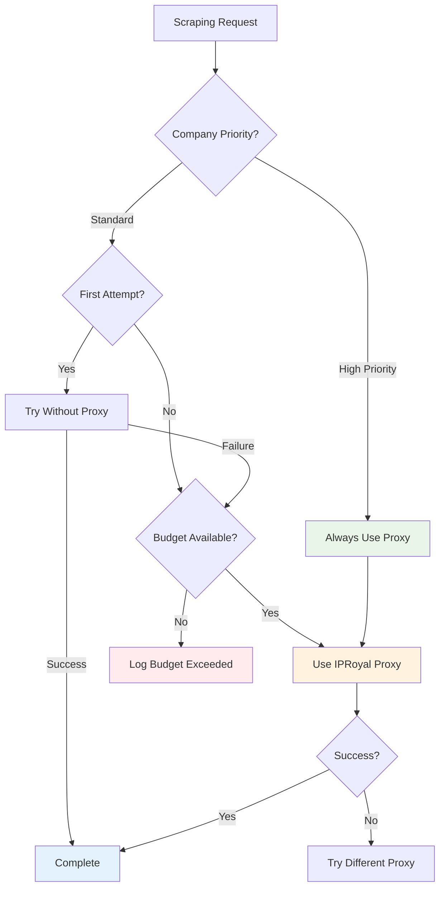

# ADR-027: IPRoyal Residential Proxy Architecture [SUPERSEDED]

## Title

IPRoyal Residential Proxy Integration with JobSpy and ScrapeGraphAI [SUPERSEDED BY ADR-011]

## Version/Date

1.0 / August 20, 2025

## Status

**SUPERSEDED BY ADR-011** - All operational monitoring capabilities integrated into ADR-011 v2.1 (2025-08-22)

## Context

**SUPERSESSION NOTICE**: This ADR has been superseded by **ADR-011 v2.1** (2025-08-22). All operational monitoring capabilities, including ProxyUsageTracker, ProxyMonitoringService, cost optimization logic, and database schema, have been integrated into the main proxy integration ADR.

**Integration Rationale**: The architectural components defined in this ADR were determined to be core operational features rather than supplementary architecture. To eliminate duplication and ensure single-source-of-truth for proxy management, all capabilities were consolidated into ADR-011.

**Migration Path**: Use ADR-011 v2.1 for all proxy implementation requirements. This ADR remains for historical reference only.

---

**ORIGINAL CONTEXT** (preserved for reference):

**Research Validation**: IPRoyal residential proxies provide optimal integration with our 2-tier scraping strategy (ADR-014). JobSpy natively supports the IPRoyal proxy format, and ScrapeGraphAI can be configured with proxy headers for career page scraping.

**Cost Analysis**: IPRoyal Growth plan ($85/month, 40,000 credits) provides economies of scale, but budget target is $15-25/month per ADR-011. Need strategic proxy usage optimization.

**Anti-Bot Requirements**: Modern job sites (LinkedIn, Glassdoor) employ sophisticated detection requiring residential IP rotation with behavioral simulation.

## Related Requirements

### Functional Requirements

- FR-027-01: Achieve 95%+ scraping success rate through proxy rotation
- FR-027-02: Support JobSpy native proxy integration format
- FR-027-03: Enable ScrapeGraphAI proxy configuration for career pages
- FR-027-04: Implement cost monitoring and budget controls

### Non-Functional Requirements

- NFR-027-01: Maintain proxy rotation health monitoring
- NFR-027-02: Ensure cost stays within $15-25/month budget
- NFR-027-03: Provide automatic failover for proxy failures
- NFR-027-04: Log proxy usage metrics for optimization

## Decision

**Implement IPRoyal Residential Proxy Architecture** with cost-optimized usage patterns:

### Primary Integration: JobSpy Native Support

```python
# IPRoyal proxy pool configuration (validated format)
IPROYAL_PROXY_POOL = [
    "198.23.239.134:6540:username:password",
    "207.244.217.165:6712:username:password", 
    "209.127.191.180:9279:username:password",
    "45.95.96.132:8745:username:password",
    "185.199.229.156:7492:username:password"
]

class ProxyManager:
    def __init__(self, monthly_budget: float = 20.0):
        self.proxy_pool = IPROYAL_PROXY_POOL
        self.monthly_budget = monthly_budget
        self.usage_tracker = ProxyUsageTracker()
        
    def get_jobspy_proxies(self) -> List[str]:
        """Get proxy list in JobSpy format."""
        return self.proxy_pool
        
    def should_use_proxy(self, company: str, attempt: int = 1) -> bool:
        """Cost-aware proxy usage decision."""
        monthly_usage = self.usage_tracker.get_monthly_cost()
        
        # Always use for high-priority companies
        if company.lower() in ['google', 'microsoft', 'amazon', 'apple']:
            return True
            
        # Use after first failure if budget allows
        if attempt > 1 and monthly_usage < self.monthly_budget * 0.8:
            return True
            
        return False
```

### Secondary Integration: ScrapeGraphAI Proxy Support

```python
def get_scrapegraph_proxy_config() -> dict:
    """Generate ScrapeGraphAI proxy configuration."""
    proxy = random.choice(IPROYAL_PROXY_POOL)
    ip, port, username, password = proxy.split(':')
    
    return {
        "http": f"http://{username}:{password}@{ip}:{port}",
        "https": f"http://{username}:{password}@{ip}:{port}",
        "timeout": 30,
        "verify": False  # Handle SSL issues with proxies
    }
```

## Architecture Design

### Proxy Usage Strategy



### Cost Optimization Implementation

```python
class ProxyUsageTracker:
    def __init__(self):
        self.db_session = get_session()
        
    def track_usage(self, company: str, proxy_used: str, cost: float):
        """Track proxy usage for cost monitoring."""
        usage = ProxyUsage(
            company=company,
            proxy_endpoint=proxy_used,
            cost=cost,
            timestamp=datetime.utcnow(),
            success=True
        )
        self.db_session.add(usage)
        self.db_session.commit()
        
    def get_monthly_cost(self) -> float:
        """Calculate current month proxy costs."""
        start_of_month = datetime.utcnow().replace(day=1, hour=0, minute=0, second=0)
        
        total_cost = self.db_session.query(
            func.sum(ProxyUsage.cost)
        ).filter(
            ProxyUsage.timestamp >= start_of_month
        ).scalar() or 0.0
        
        return total_cost
        
    def alert_if_over_budget(self, budget: float):
        """Send alert if approaching budget limit."""
        current_cost = self.get_monthly_cost()
        
        if current_cost > budget * 0.8:
            logger.warning(f"Proxy cost {current_cost} approaching budget {budget}")
            # Send notification to monitoring system
```

## Configuration Management

### Environment Variables

```bash
# .env configuration
IPROYAL_USERNAME=your_username
IPROYAL_PASSWORD=your_password
IPROYAL_ENDPOINT=rotating-residential.iproyal.com:12321
PROXY_POOL_SIZE=5
MONTHLY_PROXY_BUDGET=20.00
PROXY_USAGE_ALERTS=true

# High-priority companies (always use proxy)
HIGH_PRIORITY_COMPANIES=google,microsoft,amazon,apple,tesla,meta,netflix
```

### Database Schema

```python
class ProxyUsage(SQLModel, table=True):
    """Track proxy usage for cost monitoring."""
    __tablename__ = "proxy_usage"
    
    id: Optional[int] = Field(default=None, primary_key=True)
    company: str = Field(index=True)
    proxy_endpoint: str
    cost: float
    timestamp: datetime = Field(default_factory=datetime.utcnow)
    success: bool
    response_time: Optional[float] = None
    error_message: Optional[str] = None
```

## Integration Points

### JobSpy Integration (Tier 1)

```python
async def scrape_with_jobspy(company: str, location: str = "United States"):
    proxy_manager = ProxyManager()
    
    if proxy_manager.should_use_proxy(company):
        proxies = proxy_manager.get_jobspy_proxies()
        proxy_manager.usage_tracker.track_usage(company, proxies[0], 0.05)  # ~$0.05 per scrape
        
        jobs_df = scrape_jobs(
            site_name=["linkedin", "indeed", "glassdoor"],
            search_term=f'jobs at "{company}"',
            location=location,
            proxies=proxies,
            proxy_use=True,
            random_delay=True,
            max_workers=3
        )
    else:
        jobs_df = scrape_jobs(
            site_name=["indeed", "zip_recruiter"],  # Less restricted sites
            search_term=f'jobs at "{company}"',
            location=location,
            proxy_use=False
        )
    
    return jobs_df
```

### ScrapeGraphAI Integration (Tier 2)

```python
async def scrape_with_ai(company: str, career_url: str):
    proxy_manager = ProxyManager()
    
    config = {
        "llm": {
            "model": "openai/gpt-4o-mini",
            "api_key": os.getenv("OPENAI_API_KEY"),
        },
        "headless": True
    }
    
    if proxy_manager.should_use_proxy(company, attempt=2):  # Usually fallback
        config["proxy"] = get_scrapegraph_proxy_config()
        proxy_manager.usage_tracker.track_usage(company, "scrapegraph", 0.03)
    
    smart_scraper = SmartScraperGraph(
        prompt="Extract job postings with title, location, description, url",
        source=career_url,
        config=config
    )
    
    return smart_scraper.run()
```

## Monitoring and Alerting

### Cost Monitoring Dashboard

```python
class ProxyMonitoringService:
    def __init__(self):
        self.usage_tracker = ProxyUsageTracker()
        
    async def generate_monthly_report(self) -> dict:
        """Generate monthly proxy usage report."""
        return {
            "total_cost": self.usage_tracker.get_monthly_cost(),
            "budget_remaining": 20.0 - self.usage_tracker.get_monthly_cost(),
            "companies_scraped": self._get_companies_count(),
            "success_rate": self._calculate_success_rate(),
            "average_cost_per_company": self._get_avg_cost_per_company()
        }
        
    async def check_health(self) -> dict:
        """Health check for proxy endpoints."""
        healthy_proxies = []
        for proxy in IPROYAL_PROXY_POOL:
            if await self._test_proxy(proxy):
                healthy_proxies.append(proxy)
        
        return {
            "healthy_proxies": len(healthy_proxies),
            "total_proxies": len(IPROYAL_PROXY_POOL),
            "health_percentage": len(healthy_proxies) / len(IPROYAL_PROXY_POOL)
        }
```

## Related ADRs

### Integration Points

- **ADR-011**: Primary proxy and anti-bot integration strategy (parent ADR)
- **ADR-014**: 2-tier scraping strategy with JobSpy and ScrapeGraphAI integration
- **ADR-012**: Background task management (threading.Thread handles I/O-bound proxy operations)

### Dependencies

- **Environment Configuration**: Requires IPRoyal credentials and budget settings
- **Database Schema**: Adds proxy usage tracking table
- **Monitoring Integration**: Cost alerts and usage dashboard

## Success Metrics

### Cost Targets

- [ ] Monthly proxy cost stays within $15-25 budget
- [ ] Average cost per company scrape <$0.05
- [ ] Budget alerts trigger at 80% threshold
- [ ] Zero cost overruns beyond monthly limit

### Performance Targets

- [ ] 95%+ success rate for proxy-enabled scraping
- [ ] <5 second proxy rotation time on failures
- [ ] Health monitoring detects failed proxies within 1 minute
- [ ] Cost tracking accuracy within $0.50/month

### Operational Targets  

- [ ] Proxy usage dashboard available in Streamlit UI
- [ ] Monthly usage reports generated automatically
- [ ] High-priority companies always get proxy allocation
- [ ] Proxy pool health >80% at all times

## Consequences

### Positive Outcomes

- **Cost-Controlled Scaling**: Strategic proxy usage keeps costs within budget
- **High Success Rates**: Residential IPs bypass modern anti-bot detection
- **Library-First Integration**: Native JobSpy and ScrapeGraphAI proxy support
- **Comprehensive Monitoring**: Full visibility into proxy usage and costs
- **Automatic Optimization**: Budget-aware proxy allocation decisions

### Risk Mitigation

- **Budget Controls**: Hard limits prevent cost overruns
- **Health Monitoring**: Automatic proxy rotation on failures  
- **Usage Tracking**: Complete audit trail for optimization
- **Fallback Strategy**: Graceful degradation when proxies unavailable

---

*This ADR provides comprehensive IPRoyal residential proxy architecture supporting the validated 2-tier scraping strategy with cost optimization and monitoring capabilities.*
