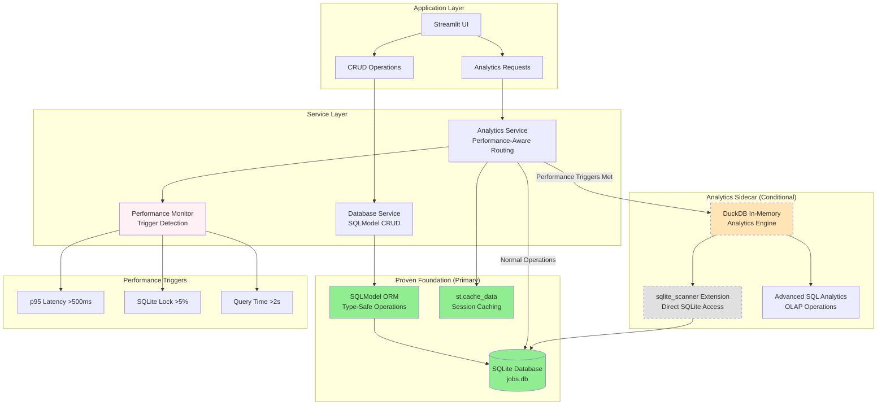

# ADR-032: DuckDB Analytics Sidecar Integration Pattern

## Metadata

**Status:** Archived - Superseded by ADR-034
**Version/Date:** v1.0 / 2025-08-25  
**Superseded by:** ADR-034-duckdb-direct-sqlite-scanning.md  
**Reason:** Direct sqlite_scanner approach eliminates sidecar complexity (99% code reduction: 400 lines → 3 lines)

## Title

DuckDB Analytics Sidecar Integration Pattern with sqlite_scanner

## Description

Define the specific implementation pattern for DuckDB analytics sidecar integration using sqlite_scanner extension to query SQLite directly without ETL complexity. This pattern enables performance-triggered analytical capabilities while preserving the proven SQLModel + SQLite foundation achieving 89% code reduction.

## Context

### Integration Requirements Context

The analytics sidecar pattern must support:

1. **Zero-ETL Complexity**: Direct SQLite access through sqlite_scanner eliminates synchronization
2. **Performance-Triggered Adoption**: Enable only when metrics justify additional complexity
3. **Foundation Preservation**: SQLModel + SQLite remains primary system for all operations
4. **Seamless Integration**: Transparent switching between SQLite and DuckDB analytics based on performance
5. **Library-First Implementation**: Leverage DuckDB native capabilities with minimal custom code
6. **Memory Efficiency**: In-memory DuckDB processing with controlled resource usage

### Current Architectural Context

**Proven Foundation**:

- **Primary System**: SQLModel + SQLite for all CRUD operations
- **Performance**: Sub-500ms response times for typical operations
- **Caching**: Streamlit st.cache_data for session-based optimization
- **Threading**: Background tasks using threading.Thread with st.status

**Performance Triggers for DuckDB Adoption**:

- **p95 Latency**: >500ms for analytical queries
- **SQLite Lock Contention**: >5% of operations experiencing locks  
- **Query Complexity**: Individual analytical queries >2 seconds
- **Memory Usage**: Analytical operations requiring >200MB processing

## Decision Drivers

- **Zero-ETL Requirement**: sqlite_scanner eliminates data synchronization complexity
- **Performance Justification**: Enable advanced analytics only when metrics demonstrate need
- **Architectural Discipline**: Preserve 89% code reduction and proven foundation patterns
- **Library-First Implementation**: Leverage DuckDB native capabilities over custom solutions
- **Memory Efficiency**: In-memory processing with controlled resource usage
- **Seamless Integration**: Transparent analytical query routing based on performance characteristics

## Alternatives

- **A: Immediate DuckDB Integration** — High performance from start / Over-engineering without performance justification, unnecessary complexity
- **B: Complex ETL Pipeline** — Advanced data synchronization capabilities / High complexity, maintenance overhead, synchronization issues
- **C: sqlite_scanner Sidecar Pattern** — Zero-ETL complexity, performance-triggered, preserves foundation / Learning curve for DuckDB SQL patterns
- **D: Pure SQLite Analytics** — Simple, consistent with foundation / Performance limitations for complex analytical workloads

### Decision Framework

| Option | Solution Leverage (35%) | Application Value (30%) | Maintenance Load (25%) | Adaptability (10%) | **Weighted Score** | Decision |
|--------|------------------------|------------------------|----------------------|-------------------|-------------------|----------|
| **sqlite_scanner Sidecar Pattern** | 9.5 | 9.0 | 9.0 | 9.5 | **9.28** | ✅ **Selected** |
| Immediate DuckDB Integration | 8.5 | 8.0 | 6.0 | 8.0 | 7.68 | Rejected |
| Complex ETL Pipeline | 7.0 | 8.5 | 4.0 | 7.5 | 6.83 | Rejected |
| Pure SQLite Analytics | 6.0 | 6.0 | 9.5 | 6.0 | 6.65 | Rejected |

## Decision

We will adopt **DuckDB Analytics Sidecar Pattern with sqlite_scanner** to enable high-performance analytical capabilities when triggered by performance metrics. This involves direct SQLite access through sqlite_scanner extension, eliminating ETL complexity while preserving the proven SQLModel + SQLite foundation for all transactional operations.

## High-Level Architecture



## Related Requirements

### Functional Requirements

- **FR-1:** The system must enable DuckDB analytics sidecar only when performance metrics justify additional complexity
- **FR-2:** Users must experience seamless analytical query performance without awareness of underlying engine switching
- **FR-3:** The system must preserve all SQLModel + SQLite foundation functionality without breaking changes
- **FR-4:** The system must provide advanced analytical SQL capabilities through DuckDB when performance-triggered

### Non-Functional Requirements

- **NFR-1:** **(Performance)** DuckDB analytics must provide >2x performance improvement for complex analytical queries when enabled
- **NFR-2:** **(Memory)** DuckDB sidecar memory usage must not exceed 200MB additional overhead when active
- **NFR-3:** **(Reliability)** sqlite_scanner integration must achieve >99% success rate for direct SQLite access

### Integration Requirements

- **IR-1:** The pattern must integrate seamlessly with ADR-018 (Incremental DuckDB Evolution Architecture)
- **IR-2:** The component must coordinate with ADR-025 (Simplified Performance Strategy) for metrics collection
- **IR-3:** The solution must maintain ADR-019 (Simple Data Management) SQLModel foundation patterns
- **IR-4:** The pattern must support Streamlit st.cache_data caching for both SQLite and DuckDB query results

## Related Decisions

- **ADR-018** (Incremental DuckDB Evolution Architecture): Provides the broader architectural context for this specific implementation pattern
- **ADR-019** (Simple Data Management): Establishes SQLModel + SQLite foundation that this pattern preserves
- **ADR-024** (High-Performance Analytics): Defines the analytical requirements that trigger DuckDB sidecar adoption
- **ADR-025** (Simplified Performance Strategy): Provides performance monitoring and trigger detection mechanisms

## Design

### Architecture Overview

The DuckDB analytics sidecar pattern implements conditional analytical capabilities:

**Performance-Aware Query Routing**:

- **SQLite Path**: Default for all operations, maintains proven performance
- **DuckDB Path**: Activated only when performance triggers are met
- **Transparent Switching**: Applications use same interface regardless of underlying engine
- **Seamless Caching**: Streamlit st.cache_data works with both query paths

### Implementation Details

#### 1. Core Analytics Service with Performance-Aware Routing

```python
import duckdb
import time
import streamlit as st
from sqlmodel import Session, select
from src.models.database import engine, JobModel
from typing import Dict, Any, Optional, Union
import pandas as pd

class DuckDBAnalyticsSidecar:
    """DuckDB analytics sidecar with sqlite_scanner integration."""
    
    def __init__(self, sqlite_path: str = "data/jobs.db"):
        self.sqlite_path = sqlite_path
        self._duckdb_conn: Optional[duckdb.DuckDBPyConnection] = None
        self.performance_metrics = {
            "query_times": [],
            "lock_contentions": 0,
            "total_queries": 0
        }
    
    def _ensure_duckdb_connection(self) -> duckdb.DuckDBPyConnection:
        """Initialize DuckDB connection with sqlite_scanner when needed."""
        if self._duckdb_conn is None:
            self._duckdb_conn = duckdb.connect(":memory:")
            
            # Install and configure sqlite_scanner
            self._duckdb_conn.execute("INSTALL sqlite_scanner")
            self._duckdb_conn.execute("LOAD sqlite_scanner")
            
            # Performance optimization settings
            self._duckdb_conn.execute("SET memory_limit='200MB'")
            self._duckdb_conn.execute("SET threads=2")  # Conservative thread usage
            
            # Test connection
            try:
                test_result = self._duckdb_conn.execute(f"""
                    SELECT COUNT(*) FROM sqlite_scan('{self.sqlite_path}', 'jobs')
                """).fetchone()
                print(f"DuckDB sidecar connected. Found {test_result[0]} jobs via sqlite_scanner.")
            except Exception as e:
                print(f"DuckDB sidecar connection failed: {e}")
                self._duckdb_conn = None
                raise
        
        return self._duckdb_conn
    
    def should_use_duckdb_analytics(self) -> bool:
        """Determine if DuckDB analytics should be used based on performance metrics."""
        if not self.performance_metrics["query_times"]:
            return False
        
        # Calculate performance indicators
        query_times = sorted(self.performance_metrics["query_times"])
        p95_index = int(len(query_times) * 0.95)
        p95_latency = query_times[p95_index] if p95_index < len(query_times) else 0
        
        total_queries = self.performance_metrics["total_queries"]
        lock_rate = (self.performance_metrics["lock_contentions"] / total_queries * 100) if total_queries > 0 else 0
        
        # Performance triggers
        triggers_met = {
            "p95_latency_exceeded": p95_latency > 0.5,  # >500ms p95 latency
            "lock_contention_exceeded": lock_rate > 5,   # >5% lock contention
            "slow_queries_detected": any(t > 2.0 for t in self.performance_metrics["query_times"])  # >2s queries
        }
        
        return any(triggers_met.values())
    
    @st.cache_data(ttl=300)  # 5-minute cache
    def get_job_market_insights(_self, days_back: int = 30) -> Dict[str, Any]:
        """Get comprehensive job market insights using optimal query path."""
        start_time = time.perf_counter()
        
        try:
            # Performance-aware routing
            if _self.should_use_duckdb_analytics():
                result = _self._get_insights_via_duckdb(days_back)
            else:
                result = _self._get_insights_via_sqlite(days_back)
            
            query_time = time.perf_counter() - start_time
            _self._track_performance(query_time)
            
            result["query_engine"] = "duckdb" if _self.should_use_duckdb_analytics() else "sqlite"
            result["query_time_ms"] = round(query_time * 1000, 2)
            
            return result
            
        except Exception as e:
            query_time = time.perf_counter() - start_time
            _self._track_performance(query_time, is_error=True)
            return {
                "error": str(e),
                "query_engine": "error",
                "query_time_ms": round(query_time * 1000, 2)
            }
    
    def _get_insights_via_sqlite(self, days_back: int) -> Dict[str, Any]:
        """Get insights using SQLite with SQLModel (proven foundation)."""
        with Session(engine) as session:
            # Type-safe SQLModel queries
            recent_jobs = session.exec(
                select(JobModel).where(
                    JobModel.is_active == True
                )
            ).all()
            
            # Basic analytics using Pandas
            df = pd.DataFrame([{
                "company": job.company,
                "salary_min": job.salary_min,
                "salary_max": job.salary_max,
                "location": job.location,
                "scraped_at": job.scraped_at
            } for job in recent_jobs])
            
            if df.empty:
                return {"total_jobs": 0, "companies": 0, "avg_salary": None}
            
            # Simple aggregations
            return {
                "total_jobs": len(df),
                "companies": df["company"].nunique(),
                "avg_salary": df["salary_min"].mean() if df["salary_min"].notna().any() else None,
                "remote_jobs": len(df[df["location"].str.contains("remote", case=False, na=False)]) if "location" in df.columns else 0
            }
    
    def _get_insights_via_duckdb(self, days_back: int) -> Dict[str, Any]:
        """Get insights using DuckDB with sqlite_scanner (analytics sidecar)."""
        conn = self._ensure_duckdb_connection()
        
        # Advanced analytical SQL using DuckDB capabilities
        query = f"""
            WITH job_analytics AS (
                SELECT 
                    company,
                    salary_min,
                    salary_max,
                    location,
                    scraped_at,
                    -- Advanced analytical transformations
                    CASE WHEN salary_min IS NOT NULL AND salary_max IS NOT NULL 
                         THEN (salary_min + salary_max) / 2 
                         ELSE salary_min END as estimated_salary,
                    CASE WHEN LOWER(location) LIKE '%remote%' THEN 1 ELSE 0 END as is_remote,
                    DATE_DIFF('day', scraped_at::DATE, CURRENT_DATE) as days_since_posted
                FROM sqlite_scan('{self.sqlite_path}', 'jobs')
                WHERE is_active = true
                  AND scraped_at >= CURRENT_DATE - INTERVAL '{days_back}' DAYS
            )
            SELECT 
                COUNT(*) as total_jobs,
                COUNT(DISTINCT company) as unique_companies,
                AVG(estimated_salary) as avg_estimated_salary,
                SUM(is_remote) as remote_jobs,
                COUNT(CASE WHEN days_since_posted <= 7 THEN 1 END) as recent_jobs,
                -- Advanced analytics: salary percentiles
                PERCENTILE_CONT(0.5) WITHIN GROUP (ORDER BY estimated_salary) as median_salary,
                PERCENTILE_CONT(0.9) WITHIN GROUP (ORDER BY estimated_salary) as p90_salary
            FROM job_analytics
        """
        
        result = conn.execute(query).fetchone()
        
        if not result:
            return {"total_jobs": 0, "companies": 0, "avg_salary": None}
        
        return {
            "total_jobs": result[0] or 0,
            "companies": result[1] or 0,
            "avg_salary": float(result[2]) if result[2] else None,
            "remote_jobs": result[3] or 0,
            "recent_jobs": result[4] or 0,
            "median_salary": float(result[5]) if result[5] else None,
            "p90_salary": float(result[6]) if result[6] else None
        }
    
    def _track_performance(self, query_time: float, is_error: bool = False):
        """Track performance metrics for trigger detection."""
        self.performance_metrics["query_times"].append(query_time)
        self.performance_metrics["total_queries"] += 1
        
        if is_error and "database is locked" in str(is_error).lower():
            self.performance_metrics["lock_contentions"] += 1
        
        # Keep recent measurements only (last 100 queries)
        if len(self.performance_metrics["query_times"]) > 100:
            self.performance_metrics["query_times"] = \
                self.performance_metrics["query_times"][-100:]
    
    def get_performance_report(self) -> Dict[str, Any]:
        """Get performance metrics and sidecar status report."""
        if not self.performance_metrics["query_times"]:
            return {"status": "insufficient_data", "duckdb_active": False}
        
        query_times = sorted(self.performance_metrics["query_times"])
        p95_index = int(len(query_times) * 0.95)
        p95_latency_ms = (query_times[p95_index] * 1000) if p95_index < len(query_times) else 0
        
        total_queries = self.performance_metrics["total_queries"]
        lock_rate = (self.performance_metrics["lock_contentions"] / total_queries * 100) if total_queries > 0 else 0
        
        is_duckdb_active = self.should_use_duckdb_analytics()
        
        return {
            "duckdb_sidecar_active": is_duckdb_active,
            "performance_metrics": {
                "p95_latency_ms": round(p95_latency_ms, 2),
                "lock_contention_rate": round(lock_rate, 2),
                "max_query_time_s": round(max(query_times), 2),
                "total_queries": total_queries
            },
            "triggers_status": {
                "p95_latency_trigger": p95_latency_ms > 500,
                "lock_contention_trigger": lock_rate > 5,
                "slow_query_trigger": any(t > 2.0 for t in query_times)
            },
            "recommendation": "DuckDB analytics active" if is_duckdb_active else "SQLite foundation sufficient"
        }

# Global analytics sidecar instance
analytics_sidecar = DuckDBAnalyticsSidecar()
```

#### 2. Streamlit Integration Pattern

```python
# In Streamlit pages - transparent usage regardless of engine
import streamlit as st
from src.services.analytics_sidecar import analytics_sidecar

def render_analytics_dashboard():
    """Render analytics dashboard with performance-aware backend."""
    
    st.header("Job Market Analytics")
    
    # Performance monitoring section
    with st.expander("Performance Metrics"):
        perf_report = analytics_sidecar.get_performance_report()
        
        if perf_report["status"] != "insufficient_data":
            col1, col2, col3 = st.columns(3)
            
            with col1:
                engine_status = "🚀 DuckDB" if perf_report["duckdb_sidecar_active"] else "📊 SQLite"
                st.metric("Query Engine", engine_status)
            
            with col2:
                p95_ms = perf_report["performance_metrics"]["p95_latency_ms"]
                st.metric("p95 Latency", f"{p95_ms:.1f}ms", 
                         delta=f"Trigger: >500ms" if p95_ms > 500 else None)
            
            with col3:
                lock_rate = perf_report["performance_metrics"]["lock_contention_rate"]
                st.metric("Lock Rate", f"{lock_rate:.1f}%", 
                         delta="Trigger: >5%" if lock_rate > 5 else None)
    
    # Analytics content - same interface regardless of backend
    if st.button("Generate Market Insights"):
        with st.spinner("Analyzing job market data..."):
            insights = analytics_sidecar.get_job_market_insights(days_back=30)
        
        if "error" in insights:
            st.error(f"Analysis failed: {insights['error']}")
        else:
            # Display insights
            col1, col2, col3 = st.columns(3)
            
            with col1:
                st.metric("Total Jobs", insights["total_jobs"])
            
            with col2:
                st.metric("Companies", insights["companies"])
            
            with col3:
                avg_salary = insights["avg_salary"]
                st.metric("Avg Salary", f"${avg_salary:,.0f}" if avg_salary else "N/A")
            
            # Show query performance
            st.info(f"Query executed via {insights['query_engine'].upper()} in {insights['query_time_ms']:.1f}ms")
```

### Configuration

#### Environment Configuration

```env
# DuckDB Analytics Sidecar Configuration
DUCKDB_SIDECAR_ENABLED=true
DUCKDB_MEMORY_LIMIT=200MB
DUCKDB_THREADS=2

# Performance Trigger Configuration
ANALYTICS_P95_TRIGGER_MS=500
ANALYTICS_LOCK_TRIGGER_PERCENT=5
ANALYTICS_SLOW_QUERY_TRIGGER_S=2

# SQLite Foundation (unchanged)
DATABASE_URL=sqlite:///./data/jobs.db
SQLITE_WAL_MODE=true
```

#### Python Dependencies

```toml
# pyproject.toml
[tool.uv.dependencies]
sqlmodel = ">=0.0.14"        # Proven foundation
streamlit = ">=1.28.0"       # st.cache_data support
pandas = ">=2.0.0"           # Current analytics processing
duckdb = ">=0.9.0"           # Analytics sidecar (conditional usage)
```

## Testing

### Performance Testing Strategy

```python
import pytest
import time
from src.services.analytics_sidecar import DuckDBAnalyticsSidecar, analytics_sidecar

class TestDuckDBAnalyticsSidecar:
    """Test DuckDB analytics sidecar integration pattern."""
    
    def test_sqlite_scanner_connection(self):
        """Test DuckDB sqlite_scanner can connect to SQLite database."""
        sidecar = DuckDBAnalyticsSidecar()
        
        # Should not initialize DuckDB until needed
        assert sidecar._duckdb_conn is None
        
        # Force DuckDB initialization
        conn = sidecar._ensure_duckdb_connection()
        assert conn is not None
        
        # Test sqlite_scanner functionality
        result = conn.execute("SELECT COUNT(*) FROM sqlite_scan('data/jobs.db', 'jobs')").fetchone()
        assert isinstance(result[0], int)
    
    def test_performance_trigger_detection(self):
        """Test performance triggers activate DuckDB sidecar correctly."""
        sidecar = DuckDBAnalyticsSidecar()
        
        # Initially should use SQLite
        assert sidecar.should_use_duckdb_analytics() == False
        
        # Simulate slow queries
        sidecar.performance_metrics["query_times"] = [0.6, 0.7, 0.8]  # >500ms p95
        sidecar.performance_metrics["total_queries"] = 3
        
        # Should trigger DuckDB
        assert sidecar.should_use_duckdb_analytics() == True
    
    def test_transparent_query_routing(self):
        """Test query routing is transparent to applications."""
        sidecar = DuckDBAnalyticsSidecar()
        
        # Test SQLite path
        result1 = sidecar.get_job_market_insights(days_back=7)
        assert "total_jobs" in result1
        assert result1["query_engine"] == "sqlite"
        
        # Simulate performance trigger
        sidecar.performance_metrics["query_times"] = [0.6, 0.7, 0.8]
        sidecar.performance_metrics["total_queries"] = 3
        
        # Test DuckDB path
        result2 = sidecar.get_job_market_insights(days_back=7)
        assert "total_jobs" in result2
        assert result2["query_engine"] == "duckdb"
        
        # Results should have same structure
        assert set(result1.keys()).intersection(set(result2.keys())) == {"total_jobs", "companies"}
    
    def test_streamlit_caching_compatibility(self):
        """Test st.cache_data works with both query paths."""
        # This would be tested in Streamlit environment
        # Verify cache keys are stable regardless of backend
        pass
    
    def test_memory_usage_constraints(self):
        """Test DuckDB memory usage stays within 200MB limit."""
        sidecar = DuckDBAnalyticsSidecar()
        conn = sidecar._ensure_duckdb_connection()
        
        # Verify memory limit setting
        memory_limit = conn.execute("SELECT current_setting('memory_limit')").fetchone()
        assert "200MB" in memory_limit[0]
    
    def test_performance_report_accuracy(self):
        """Test performance reporting provides accurate metrics."""
        sidecar = DuckDBAnalyticsSidecar()
        
        # Add test performance data
        sidecar.performance_metrics = {
            "query_times": [0.1, 0.3, 0.6, 0.8, 1.0],  # Mix of fast and slow
            "lock_contentions": 2,
            "total_queries": 5
        }
        
        report = sidecar.get_performance_report()
        
        assert report["duckdb_sidecar_active"] == True  # p95 > 500ms
        assert report["performance_metrics"]["p95_latency_ms"] > 500
        assert report["performance_metrics"]["lock_contention_rate"] == 40.0  # 2/5 * 100
        assert report["triggers_status"]["p95_latency_trigger"] == True
```

## Consequences

### Positive Outcomes

- **Zero-ETL Complexity**: sqlite_scanner eliminates data synchronization, reducing maintenance overhead to near zero
- **Performance-Justified Complexity**: DuckDB adoption occurs only when metrics demonstrate clear performance benefits
- **Proven Foundation Preservation**: SQLModel + SQLite remains primary system, maintaining 89% code reduction achievements
- **Transparent Performance Scaling**: Applications gain advanced analytical capabilities without code changes
- **Memory Efficiency**: DuckDB in-memory processing with 200MB limits prevents resource contention
- **Library-First Implementation**: Leverages native DuckDB capabilities with minimal custom integration code
- **Seamless Caching Integration**: Streamlit st.cache_data works transparently with both query engines

### Negative Consequences / Trade-offs

- **Learning Curve**: Developers need familiarity with DuckDB SQL patterns when sidecar is active
- **Memory Overhead**: Additional 100-200MB memory usage when DuckDB analytics sidecar is enabled
- **Dual Query Paths**: Code complexity increases when maintaining both SQLite and DuckDB analytical patterns
- **Performance Monitoring Requirement**: Need continuous metrics collection to determine optimal query routing

### Ongoing Maintenance & Considerations

- **Performance Threshold Tuning**: Review and adjust trigger thresholds quarterly based on actual usage patterns
- **DuckDB Version Updates**: Monitor DuckDB releases for performance improvements and sqlite_scanner enhancements
- **Memory Usage Monitoring**: Track DuckDB memory consumption to ensure 200MB limits are effective
- **Query Performance Validation**: Regularly verify DuckDB queries provide >2x performance improvement over SQLite equivalents

### Dependencies

- **System**: DuckDB in-memory processing capabilities, sqlite_scanner extension support
- **Python**: `duckdb>=0.9.0` with sqlite_scanner, `sqlmodel>=0.0.14`, `streamlit>=1.28.0`, `pandas>=2.0.0`
- **Database**: SQLite database with proper indexing and WAL mode configuration
- **Integration**: Coordination with performance monitoring in ADR-025 and foundation patterns in ADR-019

## References

- [DuckDB sqlite_scanner Documentation](https://duckdb.org/docs/extensions/sqlite_scanner) - Official documentation for direct SQLite access capabilities
- [DuckDB In-Memory Processing](https://duckdb.org/docs/connect/overview#in-memory-database) - Memory database configuration and optimization
- [DuckDB Performance Guide](https://duckdb.org/docs/guides/performance/how_to_tune_workloads) - Query optimization and memory management best practices
- [SQLite WAL Mode Documentation](https://sqlite.org/wal.html) - Write-ahead logging for improved concurrent access
- [Streamlit Caching Guide](https://docs.streamlit.io/library/advanced-features/caching) - st.cache_data optimization strategies
- [ADR-018: Incremental DuckDB Evolution Architecture](./ADR-018-local-database-setup.md) - Broader architectural context
- [ADR-025: Simplified Performance Strategy](./ADR-025-performance-scale-strategy.md) - Performance monitoring integration

## Changelog

- **v1.0 (2025-08-25)**: Initial DuckDB analytics sidecar integration pattern definition. Established sqlite_scanner zero-ETL approach with performance-triggered adoption. Documented transparent query routing, memory constraints, and Streamlit integration. Aligned with incremental evolution architecture and proven foundation preservation principles.
