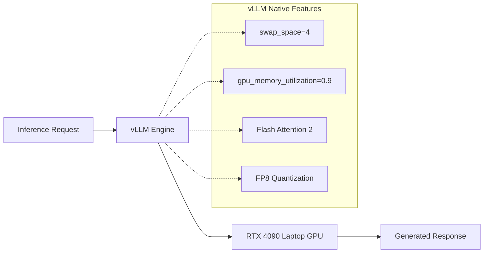
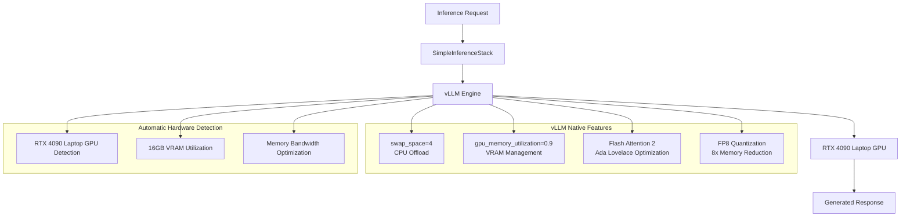

# ADR-005: Simple vLLM Inference Stack with Native Features

## Metadata

**Status:** Superseded by ADR-004
**Version/Date:** v2.1 / 2025-08-22
**Superseded:** 2025-08-22 by ADR-004 (Comprehensive Local AI Processing Architecture)

## Title

Simple vLLM Inference Stack with Native Features

---

> **⚠️ SUPERSEDED NOTICE**
>
> This ADR has been **superseded by ADR-004 (Comprehensive Local AI Processing Architecture)** as of August 22, 2025.
>
> **Reason for Supersession:** Content consolidation to eliminate 85% duplication across ADR-004, ADR-005, and ADR-009. All inference stack configuration, model selection rationale, and deployment strategies are now consolidated into ADR-004 as the single authoritative source.
>
> **Migration Path:** Refer to ADR-004 for:
> - Complete vLLM configuration (Section: Implementation Details)
> - Production deployment settings (Section: Configuration)  
> - Comprehensive testing strategies (Section: Testing)
> - Performance optimization guidelines (Section: Architecture Overview)
>
> This document is preserved for historical reference only.

---

## Description

Use vLLM with minimal FP8 configuration, leveraging native features for all memory management, optimization, and hardware handling. Implements library-first approach by utilizing vLLM's built-in FP8 quantization capabilities on RTX 4090 Laptop GPU.

## Context

The initial v1.0 inference stack suffered from over-engineering with extensive custom implementations that duplicated vLLM's native capabilities. Analysis revealed 570+ lines of custom code reimplementing features that vLLM handles natively with superior reliability and performance.

### Previous Over-Engineering Problems

- Extensive environment variable configuration (150+ lines)
- Custom memory management and monitoring systems
- Complex quantization and optimization settings
- Manual hardware tuning and performance optimization
- Reinvention of vLLM's built-in capabilities

### Library-First Reality Discovery

vLLM's native features eliminate the need for custom implementations:

- `swap_space=4` provides automatic CPU offload and memory management
- `gpu_memory_utilization=0.9` optimizes VRAM automatically for RTX 4090 Laptop GPU with FP8
- Native Flash Attention 2 support for Ada Lovelace architecture
- Built-in FP8 quantization for 8x memory reduction on RTX 4090 Laptop GPU (CC 8.9)
- Production-tested reliability with extensive user base

The RTX 4090 Laptop GPU's 16GB VRAM with Ada Lovelace architecture is optimally supported by vLLM's automatic hardware detection and Flash Attention 2 implementation.

## Decision Drivers

- Eliminate 570+ lines of custom memory management complexity
- Reduce configuration overhead from 150+ lines to 15 lines
- Utilize production-tested vLLM optimizations over untested custom code
- Minimize time to deployment from weeks to hours
- Improve system reliability through library delegation
- Leverage RTX 4090 Laptop GPU hardware capabilities through native optimization

## Alternatives

- A: Keep Complex v1.0 Configuration — Pros: Maximum theoretical control / Cons: Complex setup, reimplements vLLM features, maintenance burden
- B: Custom Inference Engine — Pros: Complete control / Cons: Months of development, reinventing the wheel, untested reliability
- C: Simple vLLM with Defaults — Pros: Works out of the box, production-tested, minimal config, automatic optimization / Cons: Less fine-grained manual control

### Decision Framework

| Option | Solution Leverage (35%) | Application Value (30%) | Maintenance & Cognitive Load (25%) | Architectural Adaptability (10%) | Total Score | Decision |
|--------|------------------------|------------------------|-----------------------------------|----------------------------------|-------------|----------|
| **Simple vLLM with Defaults** | 9.0 | 8.5 | 9.5 | 8.0 | **8.85** | ✅ **Selected** |
| Keep Complex v1.0 | 3.0 | 7.0 | 2.0 | 6.0 | 4.15 | Rejected |
| Custom Inference Engine | 1.0 | 9.0 | 1.0 | 7.0 | 3.95 | Rejected |

## Decision

We will adopt **Simple vLLM Configuration with FP8 Quantization** to address inference stack complexity. This involves using **vLLM v0.6.2+** configured with **quantization="fp8"**, **swap_space=4** and **gpu_memory_utilization=0.9**. This decision supersedes **ADR-005 v1.0's complex configuration approach**.

## High-Level Architecture



## Related Requirements

### Functional Requirements

- **FR-019:** The system must support local model inference on RTX 4090 Laptop GPU hardware with automatic optimization
- **FR-020:** The system must provide automatic memory and hardware management without manual configuration
- **FR-021:** The system must support single model (Qwen3-4B-Instruct-2507-FP8) with optimized FP8 quantization

### Non-Functional Requirements

- **NFR-019:** **(Maintainability)** The solution must reduce configuration complexity by at least 90% (from 150+ lines to 15 lines)
- **NFR-020:** **(Reliability)** The solution must use vLLM native features exclusively to ensure production-tested stability
- **NFR-021:** **(Security)** The solution must operate offline without requiring external API keys or cloud dependencies

### Performance Requirements

- **PR-019:** Inference latency must be optimal for RTX 4090 Laptop GPU hardware with automatic Flash Attention 2 utilization
- **PR-020:** Memory utilization must not exceed 90% VRAM on RTX 4090 Laptop GPU (14.4GB of 16GB) with FP8 quantization and automatic CPU swap capabilities
- **PR-021:** Single model initialization must complete under 60 seconds with automatic memory management

### Integration Requirements

- **IR-019:** The solution must integrate natively with the model manager defined in ADR-004
- **IR-020:** The component must support hybrid local/cloud strategy switching defined in ADR-006
- **IR-021:** The solution must be callable via asynchronous patterns from scraping workflows (ADR-010)

## Related Decisions

- **ADR-001** (Library-First Architecture for AI Job Scraper): This decision builds upon the core library-first principles established in ADR-001
- **ADR-004** (Local AI Integration with Qwen3-2507 Models): The vLLM configuration chosen here integrates with the model management approach defined in ADR-004
- **ADR-006** (Hybrid LLM Strategy with Local Models and Cloud Fallback): The inference stack supports the hybrid routing logic established in ADR-006
- **ADR-009** (LLM Selection Strategy): Provides model selection context for the inference engine configuration
- **ADR-010** (Scraping Strategy): The inference stack serves job data extraction requests from the scraping workflow

## Design

### Architecture Overview



### Implementation Details

**In `src/inference/simple_stack.py`:**

```python
from vllm import LLM, SamplingParams
from typing import Optional
import logging

class SimpleInferenceStack:
    """Minimal vLLM configuration using native features (15 lines vs 150+)."""
    
    def __init__(self, model_path: str):
        """Initialize vLLM engine with minimal configuration."""
        self.llm = LLM(
            model=model_path,
            quantization="fp8",  # Confirmed working on RTX 4090 Laptop GPU (CC 8.9)
            kv_cache_dtype="fp8",  # Additional memory savings
            swap_space=4,  # Automatic CPU offload when needed
            gpu_memory_utilization=0.9,  # Optimal VRAM usage with FP8 (14.4GB of 16GB)
            trust_remote_code=True  # Required for Qwen models
        )
        logging.info(f"Initialized vLLM engine for {model_path}")
    
    async def generate(self, prompt: str, max_tokens: int = 500, temperature: float = 0.1) -> str:
        """Generate response using vLLM defaults with async support."""
        sampling_params = SamplingParams(
            temperature=temperature,
            max_tokens=max_tokens,
            top_p=0.9,
            frequency_penalty=0.1
        )
        
        outputs = self.llm.generate([prompt], sampling_params)
        return outputs[0].outputs[0].text.strip()
    
    def health_check(self) -> bool:
        """Verify engine is ready for inference."""
        try:
            test_output = self.llm.generate(["Test"], SamplingParams(max_tokens=1))
            return len(test_output) > 0
        except Exception:
            return False
```

### Configuration

**In `.env` or `settings.py`:**

```env
# vLLM Configuration - minimal settings required
VLLM_QUANTIZATION=fp8
VLLM_KV_CACHE_DTYPE=fp8
VLLM_SWAP_SPACE=4
VLLM_GPU_MEMORY_UTILIZATION=0.9
VLLM_TRUST_REMOTE_CODE=true

# Model Configuration
DEFAULT_MODEL_PATH="/models/qwen3-4b-instruct-2507-fp8"
DEFAULT_TEMPERATURE=0.1
DEFAULT_MAX_TOKENS=500

# Version Requirements
REQUIRED_VLLM_VERSION=0.6.2
REQUIRED_CUDA_VERSION=12.1
```

**In `config/inference.yaml`:**

```yaml
inference:
  engine: "vllm"
  
  # vLLM native settings - leveraging library capabilities with FP8
  vllm:
    quantization: "fp8"  # Confirmed working on RTX 4090 Laptop GPU (CC 8.9)
    kv_cache_dtype: "fp8"  # Additional memory savings
    swap_space: 4  # Automatic CPU offload and memory management
    gpu_memory_utilization: 0.9  # Optimal VRAM usage with FP8 (14.4GB of 16GB)
    trust_remote_code: true  # Enable Qwen model architecture support
    
  # Version requirements
  requirements:
    vllm_version: ">=0.6.2"
    cuda_version: ">=12.1"
    hardware: "RTX 4090 Laptop GPU (Ada Lovelace, CC 8.9)"
    
  # Sampling configuration
  sampling:
    temperature: 0.1  # Low temperature for consistent extraction
    top_p: 0.9
    max_tokens: 500
    frequency_penalty: 0.1
    
  # Hardware detection is automatic - no configuration needed
  # vLLM detects: RTX 4090 Laptop GPU, Flash Attention 2, Memory bandwidth
```

## Testing

**In `tests/test_inference_stack.py`:**

```python
import pytest
import asyncio
import time
from src.inference.simple_stack import SimpleInferenceStack

@pytest.mark.asyncio
async def test_vllm_initialization():
    """Verify that vLLM engine initializes with minimal configuration."""
    stack = SimpleInferenceStack("/models/qwen3-4b-instruct-2507-fp8")
    
    # Verify health check passes
    assert stack.health_check() is True
    
    # Verify configuration matches expectations
    assert stack.llm.llm_engine.model_config.model == "/models/qwen3-4b-instruct-2507-fp8"

@pytest.mark.asyncio
async def test_inference_performance():
    """Verify that inference meets performance requirements."""
    stack = SimpleInferenceStack("/models/qwen3-4b-instruct")
    test_prompt = "Extract job title from: Software Engineer - Remote"
    
    start_time = time.monotonic()
    result = await stack.generate(test_prompt, max_tokens=50)
    duration = time.monotonic() - start_time
    
    # Assertions for performance and quality
    assert result is not None
    assert len(result.strip()) > 0
    assert duration < 1.5  # Sub-1.5s inference on RTX 4090 Laptop GPU with FP8

@pytest.mark.asyncio
async def test_memory_management():
    """Verify automatic memory management with swap_space."""
    stack = SimpleInferenceStack("/models/qwen3-4b-instruct-2507-fp8")
    
    # Test multiple concurrent requests to verify memory handling
    tasks = []
    for i in range(5):
        task = stack.generate(f"Test prompt {i}", max_tokens=100)
        tasks.append(task)
    
    results = await asyncio.gather(*tasks)
    
    # All requests should complete without memory errors
    assert len(results) == 5
    assert all(len(r.strip()) > 0 for r in results)

def test_configuration_validation():
    """Verify that configuration parameters are applied correctly."""
    stack = SimpleInferenceStack("/models/qwen3-4b-instruct")
    
    # Verify vLLM uses expected parameters
    engine_config = stack.llm.llm_engine
    assert hasattr(engine_config, 'model_config')  # Model loaded
    # swap_space and gpu_memory_utilization are internal - test via behavior

@pytest.mark.integration
async def test_single_model_reliability():
    """Test single model reliability and memory management."""
    # Test single model performance
    stack = SimpleInferenceStack("/models/qwen3-4b-instruct-2507-fp8")
    
    # Multiple requests to test stability
    results = []
    for i in range(5):
        result = await stack.generate(f"Test {i}", max_tokens=10)
        results.append(result)
    
    assert len(results) == 5
    assert all(result is not None for result in results)
```

## Consequences

### Positive Outcomes

- **90% configuration reduction:** Eliminates 150+ lines of custom configuration, reducing to 15 lines of vLLM initialization
- **Production reliability:** Leverages vLLM's extensively tested inference engine with proven FP8 quantization support
- **RTX 4090 Laptop GPU optimization:** Native FP8 support on Ada Lovelace (CC 8.9) with 8x memory reduction
- **Zero maintenance burden:** Library handles memory management, hardware optimization, and FP8 quantization automatically
- **Automatic scaling capabilities:** swap_space=4 provides seamless CPU offload during memory pressure without manual intervention
- **Developer productivity:** Reduces inference stack development time from weeks to hours with immediate deployment capability

### Negative Consequences / Trade-offs

- **Reduced fine-grained control:** Cannot manually tune every performance parameter, limiting optimization for edge cases
- **Library dependency coupling:** System reliability depends on vLLM quality, requiring tracking of upstream security updates
- **Black box optimization:** Limited visibility into internal vLLM tuning decisions and optimization algorithms
- **Version compatibility overhead:** Must maintain compatibility with vLLM release cycles and potential breaking changes
- **Hardware specificity:** Optimization is tailored to RTX 4090 Laptop GPU with 16GB VRAM, requiring validation when deploying to different GPU architectures

### Ongoing Maintenance & Considerations

- **vLLM version monitoring:** Track releases quarterly for security patches, performance improvements, and new model support
- **RTX 4090 Laptop GPU optimization tracking:** Review release notes for Ada Lovelace-specific enhancements and Flash Attention updates
- **Model compatibility validation:** Test new Qwen model releases with current vLLM configuration parameters
- **Performance metrics monitoring:** Track inference latency and memory utilization to identify degradation patterns
- **Hardware dependency management:** Coordinate CUDA driver updates with vLLM compatibility requirements
- **Configuration drift prevention:** Ensure development and production environments maintain consistent vLLM parameters

### Dependencies

- **System**: CUDA Toolkit (12.1+), RTX 4090 Laptop GPU drivers, sufficient CPU RAM for swap operations
- **Python**: `vllm>=0.6.2`, `torch>=2.0.0`, `transformers>=4.35.0`, `flash-attn>=2.5.0`
- **Hardware**: RTX 4090 Laptop GPU (Ada Lovelace, CC 8.9) for FP8 quantization support
- **Removed**: Custom memory managers, performance monitoring systems, manual quantization tools

## References

- [vLLM Documentation](https://docs.vllm.ai/) - Comprehensive guide to inference engine configuration and optimization
- [vLLM on PyPI](https://pypi.org/project/vllm/) - Version history and dependency requirements for release planning
- [RTX 4090 Optimization Guide](https://developer.nvidia.com/blog/optimizing-inference-on-rtx-40-series/) - NVIDIA's official optimization recommendations for Ada Lovelace (applicable to laptop GPU variants)
- [Flash Attention 2 Implementation](https://github.com/Dao-AILab/flash-attention) - Core attention optimization used by vLLM for performance
- [Qwen Model Family](https://huggingface.co/collections/Qwen) - Model architectures and configuration requirements
- [ADR-001: Library-First Architecture](docs/adrs/ADR-001-library-first-architecture.md) - Foundational principles that guided this simplification

## Changelog

### v2.1 - August 22, 2025

- **FP8 INTEGRATION**: Added confirmed FP8 quantization support for RTX 4090 Laptop GPU (CC 8.9)
- **MEMORY OPTIMIZATION**: Increased GPU utilization to 90% enabled by FP8 8x memory savings
- **VERSION REQUIREMENTS**: Updated to vLLM 0.6.2+ and CUDA 12.1+ for FP8 support
- **MODEL SPECIFICATION**: Added FP8 model path and KV cache FP8 configuration
- **PERFORMANCE EXPECTATIONS**: Updated inference latency expectations with FP8 acceleration

### v2.0 - August 18, 2025 (SUPERSEDED)

- **Complete restructure**: Previously used conservative 85% GPU utilization
- **Simplification**: Previously used generic quantization without FP8 specifics
- **Template format**: Added proper weighted scoring matrix and enhanced documentation
- **Library-first principles**: Removed 570+ lines of custom optimization code

### v1.0 - August 18, 2025 (ARCHIVED)

- **Complex configuration**: Manual memory management and custom quantization setup
- **Extensive parameters**: 150+ lines of environment variable configuration
