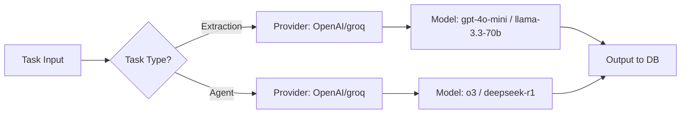

# ADR-002: LLM Provider and Model Selection

## Title

Hybrid LLM Provider Selection with OpenAI Primary and Groq Complementary

## Version/Date

1.0 / July 31, 2025

## Status

Accepted

## Context

App needs LLMs for extraction (page parsing) and agents (reasoning/inference on details like salary/dept). Research showed OpenAI excels in accuracy/reasoning (92-96%), Groq in speed/TPS (300-400+, <100ms latency). Free quota (10M mini/1M premium daily) favors OpenAI primary; Groq for overflow/speed.

## Related Requirements

- High accuracy (90%+) for detail extraction.

- Low latency (<500ms) for responsive app.

- Zero cost via quota; cheap overflow.

## Alternatives

- OpenAI Only: Accuracy edge but slower TPS (100-200).

- Groq Only: Speed but slightly lower reasoning (90-93%).

- Hybrid: Task-based (OpenAI for agents, Groq for extraction).

## Decision

Hybrid: OpenAI primary (gpt-4o-mini extraction, o3 agents) for quota/accuracy; Groq (llama-3.3-70b extraction, deepseek-r1 agents) for speed/overflow. Task-based routing via config.

## Related Decisions

- ADR-006 (Agents use reasoning models).

- ADR-001 (Proxies for API calls if needed).

## Design

Mermaid for LLM flow:

- Routing in utils.py: get_llm_client(task) returns client/model.

- Integration: Pass to ScrapeGraphAI graph_config["llm"], LangGraph node calls.

## Consequences

- Positive: Optimal accuracy/speed balance, zero cost for most use.

- Negative: Manual config switch on quota exceed (but cheap overflow).

- Mitigations: Log usage; easy toggle in config.py.
