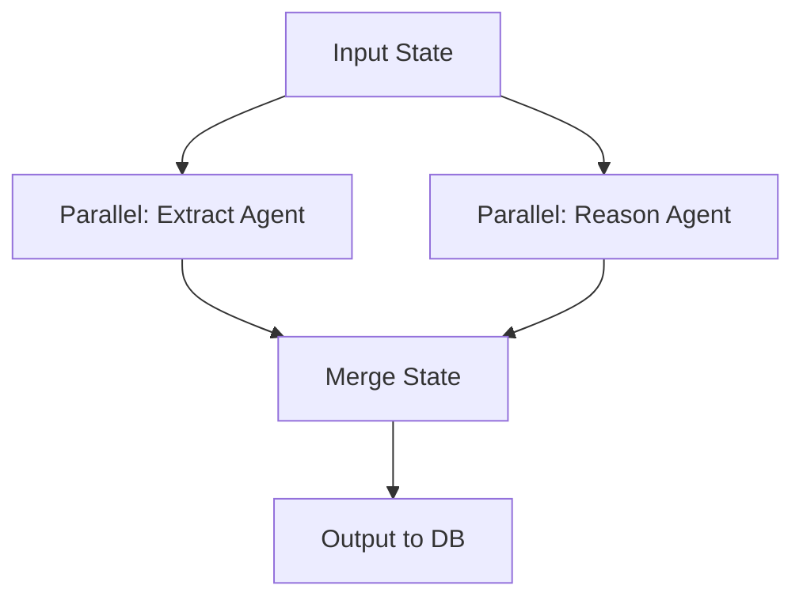

# ADR-006: Agentic Workflows with LangGraph

## Title

LangGraph for Multi-Step Agentic Scraping and Reasoning

## Version/Date

1.0 / July 31, 2025

## Status

Accepted

## Context

Need multi-step (scrape -> extract -> reason on details). LangGraph provides parallel nodes/isolation (GitHub #3147), checkpointing for resilience.

## Related Requirements

- Parallel multi-agent for perf.

- State persistence on errors.

## Alternatives

- Sequential Custom Code: Simple but slow.

- CrewAI: Role-based but heavier.

## Decision

Use LangGraph Parallel for concurrent agents, SqliteSaver for checkpointing (toggle).

## Related Decisions

- ADR-003 (Parallel execution).

- ADR-004 (Integrates with streaming).

## Design

Mermaid for agent graph:

- scraper.py: StateGraph with Parallel<extract, reason>; compile with checkpointer if toggled.

## Consequences

- Positive: 2x perf with parallel, resume on fails.

- Negative: Minor state management complexity.

- Mitigations: Config toggle; test isolation.
