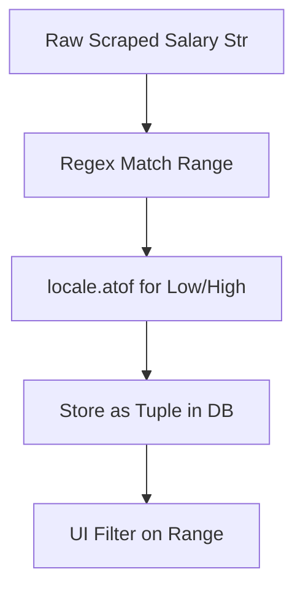

# ADR-007: Database Schema Enhancements

## Title

SQLModel Schema with Salary/Dept Fields and Parsing

## Version/Date

1.0 / July 31, 2025

## Status

Accepted

## Context

Need to store/extract salary (ranges) and dept internationally. Research showed regex + locale.atof for parsing (SO examples).

## Related Requirements

- Parse salary to tuple for filtering.

- Support international formats.

## Alternatives

- Str Storage Only: Simple but no filtering.

- Custom Parser: Flexible but DRY violation.

## Decision

Add salary tuple field with validator using regex/locale.atof; dept as str.

## Related Decisions

- ADR-002 (Salary parsing).

## Design

Mermaid for data flow:

- models.py: @validator with re.match/locale.atof for salary parsing.

## Consequences

- Positive: Filterable data, international support.

- Negative: Parsing errors on invalid formats.

- Mitigations: Optional field; log errors.
