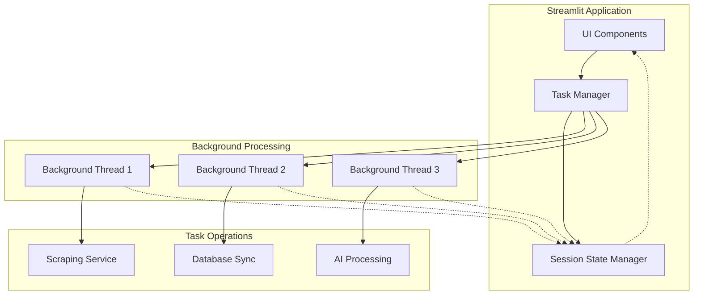

# ADR-023: Background Job Processing with Streamlit Integration

## Metadata

**Status:** Accepted  
**Version/Date:** v1.0 / 2025-08-20

## Title

Background Job Processing Architecture for Streamlit Applications

## Description

Implement background job processing system for long-running scraping and data processing tasks using Python threading and Streamlit's built-in state management, ensuring UI responsiveness while providing real-time progress updates.

## Context

The AI Job Scraper requires background job processing for long-running operations that currently block the Streamlit UI, creating poor user experience. The system needs to handle scraping operations (5-15 minutes), database synchronization tasks (processing 1000+ jobs), and AI processing workflows while maintaining UI responsiveness.

Given Streamlit framework adoption (per **ADR-017**), we need a background processing solution that integrates naturally with Streamlit's execution model and session state management. The solution must execute background tasks without UI blocking, provide real-time progress updates, support task cancellation and error handling, and maintain simple architecture for local development.

Current challenges include Streamlit's synchronous execution model blocking long-running operations, lack of native background processing capabilities, and need for real-time progress feedback without external infrastructure complexity.

## Decision Drivers

- **Streamlit Integration**: Natural integration with Streamlit's execution model and session state
- **Implementation Simplicity**: Simple threading approach without external dependencies  
- **Local Development Optimization**: Optimized for development and single-user scenarios
- **Real-time Updates**: Quality of progress feedback through UI rerun mechanism
- **Zero Dependencies**: No external infrastructure or service requirements

## Alternatives

- **A: Redis Queue (RQ)** — Distributed processing, persistence, advanced queue features / External dependency, infrastructure complexity, over-engineering for local development
- **B: Celery** — Enterprise-grade task processing, comprehensive features / Complex setup, heavy dependencies, resource overhead  
- **C: asyncio** — Python native async processing, efficient concurrency / Complex integration with Streamlit's threading model, execution complexity
- **D: Threading + Session State** — Native Streamlit integration, simple implementation, zero external dependencies / Limited scalability, GIL limitations, no persistence across restarts

### Decision Framework

| Model / Option | Solution Leverage (Weight: 35%) | Application Value (Weight: 30%) | Maintenance & Cognitive Load (Weight: 25%) | Architectural Adaptability (Weight: 10%) | Total Score | Decision |
| -------------- | ------------------------------- | ------------------------------- | ------------------------------------------ | ---------------------------------------- | ----------- | -------- |
| **Threading + Session State** | 10 | 9 | 9 | 8 | **9.3** | ✅ **Selected** |
| Redis Queue (RQ) | 6 | 8 | 7 | 9 | 7.2 | Rejected |
| asyncio | 5 | 7 | 6 | 8 | 6.4 | Rejected |
| Celery | 4 | 5 | 4 | 7 | 4.7 | Rejected |

## Decision

We will adopt **Threading + Session State** to address background job processing requirements. This involves using **Python threading** configured with **Streamlit session state management** for task tracking and progress updates.

## High-Level Architecture



## Related Requirements

### Functional Requirements

- **FR-023-01:** Execute background tasks without blocking Streamlit UI
- **FR-023-02:** Provide real-time progress updates with 2-3 second refresh cycles
- **FR-023-03:** Support task cancellation and comprehensive error handling
- **FR-023-04:** Integrate with Streamlit's session state management

### Non-Functional Requirements

- **NFR-023-01:** **(Reliability)** Task execution success rate >95% with robust error recovery
- **NFR-023-02:** **(Performance)** UI responsiveness maintained during background task operations
- **NFR-023-03:** **(Performance)** Progress update latency <1 second for real-time feedback
- **NFR-023-04:** **(Maintainability)** Zero external dependencies for background processing

### Performance Requirements

- **PR-023-01:** Support concurrent execution of 3-5 background tasks
- **PR-023-02:** Task state management operations <50ms response time
- **PR-023-03:** Memory usage <100MB for typical background task workflows
- **PR-023-04:** Thread creation and cleanup <200ms overhead

### Integration Requirements

- **IR-023-01:** Coordinate with **ADR-017** local development architecture patterns
- **IR-023-02:** Support **ADR-010** scraping strategy background operations
- **IR-023-03:** Interface with **ADR-019** data management task processing
- **IR-023-04:** Integration with **ADR-012** background task management UI patterns

## Related Decisions

- **ADR-017** (Local Development Architecture): Streamlit framework foundation
- **ADR-010** (Scraping Strategy): Background scraping implementation
- **ADR-019** (Simple Data Management): Task data processing
- **ADR-012** (Background Task Management & UI Integration): UI integration patterns

## Design

### Architecture Overview

The background processing system uses Python threading integrated with Streamlit's session state for task management. Each background task runs in a separate daemon thread while communicating progress updates through session state variables that trigger UI refreshes.

### Implementation Details

**In `services/background_processor.py`:**

```python
# Core background task manager with Streamlit integration
import threading
import time
import uuid
from typing import Dict, Callable, Any
from dataclasses import dataclass
from enum import Enum
import streamlit as st

class TaskStatus(Enum):
    PENDING = "pending"
    RUNNING = "running"
    COMPLETED = "completed"
    FAILED = "failed"
    CANCELLED = "cancelled"

@dataclass
class TaskInfo:
    id: str
    name: str
    status: TaskStatus
    progress: float
    message: str
    result: Any = None
    error: str = None

class BackgroundTaskManager:
    """Streamlit-compatible background task manager."""
    
    def __init__(self):
        if 'background_tasks' not in st.session_state:
            st.session_state.background_tasks = {}
    
    def submit_task(self, func: Callable, name: str, *args, **kwargs) -> str:
        """Submit background task with progress callback integration."""
        task_id = str(uuid.uuid4())
        task_info = TaskInfo(
            id=task_id, name=name, status=TaskStatus.PENDING,
            progress=0.0, message="Task queued..."
        )
        st.session_state.background_tasks[task_id] = task_info
        
        thread = threading.Thread(
            target=self._execute_task,
            args=(task_id, func, args, kwargs),
            daemon=True
        )
        thread.start()
        return task_id
```

**In `components/progress_components.py`:**

```python
# Real-time progress UI components
import streamlit as st
from services.background_processor import task_manager, TaskStatus

def task_progress_display(task_id: str):
    """Display real-time task progress with cancellation support."""
    task = task_manager.get_task(task_id)
    if not task:
        st.error("Task not found")
        return
    
    col1, col2, col3 = st.columns([2, 1, 1])
    with col1:
        st.subheader(task.name)
    with col2:
        status_icons = {
            TaskStatus.RUNNING: "⚡", TaskStatus.COMPLETED: "✅",
            TaskStatus.FAILED: "❌", TaskStatus.CANCELLED: "🛑"
        }
        st.write(f"{status_icons.get(task.status, '🔄')} {task.status.value.title()}")
    
    if task.status == TaskStatus.RUNNING:
        st.progress(task.progress / 100.0)
        st.caption(f"{task.progress:.1f}% - {task.message}")
```

### Configuration

**In `streamlit_config.toml`:**

```toml
# Background processing configuration
[server]
runOnSave = true
allowRunOnSave = true

[client]
showErrorDetails = true
toolbarMode = "minimal"
```

## Testing

**In `tests/test_background_processor.py`:**

```python
import pytest
import time
from unittest.mock import Mock
from services.background_processor import BackgroundTaskManager, TaskStatus

@pytest.mark.asyncio
async def test_background_task_execution():
    """Verify background tasks execute without blocking main thread."""
    manager = BackgroundTaskManager()
    
    def sample_task(progress_callback):
        """Sample task with progress updates."""
        for i in range(0, 101, 25):
            progress_callback(i, f"Processing step {i//25 + 1}")
            time.sleep(0.1)
        return {"result": "completed"}
    
    task_id = manager.submit_task(sample_task, "Test Task")
    
    # Verify task starts and completes
    assert task_id is not None
    time.sleep(0.5)  # Allow task completion
    
    task = manager.get_task(task_id)
    assert task.status == TaskStatus.COMPLETED
    assert task.result["result"] == "completed"

def test_task_cancellation():
    """Verify task cancellation functionality."""
    manager = BackgroundTaskManager()
    task_id = manager.submit_task(lambda: time.sleep(10), "Long Task")
    
    manager.cancel_task(task_id)
    task = manager.get_task(task_id)
    assert task.status == TaskStatus.CANCELLED
```

## Consequences

### Positive Outcomes

- **Zero External Dependencies**: No infrastructure or external services required for background processing
- **Native Streamlit Integration**: Seamless integration with session state and execution model reduces complexity
- **Simple Implementation**: Easy debugging and maintenance for development workflows with minimal learning curve
- **Real-time Progress Updates**: Leverages Streamlit's rerun mechanism for responsive user feedback
- **Local Development Optimized**: Perfect for development and single-user scenarios without infrastructure overhead

### Negative Consequences / Trade-offs

- **Limited Scalability**: Thread-based approach has constraints compared to distributed queue systems like Celery
- **GIL Limitations**: Python Global Interpreter Lock affects CPU-intensive tasks, limiting true parallelism
- **No Persistence**: Task state lost across application restarts, requiring manual task restart
- **Limited Advanced Features**: No distributed queue management, priority queues, or sophisticated retry logic
- **Memory Constraints**: All task state held in memory, potential issues with long-running applications

### Ongoing Maintenance & Considerations

- **Thread Safety**: Monitor thread-safe data structure usage for task state management
- **Error Recovery**: Review and enhance error handling patterns based on production usage
- **Timeout Mechanisms**: Implement and tune task timeout and cancellation capabilities
- **Memory Monitoring**: Track memory usage with concurrent task execution to prevent leaks
- **Performance Metrics**: Monitor task execution times and UI responsiveness under load

### Dependencies

- **Python**: `threading` (stdlib), `uuid` (stdlib), `dataclasses` (stdlib), `enum` (stdlib)
- **Streamlit**: `streamlit>=1.28.0` for session state management
- **Removed**: No external task queue dependencies (Redis, Celery, RQ)

## References

- [Python Threading Documentation](https://docs.python.org/3/library/threading.html) - Core threading patterns and best practices used in implementation
- [Streamlit Session State](https://docs.streamlit.io/library/api-reference/session-state) - Session state management for task tracking
- [Streamlit Advanced Features](https://docs.streamlit.io/library/advanced-features) - Advanced Streamlit patterns for UI integration
- [Background Processing Patterns](https://realpython.com/python-sleep/) - Python background processing best practices
- [Python Dataclasses](https://docs.python.org/3/library/dataclasses.html) - Task information structure definition
- [Threading Best Practices](https://docs.python.org/3/library/concurrent.futures.html) - Alternative concurrent execution patterns

## Changelog

- **v1.0 (2025-08-20)**: Initial accepted version with threading-based background processing architecture
