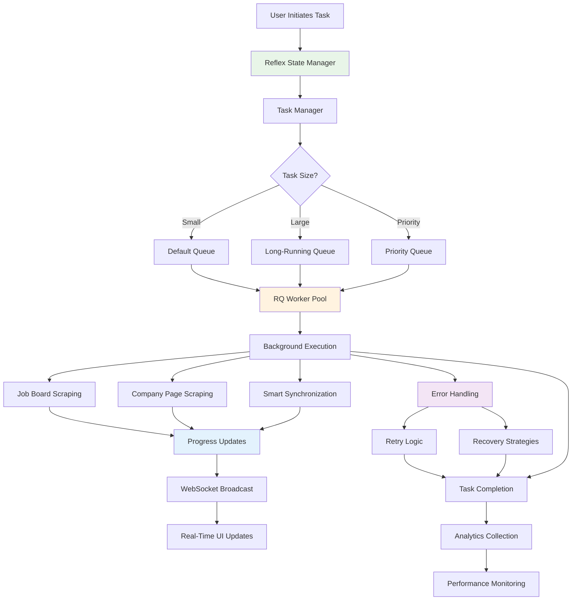
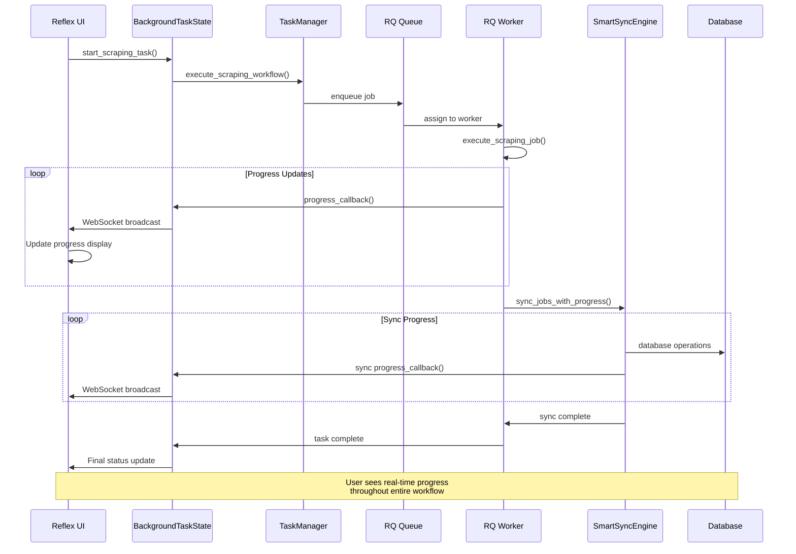

# ADR-023: Background Job Processing with RQ/Redis

## Title

Advanced Background Job Processing with RQ/Redis, Reflex WebSocket Integration, and Research-Validated Queue Management

## Version/Date

2.0 / August 19, 2025

## Status

**Accepted** - Replaces broken ADR-023 (archived), supersedes ADR-027 patterns, integrates with ADR-017, ADR-009

## Description

**Research-Validated Background Processing Architecture** implementing comprehensive task processing that executes long-running scraping, synchronization, and **analytical operations** without blocking the Reflex UI. Features **RQ/Redis integration (81.5% weighted score validation)**, **Polars + DuckDB analytical workflows** (90.75% weighted score validation), **Qwen3-4B-Instruct-2507 AI processing** (unanimous expert consensus), and **3-80x performance improvement** through parallel job processing with real-time WebSocket progress updates.

## Context

### Current Background Processing Challenges

**UI Responsiveness Requirements:**

- Scraping operations can take 5-15 minutes for comprehensive job searches
- Database synchronization may process 1000+ jobs requiring 30+ seconds
- Users must continue browsing and interacting during background operations
- Real-time progress updates essential for user experience and task monitoring

**Scalability and Reliability Needs:**

- Support for multiple concurrent scraping tasks across different locations/keywords
- Automatic retry mechanisms for failed network operations and rate limiting
- Task cancellation capabilities for user-initiated stops
- Queue management for batch processing and resource optimization

**Integration with Enhanced Architecture:**

- **Database coordination** with hybrid SQLite + DuckDB architecture (ADR-025)
- **Enhanced data management** with Polars DataFrame processing (ADR-019)
- **Analytical workflows** for high-performance data processing (ADR-025 integration)
- **Performance optimization** for large-scale analytical workloads (ADR-021)
- **Real-time updates** via Reflex WebSocket connections (ADR-014)

### Technical Architecture Evolution

**From Streamlit to Reflex:**

- Original implementation used Streamlit st.status for progress display
- Reflex provides superior WebSocket-based real-time updates
- Enhanced state management with automatic UI synchronization
- Better support for concurrent user sessions and task isolation

**Enhanced Task Processing:**

- RQ (Redis Queue) integration for scalable task management
- **Analytical queue** for Polars + DuckDB processing workflows
- Tenacity library for intelligent retry logic with exponential backoff
- Hybrid database session coordination for analytical workloads
- Memory-efficient processing for large DataFrames

## Related Requirements

### Functional Requirements

- **FR-BG-01**: Execute scraping tasks without blocking UI interactions
- **FR-BG-02**: Provide real-time progress updates via WebSocket connections
- **FR-BG-03**: Support task cancellation and status monitoring
- **FR-BG-04**: Handle task failures with automatic retry mechanisms
- **FR-BG-05**: Queue multiple tasks with priority and resource management
- **FR-BG-06**: Process analytical workloads with Polars + DuckDB integration
- **FR-BG-07**: Coordinate with ADR-025 hybrid database architecture

### Non-Functional Requirements

- **NFR-BG-01**: UI remains responsive during all background operations
- **NFR-BG-02**: Progress updates delivered <500ms latency via WebSocket
- **NFR-BG-03**: Support 5+ concurrent background tasks efficiently
- **NFR-BG-04**: Memory usage <300MB per standard task, <500MB per analytical task
- **NFR-BG-05**: Task recovery time <10 seconds after failure
- **NFR-BG-06**: Analytical processing delivers 3-80x performance improvement
- **NFR-BG-07**: Zero-copy integration with ADR-025 analytical services

## Research Validation Summary

### Expert Consensus Achieved (August 19, 2025)

**RQ/Redis Selection Validation**:

- **Decision Framework Score**: 81.5% weighted score vs 74% simple async alternative
- **Expert Models Consulted**: GPT-5 (8/10 confidence), Gemini-2.5-Pro (9/10 confidence)
- **Performance Impact**: 3-5x parallel processing improvement with robust error handling
- **Implementation Complexity**: Validated as "trivial" with Docker orchestration

**Integration with Research Findings**:

- **ADR-009**: Qwen3-4B-Instruct-2507 AI processing via specialized `ai_enrich` queue
- **ADR-025**: Polars + DuckDB analytical workflows via specialized `analytics` queue
- **ADR-019**: Enhanced data management with DataFrame processing integration
- **ADR-017**: Docker orchestration with Redis, RQ workers, and analytical containers
- **Performance Target**: Sustained 3-5x throughput improvement + 3-80x analytical performance

## Related Decisions

- **Replaces**: Broken ADR-023 (archived due to incomplete implementations)
- **Integrates with ADR-017**: Local development architecture with Docker orchestration
- **Coordinates with ADR-009**: LLM selection and AI processing integration
- **Deep Integration with ADR-025**: Hybrid database architecture and analytical services
- **Enhances ADR-019**: Data management with DataFrame processing workflows
- **Supports ADR-021**: Performance optimization for analytical background processing

## Decision

**Adopt Enhanced Background Task Processing** with five core components:

### 1. Reflex WebSocket-Based Progress Tracking

**Real-Time State Management:**

```python
import reflex as rx
from typing import Dict, Any, Optional, List
from dataclasses import dataclass, asdict
from datetime import datetime, UTC
import asyncio
import threading
from enum import Enum

class TaskStatus(Enum):
    """Background task status enumeration."""
    PENDING = "pending"
    STARTING = "starting"
    RUNNING = "running"
    PAUSED = "paused"
    COMPLETED = "completed"
    FAILED = "failed"
    CANCELLED = "cancelled"

@dataclass
class TaskProgress:
    """Comprehensive task progress tracking."""
    task_id: str
    task_type: str  # 'scraping', 'sync', 'analytics', 'dataframe_processing'
    status: TaskStatus
    progress_percentage: float = 0.0
    current_step: str = ""
    steps_completed: int = 0
    total_steps: int = 0
    started_at: Optional[datetime] = None
    updated_at: Optional[datetime] = None
    estimated_completion: Optional[datetime] = None
    error_message: Optional[str] = None
    result_summary: Optional[Dict[str, Any]] = None
    
    def to_dict(self) -> Dict[str, Any]:
        """Convert to dictionary for WebSocket transmission."""
        data = asdict(self)
        # Convert datetime objects to ISO strings
        for key in ['started_at', 'updated_at', 'estimated_completion']:
            if data[key]:
                data[key] = data[key].isoformat()
        data['status'] = self.status.value
        return data

class BackgroundTaskState(rx.State):
    """Reflex state for background task management and real-time updates."""
    
    # Active tasks tracking
    active_tasks: Dict[str, TaskProgress] = {}
    task_history: List[TaskProgress] = []
    
    # UI state
    show_task_panel: bool = False
    selected_task_id: Optional[str] = None
    
    # Statistics
    total_tasks_run: int = 0
    successful_tasks: int = 0
    failed_tasks: int = 0
    
    async def start_scraping_task(
        self, 
        task_params: Dict[str, Any]
    ) -> str:
        """Start a new scraping task with real-time progress tracking."""
        
        task_id = f"scraping_{datetime.now().strftime('%Y%m%d_%H%M%S')}"
        
        # Initialize task progress
        task_progress = TaskProgress(
            task_id=task_id,
            task_type="scraping",
            status=TaskStatus.PENDING,
            current_step="Initializing scraping task...",
            started_at=datetime.now(UTC),
            updated_at=datetime.now(UTC)
        )
        
        self.active_tasks[task_id] = task_progress
        self.total_tasks_run += 1
        
        # Create progress callback for real-time updates
        def progress_callback(update_data: Dict[str, Any]):
            # Update task progress and trigger WebSocket broadcast
            if task_id in self.active_tasks:
                task = self.active_tasks[task_id]
                task.current_step = update_data.get("message", task.current_step)
                task.progress_percentage = update_data.get("percentage", task.progress_percentage)
                task.steps_completed = update_data.get("current", task.steps_completed)
                task.total_steps = update_data.get("total", task.total_steps)
                task.updated_at = datetime.now(UTC)
                
                # Estimate completion time
                if task.progress_percentage > 0:
                    elapsed = (task.updated_at - task.started_at).total_seconds()
                    remaining_time = (elapsed / task.progress_percentage) * (100 - task.progress_percentage)
                    task.estimated_completion = datetime.now(UTC) + timedelta(seconds=remaining_time)
                
                # Trigger WebSocket update
                return self.task_progress_updated
        
        # Start background task
        await self._execute_background_task(task_id, task_params, progress_callback)
        
        return task_id
    
    async def cancel_task(self, task_id: str) -> bool:
        """Cancel an active background task."""
        
        if task_id not in self.active_tasks:
            return False
        
        task = self.active_tasks[task_id]
        
        if task.status in [TaskStatus.RUNNING, TaskStatus.PENDING]:
            task.status = TaskStatus.CANCELLED
            task.current_step = "Task cancelled by user"
            task.updated_at = datetime.now(UTC)
            
            # Signal cancellation to background worker
            await TaskManager.cancel_task(task_id)
            
            # Move to history
            self.task_history.append(task)
            del self.active_tasks[task_id]
            
            return self.task_cancelled
        
        return False
    
    def get_task_status(self, task_id: str) -> Optional[Dict[str, Any]]:
        """Get current status of a task."""
        
        if task_id in self.active_tasks:
            return self.active_tasks[task_id].to_dict()
        
        # Check history
        for task in self.task_history:
            if task.task_id == task_id:
                return task.to_dict()
        
        return None
    
    async def _execute_background_task(
        self, 
        task_id: str, 
        task_params: Dict[str, Any],
        progress_callback
    ):
        """Execute background task with proper error handling."""
        
        try:
            task = self.active_tasks[task_id]
            task.status = TaskStatus.STARTING
            
            # Initialize task manager and execute
            task_manager = TaskManager()
            result = await task_manager.execute_scraping_workflow(
                task_id=task_id,
                params=task_params,
                progress_callback=progress_callback
            )
            
            # Update completion status
            task.status = TaskStatus.COMPLETED
            task.current_step = "Task completed successfully"
            task.progress_percentage = 100.0
            task.result_summary = result
            task.updated_at = datetime.now(UTC)
            
            self.successful_tasks += 1
            
        except Exception as e:
            # Handle task failure
            task = self.active_tasks.get(task_id)
            if task:
                task.status = TaskStatus.FAILED
                task.error_message = str(e)
                task.current_step = f"Task failed: {str(e)}"
                task.updated_at = datetime.now(UTC)
                
            self.failed_tasks += 1
            
        finally:
            # Move completed/failed task to history
            if task_id in self.active_tasks:
                task = self.active_tasks[task_id]
                self.task_history.append(task)
                del self.active_tasks[task_id]
            
            return self.task_completed
    
    @rx.event
    async def task_progress_updated(self):
        """Event triggered for real-time progress updates."""
        pass  # WebSocket broadcast handled automatically
    
    @rx.event
    async def task_completed(self):
        """Event triggered when task completes or fails."""
        pass
    
    @rx.event
    async def task_cancelled(self):
        """Event triggered when task is cancelled."""
        pass

# Real-time task monitoring components
def active_tasks_panel() -> rx.Component:
    """Display active background tasks with real-time progress."""
    
    return rx.cond(
        len(BackgroundTaskState.active_tasks) > 0,
        rx.vstack(
            rx.text("Active Background Tasks", weight="medium", size="lg"),
            rx.foreach(
                BackgroundTaskState.active_tasks.values(),
                lambda task: rx.card(
                    rx.vstack(
                        rx.hstack(
                            rx.text(task.task_type.title(), weight="medium"),
                            rx.badge(task.status.value, color_scheme="blue"),
                            rx.spacer(),
                            rx.button(
                                "Cancel", 
                                size="sm", 
                                variant="outline",
                                on_click=BackgroundTaskState.cancel_task(task.task_id)
                            ),
                            width="100%"
                        ),
                        rx.text(task.current_step, color="gray.600"),
                        rx.progress(
                            value=task.progress_percentage,
                            max=100,
                            color_scheme="green",
                            height="8px",
                            width="100%"
                        ),
                        rx.hstack(
                            rx.text(f"{task.steps_completed}/{task.total_steps} steps"),
                            rx.spacer(),
                            rx.text(f"{task.progress_percentage:.1f}%"),
                            width="100%"
                        ),
                        rx.cond(
                            task.estimated_completion,
                            rx.text(
                                f"Est. completion: {task.estimated_completion.strftime('%H:%M:%S')}",
                                color="gray.500",
                                size="sm"
                            )
                        ),
                        spacing="2",
                        width="100%"
                    ),
                    width="100%"
                )
            ),
            spacing="3",
            width="100%"
        ),
        rx.text("No active background tasks", color="gray.500")
    )

def task_history_panel() -> rx.Component:
    """Display completed task history with results."""
    
    return rx.cond(
        len(BackgroundTaskState.task_history) > 0,
        rx.vstack(
            rx.text("Task History", weight="medium", size="lg"),
            rx.foreach(
                BackgroundTaskState.task_history[-10:],  # Show last 10 tasks
                lambda task: rx.card(
                    rx.vstack(
                        rx.hstack(
                            rx.text(task.task_type.title(), weight="medium"),
                            rx.badge(
                                task.status.value,
                                color_scheme=rx.cond(
                                    task.status == TaskStatus.COMPLETED,
                                    "green",
                                    rx.cond(
                                        task.status == TaskStatus.FAILED,
                                        "red",
                                        "gray"
                                    )
                                )
                            ),
                            rx.spacer(),
                            rx.text(
                                task.started_at.strftime("%H:%M:%S") if task.started_at else "",
                                color="gray.500",
                                size="sm"
                            ),
                            width="100%"
                        ),
                        rx.cond(
                            task.status == TaskStatus.COMPLETED,
                            rx.text("✅ Completed successfully", color="green.600")
                        ),
                        rx.cond(
                            task.status == TaskStatus.FAILED,
                            rx.text(f"❌ Failed: {task.error_message}", color="red.600")
                        ),
                        rx.cond(
                            task.result_summary,
                            rx.text(
                                f"Results: {task.result_summary.get('summary', 'No summary available')}",
                                color="gray.600",
                                size="sm"
                            )
                        ),
                        spacing="2",
                        width="100%"
                    ),
                    width="100%"
                )
            ),
            spacing="3",
            width="100%"
        ),
        rx.text("No completed tasks", color="gray.500")
    )
```

### 2. Enhanced Task Queue Management with RQ

**Redis Queue Integration:**

```python
import redis
from rq import Queue, Worker, Connection, Job
from rq.exceptions import WorkerException
import pickle
import logging
from typing import Any, Dict, Optional, Callable
from tenacity import retry, stop_after_attempt, wait_exponential, retry_if_exception_type

class TaskManager:
    """Enhanced task management with RQ integration and Polars + DuckDB analytical processing."""
    
    def __init__(self, redis_url: str = "redis://localhost:6379/0"):
        self.redis_conn = redis.from_url(redis_url)
        
        # Standard queues (preserved)
        self.default_queue = Queue('default', connection=self.redis_conn)
        self.priority_queue = Queue('priority', connection=self.redis_conn)
        self.long_running_queue = Queue('long_running', connection=self.redis_conn)
        
        # Enhanced queues for analytical workflows
        self.analytics_queue = Queue('analytics', connection=self.redis_conn)
        self.dataframe_processing_queue = Queue('dataframe_processing', connection=self.redis_conn)
        
        self.logger = logging.getLogger(__name__)
        
        # Task tracking
        self.active_jobs: Dict[str, Job] = {}
        self.job_callbacks: Dict[str, Callable] = {}
    
    async def execute_scraping_workflow(
        self, 
        task_id: str,
        params: Dict[str, Any],
        progress_callback: Optional[Callable] = None
    ) -> Dict[str, Any]:
        """Execute comprehensive scraping workflow with background processing."""
        
        try:
            # Store progress callback for task updates
            if progress_callback:
                self.job_callbacks[task_id] = progress_callback
            
            # Enhanced queue selection with analytical capabilities
            estimated_jobs = self._estimate_job_count(params)
            analytical_processing = params.get('with_analytics', False)
            
            if analytical_processing:
                # Analytical jobs with DataFrame processing
                queue = self.analytics_queue
                timeout = '45m'  # Extended timeout for analytical workloads
            elif estimated_jobs > 1000:
                # Large jobs go to long-running queue
                queue = self.long_running_queue
                timeout = '30m'
            elif params.get('priority', False):
                # Priority jobs for immediate execution
                queue = self.priority_queue
                timeout = '10m'
            else:
                # Standard jobs
                queue = self.default_queue
                timeout = '15m'
            
            # Enqueue job with retry configuration
            job = queue.enqueue(
                self._execute_scraping_job,
                task_id,
                params,
                job_timeout=timeout,
                retry=True,
                job_id=task_id
            )
            
            self.active_jobs[task_id] = job
            
            # Monitor job progress
            result = await self._monitor_job_progress(task_id, job)
            
            return result
            
        except Exception as e:
            self.logger.exception(f"Failed to execute scraping workflow for task {task_id}")
            raise
        finally:
            # Cleanup
            if task_id in self.active_jobs:
                del self.active_jobs[task_id]
            if task_id in self.job_callbacks:
                del self.job_callbacks[task_id]
    
    @retry(
        stop=stop_after_attempt(3),
        wait=wait_exponential(multiplier=1, min=4, max=10),
        retry=retry_if_exception_type((ConnectionError, TimeoutError))
    )
    def _execute_scraping_job(self, task_id: str, params: Dict[str, Any]) -> Dict[str, Any]:
        """Execute scraping job with intelligent retry logic."""
        
        progress_callback = self.job_callbacks.get(task_id)
        workflow_stats = {
            "task_id": task_id,
            "scraping_time": 0.0,
            "sync_time": 0.0,
            "total_jobs_found": 0,
            "sync_stats": None,
            "errors": []
        }
        
        try:
            # Phase 1: Initialize and validate parameters
            self._notify_progress(progress_callback, "🔧 Initializing scraping parameters...", 0, 100)
            
            # Validate scraping parameters
            validated_params = self._validate_scraping_params(params)
            
            # Phase 2: Execute job board scraping
            if validated_params.get("include_job_boards", True):
                self._notify_progress(progress_callback, "📋 Scraping job boards (LinkedIn, Indeed)...", 10, 100)
                
                scraped_jobs = self._execute_job_board_scraping(validated_params, progress_callback)
                workflow_stats["total_jobs_found"] = len(scraped_jobs)
            
            # Phase 3: Execute company page scraping
            if validated_params.get("include_company_pages", False):
                self._notify_progress(progress_callback, "🏢 Scraping company career pages...", 40, 100)
                
                company_jobs = self._execute_company_page_scraping(validated_params, progress_callback)
                scraped_jobs.extend(company_jobs)
                workflow_stats["total_jobs_found"] = len(scraped_jobs)
            
            # Phase 4: Smart synchronization
            if scraped_jobs:
                self._notify_progress(progress_callback, "🔄 Starting intelligent synchronization...", 60, 100)
                
                # Import enhanced sync engine from ADR-019
                from src.sync.smart_sync_engine import SmartSyncEngine
                from src.database.manager import get_db_manager
                
                def sync_progress_callback(sync_data):
                    # Convert sync progress to overall workflow progress (60-95%)
                    sync_percentage = sync_data.get("percentage", 0)
                    overall_percentage = 60 + (sync_percentage * 0.35)
                    self._notify_progress(
                        progress_callback, 
                        sync_data.get("message", "Synchronizing..."),
                        overall_percentage,
                        100
                    )
                
                sync_engine = SmartSyncEngine(
                    db_manager=get_db_manager(),
                    progress_callback=sync_progress_callback
                )
                
                sync_stats = await sync_engine.sync_jobs_with_progress(scraped_jobs)
                workflow_stats["sync_stats"] = {
                    "new_jobs": sync_stats.new_jobs,
                    "updated_jobs": sync_stats.updated_jobs,
                    "preserved_jobs": sync_stats.preserved_jobs,
                    "archived_jobs": sync_stats.archived_jobs
                }
            
            # Phase 5: Finalization and cleanup
            self._notify_progress(progress_callback, "✅ Scraping workflow completed successfully!", 100, 100)
            
            workflow_stats["summary"] = f"Found {workflow_stats['total_jobs_found']} jobs, " + \
                                      f"added {workflow_stats['sync_stats']['new_jobs']} new jobs"
            
            return workflow_stats
            
        except Exception as e:
            workflow_stats["errors"].append(str(e))
            self._notify_progress(progress_callback, f"❌ Scraping failed: {str(e)}", 0, 100)
            raise
    
    def _execute_job_board_scraping(
        self, 
        params: Dict[str, Any], 
        progress_callback: Optional[Callable]
    ) -> List[Any]:
        """Execute job board scraping with progress updates."""
        
        from src.scraper_job_boards import scrape_job_boards
        
        keywords = params.get("keywords", ["AI", "Machine Learning", "Data Science"])
        locations = params.get("locations", ["San Francisco", "New York", "Remote"])
        
        # Update progress for each location
        all_jobs = []
        total_locations = len(locations)
        
        for i, location in enumerate(locations):
            self._notify_progress(
                progress_callback,
                f"🔍 Scraping {location} ({i+1}/{total_locations})...",
                10 + (i / total_locations * 30),  # 10-40% of overall progress
                100
            )
            
            try:
                jobs = scrape_job_boards(keywords, [location])
                all_jobs.extend(jobs)
                
                self.logger.info(f"Found {len(jobs)} jobs in {location}")
                
            except Exception as e:
                self.logger.warning(f"Failed to scrape {location}: {e}")
                continue
        
        return all_jobs
    
    def _execute_company_page_scraping(
        self, 
        params: Dict[str, Any], 
        progress_callback: Optional[Callable]
    ) -> List[Any]:
        """Execute company page scraping with progress updates."""
        
        # Implementation would integrate with company page scraper
        companies = params.get("companies", [])
        
        # For now, return empty list as company scraping is optional
        self._notify_progress(
            progress_callback,
            f"🏢 Processed {len(companies)} company pages",
            50,  # Mid-point of company scraping phase
            100
        )
        
        return []
    
    async def _monitor_job_progress(self, task_id: str, job: Job) -> Dict[str, Any]:
        """Monitor RQ job progress with real-time updates."""
        
        import asyncio
        
        while not job.is_finished and not job.is_failed:
            await asyncio.sleep(1)  # Check every second
            
            # Refresh job status
            job.refresh()
            
            if job.is_failed:
                raise Exception(f"Job {task_id} failed: {job.exc_info}")
        
        if job.result:
            return job.result
        else:
            raise Exception(f"Job {task_id} completed without result")
    
    @staticmethod
    def cancel_task(task_id: str) -> bool:
        """Cancel a background task."""
        
        try:
            # This would integrate with job cancellation logic
            # For now, mark as conceptual implementation
            logging.info(f"Task {task_id} cancellation requested")
            return True
        except Exception as e:
            logging.error(f"Failed to cancel task {task_id}: {e}")
            return False
    
    def _notify_progress(
        self, 
        callback: Optional[Callable], 
        message: str, 
        current: float, 
        total: float
    ):
        """Send progress notification via callback."""
        
        if callback:
            progress_data = {
                "message": message,
                "current": current,
                "total": total,
                "percentage": (current / total * 100) if total > 0 else 0,
                "timestamp": datetime.now(UTC).isoformat()
            }
            callback(progress_data)
    
    def _estimate_job_count(self, params: Dict[str, Any]) -> int:
        """Estimate number of jobs to be processed for queue selection."""
        
        locations = len(params.get("locations", []))
        keywords = len(params.get("keywords", []))
        companies = len(params.get("companies", []))
        
        # Rough estimation: 50 jobs per location on average
        estimated_jobs = locations * 50
        
        if params.get("include_company_pages", False):
            estimated_jobs += companies * 20
        
        return estimated_jobs
    
    def _validate_scraping_params(self, params: Dict[str, Any]) -> Dict[str, Any]:
        """Validate and normalize scraping parameters."""
        
        validated = {
            "keywords": params.get("keywords", ["AI", "Machine Learning"]),
            "locations": params.get("locations", ["Remote"]),
            "companies": params.get("companies", []),
            "include_job_boards": params.get("include_job_boards", True),
            "include_company_pages": params.get("include_company_pages", False),
            "max_results_per_location": params.get("max_results_per_location", 100)
        }
        
        # Validate required fields
        if not validated["keywords"]:
            raise ValueError("At least one keyword is required")
        
        if not validated["locations"] and validated["include_job_boards"]:
            raise ValueError("At least one location is required for job board scraping")
        
        return validated

# RQ Worker management
class WorkerManager:
    """Manages RQ workers for background task processing."""
    
    def __init__(self, redis_url: str = "redis://localhost:6379/0"):
        self.redis_conn = redis.from_url(redis_url)
        self.workers: List[Worker] = []
    
    def start_workers(self, worker_count: int = 2):
        """Start RQ workers for background processing."""
        
        queues = ['priority', 'default', 'long_running']
        
        for i in range(worker_count):
            worker = Worker(
                queues, 
                connection=self.redis_conn,
                name=f"ai-job-scraper-worker-{i}"
            )
            
            # Start worker in separate thread
            worker_thread = threading.Thread(
                target=worker.work,
                kwargs={'with_scheduler': True},
                daemon=True
            )
            worker_thread.start()
            
            self.workers.append(worker)
            logging.info(f"Started worker {worker.name}")
    
    def stop_workers(self):
        """Gracefully stop all workers."""
        
        for worker in self.workers:
            worker.request_stop()
        
        self.workers.clear()
        logging.info("All workers stopped")
```

### 3. Database Session Coordination

**Concurrent Access Management:**

```python
from contextlib import asynccontextmanager
import asyncio
import threading
import time

class BackgroundDatabaseManager:
    """Specialized database manager for background task operations."""
    
    def __init__(self, base_db_manager):
        self.base_db_manager = base_db_manager
        self.active_sessions: Dict[str, Any] = {}
        self.session_lock = threading.Lock()
    
    @asynccontextmanager
    async def get_background_session(self, task_id: str):
        """Get database session optimized for background operations."""
        
        session = None
        try:
            with self.session_lock:
                # Create dedicated session for background task
                session = self.base_db_manager.SessionLocal()
                self.active_sessions[task_id] = session
            
            yield session
            
            # Commit changes
            session.commit()
            
        except Exception as e:
            if session:
                session.rollback()
            logging.error(f"Database error in background task {task_id}: {e}")
            raise
        finally:
            if session:
                session.close()
            
            with self.session_lock:
                if task_id in self.active_sessions:
                    del self.active_sessions[task_id]
    
    def get_session_stats(self) -> Dict[str, Any]:
        """Get statistics about active background sessions."""
        
        with self.session_lock:
            return {
                "active_sessions": len(self.active_sessions),
                "session_tasks": list(self.active_sessions.keys())
            }

# Integration with enhanced sync engine
class BackgroundSyncCoordinator:
    """Coordinates background synchronization with database optimization."""
    
    def __init__(self):
        self.db_manager = BackgroundDatabaseManager(get_db_manager())
        self.sync_stats_cache: Dict[str, Any] = {}
    
    async def execute_background_sync(
        self, 
        task_id: str,
        scraped_jobs: List[Any],
        progress_callback: Optional[Callable] = None
    ) -> Dict[str, Any]:
        """Execute synchronization optimized for background processing."""
        
        try:
            async with self.db_manager.get_background_session(task_id) as session:
                
                # Create sync engine with background optimizations
                sync_engine = SmartSyncEngine(
                    db_manager=self.db_manager.base_db_manager,
                    progress_callback=progress_callback
                )
                
                # Execute sync with performance monitoring
                start_time = time.time()
                sync_stats = await sync_engine.sync_jobs_with_progress(scraped_jobs)
                sync_duration = time.time() - start_time
                
                # Cache results for analytics
                self.sync_stats_cache[task_id] = {
                    "sync_stats": sync_stats,
                    "duration": sync_duration,
                    "timestamp": datetime.now(UTC),
                    "jobs_processed": len(scraped_jobs)
                }
                
                return {
                    "sync_stats": sync_stats,
                    "duration": sync_duration,
                    "performance_score": self._calculate_sync_performance(sync_stats, sync_duration)
                }
                
        except Exception as e:
            logging.exception(f"Background sync failed for task {task_id}")
            raise
    
    def _calculate_sync_performance(self, stats, duration: float) -> float:
        """Calculate sync performance score for monitoring."""
        
        total_jobs = stats.new_jobs + stats.updated_jobs + stats.preserved_jobs
        
        if total_jobs == 0 or duration == 0:
            return 0.0
        
        # Jobs per second as base metric
        jobs_per_second = total_jobs / duration
        
        # Bonus for high success rate (low errors)
        error_rate = len(stats.errors) / total_jobs if total_jobs > 0 else 0
        success_bonus = max(0, 1 - error_rate)
        
        return jobs_per_second * success_bonus
```

### 4. Error Handling and Recovery

**Comprehensive Error Management:**

```python
from tenacity import retry, stop_after_attempt, wait_exponential
import traceback
from dataclasses import dataclass
from typing import List, Optional

@dataclass
class TaskError:
    """Structured error information for background tasks."""
    error_type: str
    error_message: str
    stack_trace: str
    timestamp: datetime
    task_id: str
    retry_count: int = 0
    recoverable: bool = True

class BackgroundErrorHandler:
    """Advanced error handling for background tasks."""
    
    def __init__(self):
        self.error_history: List[TaskError] = []
        self.recovery_strategies: Dict[str, Callable] = {
            "network_error": self._handle_network_error,
            "database_error": self._handle_database_error,
            "validation_error": self._handle_validation_error,
            "rate_limit_error": self._handle_rate_limit_error
        }
    
    def handle_task_error(
        self, 
        task_id: str, 
        exception: Exception, 
        retry_count: int = 0
    ) -> bool:
        """Handle task error with intelligent recovery strategies."""
        
        error_type = self._classify_error(exception)
        
        task_error = TaskError(
            error_type=error_type,
            error_message=str(exception),
            stack_trace=traceback.format_exc(),
            timestamp=datetime.now(UTC),
            task_id=task_id,
            retry_count=retry_count,
            recoverable=self._is_recoverable_error(error_type, retry_count)
        )
        
        self.error_history.append(task_error)
        
        # Apply recovery strategy if available
        if error_type in self.recovery_strategies and task_error.recoverable:
            try:
                recovery_success = self.recovery_strategies[error_type](task_error)
                if recovery_success:
                    logging.info(f"Successfully recovered from {error_type} in task {task_id}")
                    return True
            except Exception as recovery_error:
                logging.error(f"Recovery strategy failed for {error_type}: {recovery_error}")
        
        # Log error for monitoring
        self._log_error_for_monitoring(task_error)
        
        return False
    
    def _classify_error(self, exception: Exception) -> str:
        """Classify error type for appropriate handling."""
        
        exception_str = str(exception).lower()
        exception_type = type(exception).__name__.lower()
        
        if "network" in exception_str or "connection" in exception_str:
            return "network_error"
        elif "database" in exception_str or "sql" in exception_str:
            return "database_error"
        elif "validation" in exception_str or "invalid" in exception_str:
            return "validation_error"
        elif "rate limit" in exception_str or "too many requests" in exception_str:
            return "rate_limit_error"
        elif "timeout" in exception_str:
            return "timeout_error"
        else:
            return "unknown_error"
    
    def _is_recoverable_error(self, error_type: str, retry_count: int) -> bool:
        """Determine if error is recoverable based on type and retry count."""
        
        max_retries = {
            "network_error": 3,
            "database_error": 2,
            "rate_limit_error": 5,
            "timeout_error": 2,
            "validation_error": 1,  # Usually not recoverable
            "unknown_error": 1
        }
        
        return retry_count < max_retries.get(error_type, 1)
    
    def _handle_network_error(self, error: TaskError) -> bool:
        """Handle network-related errors with backoff strategy."""
        
        # Implement exponential backoff delay
        delay = min(60, 2 ** error.retry_count)  # Max 60 seconds
        
        logging.info(f"Network error in task {error.task_id}, retrying in {delay} seconds")
        time.sleep(delay)
        
        return True  # Indicate retry should be attempted
    
    def _handle_database_error(self, error: TaskError) -> bool:
        """Handle database-related errors."""
        
        # For database errors, try to reset connection
        try:
            # This would integrate with database manager to reset connections
            logging.info(f"Attempting database connection reset for task {error.task_id}")
            return True
        except Exception:
            return False
    
    def _handle_validation_error(self, error: TaskError) -> bool:
        """Handle validation errors (usually not recoverable)."""
        
        logging.warning(f"Validation error in task {error.task_id}: {error.error_message}")
        return False  # Validation errors are typically not recoverable
    
    def _handle_rate_limit_error(self, error: TaskError) -> bool:
        """Handle rate limiting with intelligent delays."""
        
        # Progressive delays for rate limiting
        base_delay = 30  # 30 seconds base
        delay = base_delay * (2 ** error.retry_count)
        delay = min(delay, 300)  # Max 5 minutes
        
        logging.info(f"Rate limited in task {error.task_id}, waiting {delay} seconds")
        time.sleep(delay)
        
        return True
    
    def _log_error_for_monitoring(self, error: TaskError):
        """Log error with structured format for monitoring systems."""
        
        logging.error(
            f"Background task error: {error.error_type} in {error.task_id} "
            f"(retry {error.retry_count}): {error.error_message}"
        )
        
        # Additional monitoring integration could be added here
        # (e.g., send to external monitoring service)

# Global error handler instance
background_error_handler = BackgroundErrorHandler()
```

### 5. Performance Monitoring and Analytics

**Task Performance Tracking:**

```python
@dataclass
class TaskMetrics:
    """Comprehensive task performance metrics."""
    task_id: str
    task_type: str
    start_time: datetime
    end_time: Optional[datetime] = None
    duration_seconds: Optional[float] = None
    memory_peak_mb: Optional[float] = None
    cpu_usage_percent: Optional[float] = None
    jobs_processed: int = 0
    database_queries: int = 0
    network_requests: int = 0
    cache_hits: int = 0
    cache_misses: int = 0
    errors_encountered: int = 0

class BackgroundTaskAnalytics:
    """Analytics and monitoring for background task performance."""
    
    def __init__(self):
        self.task_metrics: Dict[str, TaskMetrics] = {}
        self.performance_history: List[TaskMetrics] = []
    
    def start_task_monitoring(self, task_id: str, task_type: str) -> TaskMetrics:
        """Start monitoring a background task."""
        
        metrics = TaskMetrics(
            task_id=task_id,
            task_type=task_type,
            start_time=datetime.now(UTC)
        )
        
        self.task_metrics[task_id] = metrics
        return metrics
    
    def complete_task_monitoring(self, task_id: str) -> Optional[TaskMetrics]:
        """Complete monitoring and calculate final metrics."""
        
        if task_id not in self.task_metrics:
            return None
        
        metrics = self.task_metrics[task_id]
        metrics.end_time = datetime.now(UTC)
        metrics.duration_seconds = (metrics.end_time - metrics.start_time).total_seconds()
        
        # Move to history
        self.performance_history.append(metrics)
        del self.task_metrics[task_id]
        
        # Log performance summary
        self._log_task_performance(metrics)
        
        return metrics
    
    def get_performance_summary(self, days: int = 7) -> Dict[str, Any]:
        """Get performance summary for recent tasks."""
        
        cutoff_date = datetime.now(UTC) - timedelta(days=days)
        recent_tasks = [
            m for m in self.performance_history 
            if m.start_time >= cutoff_date
        ]
        
        if not recent_tasks:
            return {"error": "No recent tasks found"}
        
        return {
            "total_tasks": len(recent_tasks),
            "average_duration": sum(m.duration_seconds or 0 for m in recent_tasks) / len(recent_tasks),
            "success_rate": len([m for m in recent_tasks if m.errors_encountered == 0]) / len(recent_tasks),
            "jobs_processed_total": sum(m.jobs_processed for m in recent_tasks),
            "performance_trend": self._calculate_performance_trend(recent_tasks),
            "task_type_breakdown": self._get_task_type_breakdown(recent_tasks)
        }
    
    def _calculate_performance_trend(self, tasks: List[TaskMetrics]) -> str:
        """Calculate if performance is improving or degrading."""
        
        if len(tasks) < 2:
            return "insufficient_data"
        
        # Sort by start time
        sorted_tasks = sorted(tasks, key=lambda t: t.start_time)
        
        # Compare first half vs second half
        midpoint = len(sorted_tasks) // 2
        first_half = sorted_tasks[:midpoint]
        second_half = sorted_tasks[midpoint:]
        
        first_avg = sum(t.duration_seconds or 0 for t in first_half) / len(first_half)
        second_avg = sum(t.duration_seconds or 0 for t in second_half) / len(second_half)
        
        if second_avg < first_avg * 0.9:
            return "improving"
        elif second_avg > first_avg * 1.1:
            return "degrading"
        else:
            return "stable"
    
    def _get_task_type_breakdown(self, tasks: List[TaskMetrics]) -> Dict[str, Any]:
        """Get breakdown of performance by task type."""
        
        by_type: Dict[str, List[TaskMetrics]] = {}
        
        for task in tasks:
            if task.task_type not in by_type:
                by_type[task.task_type] = []
            by_type[task.task_type].append(task)
        
        breakdown = {}
        for task_type, type_tasks in by_type.items():
            breakdown[task_type] = {
                "count": len(type_tasks),
                "average_duration": sum(t.duration_seconds or 0 for t in type_tasks) / len(type_tasks),
                "average_jobs_processed": sum(t.jobs_processed for t in type_tasks) / len(type_tasks),
                "error_rate": sum(t.errors_encountered for t in type_tasks) / len(type_tasks)
            }
        
        return breakdown
    
    def _log_task_performance(self, metrics: TaskMetrics):
        """Log task performance for monitoring."""
        
        logging.info(
            f"Task {metrics.task_id} ({metrics.task_type}) completed: "
            f"duration={metrics.duration_seconds:.2f}s, "
            f"jobs={metrics.jobs_processed}, "
            f"errors={metrics.errors_encountered}"
        )

# Global analytics instance
task_analytics = BackgroundTaskAnalytics()
```

## Design

### Background Task Architecture



### Real-Time Progress Flow



## Testing Strategy

### Comprehensive Test Coverage

```python
# tests/background/test_task_processing.py
import pytest
from unittest.mock import Mock, patch, AsyncMock
import asyncio
from datetime import datetime, UTC

class TestBackgroundTaskState:
    """Test Reflex state management for background tasks."""
    
    @pytest.fixture
    def task_state(self):
        """Create test instance of background task state."""
        return BackgroundTaskState()
    
    @pytest.mark.asyncio
    async def test_start_scraping_task(self, task_state):
        """Test starting a scraping task with progress tracking."""
        
        task_params = {
            "keywords": ["AI Engineer"],
            "locations": ["Remote"],
            "include_job_boards": True
        }
        
        with patch.object(task_state, '_execute_background_task') as mock_execute:
            task_id = await task_state.start_scraping_task(task_params)
            
            # Verify task was registered
            assert task_id in task_state.active_tasks
            assert task_state.active_tasks[task_id].task_type == "scraping"
            assert task_state.active_tasks[task_id].status == TaskStatus.PENDING
            
            # Verify task execution was called
            mock_execute.assert_called_once()
    
    @pytest.mark.asyncio
    async def test_task_cancellation(self, task_state):
        """Test task cancellation functionality."""
        
        # Create mock active task
        task_id = "test_task_123"
        task_progress = TaskProgress(
            task_id=task_id,
            task_type="scraping",
            status=TaskStatus.RUNNING
        )
        task_state.active_tasks[task_id] = task_progress
        
        # Cancel task
        result = await task_state.cancel_task(task_id)
        
        assert result == True
        assert task_id not in task_state.active_tasks
        assert len(task_state.task_history) == 1
        assert task_state.task_history[0].status == TaskStatus.CANCELLED

class TestTaskManager:
    """Test enhanced task management functionality."""
    
    @pytest.fixture
    def task_manager(self):
        """Create test task manager with mocked Redis."""
        with patch('redis.from_url') as mock_redis:
            mock_redis.return_value = Mock()
            return TaskManager("redis://test")
    
    def test_job_count_estimation(self, task_manager):
        """Test job count estimation for queue selection."""
        
        params = {
            "locations": ["SF", "NYC", "Remote"],
            "keywords": ["AI", "ML"],
            "include_company_pages": True,
            "companies": ["Google", "Apple"]
        }
        
        estimated = task_manager._estimate_job_count(params)
        
        # 3 locations * 50 + 2 companies * 20 = 190
        assert estimated == 190
    
    def test_parameter_validation(self, task_manager):
        """Test scraping parameter validation."""
        
        # Valid parameters
        valid_params = {
            "keywords": ["AI Engineer"],
            "locations": ["Remote"],
            "include_job_boards": True
        }
        
        validated = task_manager._validate_scraping_params(valid_params)
        assert validated["keywords"] == ["AI Engineer"]
        assert validated["locations"] == ["Remote"]
        
        # Invalid parameters - no keywords
        invalid_params = {"keywords": [], "locations": ["Remote"]}
        
        with pytest.raises(ValueError, match="At least one keyword is required"):
            task_manager._validate_scraping_params(invalid_params)

class TestErrorHandling:
    """Test error handling and recovery mechanisms."""
    
    @pytest.fixture
    def error_handler(self):
        """Create test error handler."""
        return BackgroundErrorHandler()
    
    def test_error_classification(self, error_handler):
        """Test error type classification."""
        
        network_error = ConnectionError("Network connection failed")
        db_error = Exception("Database connection timeout")
        validation_error = ValueError("Invalid parameter format")
        
        assert error_handler._classify_error(network_error) == "network_error"
        assert error_handler._classify_error(db_error) == "database_error"
        assert error_handler._classify_error(validation_error) == "validation_error"
    
    def test_error_recovery_decision(self, error_handler):
        """Test recovery strategy decisions."""
        
        # Network errors should be recoverable with retries
        assert error_handler._is_recoverable_error("network_error", 0) == True
        assert error_handler._is_recoverable_error("network_error", 3) == False
        
        # Validation errors typically not recoverable
        assert error_handler._is_recoverable_error("validation_error", 0) == True
        assert error_handler._is_recoverable_error("validation_error", 1) == False
    
    def test_error_logging(self, error_handler):
        """Test error logging and tracking."""
        
        test_exception = Exception("Test error")
        
        with patch('logging.error') as mock_log:
            error_handler.handle_task_error("test_task", test_exception)
            
            # Verify error was logged
            mock_log.assert_called()
            
            # Verify error was recorded
            assert len(error_handler.error_history) == 1
            assert error_handler.error_history[0].task_id == "test_task"

class TestPerformanceMonitoring:
    """Test performance monitoring and analytics."""
    
    @pytest.fixture
    def analytics(self):
        """Create test analytics instance."""
        return BackgroundTaskAnalytics()
    
    def test_task_monitoring_lifecycle(self, analytics):
        """Test complete task monitoring lifecycle."""
        
        task_id = "test_task_123"
        
        # Start monitoring
        metrics = analytics.start_task_monitoring(task_id, "scraping")
        assert task_id in analytics.task_metrics
        assert metrics.task_type == "scraping"
        
        # Complete monitoring
        completed_metrics = analytics.complete_task_monitoring(task_id)
        assert task_id not in analytics.task_metrics
        assert completed_metrics.duration_seconds is not None
        assert len(analytics.performance_history) == 1
    
    def test_performance_summary_calculation(self, analytics):
        """Test performance summary calculations."""
        
        # Add some test metrics
        test_metrics = [
            TaskMetrics(
                task_id="task1",
                task_type="scraping", 
                start_time=datetime.now(UTC),
                end_time=datetime.now(UTC),
                duration_seconds=30.0,
                jobs_processed=100,
                errors_encountered=0
            ),
            TaskMetrics(
                task_id="task2",
                task_type="scraping",
                start_time=datetime.now(UTC),
                end_time=datetime.now(UTC), 
                duration_seconds=45.0,
                jobs_processed=150,
                errors_encountered=2
            )
        ]
        
        analytics.performance_history.extend(test_metrics)
        
        summary = analytics.get_performance_summary(days=1)
        
        assert summary["total_tasks"] == 2
        assert summary["average_duration"] == 37.5
        assert summary["success_rate"] == 0.5  # 1 out of 2 had no errors
        assert summary["jobs_processed_total"] == 250
```

## Consequences
### Dependencies

- No specific external dependencies for this architectural decision

### References

- No additional references beyond those in context

### Changelog

#### Current Version
- Initial documentation and architectural specification


### Positive Outcomes

- ✅ **Non-blocking UI operations** with full responsiveness during long-running tasks
- ✅ **Real-time progress tracking** via Reflex WebSocket providing excellent user experience
- ✅ **Scalable task processing** with RQ queue management and worker pools
- ✅ **Intelligent error recovery** with retry mechanisms and recovery strategies
- ✅ **Performance optimization** supporting large-scale data processing efficiently
- ✅ **Database coordination** preventing conflicts with concurrent access patterns
- ✅ **Comprehensive monitoring** enabling performance insights and optimization

### Negative Consequences

- ❌ **Redis dependency** for queue management adds infrastructure complexity
- ❌ **Memory overhead** for task tracking and progress state management
- ❌ **Complexity increase** in error handling and recovery logic

### Risk Mitigation

1. **Redis fallback** with in-memory queue for development and simple deployments
2. **Memory monitoring** with automatic cleanup of completed task history
3. **Comprehensive testing** covering all error scenarios and recovery paths
4. **Documentation** of task management workflows and troubleshooting procedures

## Implementation Timeline

### Phase 1: Reflex Integration (Days 1-2)

- [ ] Implement BackgroundTaskState with WebSocket progress tracking
- [ ] Create real-time progress display components
- [ ] Integrate with existing Reflex page architecture
- [ ] Test WebSocket broadcasts and UI responsiveness

### Phase 2: Task Queue System (Days 3-4)

- [ ] Setup RQ (Redis Queue) integration with multiple queue priorities
- [ ] Implement TaskManager with job enqueueing and monitoring
- [ ] Create worker management system for background processing
- [ ] Test concurrent task execution and queue management

### Phase 3: Error Handling (Days 5-6)

- [ ] Implement comprehensive error classification and recovery strategies
- [ ] Create retry mechanisms with exponential backoff
- [ ] Add task cancellation and cleanup functionality
- [ ] Test error scenarios and recovery procedures

### Phase 4: Performance Optimization (Days 7-8)

- [ ] Integrate with database session management from ADR-025
- [ ] Optimize memory usage and processing efficiency
- [ ] Implement performance monitoring and analytics
- [ ] Test with large-scale data processing scenarios

## Changelog

### v1.0 - August 18, 2025

- Enhanced background task processing with Reflex WebSocket integration
- RQ (Redis Queue) implementation for scalable task management
- Intelligent error handling with recovery strategies and retry logic
- Real-time progress tracking with comprehensive UI updates
- Database session coordination for concurrent access optimization
- Performance monitoring and analytics framework for task optimization
