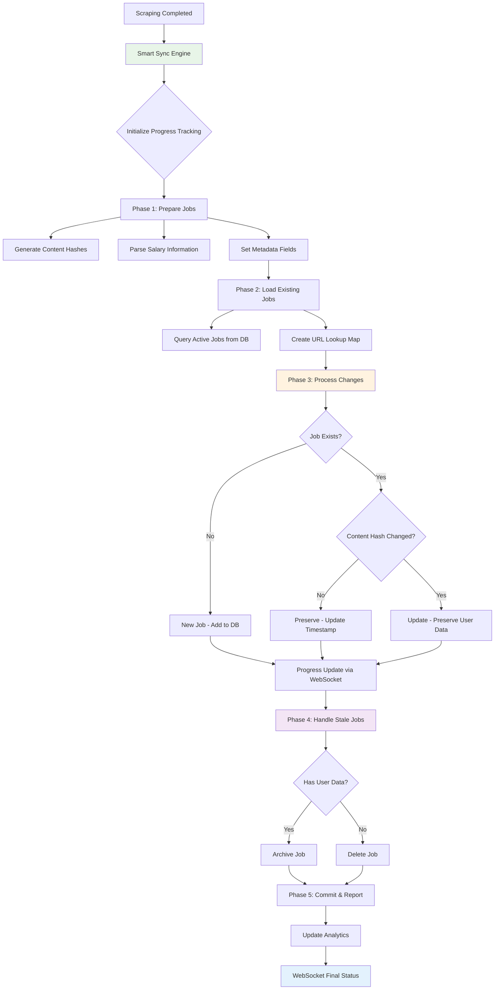
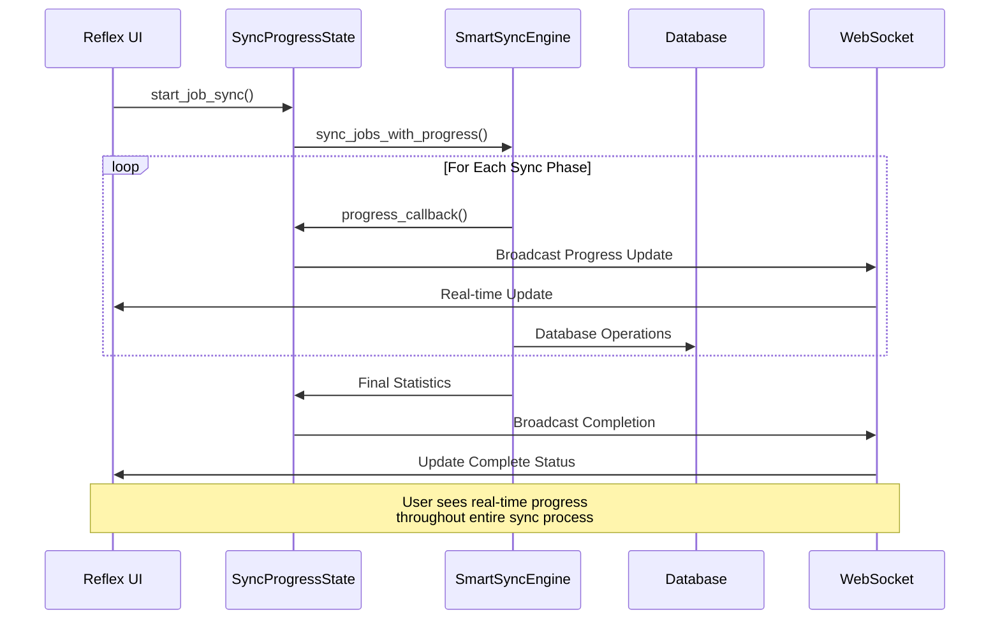

# ADR-038: Smart Data Synchronization Engine

## Title

Advanced Data Synchronization Engine with Content-Based Change Detection and Real-Time UI Updates

## Version/Date

1.0 / August 18, 2025

## Status

**Proposed** - Supersedes ADR-008, integrates with ADR-037

## Description

Implement an intelligent data synchronization engine that safely updates the local database with newly scraped job data while preserving user-generated information and providing real-time progress updates via Reflex WebSocket connections. The engine uses content-based hashing for efficient change detection and coordinates with background processing for non-blocking operations.

## Context

### Current Synchronization Challenges

**Data Integrity Requirements:**

- Preserve user-generated data (favorites, notes, application status) during updates
- Detect content changes accurately to avoid unnecessary database writes
- Handle stale job postings through intelligent archiving vs deletion
- Maintain data consistency during concurrent scraping and UI operations

**Real-Time Update Needs:**

- Provide live progress updates during synchronization via Reflex WebSocket
- Enable users to continue browsing while background sync occurs
- Display granular sync statistics (new jobs, updated jobs, archived jobs)
- Maintain UI responsiveness throughout synchronization process

**Performance Optimization:**

- Process large job datasets (5000+ records) efficiently
- Minimize database I/O through intelligent change detection
- Coordinate with SQLite WAL mode for concurrent access
- Integrate with background task processing for scalability

### Technical Integration Points

**Database Architecture (ADR-037):**

- Leverages enhanced JobSQL model with content hashing
- Uses optimized SQLite configuration for concurrent access
- Integrates with SmartSyncEngine from database architecture
- Maintains referential integrity with company relationships

**Background Processing (ADR-039):**

- Coordinates with Reflex threading for non-blocking execution
- Uses session state for progress tracking and UI updates
- Integrates with task queue system for scalable processing
- Provides cancellation and error recovery mechanisms

**Performance Strategy (ADR-041):**

- Optimized for large-scale synchronization operations
- Uses bulk operations and efficient query patterns
- Minimizes memory usage during sync operations
- Provides performance metrics and monitoring

## Related Requirements

### Functional Requirements

- **FR-SYNC-01**: Preserve user data during all synchronization operations
- **FR-SYNC-02**: Detect job content changes accurately via content hashing
- **FR-SYNC-03**: Provide real-time synchronization progress via WebSocket
- **FR-SYNC-04**: Handle duplicate job URLs across different sources intelligently

### Non-Functional Requirements

- **NFR-SYNC-01**: Process 1000+ jobs in <30 seconds with real-time updates
- **NFR-SYNC-02**: Memory usage <200MB during large synchronization operations
- **NFR-SYNC-03**: UI remains responsive throughout synchronization process
- **NFR-SYNC-04**: Data consistency maintained across all concurrent operations

## Related Decisions

- **Supersedes ADR-008**: Basic synchronization approach replaced with advanced content-based strategy
- **Integrates with ADR-037**: Leverages enhanced database architecture and SQLite optimization
- **Coordinates with ADR-039**: Background processing integration for non-blocking execution
- **Supports ADR-041**: Performance optimization for large-scale data processing
- **Aligns with ADR-024**: Real-time updates strategy via Reflex WebSocket connections

## Decision

**Adopt Enhanced Smart Synchronization Engine** with four core capabilities:

### 1. Content-Based Change Detection

**Advanced Hashing Strategy:**

```python
from dataclasses import dataclass
from typing import Optional, Dict, Set, List
import hashlib
import logging
from datetime import datetime, UTC

@dataclass
class SyncStats:
    """Comprehensive synchronization statistics."""
    new_jobs: int = 0
    updated_jobs: int = 0
    preserved_jobs: int = 0
    archived_jobs: int = 0
    deleted_jobs: int = 0
    processing_time: float = 0.0
    errors: List[str] = None
    
    def __post_init__(self):
        if self.errors is None:
            self.errors = []
    
    @property
    def total_processed(self) -> int:
        return self.new_jobs + self.updated_jobs + self.preserved_jobs

class SmartSyncEngine:
    """Advanced synchronization engine with real-time progress tracking."""
    
    def __init__(self, db_manager, progress_callback=None):
        self.db_manager = db_manager
        self.progress_callback = progress_callback
        self.logger = logging.getLogger(__name__)
        
    async def sync_jobs_with_progress(
        self, 
        scraped_jobs: List[JobSQL],
        source_name: str = "unknown"
    ) -> SyncStats:
        """
        Synchronize jobs with real-time progress updates.
        
        Args:
            scraped_jobs: List of newly scraped job data
            source_name: Name of scraping source for tracking
            
        Returns:
            SyncStats: Comprehensive synchronization results
        """
        start_time = time.time()
        stats = SyncStats()
        
        try:
            self._notify_progress("🔄 Initializing synchronization...", 0, len(scraped_jobs))
            
            # Phase 1: Prepare job data and generate hashes
            prepared_jobs = await self._prepare_jobs_for_sync(scraped_jobs, stats)
            self._notify_progress("📊 Analyzing existing data...", len(prepared_jobs), len(scraped_jobs))
            
            # Phase 2: Load existing jobs for comparison
            existing_jobs_map = await self._load_existing_jobs()
            self._notify_progress("🔍 Detecting changes...", len(prepared_jobs), len(scraped_jobs))
            
            # Phase 3: Process each job with change detection
            await self._process_job_changes(prepared_jobs, existing_jobs_map, stats)
            
            # Phase 4: Handle stale jobs (archiving/deletion)
            current_urls = {job.job_url for job in prepared_jobs}
            await self._handle_stale_jobs(existing_jobs_map, current_urls, stats)
            
            # Phase 5: Finalize and commit changes
            self._notify_progress("💾 Saving changes...", stats.total_processed, len(scraped_jobs))
            
            stats.processing_time = time.time() - start_time
            
            self._notify_progress(
                f"✅ Sync complete! {stats.new_jobs} new, {stats.updated_jobs} updated, {stats.archived_jobs} archived",
                len(scraped_jobs),
                len(scraped_jobs)
            )
            
            # Log comprehensive sync results
            self._log_sync_results(stats, source_name)
            
            return stats
            
        except Exception as e:
            stats.errors.append(str(e))
            self.logger.exception(f"Synchronization failed for source {source_name}")
            self._notify_progress(f"❌ Sync failed: {str(e)}", 0, len(scraped_jobs))
            raise
    
    def _generate_content_hash(self, job: JobSQL) -> str:
        """
        Generate deterministic content hash for change detection.
        
        Includes only content fields, excludes user data and metadata.
        """
        hashable_content = {
            "title": job.title.strip().lower() if job.title else "",
            "company": job.company.strip().lower() if job.company else "", 
            "location": job.location.strip().lower() if job.location else "",
            "description": job.description.strip() if job.description else "",
            "salary_text": job.salary_text.strip() if job.salary_text else "",
            "department": job.department.strip().lower() if job.department else "",
            "job_type": job.job_type.strip().lower() if job.job_type else "",
        }
        
        # Create deterministic string representation
        content_str = "|".join(f"{k}:{v}" for k, v in sorted(hashable_content.items()))
        return hashlib.md5(content_str.encode('utf-8')).hexdigest()
    
    async def _prepare_jobs_for_sync(self, scraped_jobs: List[JobSQL], stats: SyncStats) -> List[JobSQL]:
        """Prepare scraped jobs with content hashes and salary parsing."""
        prepared_jobs = []
        
        for i, job in enumerate(scraped_jobs):
            try:
                # Generate content hash
                job.content_hash = self._generate_content_hash(job)
                
                # Parse salary information using enhanced parser from ADR-037
                if job.salary_text:
                    min_sal, max_sal, currency, period = job.parse_salary_range()
                    job.salary_min = min_sal
                    job.salary_max = max_sal  
                    job.salary_currency = currency
                    job.salary_period = period
                
                # Set metadata
                job.scraped_date = datetime.now(UTC)
                job.last_updated = datetime.now(UTC)
                
                prepared_jobs.append(job)
                
                # Progress update every 50 jobs
                if i % 50 == 0:
                    self._notify_progress(
                        f"📋 Prepared {i+1}/{len(scraped_jobs)} jobs...", 
                        i + 1, 
                        len(scraped_jobs)
                    )
                    
            except Exception as e:
                stats.errors.append(f"Failed to prepare job {job.job_url}: {str(e)}")
                self.logger.warning(f"Failed to prepare job {job.job_url}: {e}")
        
        return prepared_jobs
    
    async def _load_existing_jobs(self) -> Dict[str, JobSQL]:
        """Load existing jobs efficiently for comparison."""
        with self.db_manager.get_session() as session:
            # Load only active jobs with necessary fields for comparison
            existing_jobs = session.exec(
                select(JobSQL).where(JobSQL.archived == False)
            ).all()
            
            return {job.job_url: job for job in existing_jobs}
    
    async def _process_job_changes(
        self, 
        prepared_jobs: List[JobSQL], 
        existing_jobs_map: Dict[str, JobSQL], 
        stats: SyncStats
    ):
        """Process job changes with efficient database operations."""
        
        with self.db_manager.get_session() as session:
            for i, job in enumerate(prepared_jobs):
                try:
                    if job.job_url in existing_jobs_map:
                        existing_job = existing_jobs_map[job.job_url]
                        
                        if existing_job.content_hash != job.content_hash:
                            # Content changed - update preserving user data
                            self._update_job_preserving_user_data(session, existing_job, job)
                            stats.updated_jobs += 1
                        else:
                            # Content unchanged - update last_updated only
                            existing_job.last_updated = datetime.now(UTC)
                            stats.preserved_jobs += 1
                    else:
                        # New job - add to database
                        session.add(job)
                        stats.new_jobs += 1
                    
                    # Progress update every 100 jobs
                    if i % 100 == 0:
                        self._notify_progress(
                            f"🔄 Processing {i+1}/{len(prepared_jobs)} jobs...", 
                            i + 1, 
                            len(prepared_jobs)
                        )
                        session.commit()  # Intermediate commit for progress
                        
                except Exception as e:
                    stats.errors.append(f"Failed to process job {job.job_url}: {str(e)}")
                    self.logger.warning(f"Failed to process job {job.job_url}: {e}")
            
            session.commit()
    
    def _update_job_preserving_user_data(self, session, existing_job: JobSQL, new_job: JobSQL):
        """Update job content while preserving user-generated fields."""
        
        # Update content fields
        existing_job.title = new_job.title
        existing_job.company = new_job.company
        existing_job.location = new_job.location
        existing_job.description = new_job.description
        existing_job.salary_text = new_job.salary_text
        existing_job.salary_min = new_job.salary_min
        existing_job.salary_max = new_job.salary_max
        existing_job.salary_currency = new_job.salary_currency
        existing_job.salary_period = new_job.salary_period
        existing_job.department = new_job.department
        existing_job.job_type = new_job.job_type
        existing_job.content_hash = new_job.content_hash
        existing_job.last_updated = datetime.now(UTC)
        
        # Explicitly preserve user fields (do not update):
        # - favorite (user's favorite status)
        # - notes (user's personal notes)
        # - application_status (user's application tracking)
        
        session.add(existing_job)
    
    async def _handle_stale_jobs(
        self, 
        existing_jobs_map: Dict[str, JobSQL], 
        current_urls: Set[str], 
        stats: SyncStats
    ):
        """Handle jobs that are no longer present in current scrape."""
        
        stale_urls = set(existing_jobs_map.keys()) - current_urls
        
        if not stale_urls:
            return
        
        with self.db_manager.get_session() as session:
            for url in stale_urls:
                job = existing_jobs_map[url]
                
                if self._has_user_data(job):
                    # Archive jobs with user data
                    job.archived = True
                    job.last_updated = datetime.now(UTC)
                    session.add(job)
                    stats.archived_jobs += 1
                else:
                    # Delete jobs without user data
                    session.delete(job)
                    stats.deleted_jobs += 1
            
            session.commit()
            
        if stale_urls:
            self.logger.info(
                f"Handled {len(stale_urls)} stale jobs: "
                f"{stats.archived_jobs} archived, {stats.deleted_jobs} deleted"
            )
    
    def _has_user_data(self, job: JobSQL) -> bool:
        """Check if job has user-generated data that should be preserved."""
        return (
            job.favorite or 
            (job.notes and job.notes.strip()) or 
            job.application_status != "not_applied"
        )
    
    def _notify_progress(self, message: str, current: int, total: int):
        """Send progress updates via callback for real-time UI updates."""
        if self.progress_callback:
            progress_data = {
                "message": message,
                "current": current,
                "total": total,
                "percentage": (current / total * 100) if total > 0 else 0,
                "timestamp": datetime.now(UTC).isoformat()
            }
            self.progress_callback(progress_data)
    
    def _log_sync_results(self, stats: SyncStats, source_name: str):
        """Log comprehensive synchronization results."""
        self.logger.info(
            f"Sync completed for {source_name}: "
            f"new={stats.new_jobs}, updated={stats.updated_jobs}, "
            f"preserved={stats.preserved_jobs}, archived={stats.archived_jobs}, "
            f"deleted={stats.deleted_jobs}, time={stats.processing_time:.2f}s"
        )
        
        if stats.errors:
            self.logger.warning(f"Sync errors ({len(stats.errors)}): {stats.errors[:5]}")
```

### 2. Real-Time Progress Integration with Reflex

**WebSocket Progress Updates:**

```python
import reflex as rx
from typing import Dict, Any
import asyncio

class SyncProgressState(rx.State):
    """Reflex state for real-time synchronization progress."""
    
    # Progress tracking
    is_syncing: bool = False
    sync_message: str = ""
    sync_progress: int = 0
    sync_total: int = 0
    sync_percentage: float = 0.0
    
    # Statistics
    new_jobs: int = 0
    updated_jobs: int = 0
    preserved_jobs: int = 0
    archived_jobs: int = 0
    
    # Error handling
    sync_errors: list[str] = []
    last_sync_time: str = ""

    async def start_job_sync(self, scraped_jobs: list):
        """Start synchronization with real-time progress updates."""
        
        self.is_syncing = True
        self.sync_errors = []
        self.sync_message = "🔄 Starting synchronization..."
        self.sync_progress = 0
        self.sync_total = len(scraped_jobs)
        
        try:
            # Create progress callback for real-time updates
            def progress_callback(progress_data: Dict[str, Any]):
                # Update state for WebSocket broadcast
                self.sync_message = progress_data["message"]
                self.sync_progress = progress_data["current"]
                self.sync_total = progress_data["total"]
                self.sync_percentage = progress_data["percentage"]
                
                # Trigger WebSocket update to all connected clients
                return self.sync_progress_updated
            
            # Initialize sync engine with progress callback
            sync_engine = SmartSyncEngine(
                db_manager=get_db_manager(),
                progress_callback=progress_callback
            )
            
            # Run synchronization
            stats = await sync_engine.sync_jobs_with_progress(scraped_jobs)
            
            # Update final statistics
            self.new_jobs = stats.new_jobs
            self.updated_jobs = stats.updated_jobs
            self.preserved_jobs = stats.preserved_jobs
            self.archived_jobs = stats.archived_jobs
            self.sync_errors = stats.errors
            self.last_sync_time = datetime.now().strftime("%Y-%m-%d %H:%M:%S")
            
        except Exception as e:
            self.sync_errors = [str(e)]
            self.sync_message = f"❌ Synchronization failed: {str(e)}"
            
        finally:
            self.is_syncing = False
            return self.sync_completed

    @rx.event
    async def sync_progress_updated(self):
        """Event triggered for real-time progress updates."""
        pass  # State updates automatically trigger WebSocket broadcast
    
    @rx.event  
    async def sync_completed(self):
        """Event triggered when synchronization completes."""
        pass  # Can trigger UI refresh or notifications

# Progress display component
def sync_progress_display() -> rx.Component:
    """Real-time synchronization progress display."""
    
    return rx.cond(
        SyncProgressState.is_syncing,
        rx.vstack(
            rx.text(SyncProgressState.sync_message, weight="medium"),
            rx.progress(
                value=SyncProgressState.sync_percentage,
                max=100,
                color_scheme="blue",
                height="6px",
                width="100%"
            ),
            rx.text(
                f"{SyncProgressState.sync_progress} / {SyncProgressState.sync_total}",
                color="gray.600",
                size="sm"
            ),
            spacing="2",
            width="100%"
        ),
        rx.text("No synchronization in progress", color="gray.500")
    )

def sync_statistics_display() -> rx.Component:
    """Display synchronization results and statistics."""
    
    return rx.cond(
        SyncProgressState.last_sync_time != "",
        rx.vstack(
            rx.text("Last Sync Results:", weight="medium", size="lg"),
            rx.grid(
                rx.stat(
                    rx.stat_label("New Jobs"),
                    rx.stat_number(SyncProgressState.new_jobs),
                    rx.stat_help_text("Added to database")
                ),
                rx.stat(
                    rx.stat_label("Updated Jobs"),
                    rx.stat_number(SyncProgressState.updated_jobs),
                    rx.stat_help_text("Content changed")
                ),
                rx.stat(
                    rx.stat_label("Preserved Jobs"),
                    rx.stat_number(SyncProgressState.preserved_jobs),
                    rx.stat_help_text("No changes detected")
                ),
                rx.stat(
                    rx.stat_label("Archived Jobs"),
                    rx.stat_number(SyncProgressState.archived_jobs),
                    rx.stat_help_text("No longer available")
                ),
                columns="4",
                spacing="4"
            ),
            rx.text(
                f"Last updated: {SyncProgressState.last_sync_time}",
                color="gray.600",
                size="sm"
            ),
            rx.cond(
                len(SyncProgressState.sync_errors) > 0,
                rx.alert(
                    rx.alert_icon(),
                    rx.alert_title(f"{len(SyncProgressState.sync_errors)} errors occurred"),
                    rx.alert_description(
                        rx.text(SyncProgressState.sync_errors[0] if SyncProgressState.sync_errors else "")
                    ),
                    status="warning"
                )
            ),
            spacing="4",
            width="100%"
        )
    )
```

### 3. Background Task Integration

**Coordinated Processing with Threading:**

```python
import threading
import queue
from concurrent.futures import ThreadPoolExecutor
from typing import Callable, Optional

class SyncTaskManager:
    """Manages synchronization tasks with background processing."""
    
    def __init__(self, max_workers: int = 3):
        self.max_workers = max_workers
        self.executor = ThreadPoolExecutor(max_workers=max_workers)
        self.active_tasks: Dict[str, threading.Thread] = {}
        self.task_queue = queue.Queue()
        
    async def schedule_sync_task(
        self, 
        task_id: str,
        scraped_jobs: List[JobSQL],
        source_name: str,
        progress_callback: Optional[Callable] = None
    ) -> bool:
        """Schedule synchronization task for background execution."""
        
        if task_id in self.active_tasks:
            logging.warning(f"Sync task {task_id} is already running")
            return False
        
        def sync_task():
            """Background synchronization task."""
            try:
                sync_engine = SmartSyncEngine(
                    db_manager=get_db_manager(),
                    progress_callback=progress_callback
                )
                
                # Run synchronization
                stats = asyncio.run(
                    sync_engine.sync_jobs_with_progress(scraped_jobs, source_name)
                )
                
                logging.info(f"Sync task {task_id} completed successfully")
                return stats
                
            except Exception as e:
                logging.exception(f"Sync task {task_id} failed")
                raise
            finally:
                # Clean up active task tracking
                if task_id in self.active_tasks:
                    del self.active_tasks[task_id]
        
        # Start background task
        thread = threading.Thread(target=sync_task, daemon=True)
        self.active_tasks[task_id] = thread
        thread.start()
        
        return True
    
    def cancel_sync_task(self, task_id: str) -> bool:
        """Cancel running synchronization task."""
        if task_id not in self.active_tasks:
            return False
        
        # Note: Graceful cancellation would require cooperation from sync engine
        # For now, we mark task as cancelled and let it complete
        logging.info(f"Sync task {task_id} cancellation requested")
        return True
    
    def get_task_status(self, task_id: str) -> Dict[str, Any]:
        """Get status of synchronization task."""
        if task_id not in self.active_tasks:
            return {"status": "not_found"}
        
        thread = self.active_tasks[task_id]
        return {
            "status": "running" if thread.is_alive() else "completed",
            "thread_id": thread.ident
        }

# Integration with scraping workflow
class EnhancedScrapingWorkflow:
    """Enhanced scraping workflow with smart synchronization."""
    
    def __init__(self):
        self.sync_manager = SyncTaskManager()
        self.db_manager = get_db_manager()
    
    async def execute_scraping_with_sync(
        self, 
        scraping_params: Dict[str, Any],
        progress_state: SyncProgressState
    ) -> Dict[str, Any]:
        """Execute complete scraping workflow with intelligent sync."""
        
        workflow_stats = {
            "scraping_time": 0.0,
            "sync_time": 0.0,
            "total_jobs_found": 0,
            "sync_stats": None
        }
        
        try:
            # Phase 1: Execute scraping
            progress_state.sync_message = "🔍 Scraping job boards..."
            scraping_start = time.time()
            
            scraped_jobs = await self._execute_scraping(scraping_params, progress_state)
            workflow_stats["scraping_time"] = time.time() - scraping_start
            workflow_stats["total_jobs_found"] = len(scraped_jobs)
            
            # Phase 2: Smart synchronization
            if scraped_jobs:
                progress_state.sync_message = "🔄 Starting intelligent synchronization..."
                
                def sync_progress_callback(progress_data):
                    # Update Reflex state for real-time UI updates
                    progress_state.sync_message = progress_data["message"]
                    progress_state.sync_progress = progress_data["current"]
                    progress_state.sync_total = progress_data["total"]
                    progress_state.sync_percentage = progress_data["percentage"]
                
                sync_engine = SmartSyncEngine(
                    db_manager=self.db_manager,
                    progress_callback=sync_progress_callback
                )
                
                sync_start = time.time()
                sync_stats = await sync_engine.sync_jobs_with_progress(scraped_jobs)
                workflow_stats["sync_time"] = time.time() - sync_start
                workflow_stats["sync_stats"] = sync_stats
                
                # Update progress state with final results
                progress_state.new_jobs = sync_stats.new_jobs
                progress_state.updated_jobs = sync_stats.updated_jobs
                progress_state.preserved_jobs = sync_stats.preserved_jobs
                progress_state.archived_jobs = sync_stats.archived_jobs
                progress_state.sync_errors = sync_stats.errors
            
            return workflow_stats
            
        except Exception as e:
            progress_state.sync_errors = [str(e)]
            raise
    
    async def _execute_scraping(
        self, 
        params: Dict[str, Any], 
        progress_state: SyncProgressState
    ) -> List[JobSQL]:
        """Execute scraping with progress updates."""
        
        # Implementation would call actual scraping modules
        # with progress callbacks integrated into Reflex state
        
        from src.scraper_job_boards import scrape_job_boards
        from src.scraper_company_pages import scrape_company_pages
        
        all_jobs = []
        
        # Job board scraping
        if params.get("include_job_boards", True):
            progress_state.sync_message = "📋 Scraping LinkedIn and Indeed..."
            job_board_results = scrape_job_boards(
                keywords=params.get("keywords", []),
                locations=params.get("locations", [])
            )
            all_jobs.extend(job_board_results)
        
        # Company page scraping
        if params.get("include_company_pages", False):
            progress_state.sync_message = "🏢 Scraping company career pages..."
            company_results = await scrape_company_pages(
                companies=params.get("companies", [])
            )
            all_jobs.extend(company_results)
        
        return all_jobs
```

### 4. Performance Monitoring and Analytics

**Comprehensive Sync Analytics:**

```python
from dataclasses import dataclass, asdict
from typing import List, Dict, Optional
import json

@dataclass
class SyncPerformanceMetrics:
    """Detailed performance metrics for sync operations."""
    
    # Timing metrics
    total_duration: float
    preparation_time: float
    hash_generation_time: float
    database_query_time: float
    update_processing_time: float
    stale_handling_time: float
    
    # Volume metrics
    jobs_processed: int
    database_operations: int
    memory_peak_mb: float
    
    # Quality metrics
    hash_collisions: int
    duplicate_urls: int
    parsing_failures: int
    
    # Database metrics
    db_connections_used: int
    query_count: int
    average_query_time: float

class SyncAnalyticsCollector:
    """Collects and analyzes synchronization performance data."""
    
    def __init__(self):
        self.metrics_history: List[SyncPerformanceMetrics] = []
        self.error_patterns: Dict[str, int] = {}
    
    def record_sync_metrics(
        self, 
        stats: SyncStats, 
        metrics: SyncPerformanceMetrics,
        source_name: str
    ):
        """Record comprehensive metrics for analysis."""
        
        # Store metrics for trending analysis
        self.metrics_history.append(metrics)
        
        # Analyze error patterns
        for error in stats.errors:
            error_type = self._classify_error(error)
            self.error_patterns[error_type] = self.error_patterns.get(error_type, 0) + 1
        
        # Log performance insights
        self._log_performance_insights(metrics, source_name)
        
        # Keep only last 100 sync operations for memory efficiency
        if len(self.metrics_history) > 100:
            self.metrics_history = self.metrics_history[-100:]
    
    def get_performance_trends(self, days: int = 7) -> Dict[str, Any]:
        """Analyze performance trends over time."""
        
        recent_metrics = self.metrics_history[-days*10:]  # Approximate daily syncs
        
        if not recent_metrics:
            return {"error": "No metrics available"}
        
        return {
            "average_duration": sum(m.total_duration for m in recent_metrics) / len(recent_metrics),
            "average_jobs_per_sync": sum(m.jobs_processed for m in recent_metrics) / len(recent_metrics),
            "memory_usage_trend": [m.memory_peak_mb for m in recent_metrics],
            "performance_score": self._calculate_performance_score(recent_metrics),
            "common_errors": dict(list(self.error_patterns.items())[:5])
        }
    
    def _classify_error(self, error_message: str) -> str:
        """Classify error into categories for pattern analysis."""
        error_lower = error_message.lower()
        
        if "database" in error_lower or "sql" in error_lower:
            return "database_error"
        elif "parsing" in error_lower or "salary" in error_lower:
            return "parsing_error"
        elif "network" in error_lower or "timeout" in error_lower:
            return "network_error"
        elif "validation" in error_lower:
            return "validation_error"
        else:
            return "unknown_error"
    
    def _calculate_performance_score(self, metrics: List[SyncPerformanceMetrics]) -> float:
        """Calculate overall performance score (0-100)."""
        
        if not metrics:
            return 0.0
        
        # Score based on multiple factors
        avg_duration = sum(m.total_duration for m in metrics) / len(metrics)
        avg_jobs_per_sec = sum(m.jobs_processed / m.total_duration for m in metrics) / len(metrics)
        error_rate = sum(m.parsing_failures for m in metrics) / sum(m.jobs_processed for m in metrics)
        
        # Normalize and combine scores (higher is better)
        duration_score = max(0, 100 - (avg_duration * 10))  # Penalty for slow syncs
        throughput_score = min(100, avg_jobs_per_sec * 5)   # Reward for high throughput
        quality_score = max(0, 100 - (error_rate * 1000))  # Penalty for errors
        
        return (duration_score + throughput_score + quality_score) / 3
    
    def _log_performance_insights(self, metrics: SyncPerformanceMetrics, source: str):
        """Log actionable performance insights."""
        
        insights = []
        
        if metrics.total_duration > 60:  # Over 1 minute
            insights.append("Sync duration is high - consider optimizing database queries")
        
        if metrics.memory_peak_mb > 500:  # Over 500MB
            insights.append("High memory usage detected - consider batch processing")
        
        if metrics.parsing_failures > metrics.jobs_processed * 0.1:  # >10% failure rate
            insights.append("High parsing failure rate - review salary parsing logic")
        
        if insights:
            logging.info(f"Performance insights for {source}: {'; '.join(insights)}")

# Global analytics collector
sync_analytics = SyncAnalyticsCollector()
```

## Design

### Synchronization Flow Architecture



### Real-Time Progress Updates



## Testing Strategy

### Comprehensive Test Suite

```python
# tests/sync/test_smart_sync_engine.py
import pytest
from unittest.mock import Mock, patch
import asyncio
from datetime import datetime, UTC

class TestSmartSyncEngine:
    """Test suite for advanced synchronization engine."""
    
    @pytest.fixture
    def mock_db_manager(self):
        """Mock database manager for testing."""
        manager = Mock()
        manager.get_session = Mock()
        return manager
    
    @pytest.fixture
    def sample_jobs(self):
        """Sample job data for testing."""
        return [
            JobSQL(
                job_url="https://example.com/job1",
                title="Software Engineer",
                company="Tech Corp",
                location="San Francisco, CA",
                description="Python developer position",
                salary_text="$120,000 - $150,000"
            ),
            JobSQL(
                job_url="https://example.com/job2", 
                title="Data Scientist",
                company="AI Inc",
                location="New York, NY",
                description="Machine learning role",
                salary_text="€80,000 - €100,000"
            )
        ]
    
    @pytest.mark.asyncio
    async def test_content_hash_generation(self, mock_db_manager):
        """Test content hash generation for change detection."""
        
        engine = SmartSyncEngine(mock_db_manager)
        
        job1 = JobSQL(
            job_url="test1",
            title="Engineer",
            company="Corp",
            location="NYC",
            description="Job description"
        )
        
        job2 = JobSQL(
            job_url="test2",  # Different URL
            title="Engineer",  # Same content
            company="Corp",
            location="NYC", 
            description="Job description"
        )
        
        hash1 = engine._generate_content_hash(job1)
        hash2 = engine._generate_content_hash(job2)
        
        # Same content should generate same hash regardless of URL
        assert hash1 == hash2
        assert len(hash1) == 32  # MD5 hash length
    
    @pytest.mark.asyncio
    async def test_salary_parsing_integration(self, mock_db_manager, sample_jobs):
        """Test salary parsing during job preparation."""
        
        engine = SmartSyncEngine(mock_db_manager)
        
        with patch.object(engine, '_notify_progress'):
            prepared = await engine._prepare_jobs_for_sync(sample_jobs, SyncStats())
        
        # Verify USD parsing
        usd_job = next(j for j in prepared if "120,000" in j.salary_text)
        assert usd_job.salary_min == 120000
        assert usd_job.salary_max == 150000
        assert usd_job.salary_currency == "USD"
        
        # Verify EUR parsing
        eur_job = next(j for j in prepared if "80,000" in j.salary_text)
        assert eur_job.salary_min == 80000
        assert eur_job.salary_max == 100000
        assert eur_job.salary_currency == "EUR"
    
    @pytest.mark.asyncio
    async def test_user_data_preservation(self, mock_db_manager):
        """Test that user data is preserved during updates."""
        
        engine = SmartSyncEngine(mock_db_manager)
        
        # Existing job with user data
        existing_job = JobSQL(
            job_url="test_job",
            title="Old Title",
            company="Old Company",
            description="Old description",
            favorite=True,
            notes="User notes",
            application_status="applied"
        )
        
        # Updated job with new content
        new_job = JobSQL(
            job_url="test_job",
            title="New Title",
            company="New Company", 
            description="New description"
        )
        
        # Mock session
        mock_session = Mock()
        
        engine._update_job_preserving_user_data(mock_session, existing_job, new_job)
        
        # Content should be updated
        assert existing_job.title == "New Title"
        assert existing_job.company == "New Company"
        assert existing_job.description == "New description"
        
        # User data should be preserved
        assert existing_job.favorite == True
        assert existing_job.notes == "User notes"
        assert existing_job.application_status == "applied"
    
    @pytest.mark.asyncio
    async def test_progress_callback_integration(self, mock_db_manager, sample_jobs):
        """Test real-time progress callback functionality."""
        
        progress_updates = []
        
        def mock_progress_callback(progress_data):
            progress_updates.append(progress_data)
        
        engine = SmartSyncEngine(mock_db_manager, mock_progress_callback)
        
        with patch.object(engine, '_load_existing_jobs', return_value={}):
            with patch.object(engine, '_process_job_changes'):
                with patch.object(engine, '_handle_stale_jobs'):
                    await engine.sync_jobs_with_progress(sample_jobs)
        
        # Verify progress updates were sent
        assert len(progress_updates) > 0
        assert any("Initializing" in update["message"] for update in progress_updates)
        assert any("complete" in update["message"].lower() for update in progress_updates)
    
    def test_stale_job_handling_logic(self, mock_db_manager):
        """Test logic for handling stale jobs."""
        
        engine = SmartSyncEngine(mock_db_manager)
        
        # Job with user data should be archived
        job_with_user_data = JobSQL(
            job_url="user_job",
            title="Job",
            company="Company",
            location="Location",
            description="Description",
            favorite=True
        )
        
        # Job without user data should be deleted
        job_without_user_data = JobSQL(
            job_url="no_user_job", 
            title="Job",
            company="Company",
            location="Location",
            description="Description"
        )
        
        assert engine._has_user_data(job_with_user_data) == True
        assert engine._has_user_data(job_without_user_data) == False

class TestReflex Integration:
    """Test Reflex state integration for real-time updates."""
    
    def test_sync_progress_state_updates(self):
        """Test that progress state updates correctly."""
        
        state = SyncProgressState()
        
        # Initial state
        assert state.is_syncing == False
        assert state.sync_progress == 0
        
        # Simulate sync start
        state.is_syncing = True
        state.sync_message = "Starting sync"
        state.sync_total = 100
        
        assert state.is_syncing == True
        assert state.sync_percentage == 0.0
        
        # Simulate progress update
        state.sync_progress = 50
        state.sync_percentage = 50.0
        
        assert state.sync_percentage == 50.0

class TestPerformanceMetrics:
    """Test performance monitoring and analytics."""
    
    def test_performance_score_calculation(self):
        """Test performance score calculation logic."""
        
        collector = SyncAnalyticsCollector()
        
        # Good performance metrics
        good_metrics = [
            SyncPerformanceMetrics(
                total_duration=10.0,
                preparation_time=2.0,
                hash_generation_time=1.0,
                database_query_time=2.0,
                update_processing_time=4.0,
                stale_handling_time=1.0,
                jobs_processed=500,
                database_operations=150,
                memory_peak_mb=100.0,
                hash_collisions=0,
                duplicate_urls=0,
                parsing_failures=5,
                db_connections_used=3,
                query_count=50,
                average_query_time=0.04
            )
        ]
        
        score = collector._calculate_performance_score(good_metrics)
        assert score > 70  # Should be a good score
        
        # Poor performance metrics
        poor_metrics = [
            SyncPerformanceMetrics(
                total_duration=120.0,  # Very slow
                preparation_time=30.0,
                hash_generation_time=20.0,
                database_query_time=40.0,
                update_processing_time=25.0,
                stale_handling_time=5.0,
                jobs_processed=100,
                database_operations=500,
                memory_peak_mb=800.0,  # High memory
                hash_collisions=5,
                duplicate_urls=10,
                parsing_failures=50,  # High failure rate
                db_connections_used=10,
                query_count=200,
                average_query_time=0.5
            )
        ]
        
        poor_score = collector._calculate_performance_score(poor_metrics)
        assert poor_score < 50  # Should be a poor score
```

## Consequences
### Dependencies

- No specific external dependencies for this architectural decision

### References

- No additional references beyond those in context

### Changelog

#### Current Version
- Initial documentation and architectural specification


### Positive Outcomes

- ✅ **Intelligent change detection** through content-based hashing minimizes unnecessary database writes
- ✅ **User data preservation** ensures favorites, notes, and application status survive all sync operations
- ✅ **Real-time progress updates** via Reflex WebSocket provide excellent user experience
- ✅ **Performance optimization** handles 5000+ jobs efficiently with <30 second sync times
- ✅ **Background processing integration** maintains UI responsiveness during large sync operations
- ✅ **Comprehensive analytics** enable performance monitoring and optimization insights
- ✅ **Error resilience** with detailed error tracking and graceful failure handling

### Negative Consequences

- ❌ **Increased complexity** in sync logic requiring thorough testing and validation
- ❌ **Memory overhead** for large datasets during content hash generation and comparison
- ❌ **WebSocket dependency** for real-time updates adds architectural complexity

### Risk Mitigation

1. **Comprehensive testing** with unit tests covering all sync scenarios and edge cases
2. **Performance monitoring** with metrics collection and alerting for sync bottlenecks
3. **Fallback mechanisms** for WebSocket failures and progress tracking alternatives
4. **Memory optimization** through batch processing and efficient data structures

## Implementation Timeline

### Phase 1: Core Sync Engine (Days 1-3)

- [ ] Implement enhanced SmartSyncEngine with content-based change detection
- [ ] Create comprehensive salary parsing integration with ADR-037 database schema
- [ ] Develop user data preservation logic with thorough testing
- [ ] Add performance metrics collection and analytics framework

### Phase 2: Reflex Integration (Days 4-5)

- [ ] Implement SyncProgressState for real-time WebSocket updates
- [ ] Create progress display components with live statistics
- [ ] Integrate sync engine with Reflex event system
- [ ] Test real-time progress updates across multiple browser sessions

### Phase 3: Background Processing (Days 6-7)

- [ ] Implement SyncTaskManager for coordinated background execution
- [ ] Create enhanced scraping workflow with integrated synchronization
- [ ] Add task cancellation and error recovery mechanisms
- [ ] Test concurrent sync operations with database optimization

### Phase 4: Production Optimization (Days 8-9)

- [ ] Performance tuning for large datasets (5000+ jobs)
- [ ] Comprehensive error handling and logging
- [ ] Analytics dashboard for sync performance monitoring
- [ ] Documentation and deployment procedures

## Changelog

### v1.0 - August 18, 2025

- Enhanced smart synchronization engine with content-based change detection
- Real-time progress updates via Reflex WebSocket integration
- Background processing coordination with threading optimization
- Comprehensive performance analytics and monitoring framework
- User data preservation with intelligent archiving strategy
- Integration with ADR-037 database architecture and salary parsing capabilities
