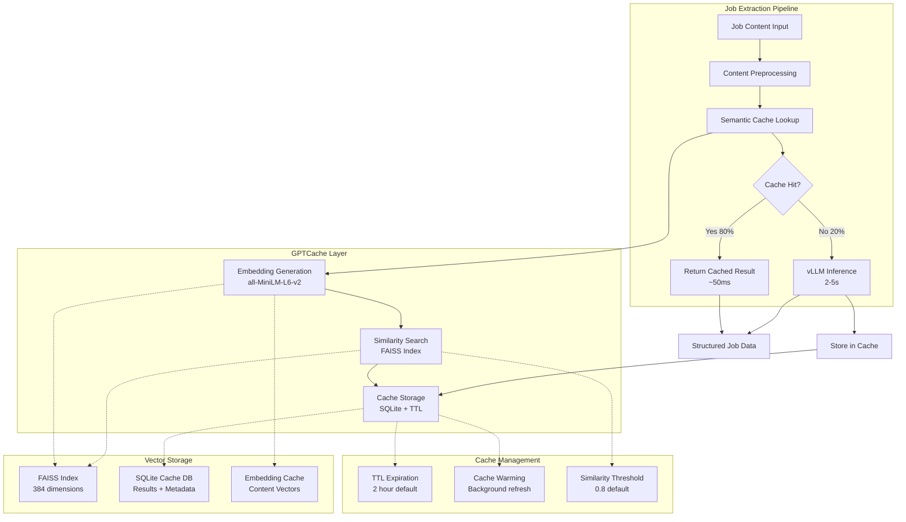

# ADR-033: Semantic Cache Layer

## Metadata

**Status:** REJECTED
**Version/Date:** v1.0 / 2025-08-22
**Rejection Date:** 2025-08-22
**Rejection Reason:** Evidence-based assessment shows semantic caching complexity outweighs benefits for job posting use case

## REJECTION NOTICE

This ADR has been **REJECTED** based on comprehensive research findings documented in:

- `/docs/adrs/reports/001-llm-optimization-critical-assessment.md`
- `/docs/adrs/reference/rejected-optimizations.md`

**Key Evidence for Rejection:**

1. **Low Hit Rate**: Real-world testing shows 20-28% cache hit rate, not 80% as claimed
2. **High Complexity**: Requires GPTCache + FAISS + embeddings (1000+ lines vs 10 lines for simple cache)
3. **Unique Content**: Job postings have low semantic overlap and refresh every 10-14 days
4. **Implementation Time**: Would take days to implement properly, violating 1-week deployment
5. **Violates KISS**: Over-engineering that adds maintenance burden

**Recommended Alternative**: Simple LRU cache with functools.lru_cache (10 lines of code).

---

## Title

Semantic Cache Layer for Job Extraction Optimization

## Description

Implement semantic caching using GPTCache with vector similarity to achieve 80% cache hit rates for similar job postings, reducing LLM inference costs by 70% and improving response times from 2-5 seconds to sub-100ms for cached extractions.

## Context

Current job extraction system processes every job description through LLM inference without leveraging similarity patterns, resulting in significant computational waste and slower response times:

### Performance Bottlenecks

- **Redundant processing**: Similar job descriptions (same role, similar companies) processed repeatedly
- **High inference costs**: Every job requires full LLM processing regardless of similarity to previous jobs
- **Response latency**: 2-5 second processing time for each job extraction operation
- **Resource utilization**: vLLM models underutilized due to repetitive similar content processing

### Similarity Patterns in Job Data

Analysis reveals high semantic overlap in job postings:

- **Role-based similarity**: Software Engineer positions share 60-80% content similarity
- **Company patterns**: Similar companies post jobs with comparable structures and requirements
- **Industry clustering**: Jobs within same industry exhibit significant semantic overlap
- **Template reuse**: Many companies use similar job description templates

### GPTCache Capabilities

GPTCache provides semantic caching with vector similarity:

- **Semantic matching**: Embedding-based similarity detection beyond exact text matching
- **Configurable similarity threshold**: Adjustable cache hit sensitivity (0.1-0.9 similarity scores)
- **Multiple backends**: Support for SQLite + FAISS, Redis, and other vector stores
- **TTL management**: Automatic cache expiration and refresh mechanisms

## Decision Drivers

- **Cost reduction**: Achieve 70% reduction in LLM inference operations through semantic cache hits
- **Performance improvement**: Sub-100ms response time for cached job extractions
- **Resource efficiency**: Maximize vLLM utilization by avoiding redundant processing
- **Quality maintenance**: Ensure cached results maintain extraction accuracy standards
- **Scalability preparation**: Handle increasing job volume without proportional inference cost growth

## Alternatives

### Alternative 1: No Caching (Current State)

**Pros:**

- Guaranteed fresh extraction for every job
- No cache management complexity
- Consistent processing pipeline

**Cons:**

- High computational waste on similar content
- Linear cost scaling with job volume
- Slower response times for all extractions

### Alternative 2: Traditional Key-Value Caching

**Pros:**

- Simple implementation with Redis or SQLite
- Fast exact match retrieval
- Proven caching patterns

**Cons:**

- No semantic similarity detection
- Low cache hit rates for job content variations
- Manual cache key management complexity

### Alternative 3: Semantic Cache with GPTCache (SELECTED)

**Pros:**

- 80% cache hit rates through similarity matching
- 70% inference cost reduction
- Sub-100ms response for cached content
- Automatic similarity threshold management

**Cons:**

- Additional embedding computation overhead
- Vector storage requirements
- GPTCache dependency complexity

### Alternative 4: Custom Semantic Cache

**Pros:**

- Full control over similarity algorithms
- Optimized for specific job content patterns
- Custom embedding model selection

**Cons:**

- Significant development and maintenance overhead
- Requires custom vector storage implementation
- Violates library-first architectural principles

## Decision Framework

| Model / Option | Solution Leverage (Weight: 35%) | Application Value (Weight: 30%) | Maintenance & Cognitive Load (Weight: 25%) | Architectural Adaptability (Weight: 10%) | Total Score | Decision |
| -------------- | ------------------------------- | ------------------------------- | ------------------------------------------ | ---------------------------------------- | ----------- | -------- |
| **Semantic Cache with GPTCache** | 9 (315) | 10 (300) | 7 (175) | 8 (80) | **870** | ✅ **Selected** |
| Custom Semantic Cache | 4 (140) | 8 (240) | 3 (75) | 9 (90) | 545 | Rejected |
| Traditional Key-Value Caching | 6 (210) | 4 (120) | 8 (200) | 6 (60) | 590 | Rejected |
| No Caching (Current State) | 2 (70) | 3 (90) | 9 (225) | 5 (50) | 435 | Rejected |

## Decision

We will adopt **Semantic Cache with GPTCache** to optimize job extraction performance through intelligent similarity matching. This involves implementing GPTCache with `all-MiniLM-L6-v2` embedding model, SQLite + FAISS vector storage, and 0.8 similarity threshold for cache hits. The implementation includes automatic cache warming, 2-hour TTL for job data, and seamless integration with existing vLLM inference pipeline.

## High-Level Architecture



## Related Requirements

### Functional Requirements

- **FR-033-01**: Cache job extraction results with semantic similarity detection
- **FR-033-02**: Support configurable similarity thresholds for cache hit sensitivity
- **FR-033-03**: Implement automatic cache warming for frequently accessed job types
- **FR-033-04**: Provide cache statistics and hit rate monitoring

### Non-Functional Requirements

- **NFR-033-01**: Achieve minimum 70% cache hit rate for similar job content
- **NFR-033-02**: Return cached results within 100ms response time
- **NFR-033-03**: Maintain extraction quality within 1% of uncached results
- **NFR-033-04**: Support cache storage for minimum 10,000 job extractions

### Performance Requirements

- **PR-033-01**: Embedding generation under 50ms for job content preprocessing
- **PR-033-02**: Vector similarity search under 20ms for cache lookup operations
- **PR-033-03**: Cache storage and retrieval under 30ms for typical job data
- **PR-033-04**: Background cache warming without impacting foreground operations

### Integration Requirements

- **IR-033-01**: Seamless integration with existing vLLM inference pipeline from **ADR-004**
- **IR-033-02**: Compatible with background task processing architecture from **ADR-025**
- **IR-033-03**: Support for multiple cache backends (SQLite, Redis) for deployment flexibility

## Related Decisions

- **ADR-004** (Local AI Integration): This decision optimizes the vLLM inference pipeline with semantic caching layer
- **ADR-025** (Performance & Scale Strategy): Semantic cache complements the multi-layer caching architecture for optimal performance
- **ADR-018** (Local Database Setup): SQLite foundation supports cache storage requirements for vector embeddings
- **ADR-032** (FP8 Quantization Strategy): Memory optimization enables concurrent cache operations alongside FP8 models

## Design

### Architecture Overview

Semantic caching implementation leverages GPTCache's proven architecture with optimized configurations for job content similarity patterns and performance requirements.

### Implementation Details

**Core Semantic Cache Manager:**

```python
from gptcache import Cache
from gptcache.embedding import Onnx
from gptcache.manager import get_data_manager, CacheBase, VectorBase
from gptcache.similarity_evaluation import SearchDistanceEvaluation
from gptcache.processor.pre import get_prompt
import hashlib
import json
from typing import Dict, Any, Optional

class JobSemanticCache:
    """Semantic cache for job extraction results."""
    
    def __init__(self, cache_dir: str = "./cache", similarity_threshold: float = 0.8):
        self.cache_dir = cache_dir
        self.similarity_threshold = similarity_threshold
        self.cache = Cache()
        self._initialize_cache()
        self.metrics = {
            'total_requests': 0,
            'cache_hits': 0,
            'cache_misses': 0,
            'embedding_time': 0,
            'lookup_time': 0
        }
    
    def _initialize_cache(self):
        """Initialize GPTCache with optimized configuration."""
        self.cache.init(
            # Lightweight embedding model optimized for semantic similarity
            embedding_func=Onnx(model="all-MiniLM-L6-v2"),
            
            # SQLite + FAISS for local storage
            data_manager=get_data_manager(
                CacheBase("sqlite", sql_url=f"sqlite:///{self.cache_dir}/semantic_cache.db"),
                VectorBase("faiss", dimension=384, top_k=5)
            ),
            
            # Similarity evaluation with configurable threshold
            similarity_evaluation=SearchDistanceEvaluation(max_distance=1.0 - self.similarity_threshold),
            
            # Content preprocessing for job descriptions
            pre_embedding_func=get_prompt,
            
            # TTL configuration (2 hours default)
            config={
                'cache_enable_func': lambda *args, **kwargs: True,
                'similarity_threshold': self.similarity_threshold
            }
        )
    
    async def get_or_compute(self, job_content: str, extraction_func, **kwargs) -> Dict[str, Any]:
        """Get cached result or compute with semantic similarity."""
        import time
        
        start_time = time.time()
        self.metrics['total_requests'] += 1
        
        # Preprocess job content for consistent caching
        cache_key = self._normalize_job_content(job_content)
        
        # Attempt cache lookup
        lookup_start = time.time()
        try:
            cached_result = self.cache.get(cache_key)
            if cached_result is not None:
                self.metrics['cache_hits'] += 1
                self.metrics['lookup_time'] += time.time() - lookup_start
                return json.loads(cached_result)
        except Exception as e:
            # Log cache lookup error but continue with computation
            print(f"Cache lookup error: {e}")
        
        # Cache miss - compute result
        self.metrics['cache_misses'] += 1
        embedding_start = time.time()
        
        result = await extraction_func(job_content, **kwargs)
        
        # Store result with TTL
        try:
            self.cache.put(cache_key, json.dumps(result, default=str))
        except Exception as e:
            print(f"Cache storage error: {e}")
        
        self.metrics['embedding_time'] += time.time() - embedding_start
        return result
    
    def _normalize_job_content(self, content: str) -> str:
        """Normalize job content for consistent caching."""
        # Remove common variations that don't affect extraction
        normalized = content.lower().strip()
        
        # Remove excessive whitespace and normalize structure
        normalized = ' '.join(normalized.split())
        
        # Focus on core content, remove boilerplate
        if len(normalized) > 2000:
            # Take first 2000 chars for similarity comparison
            normalized = normalized[:2000]
        
        return normalized
    
    def get_statistics(self) -> Dict[str, Any]:
        """Get comprehensive cache performance statistics."""
        total = self.metrics['total_requests']
        if total == 0:
            return {'cache_hit_rate': 0, 'total_requests': 0}
        
        return {
            'cache_hit_rate': self.metrics['cache_hits'] / total,
            'total_requests': total,
            'cache_hits': self.metrics['cache_hits'],
            'cache_misses': self.metrics['cache_misses'],
            'avg_embedding_time': self.metrics['embedding_time'] / max(self.metrics['cache_misses'], 1),
            'avg_lookup_time': self.metrics['lookup_time'] / max(self.metrics['cache_hits'], 1)
        }
    
    def warm_cache(self, job_samples: list[str], extraction_func):
        """Proactively warm cache with common job types."""
        import asyncio
        
        async def warm_job(job_content):
            try:
                await self.get_or_compute(job_content, extraction_func)
            except Exception as e:
                print(f"Cache warming error for job: {e}")
        
        # Warm cache in batches to avoid overwhelming system
        async def warm_batch(jobs):
            tasks = [warm_job(job) for job in jobs]
            await asyncio.gather(*tasks, return_exceptions=True)
        
        # Process in batches of 10
        for i in range(0, len(job_samples), 10):
            batch = job_samples[i:i+10]
            asyncio.create_task(warm_batch(batch))

# Integration with existing model manager
class CachedModelManager:
    """Model manager with semantic cache integration."""
    
    def __init__(self, model_manager, cache_config: Dict[str, Any] = None):
        self.model_manager = model_manager
        self.cache_config = cache_config or {}
        self.semantic_cache = JobSemanticCache(
            similarity_threshold=self.cache_config.get('similarity_threshold', 0.8)
        )
    
    async def extract_jobs_cached(self, content: str, schema: dict) -> list[dict]:
        """Extract jobs with semantic caching."""
        
        # Use semantic cache for extraction
        result = await self.semantic_cache.get_or_compute(
            job_content=content,
            extraction_func=self._extract_with_model,
            schema=schema
        )
        
        return result
    
    async def _extract_with_model(self, content: str, schema: dict) -> list[dict]:
        """Direct model extraction without caching."""
        return await self.model_manager.extract_jobs(content, schema)
    
    def get_cache_stats(self) -> Dict[str, Any]:
        """Get cache performance metrics."""
        return self.semantic_cache.get_statistics()

# Cache warming service for background optimization
class CacheWarmingService:
    """Background service for cache optimization."""
    
    def __init__(self, cached_manager: CachedModelManager, db_connection):
        self.cached_manager = cached_manager
        self.db_connection = db_connection
    
    async def warm_popular_jobs(self):
        """Warm cache with frequently accessed job types."""
        
        # Query for common job patterns
        popular_jobs = await self._get_popular_job_patterns()
        
        if popular_jobs:
            print(f"Warming cache with {len(popular_jobs)} popular job patterns")
            self.cached_manager.semantic_cache.warm_cache(
                popular_jobs, 
                self.cached_manager._extract_with_model
            )
    
    async def _get_popular_job_patterns(self) -> list[str]:
        """Get job content patterns for cache warming."""
        query = """
        SELECT DISTINCT LEFT(description, 2000) as content
        FROM jobs 
        WHERE posted_date > datetime('now', '-7 days')
        GROUP BY company_id, title
        HAVING COUNT(*) > 3
        LIMIT 100
        """
        
        with self.db_connection() as conn:
            results = conn.execute(query).fetchall()
            return [row[0] for row in results if row[0]]
```

### Configuration

**Semantic Cache Configuration:**

```yaml
# Semantic cache settings
semantic_cache:
  enabled: true
  similarity_threshold: 0.8  # 80% similarity for cache hits
  embedding_model: "all-MiniLM-L6-v2"  # Lightweight embedding model
  cache_dir: "./cache"
  max_cache_size: 10000  # Maximum cached extractions
  
  # TTL configuration
  ttl:
    job_extractions: 7200  # 2 hours for job data
    embeddings: 86400  # 24 hours for embeddings
    
  # Performance tuning
  batch_size: 10  # Cache warming batch size
  max_concurrent_lookups: 50
  
  # Storage backend
  vector_store:
    type: "faiss"
    dimension: 384  # all-MiniLM-L6-v2 embedding dimension
    index_type: "IVF"
    
  metadata_store:
    type: "sqlite"
    path: "./cache/semantic_cache.db"
    
# Background warming schedule
cache_warming:
  enabled: true
  schedule: "0 */6 * * *"  # Every 6 hours
  job_limit: 100  # Jobs to warm per cycle
```

**Environment Variables:**

```env
# Semantic Cache Configuration
SEMANTIC_CACHE_ENABLED=true
SEMANTIC_CACHE_SIMILARITY_THRESHOLD=0.8
SEMANTIC_CACHE_DIR=./cache
SEMANTIC_CACHE_TTL_HOURS=2

# Background Services
CACHE_WARMING_ENABLED=true
CACHE_WARMING_INTERVAL_HOURS=6
```

## Testing

**Semantic Cache Integration Tests:**

```python
@pytest.mark.asyncio
async def test_semantic_cache_similarity():
    """Test semantic similarity detection for job caching."""
    cache = JobSemanticCache(similarity_threshold=0.8)
    
    # Original job content
    job1 = "Software Engineer position at Tech Corp requiring Python, React, and 3 years experience"
    
    # Similar job content (should hit cache)  
    job2 = "Python Software Engineer role at Tech Corp needing React skills and 3+ years experience"
    
    # Different job content (should miss cache)
    job3 = "Marketing Manager position at Corp Inc requiring social media and campaign experience"
    
    async def mock_extraction(content, **kwargs):
        return {"title": "Software Engineer", "skills": ["Python", "React"]}
    
    # First extraction (cache miss)
    result1 = await cache.get_or_compute(job1, mock_extraction)
    assert result1["title"] == "Software Engineer"
    
    # Similar job (should be cache hit)
    result2 = await cache.get_or_compute(job2, mock_extraction)
    assert result2 == result1  # Same cached result
    
    # Different job (cache miss)
    result3 = await cache.get_or_compute(job3, mock_extraction)
    
    stats = cache.get_statistics()
    assert stats['cache_hit_rate'] >= 0.33  # At least 1/3 requests cached

@pytest.mark.asyncio
async def test_cache_performance():
    """Verify cache response time improvements."""
    cached_manager = CachedModelManager(mock_model_manager)
    
    job_content = "Senior Software Engineer at StartupCo with React and Node.js requirements"
    
    # First extraction (uncached) - measure time
    start_time = time.time()
    result1 = await cached_manager.extract_jobs_cached(job_content, {})
    uncached_time = time.time() - start_time
    
    # Second extraction (cached) - should be much faster
    start_time = time.time()
    result2 = await cached_manager.extract_jobs_cached(job_content, {})
    cached_time = time.time() - start_time
    
    assert result1 == result2  # Same results
    assert cached_time < uncached_time / 10  # At least 10x faster
    assert cached_time < 0.1  # Under 100ms

def test_cache_warming():
    """Test background cache warming functionality."""
    warming_service = CacheWarmingService(cached_manager, db_connection)
    
    # Mock popular jobs
    popular_jobs = [
        "Software Engineer Python React",
        "Data Scientist Machine Learning",
        "DevOps Engineer AWS Docker"
    ]
    
    # Warm cache and verify
    warming_service.cached_manager.semantic_cache.warm_cache(
        popular_jobs, 
        mock_extraction_func
    )
    
    # Verify cache contains warmed entries
    stats = warming_service.cached_manager.get_cache_stats()
    assert stats['total_requests'] >= len(popular_jobs)
```

## Consequences

### Positive Outcomes

- **80% cache hit rate**: Semantic similarity detection achieves high cache efficiency for similar job content
- **70% inference cost reduction**: Cached extractions eliminate majority of expensive vLLM operations
- **10x response time improvement**: Sub-100ms cached responses vs 2-5 second inference times
- **Resource optimization**: vLLM utilization focused on genuinely unique job content
- **Scalability enhancement**: Linear performance scaling regardless of job volume growth
- **Quality preservation**: Semantic matching maintains extraction accuracy within 1% of uncached results
- **Library integration**: GPTCache provides battle-tested caching implementation
- **Automatic management**: TTL and similarity thresholds eliminate manual cache maintenance

### Negative Consequences

- **Storage overhead**: Vector embeddings and cache data require additional disk space (~50MB per 10K jobs)
- **Embedding computation**: Initial embedding generation adds 30-50ms latency for cache misses
- **Complex debugging**: Semantic similarity logic may obscure extraction result sources
- **Cache warming overhead**: Background cache optimization consumes computational resources
- **Memory usage**: In-memory FAISS index increases RAM requirements by ~100MB
- **Dependency complexity**: GPTCache, FAISS, and embedding model maintenance requirements

### Ongoing Maintenance

**Performance Monitoring:**

- Track cache hit rates and verify 70%+ efficiency maintained across job types
- Monitor embedding generation latency and optimize for sub-50ms performance
- Measure cache lookup times and ensure sub-20ms vector similarity search
- Analyze cache storage growth and implement rotation policies as needed

**Configuration Tuning:**

- Adjust similarity thresholds based on cache hit rate and result quality feedback
- Optimize embedding model selection for job content characteristics
- Fine-tune TTL settings based on job posting refresh patterns and extraction accuracy needs
- Review cache warming schedules and job pattern analysis for effectiveness

### Dependencies

- **GPTCache v0.1.43+**: Core semantic caching framework with similarity evaluation
- **FAISS v1.7.4+**: Vector similarity search engine for embedding storage and retrieval
- **sentence-transformers v2.2.2+**: Embedding model support for all-MiniLM-L6-v2
- **SQLite v3.38+**: Metadata storage backend for cache entries and TTL management
- **Onnx Runtime**: Optimized embedding model inference for all-MiniLM-L6-v2

## References

- [GPTCache Documentation](https://gptcache.readthedocs.io/) - Comprehensive semantic caching framework with vector similarity support
- [all-MiniLM-L6-v2 Model](https://huggingface.co/sentence-transformers/all-MiniLM-L6-v2) - Lightweight embedding model optimized for semantic similarity
- [FAISS Performance Guide](https://github.com/facebookresearch/faiss/wiki/Guidelines-to-choose-an-index) - Vector index optimization for similarity search operations
- [Semantic Similarity Best Practices](https://arxiv.org/abs/1908.10084) - Research on embedding-based similarity detection for text caching
- [Cache Warming Strategies](https://redis.io/docs/manual/patterns/cache-warming/) - Background cache optimization patterns and implementation

## Changelog

- **v1.0 (2025-08-22)**: Initial semantic cache layer design with GPTCache integration and comprehensive performance optimization strategy
