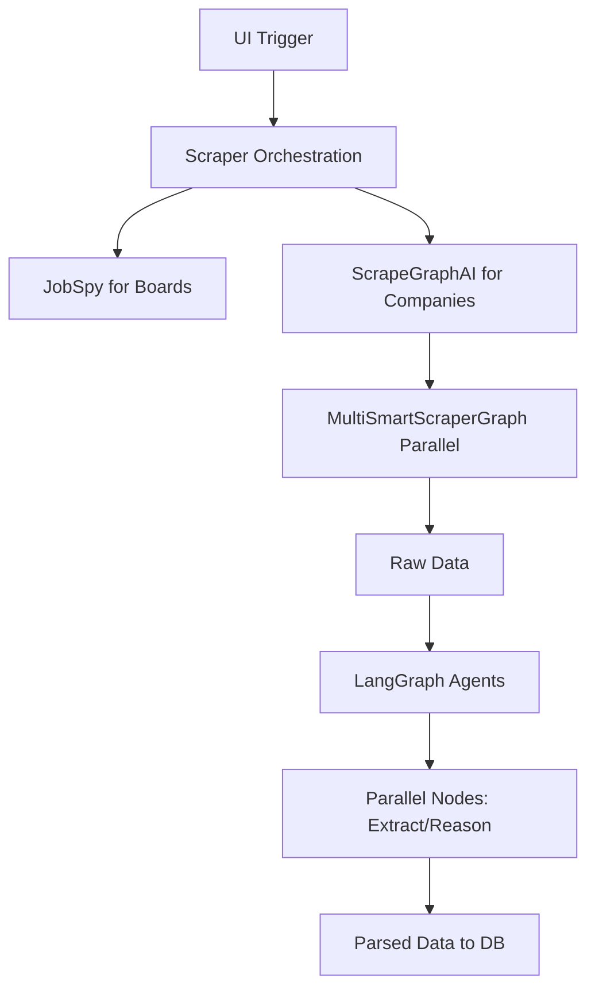

# ADR-001: Scraping Library Selection

## Title

Selection of Libraries for Job Scraping from Boards and Company Pages

## Version/Date

1.0 / July 31, 2025

## Status

Accepted

## Context

The app requires scraping job postings from job boards (LinkedIn, Indeed, Glassdoor, ZipRecruiter) and company career pages (OpenAI, NVIDIA, etc.), extracting details like title, description, salary, department. Needs to handle dynamic content, bot detection, and be modular/low-maintenance. Research showed specialized libs like JobSpy for boards and AI-driven ones like ScrapeGraphAI for adaptable company scraping outperform general tools like Scrapy or Playwright in ease and accuracy.

## Related Requirements

- Scrape full job details with 90%+ accuracy.

- Support parallel/multi-page extraction.

- Integrate with agents for reasoning/inference.

- Low custom code (library-first).

## Alternatives

- Scrapy: Scalable but requires custom spiders/selectors (high maintenance).

- Playwright/Selenium: Good for JS but heavy scripting per site (violates KISS).

- Crawl4AI/Firecrawl: Strong crawling but less prompt-adaptable than ScrapeGraphAI.

- JobSpy + ScrapeGraphAI: JobSpy board-specialized (concurrent, proxies); ScrapeGraphAI AI-prompts for companies (adapts to changes, multi-graph parallel).

## Decision

Use JobSpy for job boards (specialized, easy integration) and ScrapeGraphAI for company pages (prompt-based adaptability, multi-graph for parallel). Supplements with LangGraph for agentic multi-step (e.g., navigate details).

## Related Decisions

- ADR-006 (Agentic Workflows).

- ADR-003 (Bot Avoidance).

## Design

Mermaid diagram for data flow:

- JobSpy: Call scrape_jobs with proxies/search_term.

- ScrapeGraphAI: SmartScraperGraph(prompt, url, config with max_retries/stream/proxies).

- Integration: Async in scraper.py; proxies from utils.

## Consequences

- Positive: High accuracy/adaptability (95%+ with prompts), low maintenance (no manual selectors).

- Negative: Dependency on LLM for ScrapeGraphAI (cost via APIs, but hybrid mitigates).

- Mitigations: Config toggles for multi-graph/streaming; fallback to non-LLM if needed.
