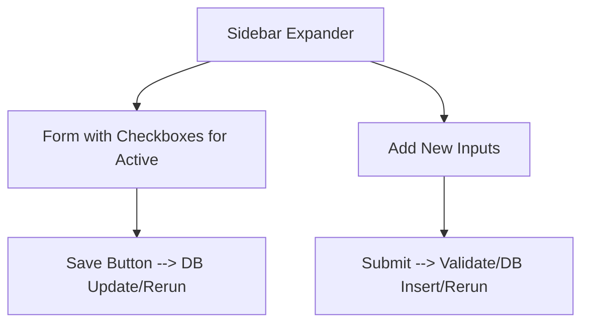

# ADR-005: UI Seed-Company Toggle Form

## Title

Streamlit Form for Company Management and Toggling

## Version/Date

1.0 / July 31, 2025

## Status

Accepted

## Context

Users need to add/toggle companies for scraping. Research showed Streamlit st.form with checkboxes provides intuitive UX (easy DB sync).

## Related Requirements

- UX for company add/remove/active toggle.

- DB-backed persistence.

## Alternatives

- Manual Config Edit: Simple but poor UX.

- Full CRUD Table: Complex for MVP.

## Decision

Use st.form with checkboxes for toggle/save, inputs for add new; validate/rerun on submit.

## Related Decisions

- ADR-004 (UI responsiveness with streaming).

## Design

Mermaid for UI flow:

- app.py: st.form with st.checkbox for active, st.text_input for new, submit with DB ops.

## Consequences

- Positive: Intuitive UX, direct DB link.

- Negative: Minor form complexity.

- Mitigations: Validation for URL/name uniqueness.
