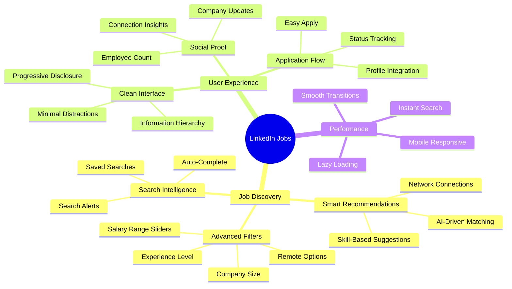
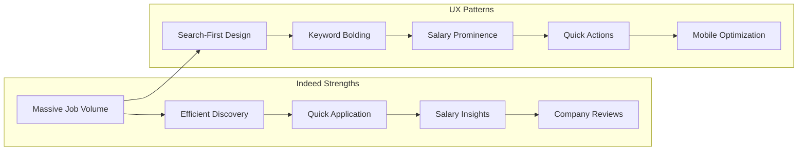
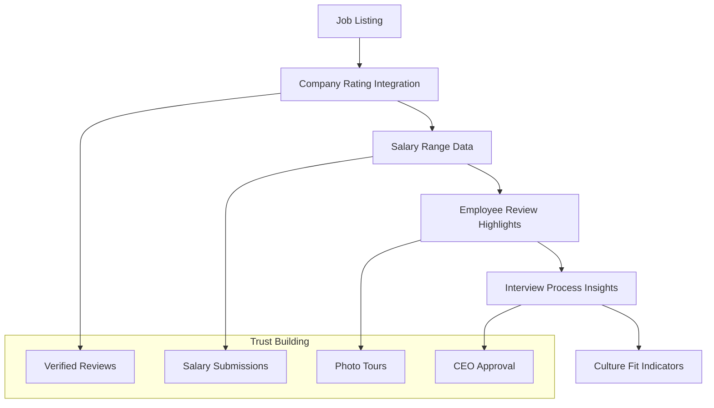
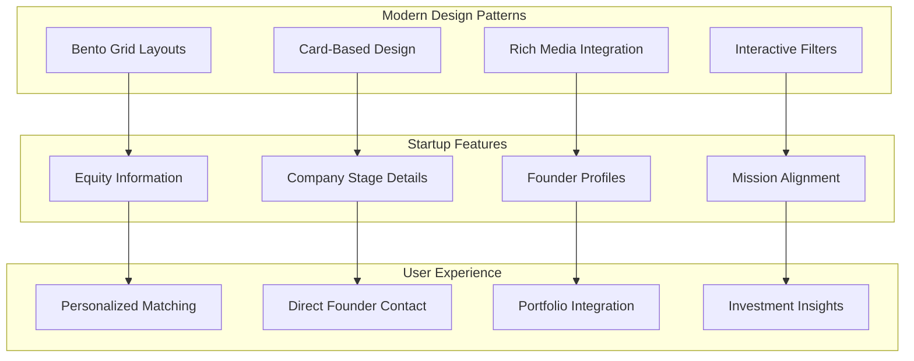
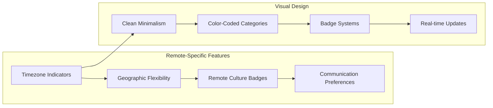
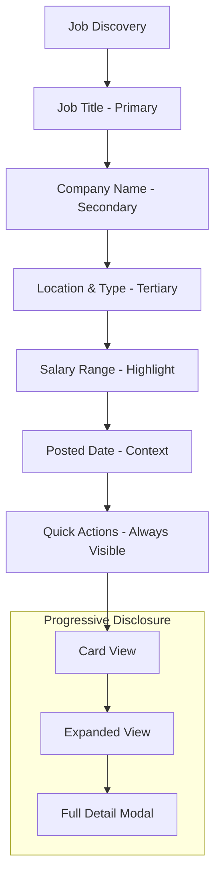
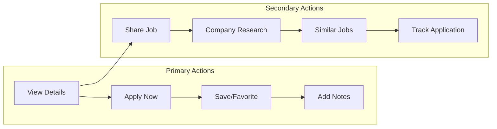
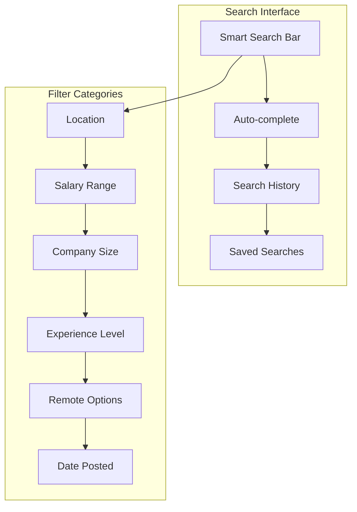
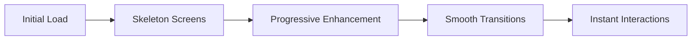

# Competitive Analysis & Industry UX Patterns

> *Last Updated: August 2025*

## 🎯 Analysis Overview

Comprehensive analysis of leading job boards and career platforms to identify best practices, UX patterns, and competitive advantages for implementing in our AI job scraper. Focus on desktop-optimized patterns for power users and personal job management.

## 🏆 Industry Leaders Analysis

### **LinkedIn Jobs - The Professional Standard**

#### **Key UX Patterns from LinkedIn**

- **Faceted Search with Live Results**: Filters update results instantly without page reload

- **Salary Transparency**: Prominent salary ranges with distribution visualization

- **Social Proof Integration**: "People in your network" and company insights

- **Progressive Disclosure**: Job cards show essential info, click for full details

- **Smart Status Management**: Clear application status with timeline visualization

#### **Adoptable Patterns for AI Job Scraper**

- ✅ **Instant Filter Updates**: Real-time filtering without page refresh

- ✅ **Salary Range Sliders**: Visual salary filtering with range display

- ✅ **Job Card Hierarchy**: Title → Company → Location → Salary priority

- ✅ **Saved Search Functionality**: Store and reuse common filter combinations

- ✅ **Application Status Tracking**: Clear progression from "not applied" to "interviewed"

---

### **Indeed - Volume & Efficiency Focus**

#### **Indeed's Core Advantages**

- **Search-First Interface**: Powerful search bar as primary interaction

- **Information Density**: Maximum job info in minimal space

- **Keyword Highlighting**: Search terms bolded in results for quick scanning

- **Salary Data Prominence**: Salary displayed prominently when available

- **Quick Apply Flow**: Streamlined application process

#### **Patterns to Implement**

- ✅ **Keyword Highlighting**: Bold search terms in job descriptions and titles

- ✅ **Compact Card Design**: Essential info in small footprint

- ✅ **Salary Badges**: Prominent salary display with visual hierarchy

- ✅ **Quick Action Buttons**: Favorite, apply, save actions always visible

- ✅ **Search Suggestions**: Auto-complete with popular search terms

---

### **Glassdoor - Transparency & Insights**

#### **Glassdoor's Differentiation**

- **Company Intelligence Integration**: Ratings, reviews, and culture insights

- **Salary Transparency**: Crowdsourced salary data with ranges

- **Interview Process Insights**: Real interview questions and process details

- **Cultural Fit Assessment**: Company culture descriptions and photos

#### **Applicable Insights**

- ✅ **Company Metadata**: Display company size, industry, rating where available

- ✅ **Salary Context**: Show salary ranges with market comparison

- ✅ **Company Notes Section**: Allow personal notes about company culture/fit

- ✅ **Research Integration**: Link to company research and reviews

- ✅ **Interview Tracking**: Track interview stages and questions asked

---

### **AngelList (Wellfound) - Startup-Focused Modern UI**

#### **Modern UI Patterns from AngelList**

- **Bento Grid Layouts**: Asymmetric card arrangements for visual interest

- **Rich Company Profiles**: Founder photos, mission statements, funding info

- **Interactive Job Matching**: Swipe-like interface for job discovery

- **Equity Transparency**: Clear equity and compensation breakdowns

#### **Design Patterns to Adopt**

- ✅ **Asymmetric Grid Layouts**: Pinterest-style varied card sizes

- ✅ **Rich Media Cards**: Company logos, founder photos when available

- ✅ **Interactive Filtering**: Smooth filter animations and transitions

- ✅ **Progressive Enhancement**: Basic functionality works, animations enhance

- ✅ **Mission/Culture Display**: Highlight company mission and values

---

### **Remote Job Boards (Remote.co, RemoteOK) - Niche Optimization**

#### **Remote Board Innovations**

- **Location Flexibility Indicators**: Clear remote vs. hybrid vs. onsite badges

- **Timezone Compatibility**: Display working hour requirements

- **Real-time Job Feeds**: Live updates as new jobs are posted

- **Category Color Coding**: Visual job type identification

#### **Patterns for Implementation**

- ✅ **Location Type Badges**: Remote/Hybrid/Onsite visual indicators

- ✅ **Real-time Updates**: Live job count updates during scraping

- ✅ **Category Visualization**: Color-coded job types and departments

- ✅ **Timezone-Aware Filtering**: Filter by work schedule compatibility

- ✅ **Feed-Style Updates**: Activity feed showing new jobs discovered

## 🎨 UX Pattern Synthesis

### **Information Architecture Best Practices**

#### **Visual Hierarchy Principles**

1. **Job Title** - Largest, bold, clickable
2. **Company Name** - Secondary prominence, linked
3. **Location & Remote Status** - Visual badges/icons
4. **Salary Range** - Highlighted when available
5. **Posted Date** - Relative time, subtle
6. **Quick Actions** - Persistent, icon-based

### **Interaction Patterns**

#### **Action Hierarchy**

- **Primary**: View, Apply, Favorite (always visible)

- **Secondary**: Share, Research, Similar (in expanded view)

- **Contextual**: Notes, Status Update (in detail modal)

### **Filtering & Search Patterns**

#### **Filter Implementation Strategy**

- **Instant Results**: No "Apply Filters" button needed

- **Visual Feedback**: Active filters clearly displayed

- **Filter Combinations**: Multiple filters work together logically

- **Clear All Option**: Easy way to reset all filters

- **Saved Filter Sets**: Store common filter combinations

## 🚀 Modern Desktop UX Patterns

### **Power User Optimization**

#### **Keyboard Navigation Support**

- `Ctrl/Cmd + K`: Quick search activation

- `J/K`: Navigate between job cards

- `Enter`: Open job detail

- `F`: Toggle favorite

- `S`: Save search

- `Esc`: Close modals/overlays

#### **Multi-Window Support**

- **Job Detail Popouts**: Open job details in new window

- **Comparison Mode**: Side-by-side job comparison

- **Research Windows**: Open company pages in separate windows

- **Application Tracking**: Dedicated window for application management

#### **Bulk Operations**

- **Multi-select**: Select multiple jobs for bulk actions

- **Batch Export**: Export selected jobs to CSV/PDF

- **Batch Status Updates**: Update application status for multiple jobs

- **Batch Notes**: Add similar notes to multiple related positions

### **Performance & Responsiveness**

#### **Loading States & Feedback**

- **Skeleton Screens**: Show layout while loading content

- **Progressive Loading**: Load above-the-fold content first

- **Optimistic Updates**: Update UI immediately, sync in background

- **Smooth Animations**: 60fps transitions for all interactions

#### **Caching Strategy**

- **Search Result Caching**: Cache filter combinations

- **Image Preloading**: Preload company logos for visible jobs

- **Predictive Loading**: Load next page while user views current

- **Background Sync**: Update job data in background without UI blocking

## 📊 Competitive Feature Matrix

### **Feature Comparison Analysis**

| Feature | LinkedIn | Indeed | Glassdoor | AngelList | Our Target |
|---------|----------|--------|-----------|-----------|------------|
| **Advanced Filtering** | ✅ Excellent | ✅ Good | ✅ Good | ✅ Modern | ✅ Enhanced |
| **Salary Transparency** | ✅ Range Display | ✅ Prominent | ✅ Crowdsourced | ✅ Equity Info | ✅ AI-Enhanced |
| **Real-time Updates** | ❌ No | ❌ No | ❌ No | ✅ Limited | ✅ Live Progress |
| **Company Insights** | ✅ Social Proof | ❌ Basic | ✅ Extensive | ✅ Rich Profiles | ✅ Personal Notes |
| **Application Tracking** | ✅ Basic | ❌ Limited | ❌ No | ✅ Direct Contact | ✅ Full Workflow |
| **Search Intelligence** | ✅ AI-Powered | ✅ Keyword-Based | ✅ Basic | ✅ Matching | ✅ Semantic Search |
| **Mobile Experience** | ✅ Excellent | ✅ Good | ✅ Good | ✅ Modern | ⚠️ Desktop-First |
| **Personalization** | ✅ Network-Based | ❌ Limited | ❌ Basic | ✅ Preference-Based | ✅ AI-Driven |

### **Competitive Advantages to Build**

#### **AI-Enhanced Features** (Unique Differentiators)

- **Intelligent Job Matching**: AI analysis of job descriptions vs. user preferences

- **Salary Prediction**: ML-based salary estimation for jobs without listed salaries

- **Company Culture Fit**: AI analysis of company descriptions for culture matching

- **Career Path Suggestions**: AI recommendations for career progression

- **Interview Prep**: Automated interview question generation based on job descriptions

#### **Personal Job Management** (Privacy-First)

- **Local Data Storage**: All data stays on user's machine

- **Custom Categorization**: Personal job organization system

- **Application Workflow**: Full application lifecycle tracking

- **Personal Notes & Research**: Rich note-taking integrated with job data

- **Export Flexibility**: Multiple export formats with custom templates

#### **Real-time Intelligence** (Technical Advantage)

- **Live Scraping Progress**: Real-time visibility into job discovery

- **Instant Updates**: Immediate notification of new jobs

- **Change Detection**: Track when job postings are modified

- **Availability Monitoring**: Alert when jobs are no longer posted

- **Trend Analysis**: Personal analytics on job market trends

## 🎯 Implementation Priorities

### **Phase 1: Core UX Patterns** (Immediate Implementation)

1. **Pinterest-style Job Grid**: Responsive card layout with hover effects
2. **Instant Search & Filtering**: Real-time results without page reload
3. **Visual Hierarchy**: Clear information architecture following industry standards
4. **Smooth Interactions**: Hover states, transitions, and micro-animations
5. **Keyboard Navigation**: Power user keyboard shortcuts

### **Phase 2: Enhanced Features** (Next Sprint)

1. **Advanced Filtering Panel**: Sliding filter panel with visual feedback
2. **Job Detail Modals**: Rich job detail overlay with smooth transitions
3. **Application Status Tracking**: Visual workflow for application management
4. **Bulk Operations**: Multi-select and batch actions
5. **Smart Search Suggestions**: Auto-complete with search history

### **Phase 3: AI & Intelligence** (Advanced Features)

1. **Semantic Search**: AI-powered job matching and relevance scoring
2. **Salary Intelligence**: ML-based salary prediction and market analysis
3. **Company Insights**: AI-generated company summaries and culture analysis
4. **Career Recommendations**: Personalized career path suggestions
5. **Interview Preparation**: Automated interview question generation

### **Phase 4: Power User Features** (Professional Tools)

1. **Multi-Window Support**: Popout windows for job comparison
2. **Advanced Analytics**: Personal job market trend analysis
3. **Custom Workflows**: Configurable application tracking workflows
4. **API Integration**: Connect with external tools (CRM, calendars)
5. **Team Collaboration**: Share job lists and notes with career advisors

## 📈 Success Metrics & KPIs

### **User Experience Metrics**

- **Time to First Job Discovery**: < 30 seconds from app launch

- **Search Result Relevance**: > 85% user satisfaction with search results

- **Filter Usage**: > 60% of users use 2+ filters per session

- **Application Tracking**: > 40% of users track application status

- **Session Duration**: Target 10+ minutes average session time

### **Performance Metrics**

- **Page Load Time**: < 2 seconds for initial load

- **Search Response Time**: < 100ms for filter updates

- **Animation Performance**: 60fps for all transitions

- **Memory Usage**: < 500MB for 10,000+ jobs loaded

- **Cache Hit Rate**: > 80% for repeated searches

### **Feature Adoption Metrics**

- **Advanced Filters**: > 50% of users use salary or location filters

- **Favorites**: > 30% of users save favorite jobs

- **Notes**: > 20% of users add personal notes to jobs

- **Export**: > 15% of users export job data

- **Keyboard Shortcuts**: > 10% of power users adopt keyboard navigation

This competitive analysis provides a comprehensive foundation for implementing modern, user-centric features that differentiate our AI job scraper while incorporating proven UX patterns from industry leaders.
