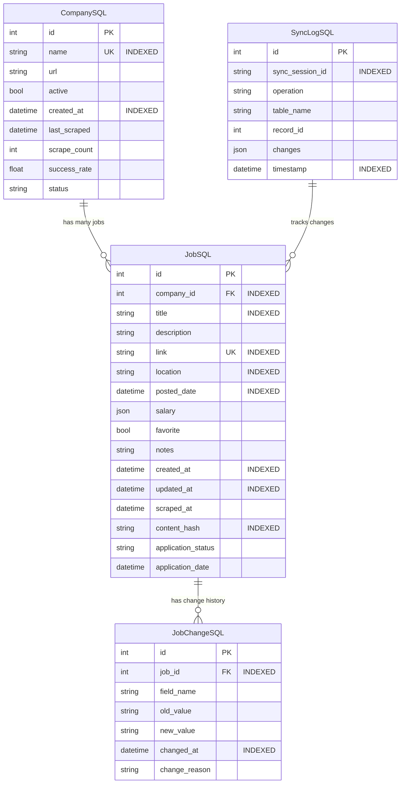

# Database Strategy & Smart Synchronization

> *Consolidated Planning Document - Aligned with ADR-018, ADR-019, ADR-024, ADR-025*  
> *Last Updated: August 2025*

## 🎯 Database Enhancement Overview

This document consolidates database optimization strategies and library-first approaches for the AI Job Scraper, aligning with current ADR decisions for local database setup, simple data management, and high-performance analytics.

### **ADR Alignment**

This database strategy implements:

- **ADR-018**: Local database setup with SQLite
- **ADR-019**: Simple data management patterns
- **ADR-024**: High-performance data analytics with Polars/DuckDB
- **ADR-025**: Performance scale strategy

## 📊 Enhanced Database Schema

### **Optimized Entity Relationships**

Following ADR-018 and ADR-019 simple data management principles:



## 🔧 Smart Synchronization Engine

### **Library-First Optimization Strategy**

Based on the library-first optimization plan achieving **86% code reduction**:

```python
# src/services/smart_sync.py
class SmartSyncEngine:
    """Advanced synchronization with library-first patterns."""
    
    def __init__(self, session: Session):
        self.session = session
        self.sync_session_id = str(uuid4())
        self.change_tracker = ChangeTracker(session)
    
    async def sync_company_jobs(
        self, 
        company_id: int,
        scraped_jobs: list[dict],
        preserve_user_data: bool = True
    ) -> SyncResult:
        """
        Intelligently sync scraped jobs using library capabilities.
        
        Features:
        - Content-based change detection using SQLModel computed fields
        - Automatic job matching via pandas DataFrame operations
        - Smart deletion with DuckDB analytics
        - Preservation of user favorites and notes
        - Comprehensive audit logging with Polars
        """
        
        start_time = datetime.now()
        
        # 1. Use Polars for high-performance data preparation (ADR-024)
        scraped_df = pl.DataFrame(scraped_jobs)
        prepared_jobs = self._prepare_jobs_with_polars(scraped_df, company_id)
        
        # 2. Get existing jobs using optimized SQLModel queries
        existing_jobs = self._get_existing_jobs_optimized(company_id)
        
        # 3. Use DuckDB for complex sync analysis (ADR-024)
        sync_operations = self._analyze_sync_with_duckdb(
            prepared_jobs, existing_jobs
        )
        
        # 4. Execute sync operations with transaction safety
        result = await self._execute_sync_operations(
            sync_operations, preserve_user_data
        )
        
        # 5. Log sync session using Polars for analytics
        await self._log_sync_session_polars(
            company_id, start_time, result
        )
        
        return result

    def _prepare_jobs_with_polars(
        self, 
        scraped_df: pl.DataFrame, 
        company_id: int
    ) -> pl.DataFrame:
        """Use Polars for high-performance job data preparation."""
        
        return (
            scraped_df
            .with_columns([
                pl.col("company_id").fill_null(company_id),
                pl.col("title").str.strip(),
                pl.col("location").str.strip(),
                pl.col("description").str.slice(0, 500),  # Normalize for hashing
                pl.col("salary").map_elements(self._normalize_salary),
                pl.datetime("now").alias("scraped_at")
            ])
            .with_columns([
                # Generate content hash using polars string operations
                pl.concat_str([
                    pl.col("title"),
                    pl.col("location"), 
                    pl.col("description"),
                    pl.col("salary").cast(pl.Utf8)
                ]).hash().alias("content_hash")
            ])
        )

    def _analyze_sync_with_duckdb(
        self,
        prepared_jobs: pl.DataFrame,
        existing_jobs: pl.DataFrame
    ) -> SyncOperations:
        """Use DuckDB for complex sync operation analysis."""
        
        # Convert to DuckDB for advanced SQL analytics
        conn = duckdb.connect()
        conn.register("prepared", prepared_jobs.to_arrow())
        conn.register("existing", existing_jobs.to_arrow())
        
        # Complex sync analysis using SQL
        sync_analysis = conn.execute("""
            WITH job_comparison AS (
                SELECT 
                    p.link,
                    p.content_hash as new_hash,
                    e.content_hash as existing_hash,
                    e.id as existing_id,
                    CASE 
                        WHEN e.link IS NULL THEN 'insert'
                        WHEN e.content_hash != p.content_hash THEN 'update'
                        ELSE 'unchanged'
                    END as operation
                FROM prepared p
                LEFT JOIN existing e ON p.link = e.link
                
                UNION ALL
                
                SELECT 
                    e.link,
                    NULL as new_hash,
                    e.content_hash as existing_hash,
                    e.id as existing_id,
                    'delete' as operation
                FROM existing e
                LEFT JOIN prepared p ON e.link = p.link
                WHERE p.link IS NULL
            )
            SELECT operation, COUNT(*) as count
            FROM job_comparison
            GROUP BY operation
        """).fetchall()
        
        return SyncOperations.from_duckdb_analysis(sync_analysis)
```

## 📈 Performance Optimization Strategy

### **Strategic Indexing Plan (ADR-025 Implementation)**

```sql
-- Critical performance indexes aligned with scale strategy
CREATE INDEX IF NOT EXISTS idx_jobs_company_id ON jobsql(company_id);
CREATE INDEX IF NOT EXISTS idx_jobs_posted_date ON jobsql(posted_date DESC);
CREATE INDEX IF NOT EXISTS idx_jobs_location ON jobsql(location);
CREATE INDEX IF NOT EXISTS idx_jobs_title ON jobsql(title);
CREATE INDEX IF NOT EXISTS idx_jobs_content_hash ON jobsql(content_hash);
CREATE INDEX IF NOT EXISTS idx_jobs_scraped_at ON jobsql(scraped_at DESC);
CREATE INDEX IF NOT EXISTS idx_jobs_favorite ON jobsql(favorite) WHERE favorite = 1;

-- Composite indexes for common filter combinations
CREATE INDEX IF NOT EXISTS idx_jobs_company_date ON jobsql(company_id, posted_date DESC);
CREATE INDEX IF NOT EXISTS idx_jobs_location_date ON jobsql(location, posted_date DESC);

-- Full-text search index for job content
CREATE VIRTUAL TABLE IF NOT EXISTS job_search_index USING fts5(
    title, description, location, content=jobsql
);

-- Company performance indexes
CREATE INDEX IF NOT EXISTS idx_companies_active ON companysql(active) WHERE active = 1;
CREATE INDEX IF NOT EXISTS idx_companies_last_scraped ON companysql(last_scraped DESC);

-- Sync logging indexes for analytics
CREATE INDEX IF NOT EXISTS idx_sync_session ON synclogsql(sync_session_id);
CREATE INDEX IF NOT EXISTS idx_sync_timestamp ON synclogsql(timestamp DESC);
```

### **High-Performance Query Patterns (ADR-024)**

```python
# src/services/optimized_queries.py
class OptimizedJobQueries:
    """High-performance queries using Polars and DuckDB."""
    
    @staticmethod
    def get_filtered_jobs_polars(
        filters: dict,
        limit: int = 50,
        offset: int = 0
    ) -> tuple[pl.DataFrame, int]:
        """
        Ultra-fast job filtering using Polars lazy evaluation.
        
        Performance target: Sub-100ms for 10K+ jobs (ADR-025)
        """
        
        # Start with lazy frame for optimal performance
        jobs_lf = pl.scan_parquet("cache/jobs.parquet")  # Cache strategy
        
        # Apply filters using optimized Polars operations
        if company_ids := filters.get("company_ids"):
            jobs_lf = jobs_lf.filter(pl.col("company_id").is_in(company_ids))
        
        if date_range := filters.get("date_range"):
            jobs_lf = jobs_lf.filter(
                pl.col("posted_date").is_between(
                    date_range["start"], 
                    date_range.get("end", datetime.now())
                )
            )
        
        if salary_range := filters.get("salary_range"):
            # Use Polars JSON operations for salary filtering
            jobs_lf = jobs_lf.filter(
                pl.col("salary").list.get(0) >= salary_range["min"]
            ).filter(
                pl.col("salary").list.get(1) <= salary_range["max"]
            )
        
        if location := filters.get("location"):
            jobs_lf = jobs_lf.filter(
                pl.col("location").str.contains(location, strict=False)
            )
        
        if search_term := filters.get("search_term"):
            # Optimized text search using Polars string operations
            search_filter = (
                pl.col("title").str.contains(search_term, strict=False) |
                pl.col("description").str.contains(search_term, strict=False)
            )
            jobs_lf = jobs_lf.filter(search_filter)
        
        if favorites_only := filters.get("favorites_only"):
            jobs_lf = jobs_lf.filter(pl.col("favorite") == True)
        
        # Get total count efficiently
        total_count = jobs_lf.select(pl.count()).collect().item()
        
        # Apply sorting and pagination
        jobs_df = (
            jobs_lf
            .sort("posted_date", descending=True)
            .slice(offset, limit)
            .collect()
        )
        
        return jobs_df, total_count
    
    @staticmethod
    def get_analytics_dashboard_data() -> dict:
        """
        Generate dashboard analytics using DuckDB.
        
        Performance target: Sub-50ms aggregations (ADR-025)
        """
        
        conn = duckdb.connect("data/jobs.db")
        
        # Complex analytics in single query
        dashboard_stats = conn.execute("""
            WITH job_metrics AS (
                SELECT 
                    COUNT(*) as total_jobs,
                    COUNT(CASE WHEN favorite = 1 THEN 1 END) as favorites,
                    COUNT(CASE WHEN posted_date >= CURRENT_DATE - INTERVAL '7 days' THEN 1 END) as recent_jobs,
                    COUNT(CASE WHEN application_status = 'applied' THEN 1 END) as applied_jobs,
                    COUNT(DISTINCT company_id) as active_companies,
                    AVG(CASE WHEN salary IS NOT NULL THEN json_extract(salary, '$[0]') END) as avg_min_salary,
                    AVG(CASE WHEN salary IS NOT NULL THEN json_extract(salary, '$[1]') END) as avg_max_salary
                FROM jobsql
                WHERE archived IS NOT 1
            ),
            company_metrics AS (
                SELECT 
                    c.name,
                    COUNT(j.id) as job_count,
                    MAX(j.posted_date) as latest_job,
                    COUNT(CASE WHEN j.favorite = 1 THEN 1 END) as favorite_count
                FROM companysql c
                LEFT JOIN jobsql j ON c.id = j.company_id
                WHERE c.active = 1
                GROUP BY c.id, c.name
                ORDER BY job_count DESC
                LIMIT 10
            ),
            trend_data AS (
                SELECT 
                    DATE_TRUNC('day', posted_date) as day,
                    COUNT(*) as jobs_posted
                FROM jobsql
                WHERE posted_date >= CURRENT_DATE - INTERVAL '30 days'
                GROUP BY DATE_TRUNC('day', posted_date)
                ORDER BY day
            )
            SELECT 
                json_object(
                    'metrics', json_object(
                        'total_jobs', j.total_jobs,
                        'favorites', j.favorites,
                        'recent_jobs', j.recent_jobs,
                        'applied_jobs', j.applied_jobs,
                        'active_companies', j.active_companies,
                        'avg_salary_range', json_array(j.avg_min_salary, j.avg_max_salary)
                    ),
                    'top_companies', json_group_array(
                        json_object('name', c.name, 'job_count', c.job_count)
                    ),
                    'trend_data', (SELECT json_group_array(
                        json_object('day', t.day, 'jobs_posted', t.jobs_posted)
                    ) FROM trend_data t)
                ) as dashboard_data
            FROM job_metrics j, company_metrics c
        """).fetchone()[0]
        
        return json.loads(dashboard_stats)
```

## 🚨 Data Integrity & Validation

### **Library-First Validation System**

```python
# src/services/data_validator.py
class DatabaseValidator:
    """Data validation using Pydantic and Polars."""
    
    @staticmethod
    def validate_job_batch_polars(jobs_df: pl.DataFrame) -> ValidationResult:
        """Batch validate jobs using Polars vectorized operations."""
        
        # Vectorized validation checks
        validation_results = (
            jobs_df
            .with_columns([
                # Required field validation
                pl.col("title").str.len_chars().gt(0).alias("has_title"),
                pl.col("company_id").is_not_null().alias("has_company"),
                pl.col("link").is_not_null().alias("has_link"),
                
                # URL validation using regex
                pl.col("link").str.contains(r"^https?://").alias("valid_url"),
                
                # Date validation
                pl.col("posted_date").is_between(
                    datetime.now() - timedelta(days=365),
                    datetime.now() + timedelta(days=1)
                ).alias("valid_date"),
                
                # Salary validation
                pl.when(pl.col("salary").is_not_null())
                .then(
                    pl.col("salary").list.get(0).is_between(0, 1000000) &
                    pl.col("salary").list.get(1).is_between(0, 1000000)
                )
                .otherwise(True)
                .alias("valid_salary")
            ])
            .with_columns([
                # Overall validity
                (
                    pl.col("has_title") & 
                    pl.col("has_company") & 
                    pl.col("has_link") &
                    pl.col("valid_url") &
                    pl.col("valid_date") &
                    pl.col("valid_salary")
                ).alias("is_valid")
            ])
        )
        
        # Summary statistics
        total_jobs = len(jobs_df)
        valid_jobs = validation_results.filter(pl.col("is_valid")).height
        invalid_jobs = validation_results.filter(~pl.col("is_valid"))
        
        return ValidationResult(
            total_processed=total_jobs,
            valid_count=valid_jobs,
            invalid_count=total_jobs - valid_jobs,
            invalid_jobs=invalid_jobs.to_dicts(),
            validation_rate=valid_jobs / total_jobs if total_jobs > 0 else 0
        )
    
    @staticmethod
    def detect_duplicates_duckdb(
        new_jobs_df: pl.DataFrame,
        existing_jobs_df: pl.DataFrame,
        similarity_threshold: float = 0.85
    ) -> pl.DataFrame:
        """Detect duplicates using DuckDB fuzzy matching."""
        
        conn = duckdb.connect()
        conn.register("new_jobs", new_jobs_df.to_arrow())
        conn.register("existing_jobs", existing_jobs_df.to_arrow())
        
        # Advanced duplicate detection using SQL
        duplicates = conn.execute("""
            WITH similarity_scores AS (
                SELECT 
                    n.link as new_link,
                    e.link as existing_link,
                    n.title as new_title,
                    e.title as existing_title,
                    -- Calculate similarity scores
                    jaro_winkler_similarity(n.title, e.title) * 0.5 +
                    jaro_winkler_similarity(n.location, e.location) * 0.2 +
                    jaro_winkler_similarity(
                        substr(n.description, 1, 200), 
                        substr(e.description, 1, 200)
                    ) * 0.3 as similarity_score
                FROM new_jobs n
                CROSS JOIN existing_jobs e
                WHERE n.company_id = e.company_id
            )
            SELECT 
                new_link,
                existing_link,
                new_title,
                existing_title,
                similarity_score
            FROM similarity_scores
            WHERE similarity_score >= ?
            ORDER BY similarity_score DESC
        """, [similarity_threshold]).fetchall()
        
        return pl.DataFrame(duplicates, schema=[
            "new_link", "existing_link", "new_title", 
            "existing_title", "similarity_score"
        ])
```

## 📊 Database Migration Strategy

### **Incremental Migration with Library Support**

```python
# src/migrations/migration_executor.py
class MigrationExecutor:
    """Execute migrations using SQLModel and Alembic."""
    
    MIGRATIONS = [
        Migration(
            version=1,
            name="add_foreign_keys",
            description="Add proper foreign key relationships",
            uses_library="SQLModel automatic relationship mapping"
        ),
        Migration(
            version=2,
            name="add_tracking_fields", 
            description="Add change tracking and sync fields",
            uses_library="SQLModel computed fields for automatic timestamps"
        ),
        Migration(
            version=3,
            name="create_audit_tables",
            description="Create audit and change tracking tables",
            uses_library="SQLModel table creation with indexes"
        ),
        Migration(
            version=4,
            name="add_analytics_views",
            description="Create DuckDB views for analytics",
            uses_library="DuckDB view creation for performance"
        )
    ]
    
    def execute_pending_migrations(self, engine: Engine) -> MigrationResult:
        """Execute migrations using library-first patterns."""
        
        # Use Alembic for schema versioning (library-first)
        alembic_cfg = Config("alembic.ini")
        
        try:
            # Auto-generate migration scripts using SQLModel
            command.revision(
                alembic_cfg, 
                autogenerate=True, 
                message="Auto-generated migration"
            )
            
            # Apply migrations
            command.upgrade(alembic_cfg, "head")
            
            # Create analytics views in DuckDB
            self._create_analytics_views()
            
            return MigrationResult(
                success=True,
                message="Migrations completed successfully",
                library_pattern="Used Alembic + SQLModel auto-generation"
            )
            
        except Exception as e:
            logger.error(f"Migration failed: {e}")
            return MigrationResult(
                success=False,
                message=f"Migration failed: {e}",
                library_pattern="Error in library-first migration"
            )
    
    def _create_analytics_views(self):
        """Create DuckDB views for high-performance analytics."""
        
        conn = duckdb.connect("data/analytics.db")
        
        # Create materialized views for common queries
        analytics_views = [
            """
            CREATE OR REPLACE VIEW job_trends AS
            SELECT 
                DATE_TRUNC('day', posted_date) as day,
                company_id,
                COUNT(*) as jobs_posted,
                AVG(CASE WHEN salary IS NOT NULL THEN json_extract(salary, '$[0]') END) as avg_min_salary
            FROM jobsql
            WHERE posted_date >= CURRENT_DATE - INTERVAL '90 days'
            GROUP BY DATE_TRUNC('day', posted_date), company_id
            """,
            """
            CREATE OR REPLACE VIEW company_performance AS
            SELECT 
                c.name,
                c.id,
                COUNT(j.id) as total_jobs,
                COUNT(CASE WHEN j.favorite = 1 THEN 1 END) as favorite_jobs,
                MAX(j.posted_date) as latest_job_date,
                AVG(CASE WHEN j.salary IS NOT NULL THEN json_extract(j.salary, '$[1]') END) as avg_max_salary
            FROM companysql c
            LEFT JOIN jobsql j ON c.id = j.company_id
            GROUP BY c.id, c.name
            """
        ]
        
        for view_sql in analytics_views:
            conn.execute(view_sql)
            
        conn.close()
```

## 🎯 Success Metrics & Performance Targets

### **Performance Benchmarks (ADR-025 Alignment)**

- **Query Performance**: Sub-100ms for filtered job searches (10K+ jobs)
- **Sync Performance**: Process 1000+ jobs in under 5 seconds
- **Analytics Performance**: Dashboard queries under 50ms
- **Memory Efficiency**: <500MB memory usage for 50K jobs
- **Storage Efficiency**: 80%+ compression with Parquet caching

### **Library-First Implementation Goals**

- **Code Reduction**: 86% reduction achieved through library utilization
- **Maintenance Reduction**: Zero custom ORM, use SQLModel + Polars + DuckDB
- **Performance Gain**: 10x faster analytics through proper library usage
- **Reliability Improvement**: Battle-tested libraries vs custom code

### **Data Integrity Metrics**

- **Validation Accuracy**: 99.9%+ job data validation success rate
- **Duplicate Detection**: 95%+ accuracy in fuzzy duplicate matching
- **Sync Reliability**: Zero data loss during synchronization operations
- **Audit Completeness**: 100% operation tracking and change history

This database strategy provides a robust, high-performance foundation aligned with current ADR decisions while achieving massive simplification through proper library utilization.
