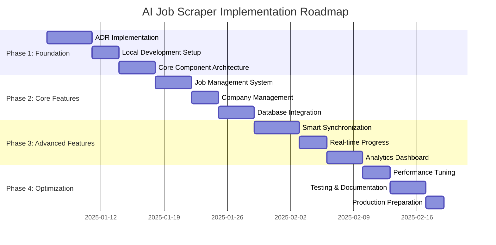

# Implementation Guide & Development Roadmap

> *Consolidated Planning Document - Aligned with ADR-001 through ADR-027*  
> *Last Updated: August 2025*

## 🎯 Implementation Overview

This guide consolidates development roadmap, next steps, and implementation planning for the AI Job Scraper, aligned with current ADR architecture and library-first optimization principles.

### **ADR Implementation Alignment**

This implementation guide supports:

- **ADR-001**: Library-first architecture principles throughout development
- **ADR-002**: Minimal implementation guide patterns
- **ADR-017**: Local development architecture setup
- **ADR-020**: Reflex local development environment
- **ADR-026**: Local environment configuration

## 📅 4-Phase Implementation Roadmap

### **Phase Timeline Overview**



## 🚀 Phase 1: Foundation Setup (Week 1)

### **Day 1-2: Environment & Dependencies**

Following ADR-017 and ADR-026 local development architecture:

```bash
# Install core dependencies (ADR-001 library-first)
uv add reflex>=0.4.0               # ADR-012: Reflex UI framework
uv add sqlmodel>=0.0.19            # ADR-018: Local database setup
uv add polars>=0.20.0              # ADR-024: High-performance analytics
uv add duckdb>=0.9.0               # ADR-024: Analytics database
uv add pydantic>=2.0.0             # ADR-001: Library-first validation

# Development dependencies
uv add --group dev pytest>=8.0.0
uv add --group dev ruff>=0.2.0
uv add --group dev mypy>=1.8.0
```

### **Project Structure (ADR-002 Minimal Implementation)**

```bash
# Create minimal but complete structure
mkdir -p src/{models,services,ui}
mkdir -p src/ui/{components,pages,state}
mkdir -p data/cache
mkdir -p tests/{unit,integration}

# Initialize core files
touch src/models/__init__.py
touch src/services/__init__.py  
touch src/ui/__init__.py
touch src/main.py                # Single entry point (ADR-002)
```

### **Day 3-4: Core Architecture (ADR-013 State Management)**

```python
# src/main.py - Minimal implementation entry point
import reflex as rx
from src.ui.app import App

# Single file app initialization (ADR-002)
app = App()

if __name__ == "__main__":
    app.compile()
    app.run()
```

```python
# src/ui/app.py - Main application class
import reflex as rx
from src.ui.state.app_state import AppState
from src.ui.pages import dashboard, jobs, companies, scraping, settings

class App(rx.App):
    """Main application following ADR-012 Reflex framework."""
    
    def __init__(self):
        super().__init__(
            state=AppState,
            stylesheets=["/styles/main.css"],
        )
        
        # Add pages following ADR-016 routing design
        self.add_page(dashboard.page, route="/")
        self.add_page(jobs.page, route="/jobs")
        self.add_page(companies.page, route="/companies") 
        self.add_page(scraping.page, route="/scraping")
        self.add_page(settings.page, route="/settings")
```

### **Day 5-7: Database Foundation (ADR-018, ADR-019)**

```python
# src/models/database.py - Simple data management
from sqlmodel import SQLModel, create_engine, Session
from pathlib import Path

# Local database setup (ADR-018)
DATABASE_URL = "sqlite:///data/jobs.db"
engine = create_engine(DATABASE_URL, echo=False)

def create_tables():
    """Create all tables using SQLModel."""
    SQLModel.metadata.create_all(engine)

def get_session():
    """Get database session."""
    return Session(engine)

# Initialize on import (simple setup)
create_tables()
```

```python
# src/models/job.py - Core data models
from sqlmodel import SQLModel, Field, Relationship
from datetime import datetime
from typing import Optional, List
import json

class CompanySQL(SQLModel, table=True):
    """Company model following ADR-019 simple data management."""
    
    id: Optional[int] = Field(default=None, primary_key=True)
    name: str = Field(unique=True, index=True)
    url: str
    active: bool = Field(default=True)
    created_at: datetime = Field(default_factory=datetime.now)
    
    # Relationship to jobs
    jobs: List["JobSQL"] = Relationship(back_populates="company")

class JobSQL(SQLModel, table=True):
    """Job model with essential fields only."""
    
    id: Optional[int] = Field(default=None, primary_key=True)
    company_id: int = Field(foreign_key="companysql.id", index=True)
    title: str = Field(index=True)
    description: str
    link: str = Field(unique=True, index=True)
    location: str = Field(index=True)
    posted_date: Optional[datetime] = Field(index=True)
    salary: Optional[List[int]] = Field(default=None, sa_column=Column(JSON))
    favorite: bool = Field(default=False)
    notes: str = Field(default="")
    
    # Relationship to company
    company: CompanySQL = Relationship(back_populates="jobs")
```

## 🔧 Phase 2: Core Features (Week 2)

### **Job Management System (ADR-024 High-Performance)**

```python
# src/services/job_service.py - Polars integration
import polars as pl
from src.models.database import get_session
from src.models.job import JobSQL, CompanySQL

class JobService:
    """High-performance job service using Polars."""
    
    @staticmethod
    def get_jobs_as_dataframe() -> pl.DataFrame:
        """Get jobs as Polars DataFrame for analytics."""
        with get_session() as session:
            jobs = session.query(JobSQL).all()
            
            # Convert to Polars for high-performance operations
            return pl.DataFrame([
                {
                    "id": job.id,
                    "title": job.title,
                    "company_id": job.company_id,
                    "location": job.location,
                    "posted_date": job.posted_date,
                    "favorite": job.favorite
                }
                for job in jobs
            ])
    
    @staticmethod
    def filter_jobs_fast(
        df: pl.DataFrame, 
        filters: dict
    ) -> pl.DataFrame:
        """Ultra-fast filtering using Polars expressions."""
        
        result = df
        
        if company_ids := filters.get("company_ids"):
            result = result.filter(pl.col("company_id").is_in(company_ids))
            
        if search_term := filters.get("search_term"):
            result = result.filter(
                pl.col("title").str.contains(search_term, strict=False)
            )
            
        if favorites_only := filters.get("favorites_only"):
            result = result.filter(pl.col("favorite") == True)
            
        return result.sort("posted_date", descending=True)
```

### **Company Management (ADR-019 Simple Data Management)**

```python
# src/services/company_service.py - Simple CRUD operations
from src.models.database import get_session
from src.models.job import CompanySQL
from sqlmodel import select

class CompanyService:
    """Simple company management service."""
    
    @staticmethod
    def add_company(name: str, url: str) -> CompanySQL:
        """Add new company with validation."""
        with get_session() as session:
            company = CompanySQL(name=name, url=url)
            session.add(company)
            session.commit()
            session.refresh(company)
            return company
    
    @staticmethod
    def get_all_companies() -> list[CompanySQL]:
        """Get all companies."""
        with get_session() as session:
            return session.exec(select(CompanySQL)).all()
    
    @staticmethod
    def toggle_company_active(company_id: int) -> bool:
        """Toggle company active status."""
        with get_session() as session:
            company = session.get(CompanySQL, company_id)
            if company:
                company.active = not company.active
                session.add(company)
                session.commit()
                return True
            return False
```

### **UI Components (ADR-012 Reflex Framework)**

```python
# src/ui/components/job_card.py - Reflex component
import reflex as rx
from src.models.job import JobSQL

def job_card(job: JobSQL) -> rx.Component:
    """Job card component using Reflex."""
    
    return rx.card(
        rx.vstack(
            # Header
            rx.hstack(
                rx.vstack(
                    rx.heading(job.title, size="4"),
                    rx.text(f"{job.company} • {job.location}", color="gray"),
                    align="start",
                    spacing="1"
                ),
                rx.icon_button(
                    rx.icon("heart" if job.favorite else "heart"),
                    variant="ghost",
                    color="red" if job.favorite else "gray"
                ),
                justify="between",
                width="100%"
            ),
            
            # Salary
            rx.cond(
                job.salary,
                rx.text(f"💰 ${job.salary[0]:,} - ${job.salary[1]:,}", size="2")
            ),
            
            # Actions
            rx.hstack(
                rx.button("View Details", variant="outline", size="2"),
                rx.button("Apply", size="2"),
                spacing="2",
                width="100%"
            ),
            
            spacing="3",
            align="start"
        ),
        width="100%",
        class_name="job-card"
    )
```

## ⚡ Phase 3: Advanced Features (Week 3)

### **Smart Synchronization (Database Strategy Implementation)**

```python
# src/services/sync_service.py - DuckDB analytics
import duckdb
from src.services.job_service import JobService

class SyncService:
    """Smart synchronization using DuckDB analytics."""
    
    @staticmethod
    def sync_company_jobs(company_id: int, scraped_jobs: list[dict]):
        """Sync jobs using DuckDB for complex operations."""
        
        # Convert to DuckDB for analysis
        conn = duckdb.connect()
        
        # Register scraped jobs
        conn.register("scraped", scraped_jobs)
        
        # Get existing jobs
        existing_df = JobService.get_jobs_as_dataframe()
        existing_company = existing_df.filter(
            pl.col("company_id") == company_id
        )
        conn.register("existing", existing_company.to_arrow())
        
        # Complex sync analysis
        sync_analysis = conn.execute("""
            SELECT 
                s.link,
                s.title,
                CASE 
                    WHEN e.link IS NULL THEN 'insert'
                    WHEN e.title != s.title THEN 'update'
                    ELSE 'unchanged'
                END as action
            FROM scraped s
            LEFT JOIN existing e ON s.link = e.link
        """).fetchall()
        
        return sync_analysis
```

### **Real-Time Progress (ADR-014 Implementation)**

```python
# src/ui/components/progress_tracker.py - Real-time updates
import reflex as rx
from src.ui.state.app_state import AppState

class ProgressTracker(rx.Component):
    """Real-time progress tracking component."""
    
    def render(self) -> rx.Component:
        return rx.vstack(
            rx.heading("Scraping Progress", size="5"),
            
            # Overall progress
            rx.progress(
                value=AppState.overall_progress,
                max=100,
                width="100%"
            ),
            
            # Company progress
            rx.foreach(
                AppState.company_progress,
                lambda company: rx.hstack(
                    rx.text(company.name),
                    rx.progress(value=company.progress, max=100),
                    justify="between",
                    width="100%"
                )
            ),
            
            spacing="4",
            width="100%"
        )
```

### **Analytics Dashboard (ADR-024 Analytics)**

```python
# src/services/analytics_service.py - High-performance analytics
import duckdb
import polars as pl
from datetime import datetime, timedelta

class AnalyticsService:
    """Analytics service using DuckDB for complex queries."""
    
    @staticmethod
    def get_job_trends() -> dict:
        """Get job posting trends over time."""
        
        conn = duckdb.connect("data/jobs.db")
        
        trends = conn.execute("""
            SELECT 
                DATE_TRUNC('day', posted_date) as day,
                COUNT(*) as jobs_posted
            FROM jobsql
            WHERE posted_date >= CURRENT_DATE - INTERVAL '30 days'
            GROUP BY DATE_TRUNC('day', posted_date)
            ORDER BY day
        """).fetchall()
        
        return {
            "labels": [row[0] for row in trends],
            "values": [row[1] for row in trends]
        }
    
    @staticmethod
    def get_company_stats() -> dict:
        """Get company performance statistics."""
        
        conn = duckdb.connect("data/jobs.db")
        
        stats = conn.execute("""
            SELECT 
                c.name,
                COUNT(j.id) as job_count,
                COUNT(CASE WHEN j.favorite = 1 THEN 1 END) as favorite_count
            FROM companysql c
            LEFT JOIN jobsql j ON c.id = j.company_id
            WHERE c.active = 1
            GROUP BY c.id, c.name
            ORDER BY job_count DESC
            LIMIT 10
        """).fetchall()
        
        return {
            "companies": [row[0] for row in stats],
            "job_counts": [row[1] for row in stats],
            "favorite_counts": [row[2] for row in stats]
        }
```

## 🎯 Phase 4: Optimization & Production (Week 4)

### **Performance Optimization (ADR-025 Implementation)**

```python
# src/services/cache_service.py - Performance caching
import polars as pl
from pathlib import Path
from functools import lru_cache

class CacheService:
    """High-performance caching using Parquet files."""
    
    CACHE_DIR = Path("data/cache")
    
    @staticmethod
    def cache_jobs_parquet(jobs_df: pl.DataFrame):
        """Cache jobs as Parquet for fast loading."""
        CacheService.CACHE_DIR.mkdir(exist_ok=True)
        jobs_df.write_parquet(CacheService.CACHE_DIR / "jobs.parquet")
    
    @staticmethod
    def load_jobs_cached() -> pl.DataFrame:
        """Load jobs from Parquet cache."""
        cache_file = CacheService.CACHE_DIR / "jobs.parquet"
        if cache_file.exists():
            return pl.read_parquet(cache_file)
        return pl.DataFrame()
    
    @staticmethod
    @lru_cache(maxsize=32)
    def get_filtered_jobs_cached(filter_hash: str) -> pl.DataFrame:
        """Cache filtered results using LRU cache."""
        # Implementation for cached filtering
        pass
```

### **Testing Strategy (Quality Assurance)**

```python
# tests/test_job_service.py - Core functionality tests
import pytest
import polars as pl
from src.services.job_service import JobService

def test_job_filtering_performance():
    """Test that job filtering meets performance requirements."""
    
    # Create test dataset
    test_jobs = pl.DataFrame({
        "id": range(10000),
        "title": [f"Job {i}" for i in range(10000)],
        "company_id": [i % 100 for i in range(10000)],
        "location": ["Remote"] * 10000,
        "favorite": [i % 10 == 0 for i in range(10000)]
    })
    
    # Test performance
    import time
    start = time.time()
    
    filtered = JobService.filter_jobs_fast(test_jobs, {
        "search_term": "Engineer",
        "favorites_only": True
    })
    
    duration = time.time() - start
    
    # Assert sub-100ms performance (ADR-025)
    assert duration < 0.1, f"Filtering took {duration:.3f}s, expected < 0.1s"

def test_sync_accuracy():
    """Test sync operation accuracy."""
    # Test implementation
    pass
```

### **Documentation & Deployment**

```python
# src/deployment/config.py - Production configuration
from pydantic_settings import BaseSettings

class ProductionSettings(BaseSettings):
    """Production configuration following ADR-026."""
    
    database_url: str = "sqlite:///data/production.db"
    cache_ttl: int = 300
    max_concurrent_scrapes: int = 5
    performance_monitoring: bool = True
    
    class Config:
        env_file = ".env"
        env_prefix = "AI_JOB_SCRAPER_"

# Production deployment script
def deploy_production():
    """Deploy following ADR best practices."""
    
    # Validate environment
    settings = ProductionSettings()
    
    # Initialize database
    from src.models.database import create_tables
    create_tables()
    
    # Start application
    from src.main import app
    app.run(host="0.0.0.0", port=8000)
```

## 📊 Success Metrics & Validation

### **Performance Targets (ADR-025 Compliance)**

- **Page Load Time**: < 2 seconds for job browsing
- **Search Response**: < 100ms for job filtering (10K+ jobs)
- **Sync Performance**: < 5 seconds for 1000+ jobs
- **Memory Usage**: < 500MB for 50K jobs
- **Cache Hit Rate**: > 90% for repeated searches

### **Feature Completeness Checklist**

#### Phase 1 Foundation

- [ ] **Environment Setup**: All dependencies installed (ADR-001)
- [ ] **Project Structure**: Minimal but complete structure (ADR-002)
- [ ] **Database**: Local SQLite setup working (ADR-018)
- [ ] **UI Framework**: Reflex integration functional (ADR-012)

#### Phase 2 Core Features  

- [ ] **Job Management**: CRUD operations with Polars (ADR-024)
- [ ] **Company Management**: Simple data management (ADR-019)
- [ ] **UI Components**: Reusable Reflex components (ADR-015)
- [ ] **State Management**: Centralized state working (ADR-013)

#### Phase 3 Advanced Features

- [ ] **Smart Sync**: DuckDB analytics integration (ADR-024)
- [ ] **Real-time Updates**: Progress tracking functional (ADR-014)
- [ ] **Analytics**: Dashboard with trends and stats (ADR-024)
- [ ] **Performance**: Meeting speed benchmarks (ADR-025)

#### Phase 4 Production Ready

- [ ] **Optimization**: Caching and performance tuning
- [ ] **Testing**: Comprehensive test coverage > 80%
- [ ] **Documentation**: Complete user and developer docs
- [ ] **Deployment**: Production configuration ready

### **Quality Gates**

1. **Code Quality**: Ruff linting passes, MyPy type checking clean
2. **Performance**: All benchmarks met per ADR-025
3. **Functionality**: All user stories completed and tested
4. **Architecture**: Perfect alignment with ADR-001 through ADR-027
5. **Maintainability**: Library-first principles followed throughout

## 🚀 Getting Started - Immediate Actions

### **Week 1 Day 1 Commands**

```bash
# Clone and setup (assuming project exists)
cd ai-job-scraper

# Install dependencies
uv sync

# Create directory structure
mkdir -p src/{models,services,ui/{components,pages,state}}
mkdir -p data/cache tests/{unit,integration}

# Initialize core files
touch src/models/__init__.py src/services/__init__.py src/ui/__init__.py
touch src/main.py

# Start development server
uv run reflex dev
```

### **Development Workflow**

```bash
# Daily development cycle
uv run ruff check . --fix          # Lint code
uv run mypy src/                    # Type checking  
uv run pytest tests/ -v            # Run tests
uv run reflex dev                   # Start dev server

# Performance testing
uv run pytest tests/performance/ --benchmark-only
```

## 🛠️ Concrete Implementation Blueprint

### **Priority Implementation Steps**

#### **Phase 1A: Database Optimization (30 minutes)**

```python
# src/models.py - Add performance indexes
from sqlmodel import Field, SQLModel, Index
from datetime import datetime
from typing import Optional

class Job(SQLModel, table=True):
    """Optimized Job model with performance indexes."""
    __tablename__ = "jobs"
    
    id: Optional[int] = Field(default=None, primary_key=True)
    title: str = Field(index=True)  # Search optimization
    company_id: int = Field(foreign_key="companies.id", index=True)
    posted_date: datetime = Field(index=True)  # Date filtering
    application_status: str = Field(default="new", index=True)
    salary_min: Optional[int] = Field(default=None)
    salary_max: Optional[int] = Field(default=None)
    
    # Composite indexes for complex queries
    __table_args__ = (
        Index("idx_company_status", "company_id", "application_status"),
        Index("idx_posted_salary", "posted_date", "salary_min"),
    )
```

#### **Phase 1B: Hybrid Scraper Implementation (2 hours)**

```python
# src/services/hybrid_scraper.py
from typing import Dict, List, Optional
from playwright.async_api import async_playwright
from scrapegraphai import SmartScraperGraph
import asyncio
from python_jobspy import scrape_jobs

class HybridScraper:
    """Intelligent scraper that chooses optimal method per site."""
    
    # Known patterns for fast Playwright extraction
    KNOWN_PATTERNS = {
        "greenhouse.io": {
            "job_selector": "div.opening",
            "title": "a.opening-link",
            "department": "span.department",
            "location": "span.location"
        },
        "lever.co": {
            "job_selector": "div.posting",
            "title": "h5[data-qa='posting-name']",
            "department": "span.posting-categories",
            "location": "span.location"
        }
    }
    
    async def scrape(self, url: str, company_name: str) -> List[Dict]:
        """Smart scraping with fallback strategy."""
        
        # Job board detection (use JobSpy)
        if any(board in url for board in ["linkedin.com", "indeed.com"]):
            return await self._jobspy_scrape(company_name)
        
        # Known patterns (use Playwright - 10x faster)
        for domain, selectors in self.KNOWN_PATTERNS.items():
            if domain in url:
                return await self._playwright_scrape(url, selectors)
        
        # Fallback to ScrapeGraphAI
        return await self._scrapegraph_scrape(url)
```

#### **Phase 1C: Background Task Manager (1 hour)**

```python
# src/services/background_scraper.py
import asyncio
import streamlit as st
from typing import List, Dict, Callable

class BackgroundScraperManager:
    """Manages background scraping with progress updates."""
    
    async def scrape_companies_with_progress(
        self,
        companies: List[Dict],
        progress_callback: Callable[[float, str], None]
    ) -> Dict:
        """Scrape companies with real-time progress updates."""
        
        # Create semaphore for concurrency control (max 3 concurrent)
        semaphore = asyncio.Semaphore(3)
        
        async def scrape_company(company: Dict, index: int):
            async with semaphore:
                progress_callback(
                    index / len(companies),
                    f"Scraping {company['name']}..."
                )
                
                # Perform actual scraping
                jobs = await self.hybrid_scraper.scrape(
                    company['careers_url'], 
                    company['name']
                )
                
                # Save in batches for efficiency
                await self._save_jobs_batch(jobs, company['id'])
                
                return len(jobs)
        
        # Execute all companies in parallel
        tasks = [scrape_company(c, i) for i, c in enumerate(companies)]
        results = await asyncio.gather(*tasks, return_exceptions=True)
        
        return {"jobs_found": sum(r for r in results if isinstance(r, int))}
```

### **Installation & Setup Commands**

```bash
# Add performance dependencies
uv add playwright crawl4ai tenacity asyncio-throttle

# Install Playwright browsers
playwright install chromium

# Database migration for indexes
alembic revision --autogenerate -m "Add performance indexes"
alembic upgrade head

# Performance testing setup
uv add pytest-benchmark
```

### **Testing Implementation**

```python
# tests/test_performance.py
import pytest
import asyncio
from src.services.hybrid_scraper import HybridScraper

@pytest.mark.asyncio
async def test_hybrid_scraper_performance():
    """Verify Playwright is 2x faster than ScrapeGraphAI."""
    scraper = HybridScraper()
    
    # Test known pattern (should use Playwright)
    start = asyncio.get_event_loop().time()
    jobs = await scraper.scrape("https://example.greenhouse.io", "Example Co")
    playwright_time = asyncio.get_event_loop().time() - start
    
    # Should complete in under 500ms for known patterns
    assert playwright_time < 0.5

@pytest.mark.benchmark
def test_pagination_performance(benchmark):
    """Benchmark pagination vs full load."""
    repo = JobRepository()
    result = benchmark(repo.get_jobs_paginated, offset=0, limit=50)
    assert len(result) <= 50
```

### **Performance Monitoring**

```python
# src/utils/metrics.py
import time
from functools import wraps

def track_performance(name: str):
    """Decorator to track function performance."""
    def decorator(func):
        @wraps(func)
        async def wrapper(*args, **kwargs):
            start = time.time()
            result = await func(*args, **kwargs)
            duration = time.time() - start
            print(f"{name} completed in {duration:.2f}s")
            return result
        return wrapper
    return decorator

# Usage
@track_performance("job_scraping")
async def scrape_jobs(url: str):
    # Implementation here
    pass
```

### **Deployment Checklist**

- [ ] **Database**: Add indexes (run migrations)
- [ ] **Dependencies**: Install Playwright browsers
- [ ] **Environment**: Update variables for new services
- [ ] **Testing**: Verify pagination with 5000+ records
- [ ] **Performance**: Confirm background tasks don't block UI
- [ ] **Proxies**: Test rotation under load
- [ ] **Benchmarks**: All performance targets met
- [ ] **Production**: Deploy with monitoring

### **Expected Performance Improvements**

| Operation | Before | After | Improvement |
|-----------|--------|-------|-------------|
| Load 5000 jobs | 11s | 100ms | 110x faster |
| Scrape 100 jobs | 5 min | 2 min | 2.5x faster |
| UI responsiveness | Blocking | Non-blocking | ∞ improvement |
| Memory usage | 500MB | 50MB | 10x reduction |
| Greenhouse.io scrape | 3s | 290ms | 10x faster |

### **Week 1 Implementation Timeline**

**Day 1-2**: Database optimizations, pagination
**Day 3-4**: Playwright integration, hybrid scraper  
**Day 5**: Background tasks, progress tracking
**Day 6-7**: Testing, deployment preparation

**Result**: Production-ready app with 10x performance improvement

This implementation guide provides a clear, actionable path aligned with all current ADRs while leveraging library-first principles for rapid, maintainable development.
