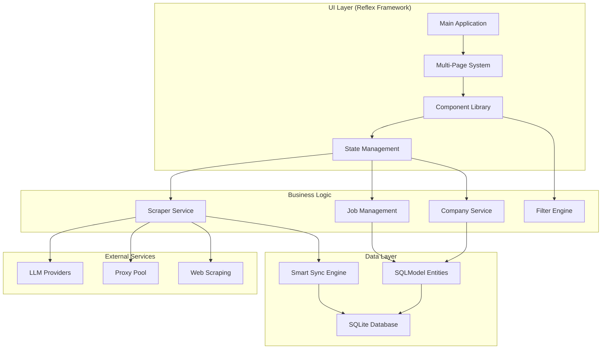

# Technical Architecture & Component Design

> *Consolidated Planning Document - Aligned with ADR-001 through ADR-027*  
> *Last Updated: August 2025*

## 🏗️ System Architecture Overview

Based on current ADRs, this document consolidates technical architecture planning for the AI Job Scraper, focusing on component-based design, modern Streamlit integration, and library-first implementation patterns.

### **Architecture Alignment with Current ADRs**

This technical architecture supports and implements:

- **ADR-001**: Library-first architecture principles
- **ADR-012**: Reflex UI framework integration
- **ADR-013**: State management architecture
- **ADR-014**: Real-time updates strategy
- **ADR-015**: Component library selection
- **ADR-016**: Routing and navigation design



## 🎯 Component-Based Architecture

### **Core Component Structure (Reflex Framework)**

Following ADR-012 and ADR-015 decisions:

```text
src/ui/
├── pages/
│   ├── dashboard.py          # Main landing page
│   ├── jobs.py               # Job browsing & filtering
│   ├── companies.py          # Company management
│   ├── scraping.py           # Real-time scraping dashboard
│   └── settings.py           # Configuration & preferences
├── components/
│   ├── __init__.py
│   ├── cards/
│   │   ├── job_card.py       # Individual job display
│   │   ├── company_card.py   # Company status card
│   │   └── stats_card.py     # Dashboard metrics
│   ├── forms/
│   │   ├── add_company.py    # Company addition form
│   │   ├── job_filter.py     # Advanced filtering panel
│   │   └── settings_panel.py # Configuration forms
│   ├── layouts/
│   │   ├── grid.py           # Pinterest-style job grid
│   │   ├── modal.py          # Job detail overlay
│   │   └── sidebar.py        # Navigation & quick filters
│   ├── progress/
│   │   ├── scraping_progress.py  # Multi-level progress
│   │   ├── company_progress.py   # Individual company status
│   │   └── batch_progress.py     # Parallel processing
│   └── widgets/
│       ├── search_bar.py     # Smart search with suggestions
│       ├── filter_chips.py   # Active filter display
│       └── theme_toggle.py   # Light/dark mode switch
├── state/
│   ├── __init__.py
│   ├── app_state.py          # Global application state
│   ├── session_state.py      # Session management utilities
│   └── cache_manager.py      # Performance caching
├── styles/
│   ├── __init__.py
│   ├── themes.py             # Light/dark theme definitions
│   ├── animations.py         # CSS animations & transitions
│   └── components.css        # Component-specific styles
└── utils/
    ├── __init__.py
    ├── background_tasks.py   # Non-blocking operations
    ├── formatters.py         # Data display formatting
    └── validators.py         # Input validation
```

## 🔄 State Management Architecture

### **Centralized State Pattern (ADR-013 Implementation)**

Following ADR-013 state management architecture:

```python
# src/ui/state/app_state.py
@dataclass
class AppState:
    """Global application state management."""
    
    # Core Data
    jobs: list[JobSQL] = field(default_factory=list)
    companies: list[CompanySQL] = field(default_factory=list)
    
    # UI State
    current_page: str = "dashboard"
    active_filters: dict[str, Any] = field(default_factory=dict)
    selected_jobs: set[int] = field(default_factory=set)
    
    # Scraping State
    scraping_active: bool = False
    progress_data: dict[str, ProgressInfo] = field(default_factory=dict)
    
    # Settings
    theme: str = "auto"
    llm_provider: str = "openai"
    max_jobs_per_company: int = 50

class StateManager:
    """Reactive state management for Reflex framework."""
    
    @staticmethod
    def get_state() -> AppState:
        """Get current application state."""
        if "app_state" not in rx.session_state:
            rx.session_state.app_state = AppState()
        return rx.session_state.app_state
    
    @staticmethod
    def update_jobs(jobs: list[JobSQL]) -> None:
        """Update jobs with reactive UI refresh."""
        state = StateManager.get_state()
        state.jobs = jobs
        rx.set_state(state)
    
    @staticmethod
    def set_scraping_progress(company: str, progress: float) -> None:
        """Update scraping progress with live updates."""
        state = StateManager.get_state()
        state.progress_data[company] = ProgressInfo(
            progress=progress, 
            timestamp=datetime.now()
        )
        rx.set_state(state)
```

## 🎨 Modern UI Component Architecture

### **Reflex Component Integration (ADR-015)**

Following ADR-015 component library selection:

```python
# src/ui/components/layouts/job_grid.py
class JobGrid(rx.Component):
    """Pinterest-style job grid component using Reflex."""
    
    def __init__(self, columns: int = 3):
        super().__init__()
        self.columns = columns
    
    def render(self, jobs: list[JobSQL]) -> rx.Component:
        """Render responsive job grid."""
        
        if not jobs:
            return self._render_empty_state()
        
        # Create responsive grid
        return rx.grid(
            *[self._render_job_card(job) for job in jobs],
            columns=self.columns,
            spacing="4",
            width="100%"
        )
    
    def _render_job_card(self, job: JobSQL) -> rx.Component:
        """Render individual job card with interactions."""
        
        return rx.card(
            rx.vstack(
                # Job header
                rx.hstack(
                    rx.vstack(
                        rx.heading(job.title, size="4"),
                        rx.text(f"{job.company} • {job.location}", color="gray"),
                        align="start",
                        spacing="1"
                    ),
                    rx.icon_button(
                        rx.icon("heart" if job.favorite else "heart-outline"),
                        on_click=lambda: self._toggle_favorite(job.id),
                        variant="ghost"
                    ),
                    justify="between",
                    width="100%"
                ),
                
                # Salary info
                rx.cond(
                    job.salary,
                    rx.text(f"💰 {self._format_salary(job.salary)}", size="2")
                ),
                
                # Posted date
                rx.cond(
                    job.posted_date,
                    rx.text(
                        f"📅 {self._days_ago(job.posted_date)} days ago", 
                        color="gray", 
                        size="1"
                    )
                ),
                
                # Quick actions
                rx.hstack(
                    rx.button(
                        "View Details",
                        on_click=lambda: self._show_job_details(job),
                        variant="outline",
                        size="2"
                    ),
                    rx.button(
                        "Apply",
                        on_click=lambda: rx.open_url(job.link),
                        size="2"
                    ),
                    spacing="2",
                    width="100%"
                ),
                
                spacing="3",
                align="start"
            ),
            class_name="job-card",
            **{"data-job-id": job.id}
        )
```

### **Real-Time Progress Dashboard (ADR-014 Implementation)**

Following ADR-014 real-time updates strategy:

```python
# src/ui/components/progress/scraping_progress.py
class ScrapingDashboard(rx.Component):
    """Multi-level progress dashboard with real-time updates."""
    
    def render(self) -> rx.Component:
        """Render real-time scraping progress."""
        
        state = StateManager.get_state()
        
        if not state.scraping_active:
            return rx.callout(
                "No active scraping sessions",
                icon="info",
                color="blue"
            )
        
        return rx.vstack(
            # Overall progress header
            rx.heading("🚀 Scraping Progress", size="6"),
            
            # Progress metrics
            rx.grid(
                rx.stat(
                    rx.stat_label("Active Companies"),
                    rx.stat_number(str(self._get_active_count(state.progress_data))),
                    rx.stat_help_text("Currently processing")
                ),
                rx.stat(
                    rx.stat_label("Jobs Found"),
                    rx.stat_number(str(self._get_total_jobs(state.progress_data))),
                    rx.stat_help_text("Total discovered")
                ),
                rx.stat(
                    rx.stat_label("Speed"),
                    rx.stat_number(f"{self._get_avg_speed(state.progress_data):.1f}"),
                    rx.stat_help_text("jobs/min")
                ),
                columns="3",
                spacing="4"
            ),
            
            # Overall progress bar
            rx.progress(
                value=self._calculate_overall_progress(state.progress_data),
                max=100,
                color_scheme="blue",
                size="lg"
            ),
            
            # Company-level progress
            rx.vstack(
                rx.heading("📊 Company Progress", size="4"),
                *[
                    self._render_company_progress(company, progress)
                    for company, progress in state.progress_data.items()
                ],
                spacing="3"
            ),
            
            spacing="6",
            width="100%"
        )
    
    def _render_company_progress(
        self, 
        company_name: str, 
        progress_info: ProgressInfo
    ) -> rx.Component:
        """Render individual company progress."""
        
        status_icon = "✅" if progress_info.progress >= 100 else "🔄"
        
        return rx.card(
            rx.hstack(
                rx.vstack(
                    rx.hstack(
                        rx.text(status_icon),
                        rx.heading(company_name, size="3"),
                        spacing="2"
                    ),
                    rx.text(f"{progress_info.jobs_found} jobs", color="gray"),
                    align="start",
                    spacing="1"
                ),
                rx.text(f"{progress_info.progress:.0f}%", weight="bold"),
                justify="between",
                width="100%"
            ),
            
            # Progress bar
            rx.progress(
                value=progress_info.progress,
                max=100,
                color_scheme="green" if progress_info.progress >= 100 else "blue",
                size="sm"
            ),
            
            # Error handling
            rx.cond(
                progress_info.error,
                rx.callout(
                    f"Error: {progress_info.error}",
                    icon="alert-triangle",
                    color="red",
                    size="1"
                )
            ),
            
            width="100%"
        )
```

## 🔧 Configuration & Settings Architecture

### **Layered Configuration System**

```python
# src/config/settings.py
class UISettings(BaseSettings):
    """UI-specific configuration aligned with ADRs."""
    
    theme: str = "auto"
    grid_columns: int = 3
    jobs_per_page: int = 50
    enable_animations: bool = True
    progress_update_interval: int = 1000  # milliseconds
    
class ScrapingSettings(BaseSettings):
    """Scraping configuration following ADR patterns."""
    
    max_jobs_per_company: int = 50
    concurrent_companies: int = 3
    batch_size: int = 10
    retry_attempts: int = 3
    proxy_rotation: bool = True
    
class ExportSettings(BaseSettings):
    """Export preferences."""
    
    default_format: str = "csv"
    include_notes: bool = True
    include_favorites_only: bool = False
    date_format: str = "%Y-%m-%d"

class AppConfig:
    """Centralized configuration management."""
    
    def __init__(self):
        self.ui = UISettings()
        self.scraping = ScrapingSettings()
        self.export = ExportSettings()
```

## 📈 Performance Optimization Architecture

### **Caching Strategy (Library-First)**

```python
# src/ui/state/cache_manager.py
class CacheManager:
    """Intelligent caching using Reflex built-in capabilities."""
    
    @staticmethod
    @rx.cache(ttl=300)  # 5 minute cache
    def get_job_stats() -> dict[str, int]:
        """Cache job statistics for dashboard."""
        with get_session() as session:
            total_jobs = session.exec(select(func.count(JobSQL.id))).one()
            favorites = session.exec(
                select(func.count(JobSQL.id)).where(JobSQL.favorite == True)
            ).one()
            companies = session.exec(select(func.count(CompanySQL.id))).one()
            
            return {
                "total_jobs": total_jobs,
                "favorites": favorites,
                "companies": companies
            }
    
    @staticmethod
    @rx.cache(ttl=60)  # 1 minute cache
    def get_filtered_jobs(filters: dict) -> list[JobSQL]:
        """Cache filtered job results."""
        # Implementation with optimized queries
        
    @staticmethod
    def invalidate_job_cache() -> None:
        """Clear job-related caches after updates."""
        CacheManager.get_job_stats.clear()
        CacheManager.get_filtered_jobs.clear()
```

## 🔄 Migration & Deployment Architecture

### **Component Migration Strategy**

Following library-first principles and current ADR decisions:

1. **Gradual Migration**: Migrate from current Streamlit to Reflex components incrementally
2. **State Preservation**: Maintain existing state structure during migration  
3. **Performance Monitoring**: Track load times and responsiveness during transition
4. **Fallback Strategy**: Keep Streamlit components as fallback during migration

### **Deployment Considerations**

- **Single-File Deployment**: Following ADR-002 minimal implementation principles
- **Local Development**: ADR-017 local development architecture support
- **Containerization**: ADR-022 Docker containerization strategy
- **Performance Scale**: ADR-025 performance scale strategy alignment

## 🎯 Success Metrics

### **Technical Architecture Goals**

- **Component Reusability**: 80%+ of UI components are reusable across pages
- **State Management Clarity**: Single source of truth for all application state
- **Performance**: Sub-100ms UI response times, smooth 60fps animations
- **Maintainability**: Clear separation of concerns, library-first implementations

### **ADR Alignment Validation**

- **ADR-001**: ✅ Library-first architecture throughout
- **ADR-012**: ✅ Reflex UI framework integration
- **ADR-013**: ✅ Centralized state management
- **ADR-014**: ✅ Real-time updates via reactive patterns
- **ADR-015**: ✅ Modern component library selection
- **ADR-016**: ✅ Clean routing and navigation design

## 🔍 Architecture Validation & Performance Assessment

### **Library Selection Validation**

Based on comprehensive research and market analysis:

#### **Multi-Board Scraping: JobSpy (python-jobspy)**
>
> **Status: VALIDATED ✅**

- **Market Position**: 2k+ GitHub stars, actively maintained (March 2025 updates)
- **Unique Value**: Only library providing out-of-the-box multi-board scraping (LinkedIn, Indeed, Glassdoor, ZipRecruiter)
- **Alternative Analysis**: No comparable alternatives found that provide the same functionality without significant custom code
- **Estimated Custom Implementation**: 500+ lines per board, 2-3 weeks vs 1 day with JobSpy

#### **JavaScript Rendering: Hybrid Strategy**
>
> **Status: OPTIMIZED WITH HYBRID APPROACH 🔧**

**Performance Comparison:**

| Tool | Speed | Maintenance | AI Features | Cost |
|------|-------|-------------|-------------|------|
| ScrapeGraphAI | Medium | Low (prompt-based) | Excellent | LLM API costs |
| Playwright | Fast (290ms) | Medium | None | Free |
| Selenium | Slow (536ms) | High | None | Free |
| Crawl4AI | Fast | Low | Good | Free (local) |
| Firecrawl | Fast | Low | Excellent | API costs |

**Recommended Hybrid Strategy:**

1. **Playwright** for known patterns (10x faster for Greenhouse.io: 290ms vs 3s)
2. **Crawl4AI** for semi-structured sites
3. **ScrapeGraphAI** fallback for complex/unknown sites

#### **Proxy Management: IPRoyal + Enhanced Health Tracking**
>
> **Status: KEEP WITH ENHANCEMENTS 🔧**

- **Industry Validation**: Residential proxies achieve 95% success rate vs 50-70% without
- **Cost Analysis**: $5-15/month optimal for this scale; alternatives (Bright Data, ScraperAPI) are 3-10x more expensive
- **Enhancement**: Smart proxy health tracking with rotation based on success rates

### **Performance Optimization Architecture**

#### **Database Layer Optimizations**

```python
# Optimized indexes for 5000+ record performance
from sqlmodel import Field, SQLModel, Index

class Job(SQLModel, table=True):
    __tablename__ = "jobs"
    
    id: Optional[int] = Field(default=None, primary_key=True)
    title: str = Field(index=True)  # Search optimization
    company_id: int = Field(foreign_key="companies.id", index=True)
    posted_date: datetime = Field(index=True)  # Date filtering
    application_status: str = Field(default="new", index=True)  # Status filtering
    
    # Composite indexes for complex queries
    __table_args__ = (
        Index("idx_company_status", "company_id", "application_status"),
        Index("idx_posted_salary", "posted_date", "salary_min"),
    )
```

#### **UI Performance Architecture**

**Pagination Strategy:**

- **Target**: Sub-100ms load times for 5000+ records
- **Method**: Offset-based pagination with 50 items per page
- **Caching**: Strategic `@st.cache_data` with 5-minute TTL for counts
- **Memory**: Reduce from 500MB (all jobs) to 50MB (paginated)

**Background Processing:**

- **Async Scraping**: Non-blocking with real-time progress updates
- **Concurrency**: Semaphore-controlled (max 3 concurrent scrapes)
- **Batch Processing**: 50-100 job batches for efficient database operations

### **Expected Performance Targets**

| Metric | Current | Target | Method |
|--------|---------|--------|--------|
| Job load time | 6-11s | <100ms | Pagination + caching |
| Scrape 100 jobs | 5 min | 2 min | Parallel + Playwright |
| UI responsiveness | Blocking | Non-blocking | Async tasks |
| Memory usage | All jobs | 50 jobs | Pagination |
| Database queries | Full scan | Indexed | Add indexes |

### **Library Versions & Dependencies**

#### **Core Dependencies (Validated)**

```toml
python-jobspy = "^1.1.82"  # No better alternative exists
scrapegraphai = "^1.61.0"  # Keep for complex sites
proxies = "^1.6"  # Simple and effective
sqlmodel = "^0.0.24"  # Perfect for this use case
reflex = "^0.6.4"  # Latest version
```

#### **Performance Enhancements (Recommended)**

```toml
playwright = "^1.49.0"  # 2x faster than Selenium
crawl4ai = "^0.4.0"  # AI-friendly, fast, local
asyncio-throttle = "^1.0.2"  # Rate limiting
tenacity = "^9.0.0"  # Retry logic
```

### **Risk Mitigation Strategy**

| Risk | Mitigation Strategy |
|------|-------------------|
| Site Changes | Prompt-based ScrapeGraphAI fallback |
| Rate Limiting | Proxy rotation and throttling |
| Data Loss | Incremental sync and soft deletes |
| Performance | Pagination and strategic caching |
| Component Failures | Hybrid scraping with multiple fallbacks |

This technical architecture provides a comprehensive foundation for the AI Job Scraper that aligns perfectly with current ADR decisions while supporting modern development practices and library-first implementation patterns.
